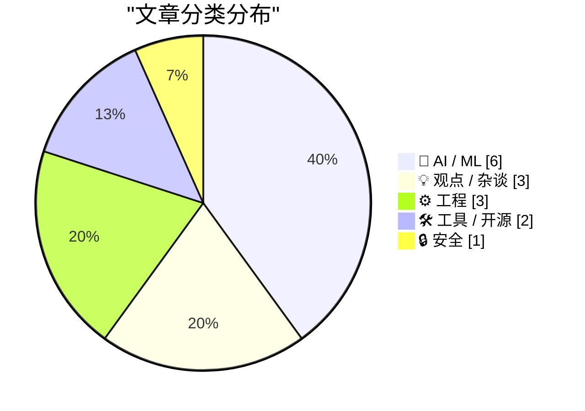
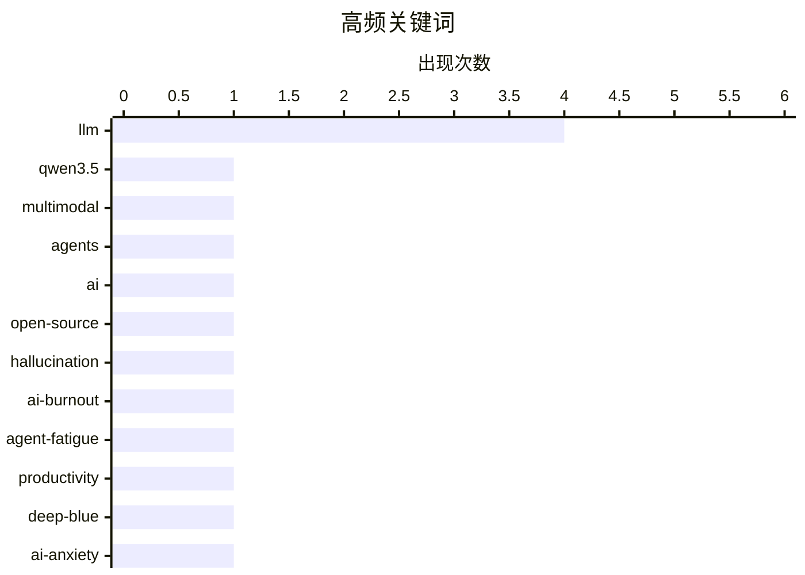

# 📰 AI 博客每日精选 — 2026-02-18

> 来自 Karpathy 推荐的 92 个顶级技术博客，AI 精选 Top 15

## 📝 今日看点

今日技术圈呈现AI发展的矛盾图景：阿里巴巴发布Qwen3.5多模态模型推进技术前沿的同时，业界对AGI炒作的质疑与模型能力局限的反思日益强烈。更值得关注的是AI编程工具普及引发的深层焦虑，从"Agent疲劳"到"Deep Blue"心理，开发者正面临认知能力退化与存在恐惧的双重挑战。而AI幻觉导致的新闻失实事件，则再次敲响当前技术在可靠性与伦理层面的警钟。

---

## 🏆 今日必读

🥇 **Qwen3.5：迈向原生多模态智能体**

[Qwen3.5: Towards Native Multimodal Agents](https://simonwillison.net/2026/Feb/17/qwen35/#atom-everything) — simonwillison.net · 12 小时前 · 🤖 AI / ML

> 阿里巴巴通义千问发布Qwen 3.5系列的前两款模型，均支持视觉输入的多模态能力。开源版本采用Mixture of Experts架构，名为Qwen3.5-397B-A17B，总参数3970亿但仅激活170亿参数，显著降低推理成本。该系列强调原生多模态智能体能力，在保持高性能的同时优化了服务效率。阿里同时发布了专有版本，形成开源与商业并行的产品策略。

💡 **为什么值得读**: 了解国产大模型在多模态和MoE架构上的最新突破，以及397B/17B参数配置带来的实际部署优势。

🏷️ Qwen3.5, multimodal, agents

🥈 **AI正在摧毁开源，而且它还并不好用**

[AI is destroying Open Source, and it's not even good yet](https://www.jeffgeerling.com/blog/2026/ai-is-destroying-open-source/) — jeffgeerling.com · 19 小时前 · 🤖 AI / ML

> Ars Technica近期撤回一篇报道，原因是记者使用的AI工具 hallucinated（幻觉生成了）开源库维护者Scott Shambaugh的虚假言论，构成对其个人的不实攻击。这一事件暴露了AI内容生成对开源社区声誉机制的破坏力——错误引用可能被当作事实传播，且受害者难以澄清。作者指出，当前AI在准确性上的缺陷正在损害开源生态的信任基础，而技术尚未成熟到可以安全使用。

💡 **为什么值得读**: 警示AI幻觉对开源维护者个人声誉的实际危害，以及媒体依赖AI生成内容的风险。

🏷️ AI, open-source, hallucination

🥉 **AI吸血鬼**

[The AI Vampire](https://simonwillison.net/2026/Feb/15/the-ai-vampire/#atom-everything) — simonwillison.net · 1 天前 · 💡 观点 / 杂谈

> Steve Yegge提出'Agent疲劳'概念，将其与职业倦怠直接关联。他对比了两种场景：员工A使用AI以10倍效率工作8小时，导致同事显得效率低下；过度依赖AI工具会导致开发者失去深度思考能力，产生存在性焦虑。这种持续的高强度人机协作模式正在侵蚀程序员的心理健康，形成新型的职场压力源。作者强调需要重新审视AI工具的使用边界，防止技术反噬工作者。

💡 **为什么值得读**: 理解AI工具带来的隐性心理负担和'Agent疲劳'这一新型职业倦怠现象。

🏷️ AI-burnout, agent-fatigue, productivity

---

## 📊 数据概览

| 扫描源 | 抓取文章 | 时间范围 | 精选 |
|:---:|:---:|:---:|:---:|
| 89/92 | 2490 篇 → 41 篇 | 48h | **15 篇** |

### 分类分布



### 高频关键词



<details>
<summary>📈 纯文本关键词图（终端友好）</summary>

```
llm           │ ████████████████████ 4
qwen3.5       │ █████░░░░░░░░░░░░░░░ 1
multimodal    │ █████░░░░░░░░░░░░░░░ 1
agents        │ █████░░░░░░░░░░░░░░░ 1
ai            │ █████░░░░░░░░░░░░░░░ 1
open-source   │ █████░░░░░░░░░░░░░░░ 1
hallucination │ █████░░░░░░░░░░░░░░░ 1
ai-burnout    │ █████░░░░░░░░░░░░░░░ 1
agent-fatigue │ █████░░░░░░░░░░░░░░░ 1
productivity  │ █████░░░░░░░░░░░░░░░ 1
```

</details>

### 🏷️ 话题标签

**llm**(4) · **qwen3.5**(1) · **multimodal**(1) · agents(1) · ai(1) · open-source(1) · hallucination(1) · ai-burnout(1) · agent-fatigue(1) · productivity(1) · deep-blue(1) · ai-anxiety(1) · developer-psychology(1) · skills(1) · prompt-engineering(1) · agi(1) · ai criticism(1) · vulnerabilities(1) · ai-redteam(1) · security(1)

---

## 🤖 AI / ML

### 1. Qwen3.5：迈向原生多模态智能体

[Qwen3.5: Towards Native Multimodal Agents](https://simonwillison.net/2026/Feb/17/qwen35/#atom-everything) — **simonwillison.net** · 12 小时前 · ⭐ 28/30

> 阿里巴巴通义千问发布Qwen 3.5系列的前两款模型，均支持视觉输入的多模态能力。开源版本采用Mixture of Experts架构，名为Qwen3.5-397B-A17B，总参数3970亿但仅激活170亿参数，显著降低推理成本。该系列强调原生多模态智能体能力，在保持高性能的同时优化了服务效率。阿里同时发布了专有版本，形成开源与商业并行的产品策略。

🏷️ Qwen3.5, multimodal, agents

---

### 2. AI正在摧毁开源，而且它还并不好用

[AI is destroying Open Source, and it's not even good yet](https://www.jeffgeerling.com/blog/2026/ai-is-destroying-open-source/) — **jeffgeerling.com** · 19 小时前 · ⭐ 27/30

> Ars Technica近期撤回一篇报道，原因是记者使用的AI工具 hallucinated（幻觉生成了）开源库维护者Scott Shambaugh的虚假言论，构成对其个人的不实攻击。这一事件暴露了AI内容生成对开源社区声誉机制的破坏力——错误引用可能被当作事实传播，且受害者难以澄清。作者指出，当前AI在准确性上的缺陷正在损害开源生态的信任基础，而技术尚未成熟到可以安全使用。

🏷️ AI, open-source, hallucination

---

### 3. LLM生成的技能有效，但要在事后生成

[LLM-generated skills work, if you generate them afterwards](https://seangoedecke.com/generate-skills-afterwards/) — **seangoedecke.com** · 17 小时前 · ⭐ 26/30

> 研究表明LLM'skills'（针对特定任务的简短提示词与辅助脚本）能显著提升模型表现，但LLM自动生成的技能却无效。关键发现是：模型无法可靠地编写它们自己受益的程序性知识。然而，如果在观察LLM执行任务后，由人类根据其实际行为提炼生成技能，则能有效复用成功经验。这揭示了LLM在元认知层面的局限——它们能执行但难以抽象总结执行方法。

🏷️ LLM, skills, prompt-engineering

---

### 4. AGI到来的传言被严重夸大了

[Rumors of AGI’s arrival have been greatly exaggerated](https://garymarcus.substack.com/p/rumors-of-agis-arrival-have-been) — **garymarcus.substack.com** · 1 小时前 · ⭐ 26/30

> 当前大型语言模型本质上只是统计近似工具，与真正的通用人工智能（AGI）存在本质区别。作者批评了业界对AGI即将到来的过度炒作，指出统计模式匹配不等于理解、推理或通用智能。现有AI系统在跨领域迁移、因果推理和常识理解方面仍有根本缺陷。技术能力的局部突破被误读为通用智能的涌现，这种认知偏差可能导致资源错配和风险低估。

🏷️ AGI, LLM, AI criticism

---

### 5. 每月 20 美元的"真香"体验：我用 LLM 生成了完美的 Terraform 代码

[I Sold Out for $20 a Month and All I Got Was This Perfectly Generated Terraform](https://matduggan.com/i-sold-out-for-200-a-month-and-all-i-got-was-this-perfectly-generated-terraform/) — **matduggan.com** · 1 天前 · ⭐ 24/30

> 作者从对 LLM 的极度怀疑（认为 Copilot 只会写冗长注释、Gemini 将 200 行脚本膨胀为 700 行废话）转向实际生产使用的经历，展示了 AI 在基础设施即代码领域的突破。通过订阅每月 20 美元的 AI 编码工具（如 Claude Pro），作者发现 LLM 在生成 Terraform 配置时不仅能准确处理模块依赖、状态管理和云资源关联，还能遵循团队的安全策略和命名规范。关键转折点在于 LLM 不再只是代码补全，而是能够理解整个基础设施的上下文并生成可直接部署的生产级代码。文章论证了在特定领域（如 IaC）中，当前 LLM 已跨越"玩具"阶段，成为能替代人工编写样板代码的实用工具。

🏷️ LLM, Terraform, AI-coding

---

### 6. Dimitris Papailiopoulos：LLM 是学术研究的"魔法盒子"

[Quoting Dimitris Papailiopoulos](https://simonwillison.net/2026/Feb/17/dimitris-papailiopoulos/#atom-everything) — **simonwillison.net** · 3 小时前 · ⭐ 23/30

> Dimitris Papailiopoulos 描述了大语言模型如何彻底改变学术研究中的初步探索流程：传统模式下验证新想法需要研究者自己笨拙地搭建原型或指派学生进行耗时预研，而现在 LLM 提供了一个"魔法盒子"——投入研究问题即可几乎零人力成本获得初步答案和信号。这种转变将探索阶段的时间成本从数天/数周压缩到分钟级，让研究者能快速筛选有价值的方向再投入深度资源。核心观点在于 LLM 不仅替代了编程助手，更成为了降低科研试错成本的基础设施，特别适用于需要快速验证概念可行性的早期研究阶段。

🏷️ LLM, reasoning, cognition

---

## 💡 观点 / 杂谈

### 7. AI吸血鬼

[The AI Vampire](https://simonwillison.net/2026/Feb/15/the-ai-vampire/#atom-everything) — **simonwillison.net** · 1 天前 · ⭐ 26/30

> Steve Yegge提出'Agent疲劳'概念，将其与职业倦怠直接关联。他对比了两种场景：员工A使用AI以10倍效率工作8小时，导致同事显得效率低下；过度依赖AI工具会导致开发者失去深度思考能力，产生存在性焦虑。这种持续的高强度人机协作模式正在侵蚀程序员的心理健康，形成新型的职场压力源。作者强调需要重新审视AI工具的使用边界，防止技术反噬工作者。

🏷️ AI-burnout, agent-fatigue, productivity

---

### 8. Deep Blue（深蓝）

[Deep Blue](https://simonwillison.net/2026/Feb/15/deep-blue/#atom-everything) — **simonwillison.net** · 1 天前 · ⭐ 26/30

> Oxide and Friends播客创造了术语'Deep Blue'，专门描述软件开发者面对生成式AI侵入核心工作领域时产生的心理倦怠与存在恐惧。这种情绪介于心理空虚（ennui）和生存焦虑之间，源于开发者对自身职业价值被算法取代的深度担忧。该术语借用IBM深蓝计算机击败国际象棋冠军的历史隐喻，象征AI对知识工作者专业领地的系统性入侵。

🏷️ Deep-Blue, AI-anxiety, developer-psychology

---

### 9. Nano Banana Pro差异对比生成网络漫画

[Nano Banana Pro diff to webcomic](https://simonwillison.net/2026/Feb/17/release-notes-webcomic/#atom-everything) — **simonwillison.net** · 12 小时前 · ⭐ 25/30

> 针对AI加速软件开发导致的'认知债务'（开发者对代码理解不深）问题，Nathan Baschez提出用网络漫画形式展示版本发布说明（release notes）。这种视觉化方式将代码差异（diff）转化为易理解的叙事内容，帮助开发者快速掌握项目变更。相比传统的文本日志，漫画形式能降低认知负荷，缓解因AI快速生成代码而产生的理解缺口，是应对认知债务的创新文档方案。

🏷️ cognitive-debt, AI-development, complexity

---

## ⚙️ 工程

### 10. Gwtar：一种静态高效的单文件 HTML 归档格式

[Gwtar: a static efficient single-file HTML format](https://simonwillison.net/2026/Feb/15/gwtar/#atom-everything) — **simonwillison.net** · 1 天前 · ⭐ 24/30

> Gwtar 是由 Gwern Branwen 和 Said Achmiz 开发的新型单文件 HTML 格式，旨在解决传统归档方案（如 MHTML）将大量资源打包后浏览器打开缓慢或卡顿的问题。核心技术方案是在页面早期调用 `window.stop()` 强制停止浏览器解析，避免渲染阻塞，同时采用延迟加载策略按需解压内联资源。与基于 ZIP 的 EPUB 或单一 HTML 文件不同，Gwtar 在保持单文件便携性的同时，通过阻止浏览器预加载未展示内容来显著提升打开速度。该格式特别适合归档包含大量图片、CSS 和 JavaScript 的复杂网页，实现了真正的"即点即看"体验。

🏷️ archive, HTML, web-standards

---

### 11. 诊断工厂：Zig 错误报告的最佳实践

[Diagnostics Factory](https://matklad.github.io/2026/02/16/diagnostics-factory.html) — **matklad.github.io** · 1 天前 · ⭐ 24/30

> 针对 Zig 语言强类型错误码仅解决错误"处理"但未覆盖错误"报告"的问题，作者提出了一种名为"Diagnostics Factory"的架构模式。该方案通过集中式诊断工厂统一管理错误消息的生成、本地化渲染和上下文附加，解决了分散式错误报告导致的信息不一致和用户体验碎片化问题。核心设计包括利用 Zig 的编译期特性实现类型安全的诊断代码映射，以及支持分层级、可过滤的错误输出机制。这种方法让库开发者能精确控制错误展示方式，同时给终端用户提供结构化、可操作的错误信息，填补了 Zig 生态在错误报告工程化方面的空白。

🏷️ Zig, error handling, programming languages

---

### 12. 在 Toy Optimizer 中实现基于类型的别名分析（TBAA）

[Type-based alias analysis in the Toy Optimizer](https://bernsteinbear.com/blog/toy-tbaa/?utm_source=rss) — **bernsteinbear.com** · 1 天前 · ⭐ 24/30

> 作为 Toy Optimizer 系列的最新进展，文章在上次实现的 load-store 转发（编译期缓存堆内存读写）基础上，引入基于类型的别名分析（TBAA）来精确判断内存访问是否冲突。之前的方案仅基于堆偏移量划分别名类，无法区分同一地址在不同类型视图下的访问（如通过指针别名修改数据）；TBAA 则利用类型信息建立层次化的别名关系图，允许编译器识别出看似冲突实则安全的内存操作。通过将类型元数据与偏移量结合，优化器能更激进地消除冗余加载、合并存储操作，同时保持对 C 风格类型双关（type punning）等不安全操作的正确性检查。

🏷️ compiler, optimization, alias-analysis

---

## 🛠 工具 / 开源

### 13. Rodney与Claude Code桌面版

[Rodney and Claude Code for Desktop](https://simonwillison.net/2026/Feb/16/rodney-claude-code/#atom-everything) — **simonwillison.net** · 1 天前 · ⭐ 25/30

> 作者介绍其重度使用的Claude Code网页版（云端容器环境），通过iPhone和Mac桌面应用而非浏览器访问，确保本地机器安全。文章同时提及Rodney工具，用于增强Claude Code在桌面环境下的工作流。这种架构将代码执行隔离在Anthropic管理的容器中，有效降低了AI辅助编程可能带来的本地安全风险，为安全敏感场景提供了可行的使用方案。

🏷️ Claude-Code, Rodney, AI-assistant

---

### 14. Showboat两款新工具：Chartroom与datasette-showboat

[Two new Showboat tools: Chartroom and datasette-showboat](https://simonwillison.net/2026/Feb/17/chartroom-and-datasette-showboat/#atom-everything) — **simonwillison.net** · 16 小时前 · ⭐ 24/30

> Simon Willison发布Showboat模式的两款配套工具：Chartroom是专为生成图表设计的CLI工具，datasette-showboat则用于数据集展示。Showboat本身帮助编码智能体（coding agents）自动生成结构化的Markdown演示文档，解决AI生成代码后的文档沉淀问题。Chartroom支持快速创建数据可视化，与Showboat的文档生成流程无缝集成，形成从代码生成到文档交付的完整工具链。

🏷️ Showboat, CLI, documentation

---

## 🔒 安全

### 15. Anthropic发现的500个漏洞只是冰山一角

[Anthropic's 500 vulns are the tip of the iceberg](https://martinalderson.com/posts/anthropic-found-500-zero-days/?utm_source=rss) — **martinalderson.com** · 17 小时前 · ⭐ 26/30

> Anthropic红队使用Claude发现超过500个关键零日漏洞，但测试范围仅限于仍在维护的活跃软件项目。真正的安全隐患在于'长尾'——那些无人维护、永远不会被修补的旧系统遗留代码。这些未修补的漏洞构成了巨大的攻击面，而AI辅助的安全测试目前主要关注活跃生态。作者警告，500个漏洞只是可见风险的极小比例，基础设施的深层脆弱性远超当前发现。

🏷️ vulnerabilities, AI-redteam, security

---

*生成于 2026-02-17 17:13 | 扫描 89 源 → 获取 2490 篇 → 精选 15 篇*
*基于 [Hacker News Popularity Contest 2025](https://refactoringenglish.com/tools/hn-popularity/) RSS 源列表，由 [Andrej Karpathy](https://x.com/karpathy) 推荐*
*由「懂点儿AI」制作，欢迎关注同名微信公众号获取更多 AI 实用技巧 💡*
