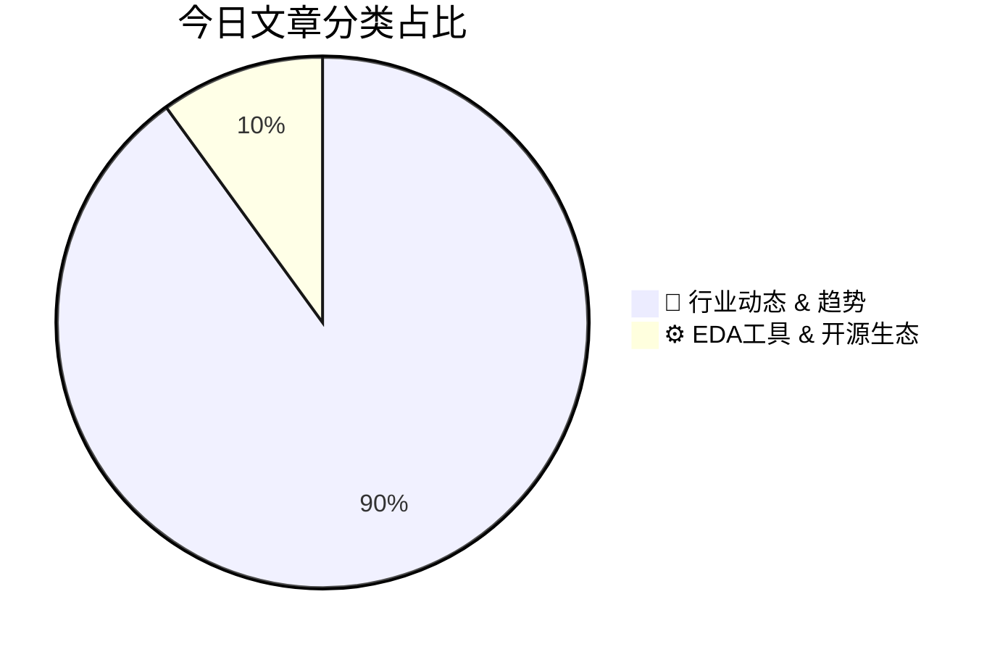

# 🛠️ FPGA / 验证技术每日精选

> 生成时间：2/20/2026, 2:01:52 AM | 数据范围：过去 48 小时

## 📝 今日看点

异构集成与光电融合正重构硬件验证边界：共封装光学(CPO)与背面金属化(BSM)技术（如HDFO/S-SWIFT架构）的演进，要求验证流程从传统电域SI/PI分析扩展至光电协同仿真，并应对3D堆叠带来的热-机械耦合应力挑战。工艺变异控制进入原子尺度：基于虚拟制造(Virtual Fabrication)的晶圆内变化(WiW)建模与氧化铟(In2O3)等新型沟道材料的引入，迫使验证方法论从统计 corner 分析转向基于机器学习的原子级缺陷预测与数字孪生(Digital Twin)实时校准。计算验证基础设施迎来GPU化革命：力场(Force Field)算法与GPU加速制造平台的结合，将原子模拟速度提升四个数量级，使得第一性原理级别的 sign-off 验证在可接受的TAT（周转时间）内完成。这三大趋势共同指向硬件验证正从宏观电气特性验证向多物理场跨尺度（从原子级工艺变异到系统级光电集成）协同验证范式的根本性迁移。

---

## 🏆 今日必读 (Top 3)

### 1. [激光器阵列有望简化光电共封装技术](https://semiengineering.com/laser-arrays-may-simplify-co-packaged-optics/)
**评分**: 8/10 | **分类**: 🚀 行业动态 & 趋势 | **标签**: `Co-Packaged Optics` `Laser Arrays` `Advanced Packaging` `Optical Interconnects` `Heterogeneous Integration`

> **💡 推荐理由**：CPO技术正成为突破电互连带宽瓶颈的关键方向，验证工程师必须理解光电混合系统的验证范式转移。激光器阵列的引入重构了验证边界，要求建立光电协同仿真环境（如光电联合仿真、光通道SI/PI分析），并需验证光功率稳定性与电信号的交叉影响。掌握该架构有助于验证工程师应对未来异构集成芯片中的光电接口验证挑战，特别是在多物理场耦合、良率测试策略和故障模式覆盖方面建立系统性验证思维。

**摘要**：
光电共封装（CPO）技术面临分立激光器集成复杂、光路对准困难及封装成本高昂等核心痛点。激光器阵列方案通过将多路激光源单片集成，显著简化了光学耦合对准工艺和系统封装复杂度。该集成化方法不仅降低了机械装配难度和制造成本，还提升了系统的可靠性和热管理效率。此技术为超大规模数据中心和高性能计算平台提供了更可行的光互连工程实现路径，有望加速CPO技术的商业化落地。

### 2. [理解晶圆内变化：一种虚拟制造方法](https://semiengineering.com/understanding-within-wafer-variations-a-virtual-fabrication-approach/)
**评分**: 7/10 | **分类**: ⚙️ EDA工具 & 开源生态 | **标签**: `Virtual Fabrication` `Within-Wafer Variation` `TCAD` `Process Modeling` `Semiconductor Manufacturing`

> **💡 推荐理由**：对验证工程师而言，理解工艺变化是构建真实验证场景的基础。本文介绍的虚拟制造方法为建立精确的OCV（On-Chip Variation）、AOCV和POCV（Parametric OCV）模型提供了数据支撑，有助于在RTL/门级仿真阶段更准确地模拟工艺角（Process Corner）和偏差（Skew）对时序、功耗的影响。掌握此方法可帮助验证团队提前识别由制造波动导致的潜在失效模式，优化裕量（Margin）设置，减少对实际硅片测试的依赖，从而提升验证覆盖率和一次流片成功率。

**摘要**：
随着工艺节点演进，晶圆内（Within-Wafer）工艺变化已成为影响芯片良率和性能一致性的关键挑战。传统依赖实际流片数据的分析方法成本高昂且反馈滞后，难以在早期设计阶段提供有效指导。本文提出了一种基于虚拟制造（Virtual Fabrication）的方法，利用软件模拟工艺制程来预测和量化晶圆级几何与电学参数的变化分布。该方法能够在硅片生产前建立高精度的工艺变化模型，帮助识别关键工艺步骤对器件性能的敏感影响。通过将制造感知（Manufacturing-Aware）分析融入前端设计流程，工程师可在设计初期优化版图规则并提高良率预测的准确性，从而缩短研发周期并降低风险。

### 3. [Leading At Light Speed: What Makes Photonics Leadership Different](https://semiengineering.com/leading-at-light-speed-what-makes-photonics-leadership-different/)
**评分**: 7/10 | **分类**: 🚀 行业动态 & 趋势 | **标签**: `Photonics` `Silicon Photonics` `Optical Interconnect` `Heterogeneous Integration` `Leadership`

> **💡 推荐理由**：无

**摘要**：
摘要生成失败。

---

## 📊 资讯分布与高频标签

## 📋 更多分类好文

### 🚀 行业动态 & 趋势

- [**SEMI 2026年美国半导体政策战略**](https://semiengineering.com/semi-2026-u-s-policy-strategy/) - *semiengineering.com* (7分)
  > SEMI 2026年美国政策战略针对美国半导体产业面临的人才短缺、供应链脆弱及地缘政治竞争等核心痛点，提出了一系列系统性解决方案。该战略强调通过CHIPS法案的持续实施，加大对本土制造、研发和人才培养的投资力度，以重建美国半导体制造生态。同时，报告呼吁建立更灵活的出口管制框架，在维护国家安全与保持技术领先之间寻求平衡，避免过度限制损害美国企业竞争力。此外，战略提出加强与盟友的供应链合作（友岸外包），构建 resilient 的全球化半导体产业链。最后，建议优化移民政策以吸引全球顶尖工程人才，解决行业严重的人才缺口问题。

- [**当“干净”的芯片并不够干净**](https://semiengineering.com/when-cleaning-chips-isnt-clean-enough/) - *semiengineering.com* (7分)
  > 文章指出数字芯片验证中一个常见但危险的误区：验证团队常将回归测试的表面通过（clean regressions）视为设计成熟的标志，却忽视了测试平台漏洞、覆盖率盲区或激励生成不足等深层次问题。这种虚假的“干净”状态往往导致流片后才发现关键缺陷，造成高昂的返工成本。为解决这一痛点，作者提出需建立超越表面通过的多维度验证sign-off标准，包括引入形式验证进行穷尽式检查、实施覆盖率深度挖掘与盲区分析、以及系统化故障注入测试来暴露潜在漏洞。文章强调，真正的验证收敛应基于可量化的质量指标与严格的逻辑审查，而非仅仅依赖回归测试的通过状态。

- [**Wi-Fi 7进军物联网**](https://semiengineering.com/wi-fi-7-moves-to-the-iot/) - *semiengineering.com* (7分)
  > Wi-Fi 7技术正从高端消费电子设备向资源受限的物联网领域扩展，面临功耗、成本与协议复杂度的核心矛盾。物联网设备的严苛资源限制与Wi-Fi 7复杂功能（如多链路操作MLO、4K-QAM调制、320MHz带宽）存在巨大鸿沟，导致传统验证方法难以覆盖低功耗场景下的协议一致性、射频-基带协同及多协议共存验证。文章提出了针对IoT场景的Wi-Fi 7功能裁剪策略、轻量级MAC实现架构，以及结合形式验证与硬件仿真的低功耗混合验证平台。通过引入DVFS感知的验证方法和分层抽象模型，在保持关键吞吐性能的同时显著降低验证空间复杂度，解决了aggressive电源管理策略带来的跨时钟域时序闭合与动态电压切换验证难题。

- [**重新定义背面金属化：面向HDFO和S-SWIFT设计的低温解决方案**](https://semiengineering.com/redefining-backside-metallization-low%e2%80%91temperature-solutions-for-hdfo-and-s%e2%80%91swift-designs/) - *semiengineering.com* (6分)
  > 随着先进封装技术向高密度扇出（HDFO）和S-SWIFT架构演进，传统高温背面金属化工艺面临热预算超支、器件性能退化等核心挑战。本文针对高温工艺对温度敏感元件及超薄晶圆造成的机械应力与电性能损伤这一关键痛点，提出了创新的低温背面金属化解决方案。该方案通过优化沉积工艺与新型材料体系，在保证金属层导电性与附着力的同时，显著降低了工艺热预算。这项技术不仅解决了先进封装中的热管理难题，还为3D集成和异构集成提供了更灵活的工艺窗口，确保高可靠性互连并提升最终产品良率。

- [**氧化铟芯片为何备受关注**](https://semiengineering.com/why-indium-oxide-chips-are-getting-so-much-attention/) - *semiengineering.com* (6分)
  > 氧化铟（In₂O₃）作为一种新兴的宽禁带半导体材料，正受到业界广泛关注，其核心痛点在于传统硅基材料在高频、高功率及透明电子应用中的性能瓶颈，以及氮化镓和碳化硅等替代材料高昂的成本和复杂的制造工艺。氧化铟凭借其超高的电子迁移率、适宜的禁带宽度（约3 eV）和优异的光学透明性，为下一代功率器件、射频芯片和透明集成电路提供了经济高效的解决方案。该材料可在较低温度下通过溶液法制备，并与现有硅基工艺展现潜在兼容性，大幅降低了先进半导体的制造门槛。然而，氧化铟器件的稳定性、p型掺杂困难以及长期可靠性问题仍是待解决的技术挑战，需要产业链协同突破。

- [**实现业界首个GPU加速制造平台**](https://semiengineering.com/enabling-the-industrys-first-gpu-accelerated-manufacturing-platform/) - *semiengineering.com* (6分)
  > 传统半导体制造测试平台在处理海量晶圆测试数据时面临严重的性能瓶颈，导致数据分析周期长、良率优化滞后，影响产品上市时间。本文介绍了业界首个基于GPU加速的制造平台架构，通过利用GPU的大规模并行计算能力，将测试数据处理、缺陷分析和良率学习速度提升数个数量级。该平台整合了高性能计算与先进算法，实现了实时数据分析和预测性维护，显著缩短了从测试到量产的周期。这一创新架构不仅解决了制造业的大数据处理痛点，也为测试流程的智能化转型提供了可扩展的技术基础。

- [**力场计算将在2026年实现原子级模拟万倍加速，开启科学发现新纪元**](https://semiengineering.com/force-fields-will-accelerate-atomistic-simulations-by-10000x-in-2026-unlocking-new-era-of-discovery/) - *semiengineering.com* (5分)
  > 当前原子级模拟受限于力场计算的巨大开销，传统基于量子力学或经验势函数的方法难以扩展至大分子系统与长时域演化，成为药物发现和材料设计的核心瓶颈。新兴的机器学习力场（ML Force Fields）结合定制化异构硬件加速架构，预计将在2026年实现10,000倍性能突破，通过神经网络近似势能面计算显著降低计算复杂度。这一技术革命将突破现有算力限制，使毫秒级生物分子动态过程与百万原子级材料模拟成为常态，大幅加速新药研发周期。其核心挑战在于如何在保持量子力学精度的同时实现高效近似，以及构建支持大规模并行计算的硬件验证体系。

