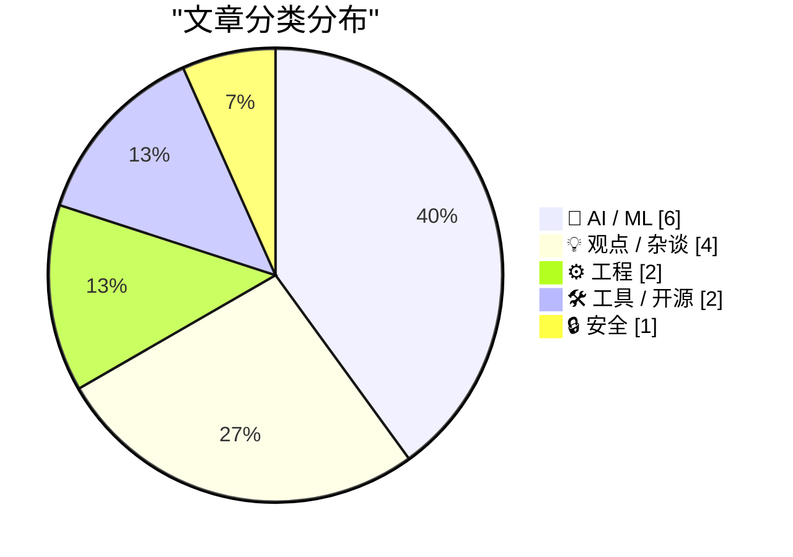
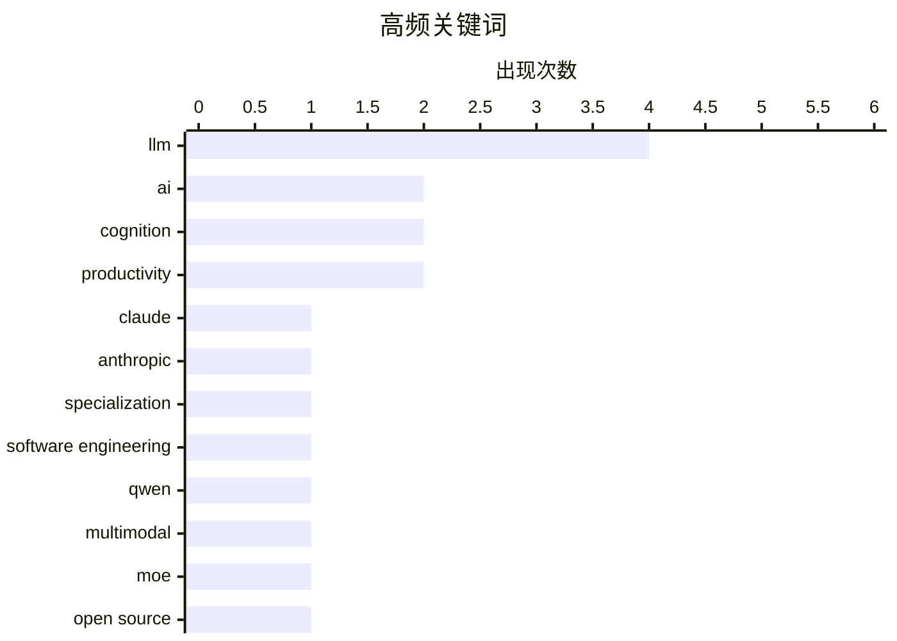

# 📰 AI 博客每日精选 — 2026-02-19

> 来自 Karpathy 推荐的 92 个顶级技术博客，AI 精选 Top 15

## 📝 今日看点

今日技术圈呈现三大核心动态：以Claude Sonnet 4.6和Qwen3.5为代表的大模型正加速向多模态与Agent能力演进，开源与闭源赛道竞争白热化；AI对软件开发的颠覆已从概念落地为现实，不仅重构了编程范式，更引发对"专业技能价值"和"认知债务"的深层反思；与此同时，AI生成内容的泛滥与儿童安全风险暴露出技术治理的滞后，行业亟待建立更严格的质量控制与伦理守门机制。

---

## 🏆 今日必读

🥇 **Claude Sonnet 4.6 发布**

[Introducing Claude Sonnet 4.6](https://simonwillison.net/2026/Feb/17/claude-sonnet-46/#atom-everything) — simonwillison.net · 1 天前 · 🤖 AI / ML

> Anthropic 发布 Claude Sonnet 4.6，在保持 Sonnet 系列定价（输入 $3/百万 tokens，输出 $15/百万 tokens）的前提下，实现了与 Opus 4.5 相当的性能水平。相比之下，Opus 模型定价为 $5/$25 每百万 tokens，Sonnet 4.6 提供了显著更高的性价比。该模型系统卡（system card）详细说明了其技术规格与安全特性。

💡 **为什么值得读**: 了解最新大模型性能与成本权衡的关键更新，对选型有直接影响。

🏷️ Claude, LLM, Anthropic

🥈 **引用 Martin Fowler：LLM 正在吞噬专业技能**

[Quoting Martin Fowler](https://simonwillison.net/2026/Feb/18/martin-fowler/#atom-everything) — simonwillison.net · 9 小时前 · 🤖 AI / ML

> 随着 LLM 普及，专业技能（如前后端开发细节）的价值正在被稀释，掌握 LLM 驱动技能比精通特定平台使用更为重要。这可能导致对"专家通才"（Expert Generalists）需求的上升，或者 LLM 会绕过专业壁垒直接生成大量代码。传统软件开发的专业分工模式面临根本性重构，职业身份认同将发生转移。

💡 **为什么值得读**: 前瞻性思考 AI 如何重塑软件开发职业结构与技能需求。

🏷️ LLM, specialization, software engineering

🥉 **Qwen3.5：迈向原生多模态智能体**

[Qwen3.5: Towards Native Multimodal Agents](https://simonwillison.net/2026/Feb/17/qwen35/#atom-everything) — simonwillison.net · 1 天前 · 🤖 AI / ML

> 阿里巴巴 Qwen 团队发布 Qwen 3.5 系列首批两个模型，均支持视觉多模态输入。开源版本 Qwen3.5-397B-A17B 采用混合专家（MoE）架构，激活参数 17B，总参数 397B，强调推理效率与 serving 成本优化。该系列同时提供开源权重版本和专有 API 版本，为开发者提供灵活选择。

💡 **为什么值得读**: 开源社区获得与闭源模型竞争的多模态大模型新选择。

🏷️ Qwen, multimodal, LLM, MoE

---

## 📊 数据概览

| 扫描源 | 抓取文章 | 时间范围 | 精选 |
|:---:|:---:|:---:|:---:|
| 81/92 | 2352 篇 → 36 篇 | 48h | **15 篇** |

### 分类分布



### 高频关键词



<details>
<summary>📈 纯文本关键词图（终端友好）</summary>

```
llm                  │ ████████████████████ 4
ai                   │ ██████████░░░░░░░░░░ 2
cognition            │ ██████████░░░░░░░░░░ 2
productivity         │ ██████████░░░░░░░░░░ 2
claude               │ █████░░░░░░░░░░░░░░░ 1
anthropic            │ █████░░░░░░░░░░░░░░░ 1
specialization       │ █████░░░░░░░░░░░░░░░ 1
software engineering │ █████░░░░░░░░░░░░░░░ 1
qwen                 │ █████░░░░░░░░░░░░░░░ 1
multimodal           │ █████░░░░░░░░░░░░░░░ 1
```

</details>

### 🏷️ 话题标签

**llm**(4) · **ai**(2) · **cognition**(2) · productivity(2) · claude(1) · anthropic(1) · specialization(1) · software engineering(1) · qwen(1) · multimodal(1) · moe(1) · open source(1) · ai-generated code(1) · maintainer burnout(1) · ai disruption(1) · software development(1) · future of work(1) · safety(1) · ethics(1) · type system(1)

---

## 🤖 AI / ML

### 1. Claude Sonnet 4.6 发布

[Introducing Claude Sonnet 4.6](https://simonwillison.net/2026/Feb/17/claude-sonnet-46/#atom-everything) — **simonwillison.net** · 1 天前 · ⭐ 27/30

> Anthropic 发布 Claude Sonnet 4.6，在保持 Sonnet 系列定价（输入 $3/百万 tokens，输出 $15/百万 tokens）的前提下，实现了与 Opus 4.5 相当的性能水平。相比之下，Opus 模型定价为 $5/$25 每百万 tokens，Sonnet 4.6 提供了显著更高的性价比。该模型系统卡（system card）详细说明了其技术规格与安全特性。

🏷️ Claude, LLM, Anthropic

---

### 2. 引用 Martin Fowler：LLM 正在吞噬专业技能

[Quoting Martin Fowler](https://simonwillison.net/2026/Feb/18/martin-fowler/#atom-everything) — **simonwillison.net** · 9 小时前 · ⭐ 26/30

> 随着 LLM 普及，专业技能（如前后端开发细节）的价值正在被稀释，掌握 LLM 驱动技能比精通特定平台使用更为重要。这可能导致对"专家通才"（Expert Generalists）需求的上升，或者 LLM 会绕过专业壁垒直接生成大量代码。传统软件开发的专业分工模式面临根本性重构，职业身份认同将发生转移。

🏷️ LLM, specialization, software engineering

---

### 3. Qwen3.5：迈向原生多模态智能体

[Qwen3.5: Towards Native Multimodal Agents](https://simonwillison.net/2026/Feb/17/qwen35/#atom-everything) — **simonwillison.net** · 1 天前 · ⭐ 26/30

> 阿里巴巴 Qwen 团队发布 Qwen 3.5 系列首批两个模型，均支持视觉多模态输入。开源版本 Qwen3.5-397B-A17B 采用混合专家（MoE）架构，激活参数 17B，总参数 397B，强调推理效率与 serving 成本优化。该系列同时提供开源权重版本和专有 API 版本，为开发者提供灵活选择。

🏷️ Qwen, multimodal, LLM, MoE

---

### 4. 我们等待已久的 AI 颠覆已经到来

[The A.I. Disruption We’ve Been Waiting for Has Arrived](https://simonwillison.net/2026/Feb/18/the-ai-disruption/#atom-everything) — **simonwillison.net** · 8 小时前 · ⭐ 25/30

> Paul Ford 在《纽约时报》撰文指出，AI 对软件行业的颠覆性变革已从概念进入现实，特别是 2025 年 11 月前后的技术跃升标志着关键转折点。这场变革不仅改变编程方式，更重塑整个技术行业的经济结构和劳动形态。作者认为当前正是行业应对这一历史性转变的关键时刻。

🏷️ AI disruption, software development, future of work

---

### 5. 我们怎会让 AI 威胁到孩子们的生命？

[How did we end up threatening our kids’ lives with AI?](https://anildash.com/2026/02/18/threatening-kids-with-AI/) — **anildash.com** · 1 天前 · ⭐ 25/30

> Anil Dash 严厉批评大型 AI 公司在儿童安全方面的失职，指出当前 AI 系统已产生针对儿童的严重安全隐患和令人不安的内容风险。作者强调这些威胁并非技术偶然，而是企业主动选择的结果，呼吁行业正视 AI 伦理责任。文章警告若不立即采取行动，下一代将承受不可挽回的伤害。

🏷️ AI, safety, ethics

---

### 6. 引用 Dimitris Papailiopoulos：近乎魔法的研究工具

[Quoting Dimitris Papailiopoulos](https://simonwillison.net/2026/Feb/17/dimitris-papailiopoulos/#atom-everything) — **simonwillison.net** · 1 天前 · ⭐ 23/30

> AI 工具已成为研究者探索新想法的"魔法盒"，投入问题即可几乎零人力成本获得初步答案，彻底改变了传统研究流程。过去需要学生手动验证或研究者自行拼凑原型的信号探测阶段，现在可由 AI 即时完成，只有当信号确认后才投入深度研究。这种转变显著降低了学术探索的试错成本。

🏷️ LLM, cognition, productivity

---

## 💡 观点 / 杂谈

### 7. 守门机制的必要性：中世纪行会的启示

[The case for gatekeeping, or: why medieval guilds had it figured out](https://www.joanwestenberg.com/the-case-for-gatekeeping-or-why-medieval-guilds-had-it-figured-out/) — **joanwestenberg.com** · 23 小时前 · ⭐ 26/30

> 开源维护者正面临 AI 生成低质量 PR（Pull Request）的洪水冲击，这些批量提交的代码看似规范实则质量低下，将仓库变成"废稿堆"。作者主张借鉴中世纪行会的质量控制机制，建立严格的贡献筛选标准，而非无条件接受所有表面合规的提交。这种"守门"不是排他，而是维护代码库健康的必要手段。

🏷️ open source, AI-generated code, maintainer burnout

---

### 8. Nano Banana Pro：将 diff 转为网络漫画

[Nano Banana Pro diff to webcomic](https://simonwillison.net/2026/Feb/17/release-notes-webcomic/#atom-everything) — **simonwillison.net** · 1 天前 · ⭐ 22/30

> 针对 AI 加速开发导致的"认知债务"——项目数量激增但深度理解减少——Nathan Baschez 提出将代码变更（diff）转换为网络漫画的创新方案。通过视觉化叙事降低复杂变更的认知负荷，帮助开发者在快节奏开发中保持对项目的深度理解。这种方法尝试用新媒介对抗 AI 开发带来的信息过载。

🏷️ cognitive debt, AI development, complexity

---

### 9. 关于「关怀」的几点漫谈

[A Few Rambling Observations on Care](https://blog.jim-nielsen.com/2026/observations-on-care/) — **blog.jim-nielsen.com** · 7 小时前 · ⭐ 22/30

> 在AI时代，「品味」被推崇为至高无上的技能，但作者认为「关怀」才是购买产品时真正看重的品质。关怀与量化的本质相悖，它难以被测量，且在大规模生产中往往被稀释。当产品决策完全交由数字和指标仲裁时，关怀便会消失。真正的关怀体现在那些无法被数据捕捉的细节和人性化的坚持中。

🏷️ AI, product craft, taste

---

### 10. 思考提升思考能力

[Thinking Improves Thinking](https://idiallo.com/blog/taking-our-mind-for-granted?src=feed) — **idiallo.com** · 14 小时前 · ⭐ 21/30

> 在 ChatGPT 普及之前，人们通过忍受认知不适、长时间静坐或散步来强迫大脑建立逻辑连接并解决问题。这种主动思考的过程本身就是一种训练，能够持续提升思维能力。依赖 AI 生成答案反而可能削弱这种深层思考能力，因为大脑失去了在困惑中挣扎并自主产生洞察的机会。

🏷️ critical thinking, AI dependency, cognition

---

## ⚙️ 工程

### 11. 无需亲自打字的编程

[Typing without having to type](https://simonwillison.net/2026/Feb/18/typing/#atom-everything) — **simonwillison.net** · 7 小时前 · ⭐ 22/30

> 拥有 25 年编程经验的 Simon Willison 转变立场，开始接受类型提示和强类型语言，因 AI 编码代理承担了繁琐的代码输入工作。过去强类型会拖慢 REPL 环境的迭代速度，但在 AI 辅助编程场景下，明确的类型定义反而成为管理复杂度的优势。这标志着个人开发者在 AI 时代编程范式的根本性转变。

🏷️ type system, programming, productivity

---

### 12. 避免中间缓冲区能否让 WriteProcessMemory 更快？

[Could Write­Process­Memory be made faster by avoiding the intermediate buffer?](https://devblogs.microsoft.com/oldnewthing/20260218-00/?p=112069) — **devblogs.microsoft.com/oldnewthing** · 11 小时前 · ⭐ 21/30

> 针对 Windows API WriteProcessMemory 是否可以通过消除中间缓冲区来提升性能的问题，技术答案是「可以」，但实际意义有限。该函数的设计优先考虑稳定性和安全性而非极致性能，避免缓冲区虽然理论上能减少一次内存拷贝，但带来的性能收益相对于系统调用的开销微不足道，因此不值得为此增加代码复杂性。

🏷️ Windows API, system programming, memory management

---

## 🛠 工具 / 开源

### 13. Markdown 的时刻

[Markdown’s Moment](https://feed.tedium.co/link/15204/17278321/markdown-growing-influence-cloudflare-ai) — **tedium.co** · 22 小时前 · ⭐ 22/30

> Cloudflare 等科技巨头正大力推广 Markdown 格式，这种轻量级标记语言因 AI 应用的普及而迎来新的发展机遇。Markdown 的纯文本特性使其成为 AI 生成内容和人类编辑之间的理想交互格式，可能带来意外的生态效益。这一趋势标志着基础工具链在 AI 时代的复兴与重新定位。

🏷️ Markdown, documentation, enterprise adoption

---

### 14. Anubis v1.25.0: Necron 版本发布

[Anubis v1.25.0: Necron](https://github.com/TecharoHQ/anubis/releases/tag/v1.25.0) — **xeiaso.net** · 1 天前 · ⭐ 21/30

> Anubis 项目发布 v1.25.0 版本，但开发进度明显放缓。维护者因个人生活变故和职业倦怠，暂时无法在公开渠道投入大量精力，尽管幕后仍在推进工作。此次更新主要是维护性发布，作者承诺后续会有更多项目状态说明。该版本代号「Necron」，体现了开源维护的现实挑战。

🏷️ Anubis, anti-scraping, web security

---

## 🔒 安全

### 15. 每周更新 491：ESP32 蓝牙桥接实验失败

[Weekly Update 491](https://www.troyhunt.com/weekly-update-491/) — **troyhunt.com** · 1 天前 · ⭐ 22/30

> Troy Hunt 尝试使用 ESP32 作为蓝牙桥接器控制 Yale 智能锁的实验以失败告终。虽然 ESP32 无线电本身性能良好，但无法实现对锁的可靠操作，可能是因为 BLE（低功耗蓝牙）的被动特性无法提供足够的检测可靠性。这次失败排除了该技术路线，为后续尝试其他解决方案提供了明确的排除依据。

🏷️ ESP32, BLE, IoT

---

*生成于 2026-02-19 02:05 | 扫描 81 源 → 获取 2352 篇 → 精选 15 篇*
*基于 [Hacker News Popularity Contest 2025](https://refactoringenglish.com/tools/hn-popularity/) RSS 源列表，由 [Andrej Karpathy](https://x.com/karpathy) 推荐*
*由「懂点儿AI」制作，欢迎关注同名微信公众号获取更多 AI 实用技巧 💡*
