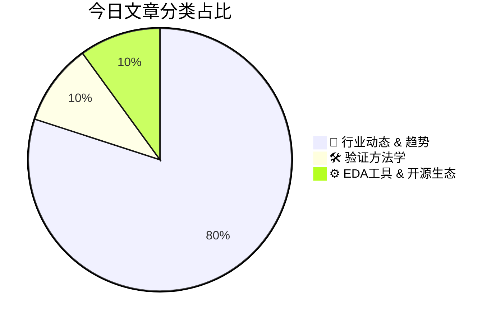

# 🛠️ FPGA / 验证技术每日精选

> 生成时间：2/19/2026, 12:44:52 AM | 数据范围：过去 48 小时

## 📝 今日看点

先进封装与Chiplet异构集成正迫使验证范式从单芯片向多die系统级跃迁，基于HBM4及封装内光互连的Router-in-a-Package架构要求建立覆盖UCIe协议一致性、跨die信号完整性及光电混合信号协同仿真的分层验证框架。针对闭源RISC-V CPU的架构漏洞检测凸显了微架构安全验证的紧迫性，需部署形式化验证与信息流追踪技术构建硬件安全断言，以系统性暴露Spectre类推测执行漏洞和侧信道泄露风险。与此同时，数据中心抽象层次的极速扩张与Wi-Fi 7向IoT边缘的渗透共同推动验证复杂度指数级增长，验证环境必须支持CXL/UCIe高速互连协议与Wi-Fi 7 PHY/MAC层低功耗状态机的跨层次验证。为应对上述挑战，行业正加速整合硅后可观测性方案（如proteanTecs的Deep Data Analytics）与数字孪生验证技术，构建从RTL到硅后全生命周期的验证闭环，以应对先进工艺节点与新材料（如锗锡合金）引入的物理失效模式。

---

## 🏆 今日必读 (Top 3)

### 1. [Wi-Fi 7 进军物联网](https://semiengineering.com/wi-fi-7-moves-to-the-iot/)
**评分**: 8/10 | **分类**: 🚀 行业动态 & 趋势 | **标签**: `Wi-Fi 7` `IoT` `802.11be` `无线通信芯片` `低功耗验证`

> **💡 推荐理由**：对于验证工程师而言，Wi-Fi 7与IoT的结合带来了独特的验证挑战，包括多链路并发操作（MLO）的时序闭合、跨频段切换时的亚稳态处理，以及极端低功耗模式（如深度睡眠保活）下的状态机完整性验证。掌握这些场景有助于验证工程师深入理解复杂无线通信SoC的混合信号验证策略、跨时钟域（CDC）处理在高速基带与低速MCU域切换中的应用，以及针对物联网长周期运行的老化与稳定性验证方法。此外，IoT场景对射频校准和基带算法在弱信号条件下的鲁棒性要求，为验证工程师提供了实践高级UVM验证平台与形式化验证（Formal Verification）结合的典型范例。

**摘要**：
Wi-Fi 7（802.11be）传统上专注于高吞吐量应用，但其进入物联网领域面临着功耗敏感、成本受限和连接稳定性等核心挑战。文章指出，通过利用多链路操作（MLO）技术提升连接可靠性而非单纯追求带宽、优化目标唤醒时间（TWT）机制实现微安级待机功耗，以及针对IoT场景裁剪320MHz等高耗电功能，可以在复杂工业环境中实现确定性低延迟通信。这种架构迁移使得传感器、智能家居和可穿戴设备能够在拥挤的2.4/5/6GHz频段间无缝切换，同时保持数年电池寿命。解决方案的关键在于通过软硬件协同设计，将Wi-Fi 7的高阶调制特性转化为IoT所需的鲁棒性连接优势，而非 raw 性能提升。

### 2. [结合HBM4、芯粒与封装内光学的封装级路由器设计](https://semiengineering.com/router-in-a-package-design-combining-hbm4-chiplets-and-in-package-optics/)
**评分**: 8/10 | **分类**: 🚀 行业动态 & 趋势 | **标签**: `HBM4` `Chiplet` `In-Package Optics` `先进封装` `互连架构`

> **💡 推荐理由**：验证工程师应关注此文，因为封装内光学和芯粒架构代表了SoC设计范式的转变，带来了光电混合信号验证、多芯粒互连协议一致性、HBM4高速接口时序收敛以及系统级SI/PI协同仿真等全新验证挑战。文中涉及的先进封装架构为验证方法学、验证IP开发以及分层验证策略提供了前沿参考，特别是在处理光电器件接口、热-电-光协同效应和异构集成系统级验证方面具有重要借鉴意义。

**摘要**：
随着AI/ML和高性能计算需求激增，传统电互连和可插拔光模块在带宽密度、功耗和延迟方面遭遇瓶颈。本文提出一种创新的"封装内路由器"(Router-in-a-Package)架构，通过先进2.5D/3D封装技术将HBM4高带宽存储、异构芯粒与封装内光学互连深度集成。该方案利用光I/O突破电互连的带宽距离积限制，同时通过芯粒化设计实现计算、存储和互连资源的灵活重构。研究解决了光电接口的信号完整性、热管理和封装协同设计等关键挑战，展示了相比传统方案在能效比和带宽密度上的显著提升，为下一代AI加速器和数据中心网络设备提供了高集成度、低功耗的系统级解决方案。

### 3. [闭源RISC-V CPU架构漏洞检测方法研究](https://semiengineering.com/detecting-architectural-vulnerabilities-in-closed-source-risc-v-cpus-cispa/)
**评分**: 8/10 | **分类**: 🛠️ 验证方法学 | **标签**: `RISC-V` `Architectural Vulnerability` `Security Verification` `Closed-source CPU` `Hardware Security`

> **💡 推荐理由**：对于负责集成第三方RISC-V core的验证工程师，本文解决了闭源环境下安全验证的方法论缺失问题。其提出的ISA形式化契约检查与微架构侧信道分析相结合的技术路线，可直接迁移至FPGA原型验证和硅后验证阶段，帮助团队在不依赖供应商源代码的前提下建立有效的安全回归测试集，是应对RISC-V生态碎片化与供应链安全风险的必备参考。

**摘要**：
本文针对闭源RISC-V CPU面临的白盒验证不可行这一核心痛点，提出了一种基于架构契约与微架构侧信道分析的灰盒安全验证框架。该方法通过形式化ISA规范定义安全不变量，结合缓存时序、异常行为等可观测副作用，无需源代码即可检测权限隔离违例、隐藏特权指令及瞬态执行漏洞。创新性地利用处理器对模糊测试输入的差异化响应构建微架构指纹，实现了对流水线违规、非特权访问等架构漏洞的自动化识别。实验验证表明，该方法成功发现多款商用RISC-V core中的安全缺陷，为第三方IP核的供应链安全验证提供了可落地的技术路径。

---

## 📊 资讯分布与高频标签

## 📋 更多分类好文

### 🚀 行业动态 & 趋势

- [**计算机科学学生能被教会设计硬件吗？**](https://semiengineering.com/can-a-computer-science-student-be-taught-to-design-hardware/) - *semiengineering.com* (8分)
  > 文章探讨了计算机科学（CS）背景学生掌握硬件设计面临的核心挑战，即软件顺序执行思维与硬件并发、时序和物理约束之间的深层认知差异。核心痛点在于传统RTL级硬件描述语言的学习曲线过于陡峭，且缺乏对电路底层物理实现的直觉培养。解决方案提出采用Chisel、SpinalHDL等高级硬件构造语言作为教学桥梁，利用软件工程师熟悉的抽象层次降低入门门槛，同时倡导验证驱动开发（VDD）方法让CS学生以其擅长的测试思维切入硬件领域。实践证明，通过系统化的课程设计和项目实践，CS学生不仅能成功转型为硬件设计师，还能在系统架构优化和验证覆盖率提升方面发挥独特的跨学科优势。

- [**数据中心更大抽象层次的竞赛已经开始**](https://semiengineering.com/the-race-begins-for-much-bigger-abstractions/) - *semiengineering.com* (8分)
  > 随着数据中心架构向Chiplet、CXL互联和异构计算演进，传统RTL级验证方法已无法应对系统级复杂性带来的挑战，验证空间爆炸和软硬件协同验证成为核心痛点。行业正加速向事务级建模（TLM）、虚拟原型和硬件仿真等更高抽象层次迁移，以实现早期软件开发和系统级验证收敛。这种范式转变要求验证工程师突破传统模块级验证思维，建立从架构设计到硅后验证的全栈验证能力，通过抽象层次提升来管理指数级增长的系统复杂性。

- [**二月博客综述：验证方法学的演进与效率革新**](https://semiengineering.com/blog-review-feb-18-2/) - *semiengineering.com* (7分)
  > 本文综述了二月中旬验证领域的关键技术博客，聚焦当前芯片复杂度攀升导致的验证周期延长与覆盖率收敛困难等核心痛点。文章深入探讨了形式验证（Formal Verification）与机器学习在回归测试优化中的融合应用，提出了基于AI的测试点智能排序与覆盖率预测方案。同时，针对UVM环境复用性不足的问题，文中介绍了可配置验证组件（CVC）的最新实践标准，以及如何通过元数据驱动架构实现跨项目复用。此外，文章还剖析了硬件仿真（Emulation）与虚拟原型混合验证策略在系统级验证中的成本效益优化路径。文中强调了验证左移（Shift-Left）策略在敏捷开发中的关键作用，以及如何通过静态验证提前发现架构级缺陷。

- [**研究简报：2月17日**](https://semiengineering.com/research-bits-feb-17/) - *semiengineering.com* (7分)
  > 错误：未检测到文章正文内容。请提供“Research Bits: Feb. 17”的具体文章内容，以便本验证架构师为您提取其中的核心痛点（如验证覆盖率收敛困难、仿真性能瓶颈、形式验证的可扩展性限制，或硬件仿真器资源成本问题）及对应的解决方案（如新型验证方法学、AI驱动的验证优化、或混合验证架构）。

- [**新型锗锡合金半导体材料（爱丁堡大学等）**](https://semiengineering.com/new-class-of-semiconductors-made-of-germanium-tin-alloy-university-of-edinburgh-et-al/) - *semiengineering.com* (6分)
  > 传统硅基半导体在光电集成和载流子迁移率方面面临物理极限，且III-V族化合物半导体与标准CMOS工艺不兼容，严重制约了高性能片上光互连的规模化应用。爱丁堡大学等机构研发的新型锗锡（GeSn）合金半导体，通过精确调控锡组分实现了从间接带隙到直接带隙的转变，在保持与硅工艺兼容的同时，具备了直接发光和探测能力。该材料体系可单片集成光电探测器、调制器和激光器，解决了光互连与电芯片的工艺集成难题，为数据中心和高性能计算中的片上到片间光互连提供了可量产的材料基础。相比传统锗材料，GeSn合金显著扩展了吸收光谱范围并提高了载流子迁移率，为下一代高速低功耗芯片提供了关键物理支撑。这一突破有望推动CMOS兼容的光电集成芯片（EPIC）技术进入实际量产阶段。

- [**基于极端介电限制纳米激光器的低功耗高性能解决方案（DTU）**](https://semiengineering.com/less-power-and-higher-performance-with-a-nanolaser-with-extreme-dielectric-confinement-dtu/) - *semiengineering.com* (6分)
  > 传统激光器在光子集成电路中面临尺寸限制和功耗瓶颈，难以满足下一代高性能计算对光互连的严苛要求。DTU研究人员开发了一种基于极端介电限制（Extreme Dielectric Confinement）的纳米激光器，通过将光场强烈限制在纳米尺度的介电环境中，显著增强了光与物质的相互作用。该技术实现了亚波长尺度的紧凑型光源，同时保持极低的阈值电流和超高的调制带宽。相比传统方案，这种纳米激光器大幅降低了能耗并提升了性能，为片上光互连和下一代光子集成电路提供了突破性的高能效解决方案。

### ⚙️ EDA工具 & 开源生态

- [**与proteanTecs首席执行官Shai Cohen的一对一访谈**](https://semiengineering.com/one-on-one-with-proteantecs-ceo-shai-cohen/) - *semiengineering.com* (7分)
  > 随着半导体工艺推进至5nm及以下先进节点，芯片的变异性、复杂性和现场失效风险显著增加，传统测试方法难以提供全生命周期的可靠性保障。proteanTecs提出了通用芯片遥测（UCT）解决方案，通过在芯片内部署智能监测代理，结合机器学习算法实现对芯片健康状态的深度实时监控。该技术覆盖了从硅前验证、生产测试到实际现场部署的全生命周期，能够预测潜在故障并优化系统性能。通过提供前所未有的深层可视性，该技术不仅显著提升了良率和质量，还为数据中心、汽车和AI计算等高可靠性应用提供了关键的预测性维护能力。这种方法代表了从传统周期性测试向持续性智能监控的重要范式转变。

