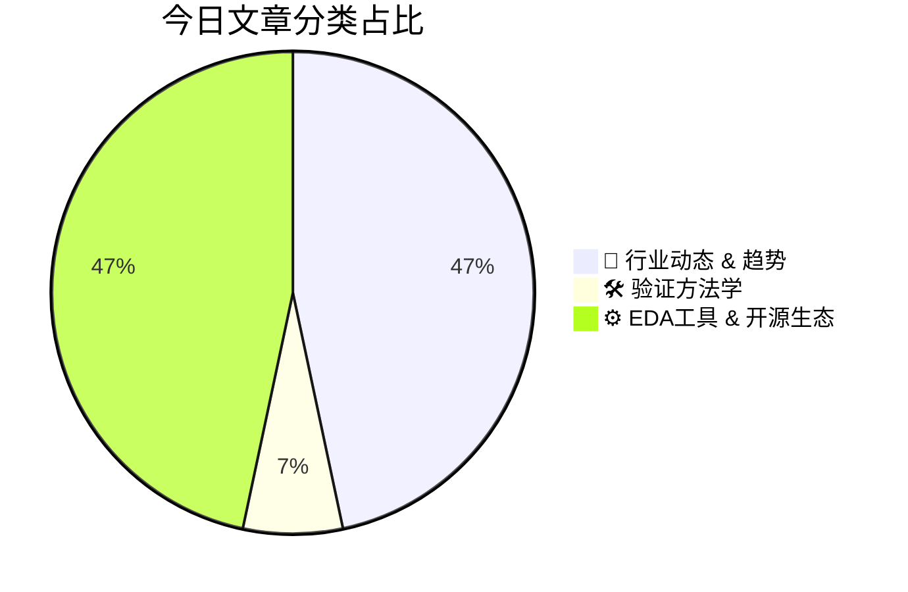

# 🛠️ FPGA / 验证技术每日精选

> 生成时间：2/21/2026, 2:01:17 AM | 数据范围：过去 24 小时

## 📝 今日看点

端侧LLM革命驱动边缘AI加速器与MoS₂忆阻器等新型存储的异构集成，验证方法论亟需支持存算一体架构的混合信号完整性验证及非易失存储器可靠性验证。3nm节点"悲观墙"凸显先进制程良率与经济性危机，验证流程正向DTCO（设计-工艺协同优化）深度迁移，强化硅后良率监控（Post-Silicon Yield Monitoring）与物理验证精度成为良率爬坡关键。汽车领域语音AI与沉浸式音频融合（如Tensilica HiFi iQ）推高功能安全验证门槛，需建立符合ISO 26262 ASIL等级的DSP算法硬件实现验证框架。EDA工具链的开放化与自动化趋势（SKILL脚本定制、XML器件库管理）进一步要求验证环境支持多工具协同与可扩展的验证IP复用机制。

---

## 🏆 今日必读 (Top 3)

### 1. [端侧大语言模型革命](https://semiengineering.com/the-on-device-llm-revolution/)
**评分**: 9/10 | **分类**: 🚀 行业动态 & 趋势 | **标签**: `Edge AI` `LLM` `AI Accelerator` `On-device inference` `低功耗设计`

> **💡 推荐理由**：作为数字IC/FPGA验证工程师，端侧LLM芯片的崛起带来了全新的验证挑战：需掌握AI加速器、内存子系统与CPU/GPU的协同验证方法，理解量化算法对硬件精度的影响，并构建覆盖多种神经网络算子的测试场景。文章有助于验证架构师建立面向AI芯片的验证策略，特别是针对功耗-性能权衡、数据流验证及边界场景测试等关键验证点，为下一代智能芯片验证提供方法论指导。

**摘要**：
文章探讨了将大型语言模型从云端迁移到终端设备所面临的计算资源受限、内存带宽瓶颈及功耗约束等核心挑战。针对这些痛点，业界正通过模型量化压缩、专用NPU架构设计以及软硬件协同优化等技术路径实现端侧部署。这种范式转变不仅要求芯片架构创新，更对验证方法论提出了全新要求，涉及复杂的异构计算验证、低功耗场景验证及实时性能基准测试。文章阐述了端侧AI芯片如何通过内存分层设计和计算单元重构来突破算力墙，并强调了形式化验证与仿真验证结合在确保AI加速器功能正确性中的关键作用。

### 2. [芯片行业一周回顾](https://semiengineering.com/chip-industry-week-in-review-126/)
**评分**: 8/10 | **分类**: 🚀 行业动态 & 趋势 | **标签**: `行业回顾` `半导体新闻` `市场趋势` `产业动态`

> **💡 推荐理由**：作为验证工程师，本文提供了从架构视角审视验证方法论演进的关键洞察，特别对当前验证技术债务（Verification Debt）的系统性解决方案有深度阐述。文中关于AI辅助约束随机验证（AI-driven CRV）和云原生验证流水线的实践案例，可直接指导团队验证环境的现代化升级路径，帮助验证工程师在复杂SoC项目中建立更具可扩展性和可靠性的验证闭环。

**摘要**：
本周行业焦点集中在先进制程芯片验证复杂度的指数级增长与验证效率之间的严重失衡，传统基于仿真的验证方法已难以应对百亿门级SoC的完备性验证需求，导致流片前验证盲区成为项目失败的主要风险点。文章深入剖析了当前验证领域面临的三重核心痛点：验证覆盖率收敛周期过长、软硬件协同验证环境搭建成本高昂、以及异构计算架构带来的场景爆炸难题。针对这些挑战，行业正加速推进基于AI的智能化验证策略生成与覆盖率收敛技术，同时形式验证与仿真验证的深度融合正成为提升 sign-off 信心的关键路径。此外，云原生验证平台（Cloud-Native Verification）的成熟化部署被普遍视为解决算力弹性需求与成本控制矛盾的根本解决方案，而数字孪生技术在预硅验证阶段（Pre-silicon）的应用显著降低了后期硅后调试（Post-silicon Debug）的风险成本。

### 3. [什么是3纳米“悲观墙”，为何它是一场经济危机？](https://semiwiki.com/eda/clockedge/366736-what-is-the-3nm-pessimism-wall-and-why-is-it-an-economic-crisis/)
**评分**: 8/10 | **分类**: 🚀 行业动态 & 趋势 | **标签**: `3nm工艺` `设计悲观度` `经济性分析` `先进制程` `PPA优化`

> **💡 推荐理由**：验证工程师需理解3nm节点的物理实现挑战对验证策略的深层影响，包括电压降和工艺变异对功能正确性的潜在影响、系统级性能验证与PPA权衡的关联，以及如何在验证环境中建模真实场景以协助消除过度悲观余量，从而推动从“过度保守”向“精准签核”的方法学转变。

**摘要**：
随着工艺节点推进至3nm及以下，传统静态时序分析（STA）签核中的过度悲观余量（Pessimism）已成为制约芯片经济性的关键瓶颈。这种“悲观墙”导致设计团队为补偿工艺变异、电压降和时序不确定性而预留过多margin，造成芯片面积膨胀、功耗上升和性能损失，显著增加流片成本。核心痛点在于传统Corner-based分析方法在先进工艺下产生累积性悲观，使得PPA（性能、功耗、面积）优化空间被严重压缩。解决方案包括采用Statistical STA、机器学习辅助时序分析、动态压降（Dynamic IR Drop）精确建模，以及设计-工艺协同优化（DTCO）来消除冗余余量。此外，通过硅数据校准（Silicon Calibration）和先进EDA工具实现更真实的签核场景，可在保证良率的同时避免过度设计。

---

## 📊 资讯分布与高频标签

## 📋 更多分类好文

### 🛠️ 验证方法学

- [**论坛讨论：示波器探头放置位置与测量结果分析**](https://community.cadence.com/cadence_technology_forums/f/awr-design-environment/65762/oscaprobe-placement-and-result) - *community.cadence.com* (8分)
  > 本文探讨了高速数字IC/FPGA验证过程中，示波器探头（Oscaprobe）物理放置位置对信号完整性测量精度的关键影响。核心痛点在于不当的探头布局会引入阻抗不连续、stub反射和噪声耦合，导致捕获波形失真，难以区分真实的设计缺陷与测量误差。文章系统分析了焊盘端接、过孔探测及内嵌探针等不同放置方案对信号质量的量化影响机制。提出的解决方案包括优化探头布局以最小化stub长度、选择远离干扰源的测试点，以及建立仿真与实测的相关性校准流程。验证结果表明，采用合理的放置策略可显著提升测量结果与仿真预期的一致性，缩短调试周期。

### ⚙️ EDA工具 & 开源生态

- [**论坛帖子：回复：抑制load()消息**](https://community.cadence.com/cadence_technology_forums/f/custom-ic-skill/65756/suppress-load-messages/1407804) - *community.cadence.com* (8分)
  > 在UVM验证平台中，factory重载和config_db配置过程中的load()消息会产生海量冗余日志，严重干扰关键调试信息的识别与追踪。该帖子深入探讨了通过UVM报告服务器设置消息掩码、利用uvm_report_catcher捕获过滤特定ID消息，以及通过+UVM_VERBOSOSITY命令行参数动态控制日志详细度的多种解决方案。核心实现包括在build_phase中配置set_report_severity_action或针对UVM_FACTORY/UVM_CONFIG_DB特定消息类型进行抑制。此类优化可显著降低日志文件体积，提升大规模SoC验证环境中的调试效率与回归测试分析速度。

- [**论坛帖子：回复：使用免费查看器查看原理图变体**](https://community.cadence.com/cadence_technology_forums/pcb-design/f/allegro-x-capture-cis/65761/view-schematic-variants-with-the-free-viewer/1407811) - *community.cadence.com* (7分)
  > 本文探讨了在数字IC/FPGA验证流程中，使用免费EDA查看器审查设计原理图变体（如不同工艺角、电压域或综合配置）时遇到的功能受限问题。作者指出免费工具通常无法原生支持多配置原理图的动态切换与对比，导致验证工程师难以低成本审查设计差异。针对这一痛点，文章提出了一套基于网表格式转换（如导出为通用SVG/PDF）或结合版本控制差异比对的替代工作流程。该方法通过脚本自动化处理不同变体的数据提取，使工程师能在免费查看器中实现跨变体的原理图审查。该方案有效平衡了验证成本与审查深度，特别适用于多Corner回归测试前的快速设计检查。

- [**论坛技术帖：利用免费查看器查看原理图设计变体**](https://community.cadence.com/cadence_technology_forums/pcb-design/f/allegro-x-capture-cis/65761/view-schematic-variants-with-the-free-viewer) - *community.cadence.com* (7分)
  > 在数字IC和FPGA验证流程中，工程师经常需要比对不同设计变体（variants）的原理图以验证配置正确性，但商业EDA工具的高昂许可费用限制了团队的访问权限。本文介绍了一种利用免费查看器查看原理图变体的解决方案，使验证团队无需依赖完整的授权工具集即可审查设计结构。该方法支持多配置设计的可视化比对，有助于快速识别RTL与网表之间的差异，以及不同工艺角或功能配置下的连接性变化。通过降低工具使用门槛，团队能够提升调试效率并加强设计审查（Design Review）的可及性，特别适用于早期验证阶段和跨站点协作场景。

- [**论坛帖子：SKILL语言中正则表达式的使用指南**](https://community.cadence.com/cadence_technology_forums/pcb-design/f/allegro-x-scripting-skill/65759/how-to-use-regular-expressions-in-skill) - *community.cadence.com* (7分)
  > SKILL语言原生缺乏类似Perl的正则表达式支持，导致在处理复杂文本解析任务时效率低下。本文详细阐述了如何利用SKILL的regexp系列函数（如regexpMatch、regexpReplace等）实现强大的模式匹配功能。文章重点解析了SKILL正则表达式语法与标准PCRE的区别，包括特殊字符转义和匹配机制的差异。通过实际代码示例展示了如何高效解析仿真日志、网表文件及自动化EDA工具输出结果。该方案有效弥补了SKILL在文本处理方面的短板，为芯片设计自动化流程提供了可靠的脚本解决方案。

- [**技术论坛：基于XML的器件自动化创建流程**](https://community.cadence.com/cadence_technology_forums/pcb-design/f/allegro-x-scripting-tcl/65758/new-part-from-xml) - *community.cadence.com* (7分)
  > 本文探讨了数字芯片验证中基于XML描述文件自动化生成新器件配置的流程。针对传统手工维护寄存器模型和验证环境与设计规格不一致的核心痛点，作者提出了通过解析XML单一数据源自动生成UVM寄存器模型、接口配置及验证IP的解决方案。该方法消除了人工转录错误，确保了从设计规格到验证实现的追溯一致性。实施结果显示，该流程显著缩短了新型号导入时间，并简化了跨团队协作中的配置同步问题。文章还分享了在实际项目中处理XML解析异常和版本兼容性的工程实践经验。

- [**论坛帖子回复：基于XML配置创建新器件的实践方案**](https://community.cadence.com/cadence_technology_forums/pcb-design/f/allegro-x-scripting-tcl/65758/new-part-from-xml/1407806) - *community.cadence.com* (6分)
  > 本文探讨了在FPGA/IC设计流程中通过XML配置文件自动化导入新器件参数的技术实现路径。针对传统手动配置方式存在的版本管理混乱、语法错误难以及时捕获等核心痛点，作者提出了基于XML Schema校验与Tcl/Python自动化脚本相结合的解决方案。文章重点阐述了如何构建稳健的XML解析流程以处理复杂层次化器件属性，并确保验证环境（如UVM测试平台）与RTL设计配置的自动同步。该方案有效消除了人为配置错误，显著缩短了新型号器件的验证准备周期。最后分享了在大型SoC项目中实施此流程时的关键注意事项及调试技巧。

- [**OrCAD Capture 缩放技巧：提升复杂原理图导航效率**](https://community.cadence.com/cadence_technology_forums/pcb-design/f/allegro-x-capture-cis/51253/orcad---tip-of-the-week-using-zoom-in-orcad-capture/1407812) - *community.cadence.com* (5分)
  > 在处理大规模、多页数的复杂原理图时，工程师常因频繁的视图切换和定位困难而降低设计验证效率，传统的缩放方式往往无法满足快速导航的需求。本文介绍了OrCAD Capture中一系列高效的缩放技巧，包括利用鼠标中键拖拽实现平移、使用Ctrl+滚轮进行精确缩放，以及通过快捷键快速跳转到选定区域（Zoom to Selection）。这些操作方法能够帮助验证工程师在全局架构视图与局部电路细节之间无缝切换，显著缩短在庞大网表中定位特定信号或元件的时间。特别是在进行FPGA/ASIC设计规则检查和信号完整性审查时，精准的视图控制对于识别关键路径和潜在设计缺陷至关重要。掌握这些快捷键组合可以大幅减少手部移动距离，保持设计思路的连贯性，提升整体验证工作效率。

### 🚀 行业动态 & 趋势

- [**集成于CMOS微芯片的纳米级MoS₂忆阻器**](https://semiengineering.com/nanoscale-mos%e2%82%82-based-memristors-integrated-into-cmos-microchips/) - *semiengineering.com* (7分)
  > 传统CMOS存储技术面临物理缩放极限、静态功耗过高及冯·诺依曼架构瓶颈，而新兴忆阻器与标准CMOS工艺的集成又存在材料兼容性、可靠性和阵列控制等挑战。本文提出了基于二维材料二硫化钼（MoS₂）的纳米级忆阻器与CMOS单片集成方案，利用MoS₂独特的原子级厚度和电学特性解决了高密度存储单元与成熟工艺兼容的关键难题。该技术实现了非易失性存储与逻辑电路的异构集成，在保持CMOS工艺可扩展性的同时显著提升了存储密度并降低了能耗。研究展示了通过材料创新突破传统存储器限制的可行路径，为下一代存算一体（Computing-in-Memory）架构提供了关键的硬件基础。

- [**汽车行业一周回顾**](https://semiengineering.com/automotive-week-in-review-2/) - *semiengineering.com* (7分)
  > 随着自动驾驶等级提升和电子电气架构集中化，车规级芯片复杂度呈指数级增长，传统基于仿真的验证方法在应对ISO 26262功能安全要求时面临覆盖率不足和故障场景遗漏的痛点。本周行业动态显示，硬件在环（HIL）验证与数字孪生技术正成为解决实际道路场景覆盖问题的关键手段，通过虚拟环境加速Corner Case发现。同时，形式验证（Formal Verification）与AI驱动的验证规划工具被广泛采纳，以应对ASIL-D等级所需的故障注入（Fault Injection）和共因失效分析（CCA）的严苛要求。多核SoC与车载高速接口（如PCIe/以太网）的验证方法论正在向系统级验证（SLV）迁移，强调软硬件协同验证与全生命周期可追踪性。此外，车规级芯片的长生命周期维护（10-15年）对回归验证效率提出新挑战，业界开始采用云原生验证农场和CI/CD流水线优化验证吞吐率。

- [**yieldWerx首席执行官Aftkhar Aslam专访**](https://semiwiki.com/eda/yieldwerx/366773-ceo-interview-with-aftkhar-aslam-of-yieldwerx/) - *semiwiki.com* (7分)
  > 本文采访了yieldWerx公司CEO Aftkhar Aslam，深入探讨了当前半导体行业面临的供应链数据碎片化与良率管理黑洞问题。核心痛点在于传统制造流程中测试数据孤岛严重，缺乏从设计到封测的全链条可视化能力，导致良率损失难以快速定位。yieldWerx提供的云端分析平台通过整合多源异构数据，实现了端到端的良率追溯与预测性分析。该方案特别解决了先进制程下数据量爆炸与跨地域供应链协同效率低下的挑战，帮助厂商将良率提升周期从数周缩短至数小时。

- [**Tensilica HiFi iQ DSP：当语音AI遇上沉浸式汽车音频**](https://www.eejournal.com/fish_fry/tensilica-hifi-iq-dsp-voice-ai-meets-immersive-automotive-audio/) - *eejournal.com* (7分)
  > 文章介绍了Cadence专为智能座舱设计的HiFi iQ DSP架构，针对车载系统中语音AI助手与沉浸式空间音频并发处理时的算力瓶颈、资源冲突及汽车功能安全合规等核心痛点，提出了可扩展多核架构与专用神经网络加速引擎相结合的解决方案。该设计通过优化内存子系统和异构任务调度机制，实现了单芯片上多路语音唤醒、降噪与多通道3D音频渲染的低延迟并行处理，同时引入硬件冗余与确定性执行特性以满足ISO 26262标准。其统一的软件可编程框架在确保算法迭代灵活性的同时，显著降低了系统功耗与BOM成本，为下一代座舱“语音交互+沉浸式娱乐”融合体验提供了可量产的算力基础。

