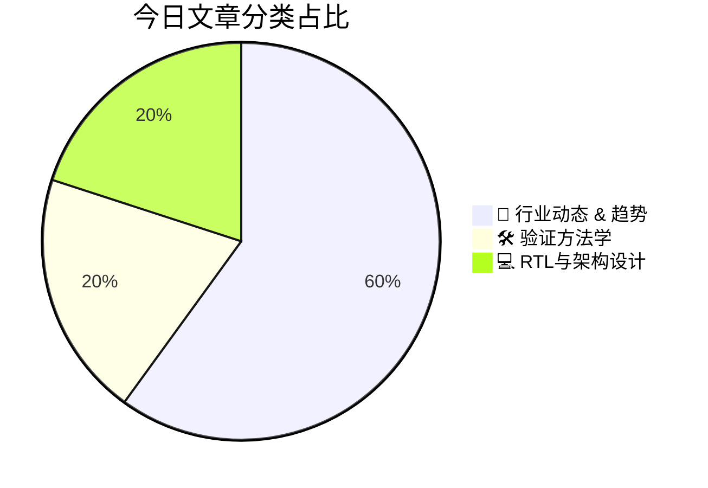

# 🛠️ FPGA / 验证技术每日精选

> 生成时间：2/23/2026, 2:02:43 AM | 数据范围：过去 24 小时

## 📝 今日看点

GenAI在全计算栈的纵向渗透正驱动硬件验证范式向智能化迁移，LLM代理辅助的测试平台生成与覆盖盲区自动收敛成为验证环境的核心能力指标。物理层安全验证的granularity已下探至晶体管级，基于激光照明故障注入的SRAM电气级位翻转精确建模亟需电磁-电路联合仿真框架，以量化先进工艺节点的软错误敏感性。台积电先进节点的工艺简化策略进一步放大了可靠性验证的复杂性，要求将制造变异性（Process Variation）纳入早期仿真 sign-off。与此同时，DSA架构的融合感知映射（Fusion-Aware Mapping）与光互连技术产业化（如Photonect代表的方向）深度耦合，通过编译器-微架构-工艺协同优化（DTCO）在功耗墙约束下最大化数据流融合效率。这迫使验证方法论向光电混合信号域拓展，必须建立光通道完整性与电-光-热协同仿真的新型验证闭环。

---

## 🏆 今日必读 (Top 3)

### 1. [生成式AI全计算栈综述：从软件到硅片（哈佛）](https://semiengineering.com/survey-of-genai-across-the-full-computing-stack-from-sw-to-silicon-harvard/)
**评分**: 8/10 | **分类**: 🚀 行业动态 & 趋势 | **标签**: `GenAI` `Computing Stack` `Hardware Design` `Survey` `Harvard`

> **💡 推荐理由**：作为IC/FPGA验证工程师，本文提供了从应用场景到硅片实现的垂直视角，有助于理解GenAI工作负载对芯片架构的特殊需求（如稀疏计算、动态负载均衡），从而制定针对性的验证策略。文中讨论的AI辅助验证（如基于大模型的测试用例生成、断言推断、覆盖率预测）是当前验证技术演进的前沿方向，对构建智能化验证平台具有直接参考价值。此外，全栈思维有助于验证工程师突破传统模块级验证局限，建立系统级软硬件协同验证意识，应对未来AI芯片复杂异构架构带来的验证挑战。

**摘要**：
本文系统综述了生成式AI在整个计算栈（从高层算法软件到低层硅片架构）中的技术进展与系统性挑战。核心痛点在于传统分层设计方法面临严峻的内存墙和能效瓶颈，软硬件协同不足导致大模型部署效率低下，且缺乏针对GenAI工作负载的标准化验证方法学。文章提出了全栈协同优化方案，涵盖算法压缩、领域专用架构（DSA）设计、先进封装与近存计算等关键技术路径。针对硬件实现环节，探讨了AI辅助设计（AI4IC）在架构探索、RTL生成及验证自动化中的应用潜力与可靠性挑战。最后强调了从软件定义到硅片实现的垂直整合必要性，为下一代AI芯片的端到端开发提供了系统性技术路线图。

### 2. [激光照射下SRAM位翻转的电气模型：模拟激光故障注入](https://semiengineering.com/electrical-model-of-the-bitflip-in-sram-under-laser-illumination-simulating-laser-fault-injection/)
**评分**: 8/10 | **分类**: 🛠️ 验证方法学 | **标签**: `Laser Fault Injection` `SRAM` `Hardware Security` `Fault Modeling` `Side-Channel Attack`

> **💡 推荐理由**：对于负责安全芯片验证的工程师而言，本文提供的电气模型是构建虚拟激光故障注入平台的关键使能技术，使得在Tape-out前就能系统性地评估加密协处理器（如AES、ECC引擎）对物理攻击的鲁棒性。该模型允许在RTL或门级网表仿真中精确注入由激光引起的单比特/多比特翻转故障，验证纠错码（ECC）、传感器网络和逻辑冗余等对抗机制的有效性，大幅降低对昂贵激光实验设备的依赖。此外，模型揭示的SRAM敏感节点分布可指导验证工程师针对性地构建最坏的故障场景（Worst-case Scenarios），优化故障注入测试用例的覆盖率，显著提升硬件安全验证（Hardware Security Verification）的效率和深度，是设计抗故障攻击（Fault Attack Resistant）架构的必备参考。

**摘要**：
本文针对激光故障注入攻击中缺乏精确电路级模型来预测SRAM位翻转的核心痛点，建立了描述光子-物质相互作用与晶体管电气特性耦合行为的数学模型。该模型将激光脉冲参数（能量、波长、聚焦位置）转化为等效电荷注入或瞬态电流源，解决了物理攻击过程与数字电路仿真脱节的问题，实现了对6T-SRAM单元敏感节点翻转阈值的定量分析。通过该电气模型，研究人员能够在SPICE或快速仿真器中复现激光诱导的单粒子翻转（SEU）效应，准确预测位翻转概率与激光参数的关系。该方案填补了基于仿真的故障攻击评估与真实物理实验之间的鸿沟，为安全芯片的鲁棒性验证提供了可复现的故障注入激励源。实验验证表明，该模型与实际激光测试结果的误差在可接受范围内，证明了其作为虚拟故障注入工具的有效性。

### 3. [加速器架构：融合感知映射器（MIT）](https://semiengineering.com/accelerator-architecture-fusion-aware-mapper-mit/)
**评分**: 7/10 | **分类**: 💻 RTL与架构设计 | **标签**: `Accelerator` `Fusion-Aware` `Mapper` `Dataflow Architecture` `MIT`

> **💡 推荐理由**：验证工程师需要理解此类架构创新对验证策略的影响：融合感知映射引入了复杂的控制逻辑和数据依赖性，要求验证环境能够覆盖多种算子组合场景、验证融合后数据流的正确性以及内存一致性。此外，该工作涉及软硬件协同优化，验证工程师需关注映射算法生成配置的正确性、硬件对动态融合指令的支持，以及边界条件下资源冲突的检测机制，对构建高性能加速器验证平台具有重要参考价值。

**摘要**：
当前AI加速器面临内存带宽瓶颈和计算效率低下的挑战，传统编译器映射策略往往忽视了算子融合带来的优化机会，导致频繁的片外内存访问和硬件资源利用率不足。MIT提出的Fusion-Aware Mapper通过在工作负载映射到硬件时显式考虑算子融合，将多个计算内核融合为单个执行单元，显著减少了中间数据搬运。该架构采用联合优化策略，在映射搜索空间中同时考虑融合决策、数据流调度和内存层级分配，实现了更高的计算吞吐量和能效比。实验结果表明，相比传统分离式映射方法，该方案在保持硬件灵活性的同时，能够有效缓解内存墙问题，为下一代AI加速器编译栈提供了新的优化范式。

---

## 📊 资讯分布与高频标签

## 📋 更多分类好文

### 🚀 行业动态 & 趋势

- [**台积电先进节点工艺简化方案**](https://semiwiki.com/semiconductor-manufacturers/tsmc/366877-tsmc-process-simplification-for-advanced-nodes/) - *semiwiki.com* (7分)
  > 随着半导体工艺演进至3nm及以下先进节点，设计规则复杂度与物理验证难度呈指数级增长，导致验证周期延长和成本激增。台积电通过设计技术协同优化（DTCO）策略，重构标准单元架构并简化光刻掩膜流程，在保证PPA（功耗、性能、面积）优势的同时显著降低设计复杂度。该方案优化了与EDA工具的接口，减少了验证所需的工艺角（Process Corners）数量和物理验证规则集，使数字IC验证团队能够更快完成时序收敛和物理 sign-off。针对FinFET及GAA晶体管结构带来的复杂性，通过单元抽象建模和设计规则精简，有效降低了功能验证与物理验证的交叉耦合难度。这一工艺简化路径为先进节点芯片验证提供了更好的可扩展性和可预测性，有效缓解了先进制程下的验证瓶颈。

- [**Photonect首席执行官Juniyali Nauriyal专访：光子互连技术破解AI芯片功耗与带宽瓶颈**](https://semiwiki.com/ceo-interviews/366531-ceo-interview-with-juniyali-nauriyal-of-photonect/) - *semiwiki.com* (6分)
  > 随着AI模型规模指数级增长，传统铜互连在数据中心和高性能计算芯片中面临严重的带宽墙和I/O功耗危机，成为制约算力扩展的核心瓶颈。Photonect CEO Juniyali Nauriyal阐述了公司通过硅光子互连技术，用光信号替代电信号实现芯片间及片内通信的解决方案，可显著降低传输延迟与能耗并提升带宽密度。该技术需要突破光电混合信号完整性、2.5D/3D封装热管理以及异构集成验证等关键挑战，涉及光电协同设计与系统级架构重构。Nauriyal指出，光互连不仅是物理层创新，更需要光学计算单元与电芯片的深度融合，以支持未来Chiplet架构和万亿参数AI模型的训练需求。这一技术路径将成为突破摩尔定律限制、重塑下一代AI芯片基础设施的关键使能技术。

