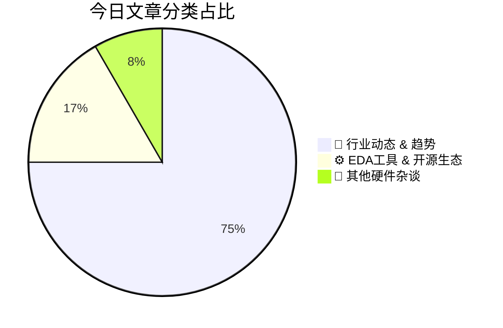

# 🛠️ FPGA / 验证技术每日精选

> 生成时间：2/24/2026, 2:06:06 AM | 数据范围：过去 24 小时

## 📝 今日看点

随着GAAFET晶体管进入原子级3D计量时代及背面供电技术(BSPDN)的导入，物理验证正面临亚纳米级几何精度与热-电耦合多物理场协同仿真的严峻挑战。神经形态计算硬件的产业化落地，特别是基于ReRAM的突触训练阵列与感算一体（60GHz雷达+边缘AI）架构的融合，正在重构传统数字验证范式，迫切需求新型模拟/混合信号(AMS)协同验证方法与存算一致性校验机制。与此同时，智能化ECO优化引擎通过机器学习驱动的物理修复算法，显著压缩了设计收敛周期，推动sign-off流程从被动规则检查向主动设计优化(ADFR)的范式转移。这些趋势共同指向硬件验证领域对多物理场精度、新型计算范式适配性及设计自动化智能化的系统性升级需求。

---

## 🏆 今日必读 (Top 3)

### 1. [音频领域的新性能要求](https://semiengineering.com/new-performance-requirements-for-audio/)
**评分**: 8/10 | **分类**: 🚀 行业动态 & 趋势 | **标签**: `Audio Standards` `Low Latency` `High Resolution Audio` `Automotive Audio` `Performance Metrics`

> **💡 推荐理由**：作为验证工程师，本文提供了音频SoC验证中极具实操性的方法论：详细阐述了如何处理音频数据通路中的CDC验证陷阱、低延迟FIFO的边界条件验证，以及如何将主观听感转化为可量化的验证覆盖率指标。特别适合正在从事AIoT、车载音响或专业音频接口芯片验证的工程师参考，帮助构建更高效的音频子系统验证平台。

**摘要**：
随着沉浸式音频、专业制作和电竞应用的发展，现代音频芯片面临超低延迟（<1ms）、高采样率（192kHz以上）和高位深（32bit浮点）的严苛要求。这些需求带来了严峻的设计痛点：极严格的时序约束、复杂的异步时钟域（CDC）同步、高吞吐量下的功耗控制，以及模拟/数字混合信号完整性挑战。文章提出了分层架构解决方案，包括专用音频DSP核、优化的高带宽内存控制器、以及基于AVB/TSN的时间敏感网络接口。针对验证难题，作者建议采用基于UVM的实时激励生成、结合形式验证确保跨时钟域安全，并引入音频质量指标（THD+N、动态范围）的量化验证方法。最后，文章强调通过软硬件协同验证（SW/HW co-verification）和功耗感知验证流程，可在硅前阶段有效验证这些新性能指标的达成。

### 2. [硬件重归宇宙中心](https://semiwiki.com/eda/synopsys/366766-hardware-is-the-center-of-the-universe-again/)
**评分**: 8/10 | **分类**: 🚀 行业动态 & 趋势 | **标签**: `Hardware Renaissance` `AI Silicon` `Heterogeneous Integration` `Verification Complexity` `Domain-Specific Architecture`

> **💡 推荐理由**：验证工程师必须理解硬件重新中心化带来的范式转变，这对验证方法论提出了革命性要求。文章揭示了当前IC/FPGA验证面临的最严峻挑战——如何在硬件主导的系统架构中确保验证完备性，并提供了从工具链（Emulation/形式化验证）到流程（云原生/Shift-Left）的系统性解决方案，对验证架构师制定技术路线和工程师提升核心技能具有直接指导价值。

**摘要**：
随着AI、高性能计算和定制芯片需求的爆发，硬件设计重新成为系统架构的核心，软硬件协同设计范式正经历根本性转变。这一趋势导致硬件复杂度呈指数级增长，传统基于软件的验证方法面临验证空间爆炸、仿真速度瓶颈和角落案例遗漏等严峻挑战。文章指出当前验证工程师面临的核心痛点是：验证规模与验证资源之间的鸿沟日益扩大，以及硬件中心化带来的验证左移（Shift-Left）压力。解决方案在于构建以硬件为中心的验证架构，深度融合硬件仿真加速（Emulation）、形式化验证与AI驱动的验证空间探索技术，并建立云原生验证环境实现算力弹性扩展。文章强调验证必须从传统的软件仿真思维转向硬件-软件协同的系统级验证思维，通过高层次综合（HLS）与验证早期协同来应对超大规模设计的验证危机。

### 3. [智能ECO之道：Easy-Logic ASIC优化引擎深度解析](https://semiwiki.com/eda/easy-logic/366680-smarter-ecos-inside-easy-logics-asic-optimization-engine/)
**评分**: 8/10 | **分类**: ⚙️ EDA工具 & 开源生态 | **标签**: `ECO` `ASIC Optimization` `Easy-Logic` `Physical Design`

> **💡 推荐理由**：对于验证工程师而言，Easy-Logic的优化引擎通过形式化方法确保ECO前后的逻辑等价性，从根本上消除了因人工修改引入的功能性bug风险，大幅减少了全量回归验证的必要性。其物理感知的优化策略能有效避免ECO引发的时序违例和绕线拥塞，降低了验证与后端迭代次数，显著缩短tape-out前的收敛周期。此外，该工具与主流验证流程的无缝集成，使验证团队能够在设计后期更自信地应对变更需求，提升整体验证效率和芯片质量。

**摘要**：
传统ASIC设计中的工程变更指令（ECO）流程依赖人工干预，不仅耗时冗长且极易引入新的逻辑错误，导致验证周期不可控地延长。Easy-Logic的ASIC优化引擎通过自动化逻辑重构与物理感知优化技术，实现了ECO的智能化生成与验证，显著降低了后期设计变更的风险。该引擎集成了形式化等价性验证（Formal Equivalence Checking）能力，确保优化后的网表在功能上与原设计完全一致，从而大幅减少验证回归测试的范围和工作量。通过将逻辑优化与物理实现约束紧密结合，该工具有效解决了ECO过程中时序收敛与面积优化的矛盾，加速了设计收敛。这一自动化方案不仅提升了验证工程师处理后期变更的效率，更为复杂SoC设计的 sign-off 流程提供了可靠的优化保障。

---

## 📊 资讯分布与高频标签

## 📋 更多分类好文

### 🚀 行业动态 & 趋势

- [**基于ReRAM的新赫布ian突触用于神经形态硬件训练**](https://semiengineering.com/reram-based-neo-hebbian-synapses-for-training-neuromorphic-hw-iit-madras-ucsb/) - *semiengineering.com* (7分)
  > 当前神经形态硬件面临的核心痛点是，传统突触权重更新依赖复杂的外围数字电路或频繁的片外数据传输，导致片上训练能效低下且吞吐量受限。本文提出了一种基于ReRAM的新赫布ian突触架构，利用阻变存储器的模拟电导特性实现局部、并行的原位权重更新，消除了对复杂ADC/DAC和数字计算单元的依赖。通过定制化的脉冲时序方案，该设计实现了符合STDP（脉冲时间依赖可塑性）规则的硬件友好型学习机制，显著降低了训练能耗和芯片面积开销。这项工作为构建高能效存算一体神经形态处理器提供了关键的电路级解决方案，支持大规模并行片上学习。

- [**背面供电网络面临制造设备与散热双重壁垒**](https://semiengineering.com/backside-power-delivery-creates-fab-tool-thermal-dissipation-barriers/) - *semiengineering.com* (7分)
  > 背面供电网络（BSPDN）作为突破先进制程布线瓶颈的关键技术，通过将电源传输迁移至晶圆背面显著提升了逻辑密度和性能。然而，该技术面临着制造设备与热管理两大核心壁垒：晶圆背面减薄和纳米级硅通孔（nTSV）加工需要全新的键合、刻蚀及检测设备，大幅增加了晶圆厂资本支出；同时，背面金属层阻碍了传统散热路径，导致热阻增加和局部热点风险上升。这些物理限制不仅推高了生产成本，还可能影响芯片长期可靠性。为应对挑战，行业正推进混合键合技术、开发高导热散热材料，并建立更精确的热-电协同仿真模型以确保可制造性。

- [**Socionext与Innatera推出集成60GHz FMCW雷达与神经形态边缘AI的人体存在检测方案**](https://www.eejournal.com/industry_news/socionext-and-innatera-introduce-integrated-60-ghz-fmcw-radar-and-neuromorphic-edge-ai-for-human-presence-detection/) - *eejournal.com* (7分)
  > 传统人体存在检测方案面临高功耗、高延迟及隐私泄露风险，难以满足现代智能家居和建筑自动化对实时性与能效的双重要求。Socionext与Innatera合作开发的集成方案将60GHz FMCW雷达与神经形态边缘AI处理器结合，实现了在传感器端直接进行智能信号处理。该方案采用事件驱动的神经形态计算架构，显著降低了AI推理的功耗，同时60GHz FMCW雷达提供了高精度的人体微动检测能力。通过将雷达前端与AI加速器的深度集成，解决了传统分立方案中数据传输带宽瓶颈和系统复杂度高的问题。这种单芯片解决方案为智能照明、安防监控和HVAC控制等应用提供了超低功耗、实时响应且隐私安全的人体存在检测能力。

- [**基于电子叠层成像的GAAFET三维原子级应变松弛与粗糙度计量**](https://semiengineering.com/3d-atomic-scale-metrology-of-strain-relaxation-and-roughness-in-gaafets-via-electron-ptychography-cornell-asm-tsmc/) - *semiengineering.com* (6分)
  > 随着GAAFET（环绕栅极晶体管）进入3nm及以下先进节点，纳米片结构的应变工程与界面粗糙度成为影响器件性能和可靠性的关键物理痛点，但传统TEM和X射线技术难以实现原子级三维分辨率。本文提出利用电子叠层成像（Electron Ptychography）技术，通过相干衍射成像算法重构出GAAFET纳米片的三维原子级应变场和表面形貌。该方法成功量化了沟道释放工艺导致的应变松弛分布以及Si/SiGe界面的原子级粗糙度，揭示了工艺诱导的机械应力与电学性能退化的关联机制。研究为先进工艺中的应变工程优化和变异性建模提供了不可替代的实验数据，填补了工艺开发与器件仿真之间的表征鸿沟。

- [**罗德与施瓦茨在2026年嵌入式世界大会上重点展示其综合嵌入式系统测试解决方案**](https://www.eejournal.com/industry_news/rohde-schwarz-highlights-its-comprehensive-embedded-systems-test-solutions-at-embedded-world-2026/) - *eejournal.com* (6分)
  > 当前嵌入式系统面临高速信号完整性、复杂电源噪声及多协议协同验证等严峻挑战，传统分离式测试方法已难以满足先进SoC与FPGA设计的验证需求。罗德与施瓦茨在embedded world 2026上推出了涵盖高性能示波器、频谱分析仪及协议解码器的综合测试平台，提供从硅片级调试到系统级验证的全链路解决方案。该方案通过硬件同步触发技术与自动化测试软件，实现了对PCIe、DDR5等高速接口的眼图分析、抖动测量及实时故障诊断的自动化，显著压缩验证周期。其集成的电源完整性（PI）分析工具可精准定位PDN阻抗与噪声源，而多通道并行采集功能则支持复杂多核处理器的并发验证。针对汽车电子与工业物联网应用，该测试套件还提供了符合功能安全标准的EMI预一致性测试能力，确保设计在早期阶段即满足量产与合规要求。

- [**SEGGER获得ISO 27001认证，强化信息安全与客户信任**](https://www.eejournal.com/industry_news/segger-receives-iso-27001-certification-strengthening-information-security-and-customer-trust/) - *eejournal.com* (6分)
  > 在嵌入式系统和芯片开发工具链面临日益严峻的网络安全威胁背景下，第三方工具的安全漏洞已成为IP保护和供应链安全的重大痛点。SEGGER通过获得ISO 27001信息安全管理体系认证，建立了覆盖产品开发、交付及维护全流程的系统化安全管控机制。该认证确保其J-Link调试器、中间件等关键工具符合国际安全标准，有效防范数据泄露、恶意代码注入及未经授权的访问风险。对于涉及敏感算法和核心IP的芯片设计企业，这意味着可在验证环节更安全地集成SEGGER工具，降低因工具链漏洞导致的设计泄密或篡改风险。此举不仅提升了开发工具的可信度，也为数字IC/FPGA验证环境构建了符合行业合规要求的安全基础设施。

- [**Taara发布用于无线通信的光子学平台及Taara Beam——基于新型光子核心的首款产品**](https://www.eejournal.com/industry_news/taara-unveils-photonics-platform-for-wireless-communication-and-taara-beam-latest-product-in-taaras-portfolio-and-first-on-the-new-photonic-core/) - *eejournal.com* (6分)
  > Taara推出了基于光子集成电路的新型无线通信平台，旨在解决传统光纤部署成本高昂、周期漫长以及射频频谱资源日益紧张的核心痛点。该平台采用自由空间光通信（FSO）技术，利用激光光束而非无线电波传输数据，无需频谱许可即可实现高速、低延迟的无线连接。Taara Beam作为该平台的首款商用产品，集成了新型光子核心芯片，通过精密的光学控制和信号处理技术，为"最后一英里"网络连接提供了比传统光纤更灵活、成本效益更高的替代方案。这项技术突破了物理基础设施的限制，可在复杂环境中快速部署高速网络。平台的光电混合架构结合了光子芯片与数字控制逻辑，代表了通信基础设施向硅光集成方向的重要技术演进。

### ⚙️ EDA工具 & 开源生态

- [**名称虽变，愿景如一——ESD Alliance的历年发展**](https://semiwiki.com/semiconductor-services/esd-alliance/366504-the-name-changes-but-the-vision-remains-the-same-esd-alliance-through-the-years/) - *semiwiki.com* (7分)
  > 本文回顾了ESD Alliance从EDAC（电子设计自动化联盟）到现名的演变历程，强调尽管组织名称随行业从芯片级设计向系统级电子设计转型而变更，但其推动半导体设计生态协作的核心使命始终未变。文章指出当前半导体设计面临复杂性指数级增长、验证成本占比过高、跨EDA/ IP/设计服务工具链碎片化等核心痛点，而联盟通过持续推动EDA标准化、促进IP复用生态建设、搭建设计-验证-制造协同平台，为行业提供了降低集成风险的系统性解决方案。这种贯穿设计全链的协作框架对应对先进制程和异构集成带来的验证收敛挑战尤为关键，确保了从硅片到系统的创新效率。

### 📝 其他硬件杂谈

- [**京瓷AVX推出面向光通信应用的新型电容器**](https://www.eejournal.com/industry_news/new-kyocera-avx-capacitors-for-optical-communications/) - *eejournal.com* (4分)
  > 随着400G/800G光通信系统对信号完整性要求日益严苛，传统电容器在高频应用中存在等效串联电阻(ESR)过高和谐振频率不足等痛点，难以有效滤除高速切换产生的电源噪声。KYOCERA AVX针对光通信模块推出新型电容器系列，通过优化介质材料和电极结构，实现了超低ESR特性与更高自谐振频率，有效解决了高速光模块中的电源完整性(PI)和信号完整性(SI)挑战。该系列产品在紧凑尺寸下提供卓越的高频去耦性能，支持更严格的电源滤波需求，同时具备优异的高温稳定性，满足光通信设备在狭小空间内的可靠运行要求。

