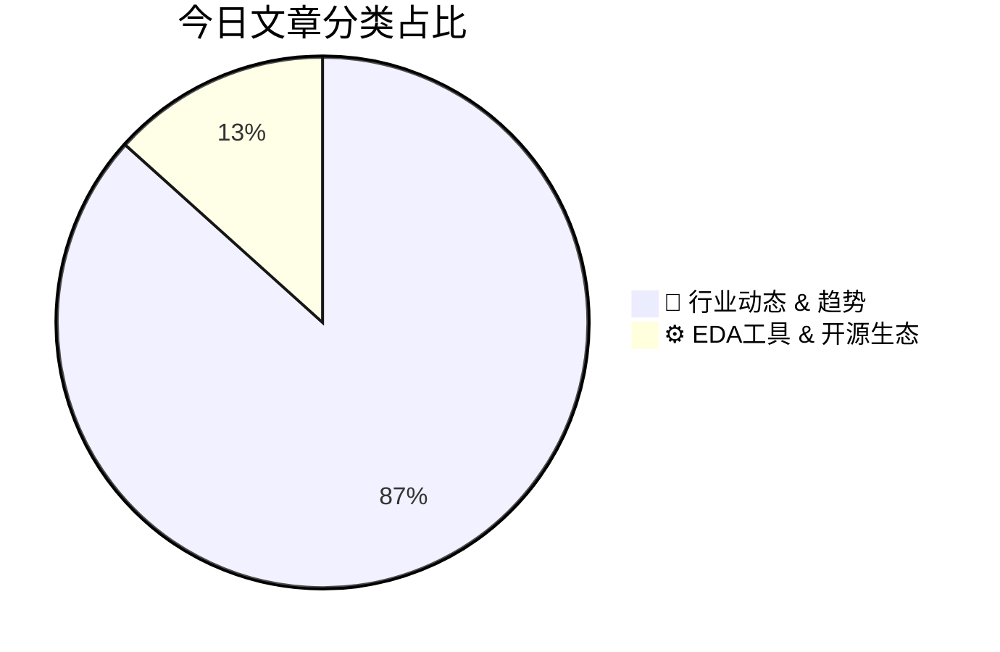

# 🛠️ FPGA / 验证技术每日精选

> 生成时间：2/25/2026, 4:52:17 AM | 数据范围：过去 24 小时

## 📝 今日看点

异构集成与Chiplet架构的规模化部署正重塑验证边界，从传统单芯片Sign-off转向多Die互连完整性、电源传输网络(PDN)协同仿真及跨工艺节点热-电-机械耦合分析。Agentic AI与LLM驱动的EDA工具链正在重构验证方法学，实现从静态规则检查向自主决策的验证工作流跃迁，显著压缩pre-silicon验证收敛周期。边缘AI与功能安全(FuSa)严苛标准倒逼硬件验证范式革新，针对AI加速器、先进MIPI接口及千瓦级处理器的高动态功耗场景，需构建覆盖硅后生命周期管理的自适应验证闭环。先进GAAFET工艺与ReRAM等新型存储器的原子级特性，则对物理验证、可靠性 sign-off 及神经形态计算硬件的在线训练机制提出亚纳米级计量与混合信号验证挑战。

---

## 🏆 今日必读 (Top 3)

### 1. [芯片行业技术论文综述：2月24日](https://semiengineering.com/chip-industry-technical-paper-roundup-feb-24/)
**评分**: 8/10 | **分类**: 🚀 行业动态 & 趋势 | **标签**: `Technical Papers` `Research Roundup` `Semiconductor Trends` `Academic Research`

> **💡 推荐理由**：对于数字IC/FPGA验证工程师而言，该综述提供了行业最前沿的验证方法论和技术趋势，特别是在应对复杂系统验证收敛、覆盖率提升以及新兴架构（如Chiplet）验证方面的创新思路，有助于验证工程师更新知识体系并优化现有验证流程。

**摘要**：
本文综述了近期芯片行业发表的重要技术论文，聚焦于先进工艺节点下的设计验证挑战与解决方案。文章指出，随着系统复杂度指数级增长和工艺缩微带来的物理效应加剧，传统验证方法面临覆盖率不足、收敛周期长等核心痛点。针对这些问题，论文集群提出了基于机器学习的智能验证加速、形式化验证与仿真混合策略、以及软硬件协同验证框架等创新解决方案。此外，文章还探讨了Chiplet集成、先进封装技术对验证流程的新要求，以及低功耗设计验证的最佳实践。这些研究成果为应对下一代芯片设计的验证危机提供了理论指导和实用工具。

### 2. [芯粒2026：现状与展望](https://semiengineering.com/chiplets-2026-where-are-we-today/)
**评分**: 8/10 | **分类**: 🚀 行业动态 & 趋势 | **标签**: `Chiplets` `Advanced Packaging` `Heterogeneous Integration` `UCIe` `Die-to-Die Interconnect`

> **💡 推荐理由**：对于验证工程师而言，Chiplet架构代表了验证范式从单芯片向多Die系统级验证的根本性转变，掌握UCIe协议验证、跨Die边界时序分析以及异构集成验证方法学将成为2026年后高端芯片验证的核心竞争力，本文有助于理解这一技术转型中的关键验证挑战与行业解决方案。

**摘要**：
Chiplet技术正从概念验证走向大规模商用，预计到2026年将成为高性能计算和AI芯片的主流架构。当前核心痛点在于异构Die集体验证的复杂性激增，包括多厂商接口互操作性、UCIe等标准化物理层与逻辑协议的协同验证，以及封装级信号完整性和电源完整性的系统级验证挑战。行业正通过建立统一的UCIe生态系统、开发Chiplet-specific的验证IP（VIP）和采用"左移"策略的虚拟原型验证方法来解决这些问题。此外，供应链协同验证流程的标准化和多物理场仿真与数字验证的融合，成为确保多Die系统可靠性的关键。验证工程师需要应对从传统单Die SoC向分布式异构系统验证的范式转变。

### 3. [智能体EDA圆桌会议回顾：前景可期但需短期实践指引](https://semiwiki.com/artificial-intelligence/366749-agentic-eda-panel-review-suggests-promise-and-near-term-guidance/)
**评分**: 8/10 | **分类**: 🚀 行业动态 & 趋势 | **标签**: `Agentic AI` `EDA` `AI-assisted Verification` `Design Automation` `Panel Discussion`

> **💡 推荐理由**：作为验证工程师，您需要关注Agentic AI对验证方法论的重塑潜力，同时理性评估当前技术边界。本文提供的短期实践指引有助于您在保持验证质量与完备性的前提下，合理引入AI工具处理重复性验证任务（如覆盖率收敛优化、失败用例初步分类），避免盲目依赖自动化带来的系统性风险，并为未来的人机协同验证模式建立技术储备。

**摘要**：
文章探讨了Agentic AI（智能体人工智能）在EDA工具链中的应用现状与发展前景。核心痛点在于当前AI智能体在复杂芯片验证流程中缺乏足够的可靠性，难以处理边界情况和保证验证完备性，同时缺乏与人类验证工程师有效协作的标准化框架。专家小组指出，尽管技术潜力巨大，但自主决策的不可解释性和在关键路径上的不可控风险阻碍了落地。解决方案建议采用渐进式部署策略，从非关键辅助任务（如测试点生成、简单回归分析）开始，逐步建立人机协同的验证工作流，并制定明确的短期工程指导原则以确保AI工具的可审计性和可控性。

---

## 📊 资讯分布与高频标签

## 📋 更多分类好文

### ⚙️ EDA工具 & 开源生态

- [**PLS UDE 2026新增对高效嵌入式AI加速器的调试支持**](https://www.eejournal.com/industry_news/pls-ude-2026-now-also-enables-debugging-of-highly-efficient-embedded-ai-accelerators/) - *eejournal.com* (8分)
  > 随着嵌入式AI加速器架构日趋复杂且高度优化，传统调试工具在异构系统可见性、数据流追踪和多核协同调试方面面临严峻挑战。PLS公司推出的UDE 2026针对这一痛点，扩展了对高效能嵌入式AI加速器的深度调试能力，支持从主控CPU到AI引擎的统一调试视图。该工具能够实现对AI专用架构的精确断点设置、实时状态监控和数据通路追踪，解决了AI加速器黑盒调试的难题。通过提供软硬件协同调试环境，UDE 2026显著提升了复杂AI芯片的可观测性和可控性。这一解决方案有效缩短了AI加速器的验证周期，降低了异构集成系统的调试门槛。

- [**西门子推出行业领先的PCB测试工程解决方案**](https://semiwiki.com/eda/365694-siemens-to-deliver-industry-leading-pcb-test-engineering-solutions/) - *semiwiki.com* (7分)
  > 现代高密度PCB设计面临测试覆盖率低、故障诊断困难及测试开发周期长等核心痛点，严重影响产品上市时间和良率。西门子通过其集成化的测试工程解决方案，将可测试性设计（DFT）与智能制造相结合，实现了从设计到测试的全流程自动化。该方案利用AI驱动的故障诊断和数字孪生技术，大幅提升了测试精度和缺陷定位效率，同时缩短了测试程序开发周期。通过统一的数据平台，工程师能够无缝衔接设计与测试环节，确保复杂电子系统的可靠性和质量。这一解决方案特别针对高速信号完整性测试和先进封装技术带来的新挑战，为电子制造业提供了端到端的测试策略优化。

### 🚀 行业动态 & 趋势

- [**MIPI联盟发布UniPro v3.0与M-PHY v6.0标准，加速JEDEC UFS性能以支持移动、PC及汽车边缘AI应用**](https://www.eejournal.com/industry_news/mipi-alliance-releases-unipro-v3-0-and-m-phy-v6-0-accelerating-jedec-ufs-performance-for-edge-ai-in-mobile-pc-and-automotive/) - *eejournal.com* (8分)
  > 随着边缘AI在移动、PC和汽车领域的快速普及，JEDEC UFS存储接口面临带宽不足和延迟过高的瓶颈，难以满足AI模型实时加载与大数据量吞吐的严苛需求。MIPI联盟发布的UniPro v3.0与M-PHY v6.0通过物理层速率跃升与协议层效率优化，系统性解决了这一挑战：M-PHY v6.0显著提升了单通道数据速率与信号完整性，UniPro v3.0则增强了流量控制、错误恢复及链路训练机制。新标准通过更高效的电源管理和自适应均衡技术，实现了高性能与低功耗的平衡，为端侧AI推理提供了关键的存储带宽保障，并确立了下一代高性能存储接口的行业基准。

- [**千瓦级处理器的供电挑战与解决方案**](https://www.eejournal.com/article/powering-kilowatt-plus-processors/) - *eejournal.com* (8分)
  > 随着AI和高性能计算处理器功耗突破千瓦级，传统集中式供电架构面临电流密度激增、严重IR压降、电迁移风险及热管理瓶颈等核心挑战。文章提出采用分布式供电架构、集成式电压调节器（IVR）和Chiplet先进封装技术，通过电源网络与硅片协同设计解决大电流输送难题。关键解决方案包括多相电源转换、瞬态负载响应优化、片上电源完整性保障以及智能动态电源管理技术。这些方法为下一代高功耗芯片的可靠供电提供了从封装到架构的系统性解决思路，确保在千瓦级功耗下的电源效率和信号完整性。

- [**研究简报：2月24日**](https://semiengineering.com/research-bits-feb-24/) - *semiengineering.com* (7分)
  > 本文聚焦于超大规模SoC与Chiplet架构带来的验证复杂度激增问题，指出传统约束随机验证（CRV）在面对指数级增长的状态空间时，存在覆盖率收敛缓慢、回归测试周期过长及调试成本不可控的核心痛点。研究提出了一种基于机器学习的智能测试生成框架，通过分析历史覆盖率数据动态优化激励组合，显著缩短验证收敛时间。同时，文章阐述了形式验证与动态仿真的协同验证（Hybrid Verification）方法，有效填补深埋边界条件（Corner Cases）的验证盲区。此外，还引入了面向场景的新型功能覆盖率度量模型，为验证完备性评估提供更精准的量化标准。最后探讨了硬件安全验证（Security Verification）在供应链完整性检查中的最新进展。

- [**分散智能时代的计算架构重塑**](https://semiwiki.com/ip/risc-v/366906-reimagining-compute-in-the-age-of-dispersed-intelligence/) - *semiwiki.com* (7分)
  > 随着AI能力从云端向海量边缘设备扩散，传统集中式计算架构面临数据搬运能耗过高、带宽瓶颈及实时性不足等核心痛点。文章提出需重构计算范式，通过存算一体、近数据处理及异构加速架构，将计算推向数据源头以适配分散式智能需求。新架构强调专用加速器与通用计算的深度耦合，以及软硬件协同设计来平衡性能、功耗与灵活性。然而，分布式环境引入了系统复杂性激增、多节点一致性保障及安全可信执行等新挑战。解决方案倡导模块化Chiplet设计、标准化片间互连及自适应计算框架，以实现可扩展的边缘AI计算生态。

- [**TASKING集成现代AI技术实现强大的软件验证与确认（V&V）**](https://www.eejournal.com/industry_news/tasking-integrates-modern-ai-technology-to-enable-robust-software-verification-and-validation-vv/) - *eejournal.com* (7分)
  > 嵌入式软件验证面临手动创建测试用例效率低下、满足功能安全标准（如ISO 26262）成本高昂等核心痛点。TASKING通过将现代AI技术深度集成到V&V流程中，实现了测试用例的智能生成、需求的自动化追踪以及代码覆盖率的优化分析。该解决方案显著缩短了验证周期，降低了达到高覆盖率（如MC/DC）所需的人力成本。特别针对汽车电子等功能安全关键领域，AI驱动的验证方法能够在开发早期发现更多潜在缺陷。这一技术演进使开发团队能够以更高效率和更低成本构建符合严苛行业标准的高质量嵌入式软件。

- [**Marvell将在DesignCon 2026展示最新AI数据中心连接解决方案**](https://www.eejournal.com/industry_news/marvell-to-showcase-latest-ai-data-center-connectivity-solutions-at-designcon-2026/) - *eejournal.com* (7分)
  > 随着AI大模型训练对算力和数据吞吐量的需求呈指数级增长，传统数据中心互连架构面临带宽瓶颈、信号完整性恶化及功耗激增等严峻挑战。Marvell此次展示的解决方案聚焦于下一代高速连接技术，包括支持224G PAM4的SerDes IP、CXL 3.0内存扩展方案以及面向AI集群的光电共封装（CPO）互连架构，旨在突破数据传输壁垒。这些技术通过先进的均衡算法、信号调理技术和低功耗设计，解决了超大规模AI集群中长距离、高密度互连的可靠性问题。展示内容还涵盖针对PCIe 6.0/7.0和800G/1.6T以太网的完整验证与测试方法学，为复杂高速接口的硅前验证和硅后测试提供了系统化解决思路。

- [**瑞萨R-Car V4H ADAS SoC获丰田RAV4车型采用**](https://www.eejournal.com/industry_news/renesas-r-car-v4h-adas-soc-selected-for-toyota-rav4-model/) - *eejournal.com* (7分)
  > 瑞萨电子宣布其R-Car V4H ADAS SoC被丰田RAV4车型选用，用于支撑高级驾驶辅助系统。核心痛点在于L2+/L3级自动驾驶需要同时满足极高算力（深度学习推理）、多传感器融合实时处理与严苛的车规级功能安全（ASIL）要求，传统方案往往难以平衡性能与可靠性。R-Car V4H通过集成专用深度学习加速器、支持多路摄像头输入的图像处理IP以及符合ISO 26262标准的双核锁步CPU架构，提供了单芯片ADAS域控制解决方案。该方案在降低系统复杂度和功耗的同时，确保了自动驾驶功能的安全完整性。此次量产落地验证了该架构在极端工况下的长期稳定性，为行业确立了高性能ADAS SoC的设计基准。

- [**三种用于共有机薄膜的新型ALD/MLD工艺**](https://semiengineering.com/three-new-ald-mld-processes-for-co-organic-thin-films-aalto-university-rub-et-al/) - *semiengineering.com* (6分)
  > 传统原子层沉积（ALD）和分子层沉积（MLD）在制备共有机杂化薄膜时面临有机前驱体热稳定性差、反应选择性不足及界面缺陷控制困难等核心挑战，限制了先进低介电常数（low-k）介质和高性能有机半导体器件的开发。阿尔托大学与鲁尔大学联合团队开发了三种创新的ALD/MLD工艺方法，通过精确设计共有机前驱体的交替反应序列与温度窗口，实现了在原子级厚度控制下的有机-有机复合薄膜生长。这些工艺有效解决了有机组分在常规ALD高温下的分解难题，显著提升了薄膜的组分均匀性、覆盖率和界面质量，为三维集成、柔性电子及新型存储器件提供了可靠的介质层制备方案，并有助于降低栅极漏电流和改善器件可靠性。

- [**通过电子叠层成像术对GAAFETs中应变松弛与粗糙度进行三维原子级计量**](https://semiengineering.com/3d-atomic-scale-metrology-of-strain-relaxation-and-roughness-in-gaafets-via-electron-ptychography-cornell-asm-tsmc/) - *semiengineering.com* (6分)
  > 随着半导体工艺进入GAAFET时代，原子级的应变松弛和界面粗糙度已成为影响器件性能与可靠性的关键变异源，但传统二维表征技术难以精确捕捉三维纳米尺度下的微观结构缺陷。本研究采用电子叠层成像术（Electron Ptychography），首次实现了GAAFETs器件三维原子级分辨率的形貌与应变场重建，能够精准量化沟道材料的应变松弛程度以及界面原子级粗糙度。该技术揭示了工艺制程中应力工程与表面形貌的深层关联机制，并能识别传统TEM/SEM无法观测到的原子层错位与应变分布非均匀性。这项工作为先进节点（3nm及以下）的器件物理验证提供了关键的微观结构数据，有助于优化工艺窗口并建立更精确的器件变异模型。

- [**基于ReRAM的新赫布突触用于神经形态硬件训练**](https://semiengineering.com/reram-based-neo-hebbian-synapses-for-training-neuromorphic-hw-iit-madras-ucsb/) - *semiengineering.com* (6分)
  > 当前神经形态计算面临的核心痛点是，传统CMOS电路实现突触可塑性和片上学习机制需要大量晶体管，导致面积和功耗开销巨大，难以支持边缘设备的在线学习。本文提出了一种基于ReRAM（阻变存储器）的新赫布学习（Neo-Hebbian）突触架构，利用ReRAM的模拟电导特性直接实现Hebbian学习规则，避免了复杂的数字电路实现。该方案通过利用器件物理特性（如电导调制）来模拟生物突触的长时程增强和抑制，实现了高能效的片上训练（on-chip learning）。研究团队展示了这种模拟突触在训练神经网络时的可行性和鲁棒性，解决了非易失性存储器与神经形态计算融合中的算法-硬件协同设计难题，为存算一体（Compute-in-Memory）架构提供了重要的硬件基础。

