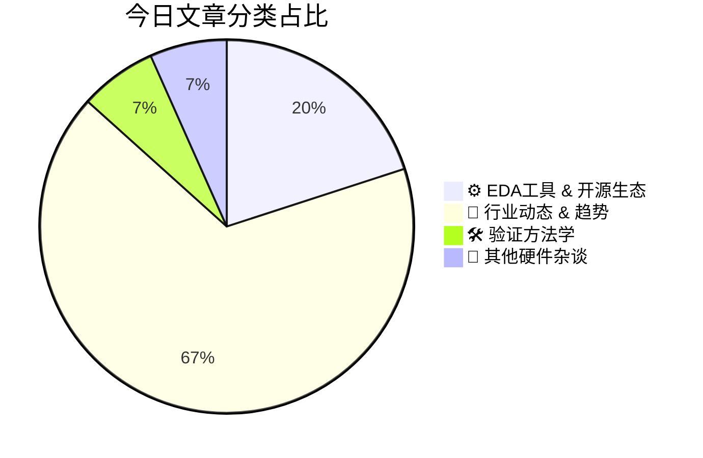

# 🛠️ FPGA / 验证技术每日精选

> 生成时间：2/26/2026, 4:50:02 AM | 数据范围：过去 24 小时

## 📝 今日看点

当前硬件验证领域正经历向**Agentic AI范式**的根本性转变，基于LLM的形式化验证智能体（Agentic Formal Verifier）与RTL安全验证工具实现了从静态规则检查到自主漏洞挖掘与攻击面分析的跃迁。面对多Die异构集成与UALink等新一代互连标准带来的复杂性爆炸，**后端自动化（Back-End Automation）**与专用化EDA工具链成为突破时序收敛、物理验证及电源完整性签核（Sign-off）瓶颈的关键基础设施。同时，亚皮秒级（sub-picosecond）偏斜匹配与VITA 90 VNX+等高速互连方案的验证需求，正推动信号完整性（SI）仿真从传统的集总参数模型向全波电磁场-电路混合求解维度演进，以确保HPC与AI加速器的可靠性与良率。

---

## 🏆 今日必读 (Top 3)

### 1. [后端自动化破解设计复杂性挑战](https://semiengineering.com/back-end-automation-tackles-growing-complexity/)
**评分**: 8/10 | **分类**: ⚙️ EDA工具 & 开源生态 | **标签**: `Physical Design` `Automation` `EDA Tools` `Place and Route` `Complexity Management`

> **💡 推荐理由**：验证工程师虽聚焦功能验证，但深入理解后端自动化有助于建立物理实现约束下的验证策略，提前捕获时序违例和功耗相关的功能缺陷；文章阐述的AI驱动自动化和云原生方法论与验证基础设施演进同源，可为构建智能验证平台提供架构参考；此外，掌握前后端数据贯通技术有助于验证团队参与早期物理可行性分析，减少后期因物理实现导致的验证迭代，提升整体交付效率。

**摘要**：
先进工艺节点下，芯片后端设计面临物理规则爆炸、时序收敛困难及多物理域协同的复杂性挑战，传统人工迭代模式已无法满足上市时间要求。文章指出当前核心痛点在于验证与物理实现的数据壁垒及缺乏智能决策能力，导致后期发现的问题需要昂贵的迭代成本。解决方案聚焦于AI/ML驱动的智能布局布线、云原生分布式计算架构以及统一数据库的自动化流程，实现物理设计的自主优化。通过将后端约束前置到前端验证阶段（Shift-left）和自动化物理验证闭环，显著缩短了设计收敛周期并提升了良率预测准确性。这种端到端的自动化范式不仅重构了后端工作流，更为验证团队提供了物理感知验证的早期介入能力，形成前后端协同的系统性解决方案。

### 2. [关于UALink：构建可扩展AI系统的设计要点](https://semiengineering.com/what-designers-need-to-know-about-ualink-for-scalable-ai-systems/)
**评分**: 8/10 | **分类**: 🚀 行业动态 & 趋势 | **标签**: `UALink` `AI加速器` `高速互连` `Chiplet` `可扩展系统`

> **💡 推荐理由**：UALink代表了AI基础设施互连技术的重大演进，验证工程师必须掌握这一开放标准以确保多加速器系统的正确性。文章深入剖析了UALink的分层架构、链路训练状态机（LTSSM）和缓存一致性协议，为制定系统级验证策略提供了关键洞察。随着AI芯片向多Die、多机柜扩展，验证复杂度从单芯片转向分布式系统，理解UALink的内存语义、错误注入机制和流量控制对构建测试平台至关重要。此外，文章涉及的高速SerDes验证、PHY-MAC协同测试以及多节点一致性验证方法，直接对应当前大规模AI芯片验证中的核心技术难点，有助于验证团队提前规划验证IP（VIP）和测试用例架构。

**摘要**：
随着AI模型规模爆炸式增长，传统互连技术（如PCIe）面临带宽瓶颈和扩展性限制，难以支持数百上千个AI加速器的高效协同。UALink（Ultra Accelerator Link）作为开放的行业标准，提供高达200Gbps/lane的带宽和微秒级延迟，支持最多1024个加速器的缓存一致性互联。该协议采用分层架构，涵盖物理层、链路层和事务层，专门针对AI工作负载的内存语义优化，替代了私有互连方案。对于设计团队而言，采用UALink意味着需要重新考虑芯片间互连架构、高速信号完整性设计以及复杂的分布式系统验证策略，特别是在多节点缓存一致性和错误处理机制方面面临新的挑战。

### 3. [博客回顾：2月25日](https://semiengineering.com/blog-review-feb-25-2/)
**评分**: 8/10 | **分类**: 🚀 行业动态 & 趋势 | **标签**: `Blog Review` `SemiEngineering` `Industry Trends` `Technical Blogs`

> **💡 推荐理由**：该文为验证工程师提供了从方法论革新到工具链落地的全栈优化路径，特别适合验证架构师和团队负责人阅读。文中提出的AI辅助验证与混合云部署策略直接回应了当前大型SoC项目面临的算力瓶颈与进度压力，而关于分层验证架构和调试效率提升的具体实践具有极强的工程可复制性，能够帮助验证团队在资源受限条件下显著提升验证质量与交付效率。

**摘要**：
本文深入剖析了当前数字IC验证领域面临的核心痛点：随着设计复杂度指数级增长，传统基于SV/UVM的验证方法在回归测试周期、调试效率及覆盖率收敛方面遭遇瓶颈，验证空间爆炸导致资源投入与验证质量难以平衡。文章提出了混合验证架构的解决方案，倡导将形式验证与动态仿真深度融合，并引入AI/ML技术实现智能测试点生成与回归测试选择算法， reportedly可减少高达70%的无效仿真时间。作者强调了验证平台架构的可重用性设计原则，建议采用分层抽象策略应对SoC级验证挑战，同时探讨了云端弹性算力与本地仿真农场协同的混合部署模式。文中还分享了关于调试效率优化的实践经验，包括智能波形裁剪技术和失败用例的自动根因分析（Root Cause Analysis）方法。最后，文章指出验证工程师需从纯编码向架构思维转型，建立系统级的验证规划（Verification Planning）能力以应对下一代芯片设计需求。

---

## 📊 资讯分布与高频标签

## 📋 更多分类好文

### ⚙️ EDA工具 & 开源生态

- [**面向互联设计的专用验证工具**](https://semiengineering.com/purpose-built-tools-for-connected-design/) - *semiengineering.com* (8分)
  > 现代SoC/FPGA设计中，多核、多协议IP的复杂互联关系已成为验证的主要瓶颈，传统通用验证方法难以高效处理连接性错误、协议违规和跨时钟域时序问题。文章指出，针对互联架构量身定制的专用验证工具能够通过自动化连接性检查、协议断言生成和系统级调试可视化，显著弥补通用工具的不足。这些工具支持从架构设计阶段就开始的互联验证左移，建立从模块级到系统级的连贯验证流程。通过采用专用互联验证解决方案，验证团队可以快速定位跨模块边界的设计缺陷，大幅缩短系统集成调试周期并提升整体验证覆盖率。

- [**Caspia Technologies发布RTL安全验证突破性技术，为智能体芯片安全铺平道路**](https://semiwiki.com/security/caspia-technologies/366956-caspia-technologies-unveils-a-breakthrough-in-rtl-security-verification-paving-the-way-for-agentic-silicon-security/) - *semiwiki.com* (8分)
  > 当前数字芯片设计面临严峻的安全挑战，传统RTL功能验证方法难以有效检测硬件木马、侧信道漏洞等安全威胁，导致安全验证成为流片前的盲区。Caspia Technologies推出的创新方案通过将人工智能代理技术引入RTL安全验证流程，实现了对设计代码的自动化安全分析与漏洞挖掘。该技术突破了传统形式验证和仿真在复杂安全属性检查上的局限，能够在早期设计阶段系统性识别潜在攻击面。这一突破不仅填补了功能验证与安全验证之间的鸿沟，更为构建从RTL到GDSII的全流程Agentic安全验证体系奠定了基础，显著提升了芯片设计的可信度和抗攻击能力。

### 🚀 行业动态 & 趋势

- [**设计未来：智能体工程时代的AI驱动多芯片创新**](https://semiwiki.com/eda/synopsys/366866-designing-the-future-ai-driven-multi-die-innovation-in-the-era-of-agentic-engineering/) - *semiwiki.com* (8分)
  > 随着多芯片（Multi-Die）架构的复杂度呈指数级增长，传统验证方法面临跨Die交互验证困难、状态空间爆炸以及调试周期过长等核心痛点。本文提出基于Agentic Engineering（智能体工程）的AI驱动验证范式，通过部署自主智能验证代理（Autonomous Verification Agents）实现测试场景自动生成、覆盖率智能收敛和根因自动分析。该方法利用机器学习优化验证策略选择，动态调整仿真资源分配，显著提升了复杂多芯片系统的验证效率。文章还探讨了AI代理在协议检查、功耗验证和物理-逻辑协同验证中的具体应用，为下一代超大规模芯片设计提供了可扩展的验证解决方案。

- [**面向自动驾驶的基于深度学习的激光雷达超分辨率技术综述**](https://semiengineering.com/survey-of-dl-based-lidar-super-resolution-for-autonomous-driving-university-college-london/) - *semiengineering.com* (7分)
  > 本文系统综述了基于深度学习的激光雷达(LiDAR)超分辨率技术在自动驾驶领域的最新进展。针对车载LiDAR点云数据稀疏、硬件高分辨率传感器成本高昂的核心痛点，文章梳理了卷积神经网络、生成对抗网络及Transformer等主流深度学习架构在点云上采样和细节重建中的解决方案。研究涵盖了从2D深度图超分到3D点云直接增强的多种技术路线，分析了多模态融合、实时性优化及鲁棒性提升等关键挑战。此外，文章总结了现有公开数据集、评价指标及量化部署方案，为算法向车载嵌入式平台（如FPGA/ASIC）的硬件实现提供了重要参考。

- [**Samtec互连方案入选VITA 90 VNX+标准**](https://www.eejournal.com/industry_news/samtec-interconnects-selected-for-vita-90-vnx/) - *eejournal.com* (7分)
  > VITA 90 VNX+标准面向紧凑型嵌入式系统，要求在小尺寸封装内实现高速、高可靠的信号互连，这对传统连接器的密度和信号完整性(SI)构成严峻挑战。Samtec的高密度互连解决方案通过优化的高速差分对设计和坚固的机械结构，有效解决了在严苛空间约束下的多Gbps信号传输可靠性问题。该方案为FPGA加速卡和处理模块提供了标准化的物理接口，消除了因连接器性能不足导致的系统级信号衰减和时序劣化。采用此标准化互连不仅简化了硬件平台的系统集成，更为验证环境提供了稳定、可重复的物理层基础，降低了高速接口验证的不确定性。

- [**Junkosha在DesignCon推出0.5皮秒偏斜匹配解决方案，强化高频测试领导地位**](https://www.eejournal.com/industry_news/junkosha-expands-high-frequency-test-leadership-with-new-0-5-psec-skew-matching-solutions-at-designcon/) - *eejournal.com* (7分)
  > 在高速数字系统验证中，测试电缆和夹具的差分偏斜（skew）已成为制约112G/224G SerDes及高速存储接口信号完整性测试精度的关键瓶颈，皮秒级的时序失配即可导致眼图恶化和误码率测量偏差。Junkosha在DesignCon发布的0.5皮秒偏斜匹配解决方案，通过亚皮秒级精度的电缆组件技术，显著降低了测试路径引入的相位误差。该方案针对PCIe 6.0/7.0、DDR5/DDR6及800G以太网等超高速接口的验证需求，提供了更高保真度的测试基础设施，使验证工程师能够在芯片bring-up和量产测试阶段获得更准确的性能表征数据。

- [**得捷电子在2026年嵌入式世界大会重点展示新产品**](https://www.eejournal.com/industry_news/digikey-spotlights-new-products-at-embedded-world-2026/) - *eejournal.com* (7分)
  > 硬件验证工程师在构建FPGA原型验证环境时，长期面临核心元器件采购周期长、评估板选型受限及供应链不稳定等关键痛点，严重制约验证迭代效率与项目进度。DigiKey在Embedded World 2026展示的新产品矩阵针对这些挑战提供了系统性解决方案，通过提供即期交付的高性能FPGA开发板、AI加速推理模块及高速信号接口组件，大幅缩短了从硬件选型到原型验证的时间窗口。这些新产品配套完整的参考设计、详细技术文档和开源验证IP，显著降低了复杂验证环境的搭建门槛和调试难度。DigiKey强大的全球供应链网络和实时库存管理系统，确保了关键验证器件的持续可获得性，有效规避了因缺货导致的验证流程中断风险，为硬件验证团队提供了稳定可靠的硬件支撑平台。

- [**贸泽电子、Microchip与Samtec联合发布新电子书，深入探讨新兴嵌入式系统的PCIe设计**](https://www.eejournal.com/industry_news/new-ebook-from-mouser-microchip-and-samtec-examines-pcie-design-for-emerging-embedded-systems/) - *eejournal.com* (7分)
  > 该电子书由三家行业领军企业联合发布，聚焦新兴嵌入式系统中PCIe高速接口设计的系统性挑战。核心痛点在于嵌入式环境对功耗、尺寸和热管理的严苛限制与PCIe高带宽需求之间的冲突，以及高速信号完整性带来的硬件可靠性风险。解决方案涵盖从连接器选型、PCB叠层设计到链路训练协议的端到端工程方法，特别强调物理层电气特性与协议层功能验证的协同优化。书中提供了PCIe Gen4/Gen5在紧凑嵌入式场景下的信号完整性仿真、热建模和电源完整性分析实践，旨在帮助工程师在资源受限环境中实现稳定的高速互联。

- [**面向先进应用的高速数据采集：ADQ35数字化仪**](https://www.eejournal.com/industry_news/high-speed-data-acquisition-for-advanced-applications-the-adq35-digitizer/) - *eejournal.com* (7分)
  > 文章介绍了ADQ35数字化仪如何解决传统高速数据采集系统中数据吞吐量瓶颈与实时处理能力不足的核心痛点。该设备通过集成高性能FPGA和高速ADC，实现了高达数GS/s的采样率与实时信号处理功能，显著降低了数据传输延迟。ADQ35采用高带宽PCIe接口和开放式FPGA架构，支持用户自定义DSP算法与数据压缩，有效解决了大数据量场景下的存储与处理难题。其模块化设计和高精度同步特性使其适用于多通道相控阵雷达、5G通信测试及高能物理等先进应用领域。

- [**SiMa.ai与STIGA S.p.A.宣布在Physical AI领域建立战略合作**](https://www.eejournal.com/industry_news/sima-ai-and-stiga-s-p-a-announce-strategic-partnership-in-physical-ai/) - *eejournal.com* (6分)
  > SiMa.ai与户外动力设备制造商STIGA宣布战略合作，旨在将边缘AI技术引入智能园林及户外机器人设备。核心痛点在于传统户外设备缺乏实时环境感知与自主决策能力，且电池供电设备面临AI算力与能耗的严重失衡。双方通过整合SiMa.ai的软件定义MLSoC边缘AI平台与STIGA的硬件系统，为割草机器人等Physical AI应用提供高能效、低延迟的推理能力。该合作解决了边缘侧AI部署中的功耗约束和实时性挑战，推动园林设备从自动化向真正的自主智能演进。此案例展示了专用AI加速器在电池供电物理设备中的商业化落地路径。

### 🛠️ 验证方法学

- [**基于智能体的自主形式化验证器：验证领域的创新**](https://semiwiki.com/artificial-intelligence/366338-an-agentic-formal-verifier-innovation-in-verification/) - *semiwiki.com* (8分)
  > 针对传统形式化验证中断言构造复杂、收敛调试困难及高度依赖专家经验等痛点，本文提出了一种基于AI Agent的自主形式化验证框架。该系统通过大语言模型与形式化验证引擎的深度协同，实现了验证策略自动规划、断言智能生成及约束动态优化。Agent能够自主分析RTL设计结构，基于反例反馈持续迭代验证方案并自动诊断根因，显著降低了形式化验证的技术门槛。实验表明，该方法在复杂协议验证场景中大幅缩短了收敛周期，提升了验证自动化水平与漏洞发现效率。

### 📝 其他硬件杂谈

- [**每位设计师都应知道的40个PCB设计技巧：电子书**](https://semiengineering.com/40-pcb-design-tips-every-designer-should-know-ebook/) - *semiengineering.com* (6分)
  > 本文汇总了40个关键的PCB设计技巧，系统性地解决了从布局规划到高速信号布线中的常见工程难题。核心痛点集中在信号完整性恶化、电源噪声耦合、EMI干扰以及高速串扰等方面，这些问题会直接导致硬件功能失效或性能降级。针对这些挑战，文章提供了涵盖层叠设计、阻抗控制、去耦策略和布线规则的实用解决方案。特别强调在高速数字接口和混合信号设计中，如何通过合理的PCB架构最小化反射与串扰。这些经验法则帮助工程师在设计初期规避潜在的制造和可靠性风险，确保硬件平台的功能正确性与长期稳定性。

