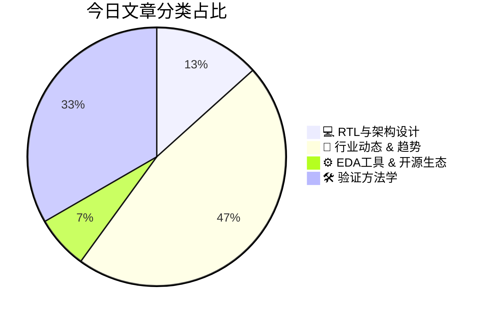

# 🛠️ FPGA / 验证技术每日精选

> 生成时间：2/27/2026, 4:54:46 AM | 数据范围：过去 24 小时

## 📝 今日看点

当前硬件验证领域正经历**异构集成与Chiplet架构**驱动的范式迁移，CXL.mem语义扩展、光学互连及领域特定加速器（如GNN预处理FPGA实现）正在重构数据移动路径，要求验证方法论从单芯片RTL级向多die系统级协同验证演进，涵盖die-to-die接口合规性、缓存一致性及功耗-热-性能的多物理场联合仿真。与此同时，**AI原生EDA工具链**与形式化验证（Formal Verification）技术深度融合，通过AI驱动的设计空间探索（DSE）和RISC-V超标量核的数学正确性证明，显著压缩复杂可编程逻辑的功能验证收敛周期。此外，**数字孪生（Digital Twin）**与功能安全（FuSa）分析的集成工作流成为破解超大规模数据中心scale-out验证复杂度的新范式，借助虚拟化平台实现架构-电路-软件协同验证，结合并发性调试技术（如Dining Philosophers问题的形式化分析）应对状态空间爆炸难题。

---

## 🏆 今日必读 (Top 3)

### 1. [一种解决GNN预处理瓶颈的FPGA加速器架构](https://semiengineering.com/an-fpga-based-accelerator-addressing-bottlenecks-in-gnn-preprocessing-kaist-et-al/)
**评分**: 8/10 | **分类**: 💻 RTL与架构设计 | **标签**: `FPGA` `GNN` `Accelerator` `Graph Neural Network` `Preprocessing` `Hardware Architecture`

> **💡 推荐理由**：验证工程师应重点关注本文展示的异构计算系统验证挑战，特别是如何验证不规则图结构访问下的数据一致性、多流水线并发控制的正确性以及FPGA与GPU间的高带宽接口时序。该设计涉及复杂的状态机管理、乱序内存访问模式和计算通信重叠机制，为加速器微架构验证、性能瓶颈定位、内存分层策略验证以及软硬件协同仿真提供了优秀的工程实践参考，有助于理解数据密集型应用中的验证方法学。

**摘要**：
图神经网络（GNN）预处理阶段因不规则的图结构访问模式和复杂的邻居采样操作，传统CPU实现面临严重的内存延迟和带宽瓶颈，成为端到端训练的关键性能短板。该论文提出了一种专用的FPGA加速器架构，通过并行化邻居采样、特征收集与格式转换等核心操作，并采用基于流的数据处理单元和片上缓存优化策略，实现了预处理与GPU训练的高效流水线重叠。该设计有效隐藏了内存访问延迟，显著提升了数据吞吐量，实验表明相比CPU基准实现了数量级的加速，证明了专用硬件在解决图计算不规则性难题上的优势。

### 2. [芯粒IP子系统：开启下一波芯片创新浪潮的关键](https://semiengineering.com/how-ip-subsystems-for-chiplets-will-unlock-your-next-wave-of-innovation/)
**评分**: 8/10 | **分类**: 🚀 行业动态 & 趋势 | **标签**: `Chiplet` `IP Subsystem` `芯粒架构` `SoC设计` `先进封装` `Die-to-Die互连`

> **💡 推荐理由**：对验证工程师而言，这篇文章揭示了Chiplet时代验证架构的范式转变：从传统的芯片级验证转向子系统级预验证与系统级集成验证相结合的分层策略。文章深入探讨了Die-to-Die接口（如UCIe）的验证挑战、多厂商IP互操作性测试方法以及子系统级验证环境复用等关键技术点，为验证架构师制定高效的模块化验证方案、建立标准化的Chiplet集成验证流程提供了实践指导，尤其在处理高速SerDes验证、协议一致性检查和跨Die边界时序分析等前沿领域具有重要参考价值。

**摘要**：
传统单片SoC设计面临良率下降、成本飙升和上市周期延长等痛点，而Chiplet架构虽能解决这些问题，却带来了复杂的Die-to-Die互连集成与多厂商IP互操作性验证挑战。文章提出通过预验证的IP子系统（如集成UCIe接口、内存控制器和互联结构的模块化方案）来简化设计流程，这些子系统提供标准化接口和经过硅验证的组件，显著降低集成风险。采用子系统级验证方法学能够大幅压缩系统级验证周期，通过预先验证的接口和协议栈解决多Die互连的一致性与可靠性问题。这种方法使设计团队能专注于差异化创新而非基础架构搭建，不仅加速产品上市，还创建了可复用的IP生态，为下一代高性能计算、AI和5G应用奠定坚实基础。

### 3. [AI能耗鸿沟与芯粒技术：为何数据搬运至关重要](https://semiengineering.com/ai-energy-gap-and-chiplets-why-data-movement-matters/)
**评分**: 8/10 | **分类**: 🚀 行业动态 & 趋势 | **标签**: `AI能耗墙` `Chiplet架构` `数据搬运开销` `Memory Wall` `先进封装`

> **💡 推荐理由**：对于验证工程师而言，Chiplet化趋势带来了全新的验证范式挑战：本文揭示了多die系统中互连带宽与功耗验证的复杂性，帮助理解为何接口协议（如UCIe）验证和跨die数据一致性检查成为关键路径。文中讨论的数据流优化策略直接影响验证场景构建——验证工程师需要设计更能反映真实AI工作负载数据模式的测试用例，而非仅关注计算逻辑。此外，文章涉及的先进封装信号完整性、热效应对时序的影响以及系统级功耗验证（包括动态电压频率调节与数据搬运的协同），都是当前高端AI芯片验证的核心技术难点，有助于验证架构师提前规划验证平台与方法论升级。

**摘要**：
随着AI模型规模指数级增长，数据搬运（而非计算本身）已成为能耗和延迟的主要瓶颈，形成严重的'能耗鸿沟'，因为数据在内存与处理器间的移动能耗远超算术运算本身。传统单片SoC面临良率下降和内存带宽不足的根本限制，难以支撑大模型对数据通路的贪婪需求。文章提出Chiplet架构结合先进封装（如2.5D/3D集成）作为解决方案，通过将计算单元物理靠近存储器（近存计算）和优化片间互连，从根本上减少数据搬运距离与能量消耗。这种范式转变要求芯片架构从以计算为中心转向以数据流为中心，通过UCIe等互连标准和分层存储策略，实现能效数量级的提升。最终，解决AI能耗问题的关键不在于堆砌更多算力，而在于重构数据搬运的路径与层次结构。

---

## 📊 资讯分布与高频标签

## 📋 更多分类好文

### 🚀 行业动态 & 趋势

- [**在EDA中更有效地利用数据与人工智能**](https://semiengineering.com/using-data-and-ai-more-effectively-in-eda/) - *semiengineering.com* (8分)
  > 当前EDA流程产生海量验证数据却缺乏有效利用，导致调试效率低下和验证收敛困难。文章探讨了如何通过AI和机器学习技术挖掘验证数据价值，实现从被动调试向主动预测的转变。核心方案包括构建统一数据平台整合多源验证数据，利用AI进行智能回归筛选、故障预测和根因分析。通过数据驱动的方法可显著缩短验证周期，优化资源分配，并提高复杂SoC验证的覆盖率收敛速度。文章还讨论了数据标准化、模型训练及与现有验证流程集成的实践挑战与解决路径。

- [**定制化基础IP如何重新定义能效与半导体投资回报率**](https://semiwiki.com/artificial-intelligence/366991-how-customized-foundation-ip-is-redefining-power-efficiency-and-semiconductor-roi/) - *semiwiki.com* (8分)
  > 随着先进工艺节点研发成本飙升，传统通用基础IP（标准单元库、存储器、I/O）在特定应用场景下暴露出严重的功耗浪费和面积冗余问题，直接侵蚀半导体产品的投资回报率（ROI）。本文指出，通过针对目标工作负载、电源域分布和性能需求进行深度优化的定制化基础IP，可显著降低动态与静态功耗并减小芯片物理面积。这种以应用为导向的IP定制策略不仅解决了先进制程下的能效瓶颈，更通过提升PPA指标和延长终端设备电池寿命，为芯片公司创造了差异化竞争优势和更高的经济回报。

- [**Innodisk推出CXL扩展卡，助力边缘AI内存弹性扩容**](https://www.eejournal.com/industry_news/innodisk-launches-cxl-add-in-card-for-scalable-edge-ai-memory-expansion/) - *eejournal.com* (8分)
  > Innodisk发布基于CXL（Compute Express Link）协议的Add-In Card，专门解决边缘AI设备因AI模型膨胀而面临的内存容量瓶颈问题。传统边缘计算平台的板载内存受限于物理空间和功耗，难以支撑大模型推理需求，而CXL技术通过高带宽、低延迟的内存池化扩展，实现了主内存的动态扩容。该扩展卡采用标准PCIe接口形态，支持即插即用和灵活配置，使边缘AI系统能够在不更换硬件平台的情况下显著提升内存带宽与容量。此方案不仅突破了传统内存架构的物理限制，还针对边缘部署优化了功耗与散热设计，为大规模边缘AI应用提供了可扩展的高性能内存基础设施。

- [**Sequans在MWC 2026展示突破性5G eRedCap与射频技术，彰显市场领导地位**](https://www.eejournal.com/industry_news/sequans-demonstrates-market-leadership-with-breakthrough-5g-eredcap-and-rf-technologies-at-mwc-2026/) - *eejournal.com* (7分)
  > Sequans在MWC 2026发布了面向物联网的5G eRedCap（精简能力）芯片方案，精准解决了传统5G调制解调器功耗过高、成本昂贵且过度配置于中低速物联网应用的核心痛点。通过创新的射频集成架构与协议栈优化，该方案在保持5G网络兼容性的同时显著降低了复杂度与功耗，为工业物联网和可穿戴设备提供了高性能与低功耗的平衡解决方案。其突破性RF技术有效解决了毫米波/sub-6GHz频段的信号完整性挑战，实现了射频前端与数字基带的高度集成，提升了频谱效率与链路稳定性。该技术不仅填补了eMBB与NB-IoT之间的市场空白，更引入了复杂的芯片级验证挑战，特别是在混合信号验证、协议一致性测试以及多电源域低功耗管理方面。Sequans的解决方案为5G物联网芯片的验证方法论提供了重要实践参考，展示了如何在严格的功耗约束下保证射频性能与数字基带功能的协同工作。

- [**Salience Labs与Tower Semiconductor合作量产面向下一代数据中心的大规模光学电路开关**](https://www.eejournal.com/industry_news/salience-labs-and-tower-semiconductor-partner-to-manufacture-at-scale-optical-circuit-switches-for-next-generation-data-centers/) - *eejournal.com* (7分)
  > Salience Labs与Tower Semiconductor宣布战略合作，利用Tower的硅光子工艺平台大规模制造光学电路开关（OCS），以应对AI驱动下数据中心面临的互连带宽瓶颈与功耗危机。传统电互连在扩展性和能效比上已逼近物理极限，无法满足超大规模计算集群的低延迟、高吞吐量需求。该解决方案通过将光子开关阵列与CMOS控制电路单片集成，实现可重构的光学互连网络，显著提升数据中心能效比和扩展灵活性，为下一代AI/ML基础设施提供关键支撑。

### ⚙️ EDA工具 & 开源生态

- [**人工智能开始简化可编程逻辑设计**](https://semiengineering.com/ai-starting-to-simplify-design-of-programmable-logic/) - *semiengineering.com* (8分)
  > 传统可编程逻辑（FPGA）设计流程高度复杂，严重依赖工程师的硬件专业知识和繁琐的手工迭代（从RTL编码到时序收敛），导致开发周期长、学习门槛高且容易引入人为错误。文章阐述了人工智能技术如何通过自动化设计决策、智能布局布线优化以及基于机器学习的时序预测来系统性简化这一流程。AI工具能够显著降低硬件设计的技术壁垒，使软件开发者也能参与FPGA开发，同时帮助资深工程师高效探索庞大的设计空间。这种智能化转型不仅大幅缩短了产品上市时间，还提升了设计质量和资源利用率。然而，AI辅助设计也对传统验证方法学提出了新挑战，要求业界重新思考如何验证AI生成的硬件逻辑。

### 🛠️ 验证方法学

- [**电路设计、仿真与功能安全分析的集成工作流**](https://semiengineering.com/an-integrated-workflow-for-circuit-design-simulation-and-functional-safety-analysis/) - *semiengineering.com* (8分)
  > 本文针对传统电路开发中设计、仿真与功能安全分析（如FMEDA、FTA）流程割裂、数据不一致及安全验证滞后等核心痛点，提出了一种贯穿RTL设计到门级实现的全生命周期集成工作流。该方案通过建立设计数据与安全分析模型的自动关联机制，实现了安全需求的早期验证（Shift-left）与追溯，确保设计变更时安全文档的同步更新。工作流深度融合了故障注入仿真与安全机制验证，支持在仿真阶段量化评估安全完整性等级（SIL/ASIL）。实验表明，该方法显著降低了因流程脱节导致的返工风险，缩短了功能安全认证周期，提升了复杂数字电路的安全分析效率与准确性。

- [**数据中心纵向扩展与横向扩展的验证技术**](https://semiengineering.com/verifying-scale-up-and-scale-out-in-data-centers/) - *semiengineering.com* (8分)
  > 随着AI算力需求激增，现代数据中心通过Scale-Up（纵向扩展，增强单节点算力）与Scale-Out（横向扩展，增加节点数量）重构架构，这给芯片及系统级验证带来了前所未有的复杂性挑战。核心痛点在于：Scale-Up场景涉及高速互连（如CXL、PCIe 6.0）的信号完整性、缓存一致性协议验证及功耗协同分析；而Scale-Out则面临分布式一致性协议、网络分区容错及百万级配置组合的验证空间爆炸问题。针对这些挑战，文章提出了分层验证策略，整合虚拟原型（Virtual Prototype）、硬件仿真加速（Emulation）及FPGA原型验证，实现从硅前到系统级的全覆盖。重点阐述了基于实际工作负载（Workload）的软硬件协同验证方法，以及利用形式验证（Formal Verification）确保一致性协议健壮性的技术路径。此外，文章还探讨了AI驱动的验证收敛技术，用于在超大规模场景下自动定位瓶颈并优化验证计划，显著缩短验证周期。该验证架构为下一代超大规模数据中心芯片的可靠性、性能和能效验证提供了可落地的系统性解决方案。

- [**Data Center Digital Twins: How Simulation Improves Design And Performance**](https://semiengineering.com/data-center-digital-twins-how-simulation-improves-design-and-performance/) - *semiengineering.com* (8分)
  > 摘要生成失败。

- [**Akeana与Axiomise合作对其超标量RISC-V核心进行形式化验证**](https://semiwiki.com/ip/akeana/366975-akeana-partners-with-axiomise-for-formal-verification-of-its-super-scalar-risc-v-cores/) - *semiwiki.com* (8分)
  > 超标量RISC-V处理器由于乱序执行、多发射和复杂流水线等特性，传统基于仿真的验证方法面临状态空间爆炸和覆盖率不足的挑战，难以穷尽所有边界场景。Akeana与形式化验证专业公司Axiomise建立战略合作，为其高性能超标量RISC-V核心引入系统级形式化验证方法学，通过数学证明确保微架构（包括流水线控制、数据通路、异常处理等）的完备正确性。该方案能够穷尽检查所有可能的输入序列和状态组合，有效发现传统验证难以捕捉的并发缺陷和边界条件，弥补仿真验证在复杂状态空间覆盖上的先天不足。此次合作不仅体现了RISC-V生态中对关键IP验证质量的高标准追求，也为高性能处理器验证树立了从架构级到微架构级全面形式化验证的新标杆。

- [**用哲学家就餐问题来“叉”我（或：调试嵌入式系统的最佳方式）**](https://www.eejournal.com/article/well-fork-me-with-a-dining-philosophers-problem-or-the-best-way-to-debug-embedded-systems/) - *eejournal.com* (8分)
  > 本文深入剖析了嵌入式系统调试中最棘手的并发性难题，特别是死锁、资源竞争和时序依赖导致的非确定性故障难以重现和定位的核心痛点。作者巧妙借用经典的“哲学家就餐问题”作为验证载体，展示了复杂并发场景下系统行为的不可预测性及其调试挑战。针对这些痛点，文章提出了一种结合形式化验证思维、系统化状态空间遍历和针对性断言植入的结构化调试方法论。该方案强调通过构建精确的同步模型和边界条件测试平台，将隐式的并发错误转化为可观测、可重现的确定性行为。最终，文章论证了这种基于经典问题的系统化调试框架能够显著提升嵌入式系统验证效率，并为验证工程师提供可复用的模式库。

### 💻 RTL与架构设计

- [**一种消除GPU低效性的AI原生架构**](https://semiwiki.com/artificial-intelligence/366785-an-ai-native-architecture-that-eliminates-gpu-inefficiencies/) - *semiwiki.com* (8分)
  > 传统GPU架构源于图形处理，在AI推理场景中面临内存带宽瓶颈、延迟不确定性和批处理依赖等根本性低效问题。该文提出了一种专为AI工作负载设计的原生架构，通过确定性执行模型和编译时调度机制，彻底消除了传统缓存层次结构和共享内存带来的复杂性。该架构采用分布式SRAM和软件定义硬件（SDH）方法，将数据流和内存访问模式在编译阶段静态确定，避免了运行时的缓存未命中和内存争用。通过张量流处理（TSP）或类似技术实现计算单元的大规模确定性协同，显著提升了推理的吞吐量、延迟确定性和能效比。这种架构范式要求从传统ISA向以编译器为中心的软硬件协同设计迁移，重新定义了AI加速器的底层执行模型。

