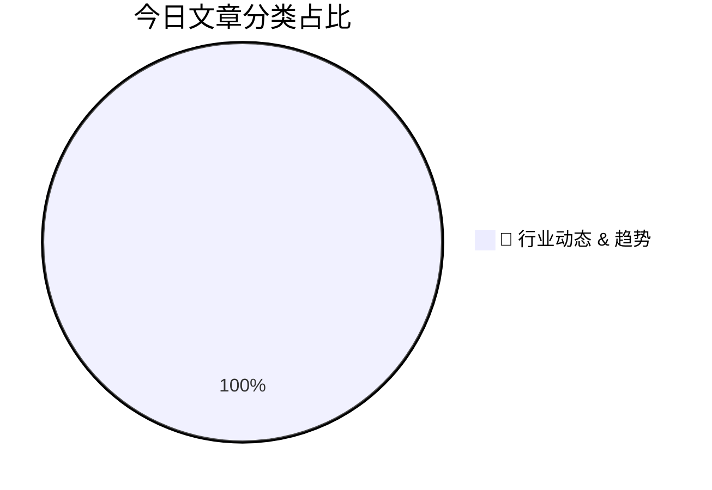

# 🛠️ FPGA / 验证技术每日精选

> 生成时间：2/28/2026, 4:34:48 AM | 数据范围：过去 24 小时

## 📝 今日看点

先进制程节点通过EUV光刻胶后烘阶段氧气注入技术实现剂量优化与产能提升，迫使物理验证团队重构工艺变异库（PVK）与可靠性签核框架，以应对亚纳米级线宽控制下的时序敏感性失效与电迁移风险。AI半导体市场的指数级增长与边缘AIoT安全架构的硬化需求，正推动验证重心向AI加速器的形式化等价性验证、NVM存储子系统的耐久性压力测试以及可信执行环境（TEE）的侧信道攻击抵抗验证迁移。人形机器人及高混合自动化场景的功能安全（FuSa）合规要求，使得硬件在环（HIL）仿真与ISO 26262/IEC 61508标准的故障注入测试成为SoC签核的关键路径。整体芯片产业的技术收敛表明，验证方法论必须从单纯的功能收敛转向涵盖先进工艺物理效应、AI工作负载特性及安全关键系统可靠性的多物理场协同验证体系。

---

## 🏆 今日必读 (Top 3)

### 1. [芯片行业一周回顾](https://semiengineering.com/chip-industry-week-in-review-127/)
**评分**: 8/10 | **分类**: 🚀 行业动态 & 趋势 | **标签**: `industry trends` `semiconductor news` `market dynamics` `weekly review`

> **💡 推荐理由**：本文深入剖析了当前数字IC验证领域面临的最严峻挑战——设计复杂度与验证资源之间的鸿沟，验证工程师可从中获取AI辅助验证、硬件加速云化部署以及Chiplet级系统验证的前沿技术路线图。文章提供的混合验证策略与形式化方法实践指南，对优化现有验证流程、提升首次流片成功率具有直接的工程指导价值，特别适合正在规划下一代验证架构的资深工程师与架构师阅读。

**摘要**：
本周行业聚焦先进制程与Chiplet架构带来的验证空间爆炸性增长问题，传统基于仿真的验证方法在面临百亿门级设计时遭遇覆盖率收敛瓶颈与回归测试周期过长的痛点。为应对这一挑战，头部厂商加速部署AI驱动的验证智能平台，通过机器学习算法优化激励生成与缺陷预测，实现验证效率的指数级提升。同时，硬件仿真加速与虚拟原型的混合验证策略成为主流，结合云端弹性算力资源显著缩短软硬件协同验证周期。此外，形式验证与动态仿真的深度协同方法学被广泛采纳，以数学证明的方式确保关键控制路径的完备性，降低后期调试成本。行业联盟正紧急推进Chiplet互连验证标准化进程，旨在解决多供应商IP集成中的接口协议一致性难题，确立系统级验证的新范式。

### 2. [存储至关重要：2025年非易失性存储器调查报告解读](https://semiwiki.com/ip/366930-memory-matters-signals-from-the-2025-nvm-survey/)
**评分**: 7/10 | **分类**: 🚀 行业动态 & 趋势 | **标签**: `NVM` `Non-Volatile Memory` `存储器趋势` `Flash` `SCM`

> **💡 推荐理由**：对于验证工程师而言，NVM领域正经历从传统功能验证向性能-功耗-可靠性多维协同验证的转型。本文揭示了CXL、存算一体等新架构带来的验证挑战，以及硬件加速、形式验证等先进方法学的应用趋势。掌握这些技术不仅能帮助工程师应对当前存储芯片验证的复杂性瓶颈，更能为参与下一代高性能计算（HPC）和AI基础设施芯片验证积累关键经验，是提升验证架构师核心竞争力的必读参考。

**摘要**：
2025年NVM调查揭示了随着CXL内存扩展、计算型存储及先进3D NAND技术的快速迭代，芯片验证复杂性呈指数级增长。核心痛点在于传统验证方法难以覆盖多协议互操作性、极端工况下的数据保持特性以及写耐久性corner cases的验证盲区。业界正面临从纯软件仿真向硬件加速验证（Emulation/Prototyping）的方法学范式转移，以应对PB级存储系统长周期压力测试的需求。解决方案指向采用UVM-based分层验证架构，结合形式验证与硬件仿真的混合验证策略，并引入机器学习驱动的智能覆盖率收敛技术。调查特别强调，构建从单元级到系统级的完整验证闭环，特别是针对断电恢复、数据完整性及磨损均衡的鲁棒性验证，已成为确保新一代NVM产品可靠性的关键门槛。

### 3. [人工智能驱动2025-2026年半导体市场强劲增长](https://semiwiki.com/semiconductor-services/semiconductor-intelligence/367018-ai-drives-strong-semiconductor-market-in-2025-2026/)
**评分**: 7/10 | **分类**: 🚀 行业动态 & 趋势 | **标签**: `AI Chip` `Market Forecast` `Semiconductor Industry` `2025-2026`

> **💡 推荐理由**：AI芯片验证是当前验证领域最具技术挑战和发展潜力的方向，涉及大规模并行计算架构、复杂互连网络及软硬件协同验证等前沿技术。掌握AI芯片验证方法论不仅能提升个人在复杂系统验证方面的架构能力，还能顺应市场人才紧缺趋势，获得优质的职业发展机会。此外，AI辅助验证工具的兴起也为验证工程师提供了提升效率的新手段，值得深入研究和实践。

**摘要**：
人工智能应用的爆发式增长推动2025-2026年全球半导体市场进入新一轮扩张周期，先进制程与Chiplet异构集成技术成为主流发展方向。然而，AI芯片极高的设计复杂度、海量数据通路验证需求以及功耗性能平衡问题，给传统验证方法带来严峻挑战。行业正通过引入AI辅助验证、硬件仿真加速平台及云原生验证环境来提升验证效率与覆盖率。验证团队需要重构验证策略，采用形式验证与动态仿真协同、软硬件协同验证等先进方法，以应对超大规模AI芯片的验证收敛难题。

---

## 📊 资讯分布与高频标签

## 📋 更多分类好文

### 🚀 行业动态 & 趋势

- [**从高混线生产到人形机器人：Robotiq推动普及型自动化的征程**](https://www.eejournal.com/fish_fry/from-high-mix-production-to-humanoids-robotiqs-push-for-accessible-automation/) - *eejournal.com* (6分)
  > 文章剖析了传统自动化方案在面对高混线（多品种小批量）生产时面临的部署周期长、编程复杂及成本高昂等核心痛点。Robotiq通过开发即插即用的自适应末端执行器与无代码编程接口，显著降低了自动化技术门槛，使中小制造企业能够快速重构产线。公司进一步将柔性自动化技术延伸至人形机器人领域，旨在构建更具通用性和经济性的下一代自动化生态系统。这种从特定工业场景向通用智能体演进的技术路径，标志着自动化正从刚性专用架构向模块化、可重构架构转型。

- [**Imec解锁EUV剂量降低新机制：金属氧化物光刻胶曝光后烘烤期间注入氧气成为提升吞吐量的游戏规则改变者**](https://www.eejournal.com/industry_news/imec-unlocks-lever-for-euv-dose-reduction-oxygen-injection-during-metal-oxide-resist-post-exposure-bake-emerges-as-game-changer-for-throughput/) - *eejournal.com* (6分)
  > 针对EUV光刻技术中因高曝光剂量需求而导致吞吐量受限的核心痛点，比利时微电子研究中心（Imec）开发了一种创新解决方案。研究团队发现，在金属氧化物光刻胶（MOR）的曝光后烘烤（PEB）过程中注入氧气，可显著降低所需的EUV曝光剂量。这一技术突破通过在PEB阶段引入氧气来增强光酸生成效率，从而在保持光刻胶性能的同时减少曝光时间。该方法不仅提高了EUV扫描仪的晶圆处理吞吐量，还为先进节点制造成本控制提供了新途径。此发现被视为极紫外光刻技术迈向大规模量产的关键游戏改变者。

- [**华擎工业安全边缘AIoT解决方案亮相2026年嵌入式世界展会并成为焦点**](https://www.eejournal.com/industry_news/asrock-industrials-secure-edge-aiot-solutions-take-center-stage-at-embedded-world-2026/) - *eejournal.com* (6分)
  > ASRock Industrial在Embedded World 2026展会上重点展示了其面向工业场景的安全边缘AIoT解决方案。针对边缘设备在数据隐私保护、网络攻击防御和AI实时推理方面的核心痛点，该公司推出了集成硬件安全模块（HSM）和AI加速引擎的嵌入式计算平台。该方案通过可信执行环境（TEE）、安全启动机制和端到端加密技术构建纵深防御体系，解决边缘侧敏感数据处理的安全隐患。同时，采用异构计算架构优化功耗与性能平衡，满足工业现场对低延迟和高可靠性的严苛要求。展示内容涵盖了从芯片级硬件信任根到云端协同管理的全栈安全验证架构，为工业4.0智能化转型提供了可信赖的硬件基础设施。

