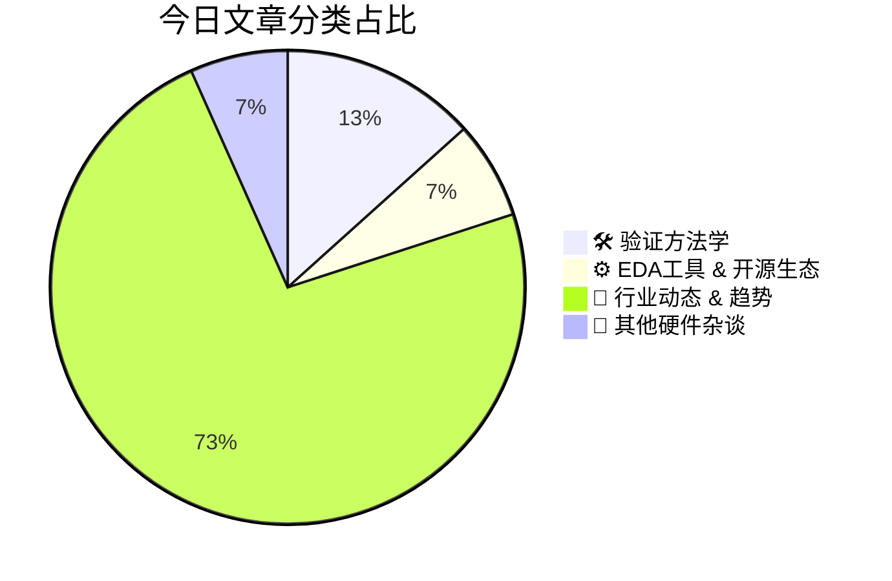

# 🛠️ FPGA / 验证技术每日精选

> 生成时间：3/3/2026, 4:53:02 AM | 数据范围：过去 24 小时

## 📝 今日看点

形式验证方法学正突破组合逻辑边界向深度时序电路扩展，并与CWE（Common Weakness Enumeration）体系结合构建RISC-V第三方IP的供应链安全可信保障，标志着硬件验证从功能正确性向硬件安全根（Root of Trust）的范式迁移。同时，亚微米级混合键合（Hybrid Bonding）、D2W互连及RDL PDK的成熟，迫使验证流程必须建立涵盖热-电-机械多物理场耦合的协同仿真框架，以应对3D异构集成中的硅前互连完整性signoff与信号/电源完整性（SI/PI）挑战。此外，面向汽车级STT-MRAM亚ppm级可靠性及神经形态处理器的规模部署，验证环境亟需整合非挥发性存储器耐久性加速老化模型、混合信号形式验证及近阈值计算条件下的统计偏差分析，实现跨数字-模拟边界的全域验证收敛。

---

## 🏆 今日必读 (Top 3)

### 1. [将形式验证扩展到时序电路](https://semiengineering.com/extending-formal-verification-to-sequential-circuits-u-of-bremen/)
**评分**: 8/10 | **分类**: 🛠️ 验证方法学 | **标签**: `Formal Verification` `Sequential Circuits` `Property Checking` `Model Checking` `State Space Exploration`

> **💡 推荐理由**：对于需要验证复杂状态机、时序优化电路或低功耗设计的IC/FPGA验证工程师，本文提供了将形式验证从组合逻辑扩展到完整时序电路的实用方法论。掌握这些技术能够帮助工程师在模块级早期发现深层次的时序违规和等价性缺陷，减少对大规模仿真平台的依赖，特别适用于处理器核、接口协议控制器及安全关键型数字电路的鲁棒性验证流程构建。

**摘要**：
传统形式验证方法在处理含寄存器和反馈回路的时序电路时面临状态空间爆炸和时序复杂性挑战。本文提出了将符号模型检测、时序等价性验证及有界模型检测等技术扩展至时序域的系统性方法，通过引入时序抽象、归纳不变量推理和基于SAT/BDD的高效状态空间遍历算法，有效缓解了计算复杂性。该方法能够在无需穷举仿真的前提下，验证时序电路的等价性、安全性及活性属性，显著提升了验证覆盖率并降低了回归测试周期。实验结果表明，该技术可处理工业级复杂状态机设计，为传统仿真验证提供了形式化的补充与增强。

### 2. [利用Smart Solido Library Profiler加速IP选型决策](https://semiengineering.com/accelerate-your-ip-selection-with-smart-solido-library-profiler/)
**评分**: 8/10 | **分类**: ⚙️ EDA工具 & 开源生态 | **标签**: `Solido` `Library Profiler` `IP Selection` `EDA` `Machine Learning` `Library Characterization`

> **💡 推荐理由**：验证工程师应关注此工具，因为IP选型阶段即决定了后续验证的复杂度和风险边界。Library Profiler提供的详细电学特性分析和 corner 差异对比，能够帮助验证团队提前识别关键时序路径、功耗模式及潜在的功能失效场景，从而制定更精准的验证计划和覆盖率目标。此外，通过量化不同IP的变异性和容限，验证工程师可以更有针对性地设计stress test和鲁棒性验证方案，避免因IP特性理解不足导致的验证漏洞和项目延期。

**摘要**：
在先进工艺节点下，IP库选择已成为影响芯片PPA和上市时间的关键瓶颈，传统依赖人工比对数据手册的方法效率低下且难以全面评估 corner case 表现。Solido Library Profiler通过自动化的数据挖掘和可视化分析，能够快速对比不同IP供应商或不同corner下的性能、功耗、面积及鲁棒性指标。该工具利用机器学习算法识别IP特性与系统需求的匹配度，帮助团队在早期阶段做出数据驱动的选型决策。通过将数周的手动分析缩短至数小时，该方案不仅加速了IP选型流程，更降低了因IP选择不当导致的后期设计迭代和验证返工风险。

### 3. [保护RISC-V第三方IP：在设计供应链中实现基于CWE的全面安全保障](https://semiwiki.com/ip/arteris/367067-securing-risc-v-third-party-ip-enabling-comprehensive-cwe-based-assurance-across-the-design-supply-chain/)
**评分**: 8/10 | **分类**: 🛠️ 验证方法学 | **标签**: `RISC-V` `CWE` `Hardware Security` `Third-Party IP` `Supply Chain Assurance`

> **💡 推荐理由**：对于数字IC/FPGA验证工程师而言，本文提供了应对RISC-V第三方IP安全验证的系统性方法学，特别是在当前供应链安全日益重要的背景下。文章介绍的CWE-based验证框架可直接应用于实际项目，帮助验证团队建立标准化的安全验证流程，识别传统功能验证难以发现的安全漏洞。此外，文中关于设计供应链安全保障的实践经验，对负责IP集成和系统级验证的工程师具有重要参考价值，有助于构建更健壮的硬件安全验证体系。

**摘要**：
随着RISC-V生态的快速发展，第三方IP的集成带来了显著的安全风险和供应链漏洞。传统验证方法缺乏针对常见弱点枚举（CWE）的系统化安全保障，难以识别和缓解跨设计供应链的潜在安全缺陷。本文提出了一种基于CWE的全面保障框架，通过在整个设计供应链中建立标准化的安全验证流程，实现对第三方IP的深度安全评估。该方法将CWE分类体系与硬件验证相结合，为RISC-V核心及其外设提供了可量化的安全置信度。实践证明，这种系统化的安全验证策略能够有效降低供应链攻击面，确保开源及商业第三方IP的可靠集成。

---

## 📊 资讯分布与高频标签

## 📋 更多分类好文

### 🚀 行业动态 & 趋势

- [**Innatera选择Synopsys仿真工具扩展面向边缘设备的类脑处理器**](https://www.eejournal.com/industry_news/innatera-selects-synopsys-simulation-to-scale-brain-inspired-processors-for-edge-devices/) - *eejournal.com* (8分)
  > Innatera作为神经形态计算芯片创新企业，面临验证复杂混合信号类脑架构（融合模拟神经元动态与数字逻辑）及确保边缘AI极端能效比的核心挑战。该公司采用Synopsys仿真解决方案构建从算法到硅片的统一验证平台，解决了传统方法难以协同仿真脉冲神经网络（SNN）算法与底层模拟电路行为的关键瓶颈。通过VCS等工具实现数字逻辑与高精度模拟神经元模型的混合信号协同仿真，显著加速了面向边缘设备的神经形态处理器验证收敛。该方案支持在RTL阶段精确评估功耗与性能指标，确保在严格面积和功耗约束下实现类脑计算架构的规模化和可靠性验证。

- [**氧化物半导体在增益单元存储器中的应用（首尔国立大学，韩国科学技术院）**](https://semiengineering.com/oxide-semiconductors-for-gain-cell-memory-applications-snu-kaist/) - *semiengineering.com* (7分)
  > 传统DRAM因电容电荷泄漏需频繁刷新，导致高功耗和性能瓶颈，且面临微缩化挑战。本文提出采用氧化物半导体（如IGZO）构建增益单元存储器（Gain Cell Memory），利用其极低的关态漏电流特性显著延长数据保持时间。通过2T或3T增益单元结构优化，实现了无需刷新或极低刷新频率的存储操作，有效解决了传统1T1C架构的保持时间与功耗矛盾。该方案为高密度、低功耗嵌入式存储器提供了可行的工艺路径，突破了传统DRAM的物理限制。

- [**优化混合键合技术**](https://semiengineering.com/making-hybrid-bonding-better/) - *semiengineering.com* (7分)
  > 混合键合作为3D IC集成的核心使能技术，正面临对准精度不足、热膨胀系数失配导致的可靠性风险，以及KGD（已知良好芯片）筛选困难等关键痛点。文章深入剖析了当前混合键合在键合良率、热管理和可测试性方面的挑战，特别是预键合测试访问受限和跨芯片边界扫描链实现复杂等问题。针对这些难题，作者提出了增强型DFT架构设计，包括可扩展的边界扫描扩展方案与基于冗余TSV的故障容错机制。同时探讨了热界面材料优化与电源完整性协同仿真方法，以解决高密度集成的散热瓶颈。最后强调了必须在设计早期引入3D异构集成验证流程，建立从芯片级到系统级的分层验证策略。

- [**苹果iPhone 17系列5G毫米波天线模块被曝采用Soitec FD-SOI衬底**](https://semiwiki.com/semiconductor-manufacturers/soitec/366949-apples-iphone-17-series-5g-mmwave-antenna-module-revealed-to-be-powered-by-soitec-fd-soi-substrates/) - *semiwiki.com* (7分)
  > 苹果iPhone 17系列的5G毫米波天线模块将采用Soitec的FD-SOI（全耗尽绝缘体上硅）衬底技术。毫米波通信面临高频信号损耗严重、功耗控制困难以及射频前端集成度要求高等核心挑战。FD-SOI技术凭借其优异的射频性能、低漏电特性和背偏压可调能力，有效解决了传统Bulk CMOS在毫米波频段的性能瓶颈。该技术能够在保持低功耗的同时实现高集成度的射频前端设计，满足5G毫米波对天线模块的严苛要求。这标志着FD-SOI工艺在高端移动设备射频领域的重要突破，为未来射频芯片设计提供了新的技术路径。

- [**汽车内存进阶：亚ppm可靠性的8nm 128Mb嵌入式STT-MRAM开发**](https://semiwiki.com/ip/366938-advancing-automotive-memory-development-of-an-8nm-128mb-embedded-stt-mram-with-sub-ppm-reliability/) - *semiwiki.com* (7分)
  > 随着汽车电子系统对存储可靠性要求达到sub-ppm（百万分之一以下）级别，传统存储技术在先进工艺节点面临严峻的功能安全与耐久性挑战。本文介绍了基于8nm工艺开发的128Mb嵌入式STT-MRAM（自旋转移矩磁阻RAM），通过创新的单元设计、先进的ECC纠错机制和冗余架构，解决了高温、辐射等恶劣汽车环境下的数据保持与写入耐久性问题。该研究实现了亚ppm级别的故障率，满足了ISO 26262等汽车功能安全标准的严苛要求，为ADAS和自动驾驶系统提供了高可靠性的非易失性存储解决方案。验证团队通过加速寿命测试、corner case仿真和故障注入验证，确保了在极端工况下的长期稳定性。

- [**NanoIC开放首个细间距RDL及D2W混合键合互连PDK**](https://www.eejournal.com/industry_news/nanoic-opens-access-to-first-ever-fine-pitch-rdl-and-d2w-hybrid-bonding-interconnect-pdks/) - *eejournal.com* (7分)
  > 随着3D IC和Chiplet技术的发展，细间距重布线层（RDL）与芯片到晶圆（D2W）混合键合技术面临缺乏标准化设计工具和验证方法学的痛点，严重制约了先进封装的开发效率。NanoIC发布了业界首个针对细间距RDL和D2W混合键合的开放互连PDK，填补了异构集成领域的设计方法学空白。该PDK提供了从物理布局、电气建模到签核验证的完整数据支持，使设计团队能够在流片前完成3D架构探索和信号完整性/电源完整性验证。通过标准化的工艺设计套件，显著降低了先进封装的设计门槛，加速了高密度互连方案的商业化落地。

- [**罗德与施瓦茨演示FR1–FR3载波聚合，加速6G就绪进程**](https://www.eejournal.com/industry_news/rohde-schwarz-demonstrates-fr1-fr3-carrier-aggregation-advancing-6g-readiness/) - *eejournal.com* (7分)
  > 随着6G向更高带宽和频谱效率演进，跨频段（FR1 Sub-6GHz与FR3 7-24GHz）载波聚合成为突破单频段容量瓶颈的关键技术，但面临高频相位噪声、时延同步及跨频段互操作性等严峻验证挑战。罗德与施瓦茨成功演示了FR1至FR3的载波聚合方案，通过先进的测试测量架构解决了多频段信号协同与一致性验证难题。该方案不仅实现了高低频谱资源的无缝融合，还为6G基带与射频前端（RFFE）的联合验证提供了可复用的测试方法论，显著降低了复杂调制场景下的验证盲区风险。

- [**Danisense交流校准服务荣获完整ISO/IEC 17025认证**](https://www.eejournal.com/industry_news/danisense-achieves-full-iso-iec-17025-accreditation-for-ac-calibration-services/) - *eejournal.com* (6分)
  > 在高端数字IC与FPGA验证中，精确的电流测量是功耗分析与电源完整性测试的关键，但未经认证的校准服务往往导致测量结果缺乏溯源性与不确定性。Danisense成功获得ISO/IEC 17025全面认证，标志着其交流校准服务已达到国际实验室质量管理标准，有效解决了高精度电流传感器校准的可追溯性与精度保障问题。该认证确保了从低频到高频交流范围内电流测量的准确性与一致性，为验证工程师提供了可信赖的计量基准。通过采用经17025认证的校准服务，验证团队能够显著降低因测量设备漂移带来的验证风险，确保功耗测试数据符合严格的行业标准。这一进展对于需要高精度测量的先进制程芯片验证尤为重要，有助于提升整体验证结果的可信度与复现性。

- [**SEGGER宣布为Flasher编程器提供Web浏览器文件访问功能**](https://www.eejournal.com/industry_news/segger-announces-web-browser-file-access-for-flashers/) - *eejournal.com* (6分)
  > 传统独立烧录器更新固件通常依赖专用软件、物理存储卡或复杂的网络配置，存在跨平台兼容性差和操作流程繁琐的痛点。SEGGER此次为Flasher系列增加了基于Web浏览器的文件管理功能，允许用户通过标准HTTP/HTTPS协议直接上传、下载和管理烧录文件，无需安装任何客户端软件。该方案利用Flasher内置的Web服务器实现，支持拖拽式操作和批量文件管理，显著简化了固件分发流程。对于需要频繁切换测试版本或多站点协同的开发环境，此功能消除了操作系统依赖，大幅提升了设备配置效率。

- [**Flex宣布与AMD达成美国制造合作，加速本土AI基础设施建设**](https://www.eejournal.com/industry_news/flex-announces-u-s-manufacturing-collaboration-with-amd-to-accelerate-domestic-ai-infrastructure/) - *eejournal.com* (6分)
  > 面对地缘政治风险与AI算力需求激增带来的供应链安全挑战，全球电子制造服务商Flex与半导体巨头AMD宣布在美国本土开展深度制造合作。该合作旨在解决AI基础设施硬件交付周期长、海外供应链脆弱及本土化生产不足等核心痛点，通过整合Flex的美国制造能力与AMD先进的AI计算平台，实现AI服务器及加速卡的本土生产与测试。此举不仅显著缩短产品上市周期并增强供应链韧性，更响应了美国强化半导体本土生态的政策要求。通过近距离制造与协同验证，双方能够加速AI系统的硬件迭代与质量管控，为大规模数据中心部署提供可靠的算力基础设施保障。

- [**另一个量子主题：量子通信**](https://semiwiki.com/photonics/366985-another-quantum-topic-quantum-communication/) - *semiwiki.com* (5分)
  > 量子通信利用量子纠缠和量子密钥分发(QKD)技术实现理论上的无条件安全传输，但面临量子态脆弱性导致的传输损耗、环境噪声敏感以及与经典数字系统协议转换等核心痛点。文章分析了单光子探测、量子随机数生成(QRNG)等关键硬件模块在工程实现中的时序抖动、误码率控制和接口标准化挑战。针对这些难点，作者提出了诱骗态协议优化、量子中继器架构设计以及量子-经典混合系统的分层验证策略。特别讨论了如何在现有FPGA/ASIC验证流程中集成量子信道建模、量子态保真度检测和抗侧信道攻击的验证方法。解决方案强调了从物理层量子态传输到应用层密码协议的全栈验证覆盖，以及建立量子噪声注入和容错机制验证的必要性。

### 📝 其他硬件杂谈

- [**Leankon推出先进的868MHz与915MHz LoRa天线解决方案**](https://www.eejournal.com/industry_news/leankon-introduces-advanced-868mhz915mhz-lora-antenna-solutions/) - *eejournal.com* (5分)
  > 针对LoRa物联网设备在868MHz（欧洲）和915MHz（北美）ISM频段部署时面临的多频段兼容性验证复杂、射频性能一致性难保证等痛点，Leankon发布了新一代天线解决方案。该方案通过优化的天线匹配网络和集成化设计，解决了跨频段阻抗匹配、谐波抑制及EMC合规性等关键硬件验证难题。产品支持双频段无缝切换，显著降低了射频前端验证的迭代周期和测试成本。其标准化的射频接口和预校准特性为数字IC与射频模块的协同验证提供了可复用的参考设计，加速了LoRa终端产品的上市时间。

