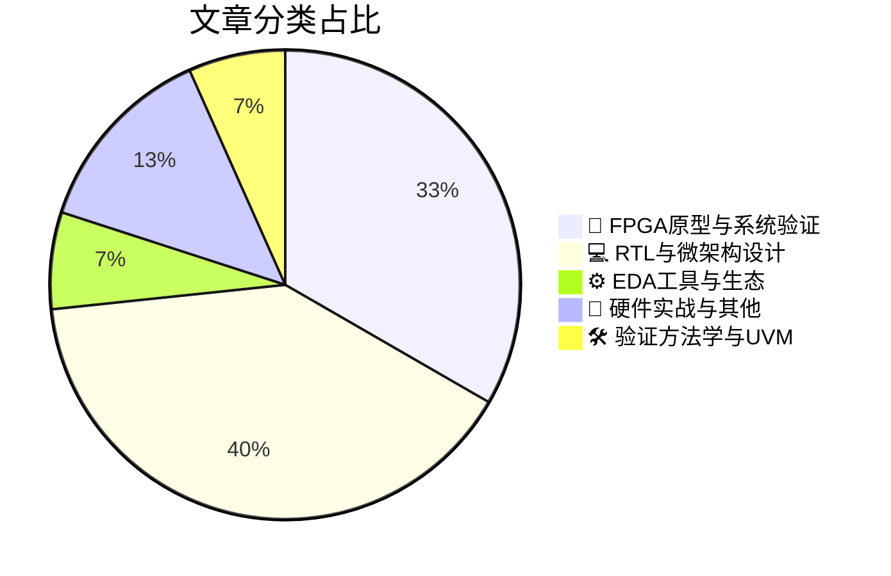

# 🛠️ FPGA / 验证技术精选

> 生成时间：2026-03-06 03:30:29 | 数据范围：过去 96 小时

## 📝 行业视点

异构集成与Chiplet架构正推动验证方法论向多物理场协同演进，从早期多芯片可行性探索到3D堆叠的ESD完整性分析，要求验证流程覆盖跨Die互连可靠性、热-电耦合效应及先进封装下的信号完整性。与此同时，Agentic AI开始重构EDA工具链，Siemens的Agentic Questa标志着验证从脚本自动化向自主决策代理转型，但AI/ML工具自身的安全约束与物理AI防护机制亦成为验证的新维度。此外，边缘AI与高性能计算的融合正重塑微架构设计范式，从RVA23规范对RISC-V推测执行的合规性要求到Edge GPU的功耗优先策略，结合UET-TSS安全以太网与25G车载以太网的严苛验证场景，凸显实时边缘节点对能效、功能安全及协议一致性的复合挑战。

---

## 🏆 深度必读 (Top 3)

### 1. [早期降低风险：多芯片设计可行性探索](https://semiwiki.com/eda/synopsys/367031-reducing-risk-early-multi-die-design-feasibility-exploration/)
**评分**: 8/10 | **分类**: 🔬 FPGA原型与系统验证 | **标签**: `Multi-Die` `Chiplet` `Early Architecture Validation` `System-Level Verification` `Feasibility Analysis`

> **💡 推荐理由**：对于验证团队而言，本文提供了在架构冻结前介入验证规划的关键方法论，能够帮助验证架构师提前评估多芯片分区方案对验证环境复杂度、测试覆盖率收敛及调试可见性的影响。通过掌握文中所述的早期可行性分析技术，验证团队可以将后期可能发现的架构缺陷左移至概念阶段，显著降低因芯片 Partitioning 不当导致的测试激励重构、跨边界覆盖率收集困难及系统级 Corner Case 遗漏风险，是实现'一次成功'（First-Time-Right）验证策略的重要参考。

**摘要**：
本文针对多芯片（Multi-Die）架构设计中的早期决策风险，提出了系统化的可行性探索方法论。文章深入剖析了芯片 Partitioning 决策对系统级验证复杂度的指数级影响，重点解决了异构集成场景下接口协议一致性、跨裸片（Cross-Die）时序收敛及系统级功耗热耦合等关键验证痛点。通过早期虚拟原型（Virtual Prototype）与物理 Aware 的协同仿真框架，该方案能够在架构定义阶段即识别互联带宽瓶颈、SI/PI 完整性风险及测试访问架构（DFT）的可控性缺陷，避免后期验证环境重构带来的巨大成本浪费。文中强调了架构-验证协同优化（AVCO）的重要性，为多芯片系统的可测试性、可调试性及封装级验证策略提供了量化评估准则。

### 2. [Arm Cortex X925：实现桌面级性能突破](https://chipsandcheese.com/p/arms-cortex-x925-reaching-desktop)
**评分**: 8/10 | **分类**: 💻 RTL与微架构设计 | **标签**: `Cortex-X925` `微架构分析` `乱序执行` `缓存层次` `性能瓶颈`

> **💡 推荐理由**：验证团队应研读本文以深入理解当代高性能CPU核心验证的最佳实践，特别是针对乱序执行深度流水线和复杂缓存一致性协议的验证技术。文章提供的性能验证方法论和边界案例挖掘策略，对当前面临类似桌面级性能目标的自研芯片验证工作具有直接指导意义，有助于团队建立更 robust 的验证环境和性能回归测试体系，同时其关于矢量指令集功能验证的经验对AI加速相关验证也具有重要参考价值。

**摘要**：
本文深入剖析了Arm Cortex X925高性能核心的微架构革新，该设计通过增强的乱序执行引擎、更大的重排序缓冲区(ROB)以及改进的内存子系统，实现了接近桌面级处理器的性能水平。文章重点探讨了在验证此类复杂乱序超标量处理器时面临的状态空间爆炸、内存一致性模型验证以及性能边界测试等关键挑战，并阐述了针对新引入的SVE2指令集和可扩展矢量扩展的验证策略。作者详细说明了如何通过层次化验证方法学、形式化验证与仿真相结合的手段，解决高频运行下的时序收敛与功能正确性验证难题。最后，文章提出了面向移动与桌面融合架构的验证方法论框架，为高性能CPU的验证环境搭建和测试用例生成提供了系统性解决方案。

### 3. [MicroZed Chronicles：7系列BUFR与时钟分频](https://www.adiuvoengineering.com/post/microzed-chronicles-seven-series-bufr-and-clock-division)
**评分**: 8/10 | **分类**: 🔬 FPGA原型与系统验证 | **标签**: `BUFR` `Clock Division` `Xilinx 7 Series` `Regional Clock` `FPGA Clocking` `CDC`

> **💡 推荐理由**：验证团队应重点阅读本文以建立针对区域时钟分频的专项验证策略，特别是文中关于BUFR分频时钟与主时钟非整数倍频关系导致的相位不确定性分析，可直接用于完善CDC验证检查清单。文章提供的XDC约束范例和时序分析方法论，有助于验证工程师在搭建testbench时准确模拟分频时钟的skew和jitter特性，避免因时钟架构理解偏差导致的功能覆盖率漏洞。此外，对于涉及多速率接口（如千兆以太网、PCIe）的验证场景，本文关于BUFR与MMCM/PLL级联使用的架构建议具有重要参考价值。

**摘要**：
本文深入解析了Xilinx 7系列FPGA中BUFR（区域时钟缓冲器）原语的配置方法及其内置时钟分频功能，解决了在I/O密集型或低功耗设计中，全局时钟缓冲器（BUFG）资源受限时的区域时钟架构设计难题。文章详细阐述了BUFR与BUFG在时钟分频应用中的关键差异，包括时钟域范围、分频能力及跨时钟域（CDC）特性，并针对分频时钟与原时钟的相位关系不确定性提出了具体的时序约束策略。作者通过SDR（软件定义无线电）等实际案例，展示了如何利用BUFR实现1/2至1/8的分频比，同时避免亚稳态和数据采样冲突。此外，文章还探讨了BUFR在部分可重配置（PR）区域中的隔离优势，为复杂时钟拓扑的验证提供了清晰的架构指导。

---

## 📊 资讯分布与高频标签

## 📋 更多分类好文

### 💻 RTL与微架构设计

- [**面向AI与HPC场景定制的超高速以太网安全协议(UET-TSS)**](https://semiengineering.com/ultra-ethernet-security-uet-tss-tailored-for-ai-and-hpc/) - *semiengineering.com* (7分)
  > 文章提出了专为AI和HPC工作负载设计的超高速以太网安全传输标准UET-TSS，针对传统MACsec/IPsec在400G/800G高带宽、微秒级低延迟场景下引发的性能瓶颈与验证复杂度爆炸问题进行了架构级优化。该方案通过硬件加密引擎卸载、流水线并行处理及零拷贝安全传输机制，解决了AI训练中大流量数据包线速加密的时序收敛难题，以及多租户环境下密钥隔离与内存保护的功能验证挑战。文章深入探讨了面向延迟敏感业务的验证策略，包括加密/解密延迟的精确测量方法、乱序包重排与安全处理的协同验证，以及在高并发RDMA/RoCEv2场景下的安全上下文切换与资源死锁测试。此外，方案构建了可扩展的密钥管理验证框架，针对HPC集群数千节点规模的密钥分发、轮换及撤销机制提供了压力测试与覆盖率量化指标，填补了超大规模智算中心网络安全IP验证的方法论空白。

- [**RVA23终结推测执行在RISC-V CPU中的垄断地位**](https://semiwiki.com/ip/risc-v/367094-rva23-ends-speculations-monopoly-in-risc-v-cpus/) - *semiwiki.com* (7分)
  > RVA23规范通过引入强制性非推测性执行机制，打破了传统RISC-V高性能处理器对推测执行架构的单一依赖，从根本上改变了处理器微架构的验证范式。文章深入剖析了推测执行带来的Spectre/Meltdown类侧信道攻击漏洞及其对形式验证和安全验证造成的巨大复杂性痛点，特别是在边界条件和覆盖率收敛方面的挑战。通过阐述Zicond、Zicfilp等扩展的确定性执行特性，文章提出了可消除分支预测和内存访问推测的架构设计方案，显著简化了内存模型验证和异常处理验证流程。针对验证团队，该文详细论证了非推测性路径如何降低状态空间爆炸风险，使形式验证工具能够更高效地证明安全属性，同时减少了回归测试中的非确定性行为调试开销。这一架构转变为高可靠性应用场景提供了可验证的安全保障，确立了功能安全与信息安全协同验证的新方法论。

- [**功耗优先于面积：边缘GPU设计为何迈入新纪元**](https://semiengineering.com/power-not-area-why-edge-gpu-design-is-entering-a-new-era/) - *semiengineering.com* (6分)
  > 边缘AI计算的爆发式增长正推动GPU设计范式从传统的面积优先转向严格的功耗优先架构。这一转变引入了复杂的电源管理挑战，包括细粒度的动态电压频率调整（DVFS）、多电源域划分以及激进的时钟门控策略，这些架构变革直接转化为验证复杂度的指数级增长。文章深入探讨了验证团队面临的具体痛点：电源状态转换的时序闭合、跨电源域的信号隔离与保持、低功耗模式下的功能等价性验证，以及实际工作负载下的功耗预估精度。针对这些挑战，作者提出了基于UPF/CPF的低功耗验证方法学、形式化验证用于电源状态机完整性检查，以及硬件仿真平台结合真实AI工作负载的功耗分析方案。文章特别强调，验证架构需要从传统的功能验证向“功耗-性能-功能”协同验证转型，建立覆盖所有电源状态的验证矩阵，以确保在极端功耗约束下的硅片成功率。

- [**新设计优势：为何统一处理与连接能够简化设计体验**](https://semiengineering.com/the-new-design-advantage-why-unifying-processing-and-connectivity-simplifies-the-design-experience/) - *semiengineering.com* (6分)
  > 本文探讨了传统SoC架构中处理单元与互连子系统分离设计所带来的验证复杂性问题，包括多协议接口验证、跨域一致性检查及系统集成收敛挑战。文章提出通过统一处理与连接架构（如近存计算、统一互连协议或Chiplet集成方案），可以显著减少验证空间并消除接口适配层的功能验证负担。这种架构整合使得验证团队能够采用统一的验证环境（UVM/Testbench）覆盖处理与传输路径，降低跨时钟域和跨协议验证的复杂度。此外，统一架构减少了系统级验证中的边界情况（corner cases）和死锁场景，加速了验证收敛并提高了覆盖率达成效率。文章还讨论了这种设计范式转变对验证方法论（如Formal验证和Emu/FPGA原型验证）的影响，为验证团队应对下一代复杂SoC提供了架构级指导。

- [**新型汽车架构重塑处理器与内存选择**](https://semiengineering.com/new-automotive-architectures-are-shaking-up-processors-and-memory-choices/) - *semiengineering.com* (6分)
  > 文章探讨了汽车电子电气架构（E/E Architecture）从分布式向域集中式及中央计算平台转型对半导体选型的深远影响。这种架构变革驱动处理器从传统MCU转向集成AI加速引擎（NPU/TPU）的异构多核SoC，同时内存子系统需采用LPDDR5X/GDDR6/HBM等高带宽方案以满足自动驾驶算法的数据吞吐需求。验证面临的核心痛点包括：异构计算单元间的协同与接口验证复杂度激增、ISO 26262功能安全在AI加速场景下的确定性延迟验证、以及高带宽内存的实时一致性与端到端数据完整性验证。文章进一步剖析了架构设计中性能-功耗-功能安全（Safety）-网络安全（Security）的多维权衡难题，以及多核缓存一致性、虚拟化资源隔离等关键验证挑战。最后提供了针对汽车SoC的验证策略建议，涵盖虚拟原型（Virtual Prototype）早期验证、硬件仿真（Emulation）加速及场景化故障注入测试方法。

### 🔬 FPGA原型与系统验证

- [**25G以太网：为ADAS、工业4.0和5G系统扩展数据移动能力**](https://semiengineering.com/25g-ethernet-scaling-data-movement-for-adas-industry-4-0-and-5g-systems/) - *semiengineering.com* (7分)
  > 本文探讨了25G以太网在满足ADAS、工业4.0和5G系统高带宽、低延迟数据传输需求中的关键作用，重点剖析了从10G向25G迁移过程中面临的验证架构挑战。文章深入分析了高速SerDes接口验证中的信号完整性(SI)与协议一致性协同验证难题，以及PCS/MAC分层架构中跨层时钟域交叉(CDC)和流量管理的验证盲点。针对ADAS等安全关键场景，作者提出了包含前向纠错(FEC)机制验证、严格延迟约束测试和故障注入策略的完整验证方法论，解决了传统以太网验证IP无法覆盖25G特定物理编码子层(PCS)64b/66b编码错误场景的痛点。此外，文章还阐述了多速率自动协商(ANEG)与链路训练(LT)状态机验证的复杂性，为构建支持10G/25G/40G多模式切换的UVM验证平台提供了可复用的架构蓝图。

- [**边缘与微型数据中心：赋能实时数字世界**](https://semiengineering.com/edge-and-micro-data-centers-powering-the-real-time-digital-world/) - *semiengineering.com* (6分)
  > 文章探讨了边缘计算和微型数据中心在支撑实时数字应用中的关键架构作用，重点分析了在资源受限环境（低功耗、散热限制、空间约束）下确保计算完整性的验证挑战。针对边缘设备对微秒级延迟和99.999%可靠性的严苛要求，文章提出了异构计算架构（CPU/FPGA/ASIC协同）的实时数据流验证方法论，解决了传统数据中心验证策略在分布式边缘节点上的失效问题。文中详细阐述了面向故障容错机制的网络一致性验证策略，以及从RTL到系统级的分层验证架构设计，特别关注了热管理相关的动态功耗验证和极端环境下的鲁棒性测试方案。

- [**是德科技与联发科推进无线接入网络的AI驱动上行链路优化及模型生命周期管理**](https://www.eejournal.com/industry_news/keysight-and-mediatek-advance-ai-driven-uplink-optimization-and-model-life-cycle-management-for-radio-access-networks/) - *eejournal.com* (6分)
  > Keysight与MediaTek合作展示了AI驱动的上行链路优化方案，解决了传统无线接入网络（RAN）中基于AI的物理层算法在FPGA/ASIC实现时的验证难题。该方案针对AI模型生命周期管理的核心痛点，建立了从模型训练、量化压缩到硬件部署的全流程验证框架，确保算法模型与数字基带处理模块的协同工作时序收敛。通过实时上行链路优化验证机制，解决了AI推理引擎与射频前端数字IC之间的接口一致性及数据流完整性挑战。该架构特别强化了AI模型版本迭代时的自动化回归验证能力，填补了无线通信系统中机器学习组件从仿真到硅后验证的鸿沟。此合作为5G/6G基带芯片的AI化转型提供了可复用的验证方法论，有效降低了算法-硬件异构系统的集成风险。

### ⚙️ EDA工具与生态

- [**西门子发布Agentic Questa智能验证平台**](https://semiwiki.com/artificial-intelligence/367026-siemens-reveals-agentic-questa/) - *semiwiki.com* (7分)
  > 西门子推出的Agentic Questa验证平台通过集成多智能体AI架构，解决了传统芯片验证中回归测试周期长、调试效率低及覆盖率收敛慢等核心痛点。该平台利用自主AI Agent实现测试生成、故障诊断与验证计划的自动化优化，显著减少了人工干预需求。其架构支持在仿真环境中进行智能决策，能够动态调整验证策略以加速缺陷发现与定位。通过将大语言模型与传统形式化验证、仿真技术融合，Agentic Questa有效应对了现代复杂SoC验证空间爆炸的挑战。这一方案为验证团队提供了从计划到收敛的全流程智能化支持，标志着验证方法论向自主化方向的重要演进。

### 📝 硬件实战与其他

- [**电子系统的功能安全分析**](https://semiwiki.com/eda/367055-functional-safety-analysis-of-electronic-systems/) - *semiwiki.com* (6分)
  > 本文针对高ASIL等级芯片验证中缺乏系统化故障分析方法的痛点，提出了基于ISO 26262标准的电子系统功能安全分析框架。文章详细阐述了如何将安全需求转化为可验证的硬件架构设计，解决了传统功能验证无法有效评估诊断覆盖率和安全机制完整性的难题。通过引入FMEDA与故障注入验证相结合的方法论，建立了从故障模式识别、安全机制设计到验证覆盖率量化的闭环流程。特别针对双核锁步、ECC校验、时钟监控等关键安全IP的验证策略提供了架构级指导，为功能安全芯片的sign-off提供了可量化的技术依据。

- [**纵贯3D堆叠的广袤疆域：精通先进半导体设计中的ESD验证**](https://semiengineering.com/across-the-vast-reaches-of-the-3d-stack-mastering-esd-verification-in-advanced-semiconductor-design/) - *semiengineering.com* (5分)
  > 文章针对3D堆叠集成电路（3D IC）和Chiplet架构中ESD（静电放电）验证的复杂性，提出了系统性的验证方法论。核心痛点在于传统2D ESD验证无法处理跨芯片垂直互连（如TSV、Microbump）带来的分布式保护网络协同问题，以及多物理场耦合下的失效模式分析。文章详细阐述了3D架构中跨层ESD路径追踪、芯片间接口ESD协同验证、以及考虑热-电-机械应力耦合的仿真方法。针对验证架构设计，提出了分层验证策略（Die-level vs. Stack-level）和基于仿真的ESD防护完整性检查流程。通过实际案例展示了如何建立3D堆叠的ESD防护签核（Sign-off）标准，解决先进封装中独特的ESD薄弱点识别难题。

### 🛠️ 验证方法学与UVM

- [**Limiting AI/ML Tools To Ensure Physical AI Safety, Security**](https://semiengineering.com/limiting-ai-ml-tools-to-ensure-physical-ai-safety-security/) - *semiengineering.com* (5分)
  > 摘要生成失败。

