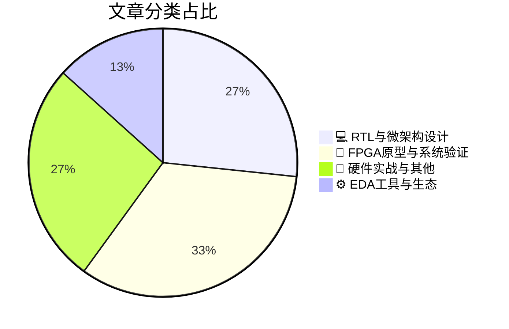

# 🛠️ FPGA / 验证技术精选

> 生成时间：2026-03-09 02:57:03 | 数据范围：过去 96 小时

## 📝 行业视点

多芯粒异构集成与3D堆叠技术正重塑硬件验证边界，要求从早期可行性阶段即引入跨dies的ESD防护、电源完整性与热机械协同验证，彻底突破传统单芯片Sign-off范式。Agentic AI驱动的EDA工具链（如Questa智能验证平台）与AI原生硬件架构（存内计算、边缘GPU微架构）形成双向赋能，通过RTL-微架构层面对多工作负载能效进行协同优化。面向ADAS与5G-Advanced场景，25G/超以太网(UET)与边缘AI加速器的深度融合催生了处理-连接统一架构的验证需求。系统级FPGA原型验证已成为验证高速数据流、功能安全及AI驱动信道压缩算法的关键基础设施，覆盖从卫星通信到工业4.0的全场景应用。

---

## 🏆 深度必读 (Top 3)

### 1. [面向多工作负载的存内AI加速器优化设计](https://semiengineering.com/optimizing-in-memory-ai-accelerators-across-multiple-workloads-kaust-compumacy/)
**评分**: 7/10 | **分类**: 💻 RTL与微架构设计 | **标签**: `In-Memory Computing` `AI Accelerator` `Dataflow Architecture` `Multi-workload Optimization` `Memory Wall`

> **💡 推荐理由**：推荐验证团队阅读本文，因为存内计算加速器的多工作负载验证涉及独特的模拟-数字混合信号验证挑战，文章提出的跨工作负载优化框架为验证计划制定和覆盖率收敛提供了关键的架构约束条件。文中对不同工作负载数据流模式的差异分析有助于验证团队构建更具针对性的测试场景，特别是针对位宽可重构、动态调度以及非确定性噪声注入的功能验证方法。此外，文章讨论的多精度权重映射与误差传播机制，为验证团队建立高精度参考模型、定义模拟-数字接口的误差容忍边界提供了重要的理论基础和实践指导。

**摘要**：
该论文针对存内计算(IMC)架构在支持多样化AI工作负载时面临的资源利用率与能效失衡问题，提出了一种跨工作负载的协同优化方法。文章深入分析了CNN与Transformer等不同神经网络拓扑对存内阵列的访问模式差异，揭示了固定数据流映射导致的硬件资源闲置与精度损失这一关键架构瓶颈。作者提出了可重构的位宽自适应计算方案与动态数据重排机制，在保持存内计算高能效优势的同时提升了架构通用性。实验结果表明，该方法在异构工作负载下实现了显著的能效-精度权衡优化。对于验证团队而言，文章特别强调了多精度计算单元与器件非理想特性（如模拟噪声）在多场景下的协同验证挑战，为层次化验证策略提供了关键约束条件。

### 2. [25G以太网：为ADAS、工业4.0及5G系统扩展数据移动能力](https://semiengineering.com/25g-ethernet-scaling-data-movement-for-adas-industry-4-0-and-5g-systems/)
**评分**: 7/10 | **分类**: 🔬 FPGA原型与系统验证 | **标签**: `25G Ethernet` `CDC` `High Speed SerDes` `System Architecture` `ADAS`

> **💡 推荐理由**：本文对验证团队极具参考价值，不仅提供了25G高速接口从物理层到协议层的完整验证方法论，还深入剖析了功能安全、实时性和低延迟等多维度需求的验证实现路径。文中关于SerDes良率测试、PCS/MAC层断言验证以及混合验证环境搭建的架构建议，可直接应用于当前先进工艺SoC和高速FPGA设计中的以太网子系统验证，有效提升验证完备性和回归测试效率。

**摘要**：
本文探讨了25G以太网在ADAS、工业4.0和5G基础设施中面临的高速数据架构验证挑战，重点分析了25Gbps速率下的信号完整性、跨时钟域同步及协议一致性等关键验证痛点。文章针对汽车电子的功能安全（ISO 26262）要求、工业场景的确定性延迟需求以及5G低时延高可靠（URLLC）特性，提出了基于UVM的分层验证架构和覆盖率驱动验证策略。作者详细阐述了高速SerDes接口的良率验证方法、MAC/PCS层协议自动检查机制，以及多通道并行验证环境下的性能基准测试方案，解决了长时稳定性测试和Corner Case激励生成的效率瓶颈。文章还论证了FPGA原型验证与硬件仿真（Emulation）相结合的混合验证流程，为复杂SoC中25G以太网子系统的可扩展验证提供了系统化的架构设计指导。

### 3. [功耗而非面积：边缘GPU设计为何迈入新纪元](https://semiengineering.com/power-not-area-why-edge-gpu-design-is-entering-a-new-era/)
**评分**: 7/10 | **分类**: 💻 RTL与微架构设计 | **标签**: `Edge GPU` `Power Optimization` `Microarchitecture Trade-offs` `Low Power Design` `PPA Analysis`

> **💡 推荐理由**：对验证团队而言，本文揭示了边缘AI芯片验证从纯功能向功耗-性能-面积(PPA)协同验证转型的必然趋势，特别有助于理解多电源域验证、功耗感知的UVM测试平台构建、以及基于实际边缘负载的功耗场景验证方法，对制定低功耗验证策略和功耗回归测试方案具有重要指导意义。

**摘要**：
文章阐述了边缘AI场景下GPU设计范式正从传统面积优先转向功耗优先的根本性转变，指出在严格热设计功耗(TDP)约束下架构验证面临的新挑战。作者深入分析了多电压域电源管理、动态电压频率调节(DVFS)及电源门控等低功耗技术在边缘GPU中的验证痛点，强调传统功能验证方法已无法满足功耗-性能联合验证需求。文中提出了基于系统级功耗建模的早期验证策略，以及针对边缘工作负载的场景化功耗验证方法，为解决电源域交叉(CDC/LDC)验证和功耗回归测试效率问题提供了架构级思路。

---

## 📊 资讯分布与高频标签

## 📋 更多分类好文

### 🔬 FPGA原型与系统验证

- [**提前规避风险：多芯片设计可行性探索**](https://semiwiki.com/eda/synopsys/367031-reducing-risk-early-multi-die-design-feasibility-exploration/) - *semiwiki.com* (7分)
  > 多芯片（Multi-Die）架构在提升系统性能和能效的同时，引入了复杂的跨芯片接口验证、早期架构决策风险以及分区策略验证 coverage 不足等挑战。本文聚焦于多芯片设计早期可行性阶段缺乏系统化验证方法论的问题，提出了在架构定义期即介入的验证可行性分析框架，重点解决了 die 间接口协议一致性、物理分区对验证环境复用的影响、以及早期性能/功耗模型验证等关键痛点。通过在设计初期评估跨 die 信号完整性、时序收敛难度和可测试性（DFT）架构，该方法有效避免了后期因架构缺陷导致的验证返工和硅片失效风险。文章还阐述了如何利用虚拟原型和事务级建模（TLM）在流片前验证多芯片 partition 策略的合理性，为验证团队提供了识别潜在集成风险和验证盲区的系统性方法。

- [**标准化与认证芯片驱动汽车安全加速演进**](https://semiengineering.com/auto-security-accelerates-with-standardization-and-certified-silicon/) - *semiengineering.com* (6分)
  > 本文针对汽车电子安全验证中标准合规流程冗长、多层级安全机制协同验证复杂的核心痛点，提出了基于标准化硬件安全架构与预认证硅IP的系统性解决方案。文章深入剖析了传统验证流程中ISO 26262功能安全与ISO/SAE 21434网络安全标准难以协同验证的架构设计难题，指出缺乏可重用安全验证IP导致认证周期过长的关键瓶颈。通过引入预认证的硬件安全模块(HSM)和标准化信任根(Root of Trust)架构，该方案实现了从芯片级到系统级安全属性的分层验证策略。文章详细阐述了如何利用自动化故障注入测试、形式化安全属性验证与合规文档生成工具链，显著降低ASIL等级认证所需的验证工作量。这一方法学为车规级芯片验证团队提供了可复用的安全验证框架，有效解决了安全关键设计中验证覆盖率与认证时效性之间的矛盾。

- [**是德科技演示5G-Advanced AI驱动的信道状态信息压缩技术，为6G发展铺平道路**](https://www.eejournal.com/industry_news/keysight-demonstrates-5g-advanced-ai-powered-channel-state-information-compression-and-paves-the-way-for-6g/) - *eejournal.com* (5分)
  > 文章阐述了是德科技针对5G-Advanced系统中大规模MIMO信道状态信息（CSI）反馈带宽爆炸问题，提出的AI驱动压缩方案及其验证架构。该方案解决了传统CSI压缩算法在高维信道矩阵实时处理中的硬件实现验证复杂性，以及AI推理模型与数字基带链路协同仿真的精度对齐挑战。通过构建集成AI加速器、信道模拟器和射频前端的联合验证平台，实现了压缩算法在精度-延迟-功耗多维度约束下的量化评估与优化。文章进一步探讨了面向6G智能空口的AI/ML算法硬件化验证方法论，为高维度数据压缩模块的验证环境搭建和测试向量生成提供了架构级参考。

- [**从卫星到5G：Ceva PentaG-NTN™降低终端创新者门槛**](https://semiwiki.com/ip/ceva/367124-from-satellites-to-5g-cevas-pentag-ntn-lowers-barriers-for-terminal-innovators/) - *semiwiki.com* (4分)
  > Ceva PentaG-NTN是一款面向非地面网络（NTN）终端的集成式基带平台，解决了卫星通信与5G NR融合设计中复杂的多模协议验证和信道仿真痛点。该平台通过硬件可配置DSP架构与标准化验证环境，显著降低了NTN特有的高延迟补偿、多普勒频移校正及链路自适应算法的验证复杂度。其预验证的物理层和协议栈IP为IC验证团队提供了可复用的参考模型，减少了从卫星物联网到宽带5G终端的跨场景验证周期。架构上采用软硬件协同设计，在保持射频前端灵活性的同时，通过专用加速单元解决了NTN终端低功耗与高性能的矛盾验证需求。

### 📝 硬件实战与其他

- [**芯片产业一周回顾：验证挑战与架构革新综述**](https://semiengineering.com/chip-industry-week-in-review-128/) - *semiengineering.com* (6分)
  > 本周综述重点剖析了3nm及以下先进制程节点带来的物理验证复杂性激增问题，特别是电压降（IR Drop）与电迁移（EM）签核对静态时序分析（STA）精度的影响。文章深入探讨了Chiplet异构集成架构下系统级验证（SoC Verification）面临的互联一致性（UCIe协议）与多物理场协同仿真难题，指出了传统UVM方法学在处理跨die数据完整性验证时的局限性。此外，综述分析了AI/ML技术在验证覆盖率收敛与回归测试筛选中的落地实践，提出了基于智能代理（AI Agent）的验证环境自适应调优方案。针对当前验证周期占芯片开发成本70%以上的痛点，文章评估了硬件仿真加速（Emulation）与数字孪生（Digital Twin）技术在验证左移（Shift-left）策略中的架构价值，并讨论了形式化验证（Formal Verification）在保障车规级芯片功能安全（ISO 26262）中的关键作用。

- [**限制AI/ML工具使用以确保物理AI安全与防护**](https://semiengineering.com/limiting-ai-ml-tools-to-ensure-physical-ai-safety-security/) - *semiengineering.com* (6分)
  > 文章探讨了在安全关键型物理AI系统（如自动驾驶、医疗机器人）中，通过严格限制AI/ML工具的能力范围和资源访问权限来解决功能安全与信息安全验证的根本矛盾。核心痛点在于传统数字IC验证流程难以处理神经网络的黑盒不确定性与ISO 26262/IEC 61508等标准要求的确定性行为之间的冲突。文章提出了基于硬件强制隔离的验证架构，通过形式化方法定义AI执行边界，限制模型推理的输入空间和计算资源，确保可预测的安全行为。该方案解决了AI加速器芯片在混合关键性系统中的故障传播控制、侧信道攻击防护及确定性响应验证等架构级难题，为AI硬件的安全认证提供了可实施的验证策略。

- [**面向AI与HPC场景的Ultra Ethernet安全传输标准(UET-TSS)架构与验证**](https://semiengineering.com/ultra-ethernet-security-uet-tss-tailored-for-ai-and-hpc/) - *semiengineering.com* (5分)
  > UET-TSS针对AI/HPC工作负载的超低延迟与高吞吐需求，重新定义了以太网传输层安全架构，解决了传统IPsec/MACsec在大规模GPU集群中因加解密处理引入的带宽瓶颈与微秒级时延膨胀问题。文章提出了硬件加速的轻量级加密引擎与数据面解耦设计方案，突破了安全处理单元与高速SerDes通道紧耦合导致的时序收敛难题。针对验证挑战，文中系统阐述了基于形式化验证的密钥管理状态机完备性检查、基于UVM-Random的加密/解密数据通路压力测试方法，以及针对侧信道攻击的功耗分析(DPA)验证策略。特别探讨了在RDMA over UET环境下，如何协调内存加密与GPU Direct P2P访问机制，解决了安全启用与Zero-Copy语义冲突的架构设计痛点。该标准通过引入硬件信任根(RoT)与可扩展的密钥轮换协议，为Exascale级AI训练基础设施提供了兼顾性能与安全的验证框架，显著降低了后量子密码学算法硬件化的验证复杂度。

- [**即插即用GMSL摄像头适配器将NVIDIA Jetson Orin开发套件转变为坚固的多摄像头视觉平台**](https://www.eejournal.com/industry_news/plug-and-play-gmsl-camera-adapters-turn-nvidia-jetson-orin-dev-kits-into-rugged-multi-camera-vision-platforms/) - *eejournal.com* (5分)
  > 本文介绍了一种即插即用的GMSL摄像头适配器解决方案，有效解决了NVIDIA Jetson Orin平台与多路高速摄像头集成时的物理层验证复杂性问题。该方案通过标准化硬件接口简化了SerDes链路信号完整性验证和多摄像头同步时序验证流程，显著缩短了传统自定义硬件设计的验证周期。适配器的坚固型工业设计为ADAS和机器人视觉系统提供了可靠的环境应力筛选（ESS）和EMC验证基准平台，支持在恶劣条件下进行多摄像头带宽压力测试和长期稳定性验证。此外，即插即用特性降低了硬件在环（HIL）验证环境的搭建门槛，使验证团队能够快速构建多通道视觉数据采集系统，专注于算法和功能验证而非底层硬件接口调试。

### ⚙️ EDA工具与生态

- [**跨越3D堆叠的广袤领域：掌握先进半导体设计中的ESD验证**](https://semiengineering.com/across-the-vast-reaches-of-the-3d-stack-mastering-esd-verification-in-advanced-semiconductor-design/) - *semiengineering.com* (6分)
  > 随着2.5D/3D集成和Chiplet架构的普及，ESD（静电放电）保护验证已从单芯片层面扩展到复杂的立体堆叠系统。文章深入剖析了3D封装中跨die静电放电路径、TSV（硅通孔）与微凸点的特殊失效机制，以及多物理场耦合带来的验证盲区等关键痛点。针对传统2D ESD验证方法在异构集成环境下的局限性，作者提出了涵盖系统级架构检查、寄生参数精准提取、电热协同仿真及全栈Sign-off的完整验证方法论。该方法通过建立跨芯片边界的ESD防护网络模型，有效解决了3D堆叠中因紧凑间距和复杂互连导致的静电防护完整性难题，为先进封装设计的可靠性验证提供了可落地的技术框架。

- [**西门子发布Agentic Questa（智能体驱动的验证平台）**](https://semiwiki.com/artificial-intelligence/367026-siemens-reveals-agentic-questa/) - *semiwiki.com* (5分)
  > Siemens EDA最新发布的Agentic Questa将生成式AI与自主智能体技术引入数字芯片验证领域，针对当前验证周期占芯片开发70%以上时间、调试工作繁重、覆盖率收敛效率低下等关键痛点提供了创新解决方案。该平台通过部署专用AI Agent实现测试激励自动生成、智能错误诊断与定位、以及回归结果的自适应分析，将验证工程师从重复性手工操作中解放出来。其架构设计强调与现有Questa验证环境的无缝兼容，支持在UVM/SystemVerilog流程中渐进式集成而无需重构整个验证基础设施。特别针对复杂SoC中随机约束求解空间爆炸和corner case难以覆盖的问题，Agentic Questa通过强化学习优化验证策略，显著提升首次通过率。这一技术演进标志着EDA工具正从辅助验证向自主验证（Autonomous Verification）转型，为应对先进制程芯片的验证挑战提供了新的架构思路。

### 💻 RTL与微架构设计

- [**统一处理与连接的新设计优势：如何简化系统设计体验**](https://semiengineering.com/the-new-design-advantage-why-unifying-processing-and-connectivity-simplifies-the-design-experience/) - *semiengineering.com* (6分)
  > 本文探讨了将处理器与片上互连/连接子系统深度集成的统一架构方法论，针对传统SoC设计中计算单元与通信基础设施分离导致的验证空间爆炸和接口协议碎片化痛点。通过消除复杂的跨模块协议转换层和减少异步时钟域边界，该架构显著降低了UVM验证环境的复杂度以及系统级性能验证的不确定性。文章阐述了统一设计如何简化软硬件协同验证流程，减少需要覆盖的边界条件数量，并加速系统级集成测试的收敛。这种方法使验证团队能够更早发现跨域集成缺陷，有效缓解多接口互联带来的调试负担，从而缩短整体验证周期。

- [**AI与硬件的十年路线图（UIUC、UCLA、Stanford等联合发布）**](https://semiengineering.com/10-year-roadmap-for-ai-hardware-uiuc-ucla-stanford-et-al/) - *semiengineering.com* (5分)
  > 该路线图系统阐述了未来十年人工智能与硬件协同演进的战略框架，重点解决了AI加速器在系统级验证中面临的状态空间爆炸、数据流复杂性及软硬件协同验证等核心痛点。文章提出了从算法-架构-电路跨层优化的验证方法论，针对存内计算、类脑计算等新兴架构的验证挑战给出了具体的架构设计原则。作者强调了传统验证方法在面对AI工作负载随机性和不确定性时的局限性，并倡导采用形式化验证与机器学习相结合的混合验证范式。该路线图还明确了硬件安全验证和隐私保护验证在AI时代的优先级，为验证团队提供了从技术栈到工具链的系统性指导。

