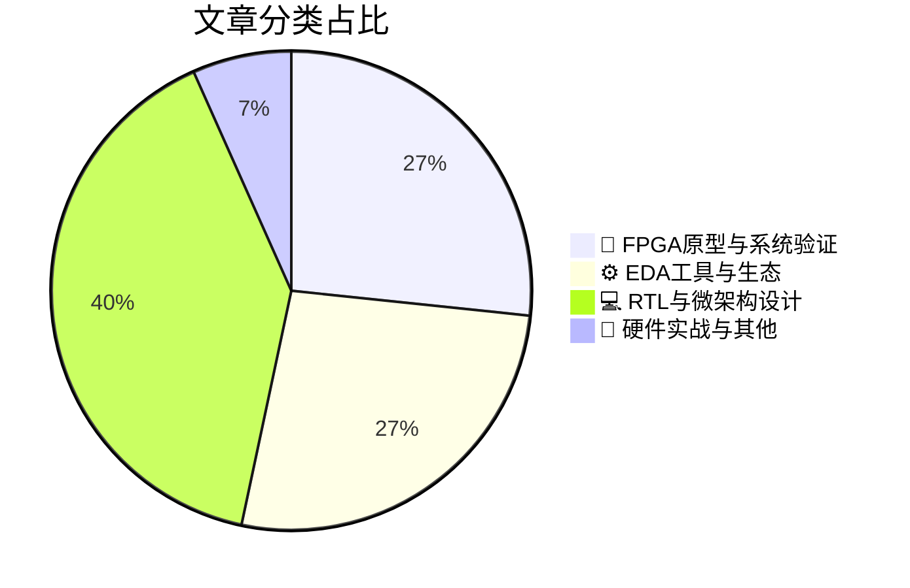

# 🛠️ FPGA / 验证技术精选

> 生成时间：2026-03-16 03:03:47 | 数据范围：过去 96 小时

## 📝 行业视点

当前硬件验证领域呈现三大技术趋势：**Agentic AI正从辅助工具演进为RTL验证流程的自主决策主体**，通过LLM驱动的testbench生成与覆盖率导向的强化学习算法，重构传统基于UVM的验证方法论，实现验证收敛周期的数量级压缩；**面向边缘AI的超低电压IP定制与亚阈值域微架构设计**，正在推动验证流程建立涵盖功耗-性能-面积（PPA）的多维sign-off标准，要求形式化验证与物理-aware仿真在极端能效约束下保证功能完整性；**随着HBM4E存储带宽突破与Scale-Up/Scale-Out拓扑的复杂度激增**，基于FPGA的原型验证与NoC形式化验证（如nocProve）成为应对AI加速器系统级验证空间爆炸的关键路径。上述趋势共同指向验证左移（Shift-Left）策略的深化，要求从架构探索阶段即介入虚拟原型与硬件仿真的混合验证范式，以应对异构计算带来的数据流重构与时序收敛挑战。

---

## 🏆 深度必读 (Top 3)

### 1. [代码驱动：软件定义汽车的实战检验](https://www.eejournal.com/fish_fry/driving-the-code-where-the-rubber-meets-the-software-defined-road/)
**评分**: 8/10 | **分类**: 🔬 FPGA原型与系统验证 | **标签**: `FPGA Prototyping` `Software-Defined Architecture` `System-Level Debug` `HW/SW Co-verification`

> **💡 推荐理由**：对于正在从事或即将涉足汽车电子、自动驾驶芯片验证的团队，本文提供了从方法论到架构实施的完整指导。特别是在软硬件协同验证、虚拟到物理环境迁移以及CI/CD流程集成方面，能够帮助验证团队建立面向未来的SDV验证体系，有效缩短从算法开发到实车验证的周期。

**摘要**：
本文针对软件定义汽车（SDV）时代复杂软硬件协同验证的挑战，提出了代码驱动的验证方法论。文章深入探讨了如何从纯虚拟仿真环境平滑过渡到硬件在环（HIL）和实车测试阶段，解决了传统V型开发流程中软件验证滞后于硬件开发的痛点。作者详细阐述了基于连续集成/连续部署（CI/CD）的验证架构设计，以及如何通过代码优先策略在早期阶段发现软硬件接口缺陷。文章还探讨了数字化孪生技术与物理测试环境的融合方案，为应对自动驾驶系统海量场景验证需求提供了可扩展的架构思路。

### 2. [以人为本的智能体AI赋能RTL验证](https://semiengineering.com/human-centered-agentic-ai-comes-to-rtl-verification/)
**评分**: 7/10 | **分类**: ⚙️ EDA工具与生态 | **标签**: `Agentic AI` `Human-in-the-loop` `RTL Verification` `AI-assisted Productivity` `Verification Workflow`

> **💡 推荐理由**：验证团队应关注该文，因其提供了在保持验证质量可控的前提下，利用AI智能体自动化处理繁琐验证任务（如大规模回归结果筛选、失败用例根因分析）的实用方案。该方法既避免了完全自动化可能带来的验证盲区，又通过人机协作显著提升了复杂SoC验证项目的整体效率，特别适用于当前设计规模快速增长而验证资源有限的团队。

**摘要**：
文章提出了将Human-Centered Agentic AI（以人为本的智能体AI）融入RTL验证流程的新型架构，旨在解决传统验证中调试周期长、回归测试结果分析耗时以及覆盖率收敛缓慢等关键痛点。该方法论通过自主智能体实现测试激励生成、故障根因诊断和验证计划的自动化优化，同时保持'人在回路'（Human-in-the-Loop）的决策机制，确保关键验证节点仍由工程师把控。这种混合架构有效平衡了AI的自动化效率与人类专家的设计意图理解能力，显著减少了验证工程师在重复性日志分析和波形调试上的时间投入。文章还探讨了智能体与现有验证方法论（如UVM）的集成路径，以及如何通过持续学习提升验证智能体对特定设计领域的适应能力。

### 3. [重新思考边缘语音AI：一种实用的离线流水线架构](https://semiengineering.com/rethinking-voice-ai-at-the-edge-a-practical-offline-pipeline/)
**评分**: 7/10 | **分类**: 🔬 FPGA原型与系统验证 | **标签**: `Voice AI` `Edge Inference` `Pipeline Architecture` `FPGA Validation` `System Integration` `Low Power Design`

> **💡 推荐理由**：推荐验证团队阅读本文，因其提供了针对语音AI SoC的可验证架构范式：模块化边界清晰，便于搭建UVM分层验证环境；离线批处理特性简化了长序列音频激励的生成与比对；确定性的数据流控制降低了FPGA原型验证的调试难度；同时，文中对低功耗状态转换的验证策略对解决语音唤醒芯片的可靠性验证具有直接指导意义。

**摘要**：
本文针对边缘设备语音AI系统中始终在线(Always-On)架构带来的高功耗验证复杂性和长序列音频测试覆盖率不足等痛点，提出了一种事件驱动的离线流水线设计方案。该架构通过将语音活动检测(VAD)与后端语音识别(ASR)解耦，并引入基于缓冲区的批处理机制，显著降低了验证环境的搭建难度和仿真时间。文章详细阐述了模块化设计如何支持确定性数据流控制，解决了传统在线流水线中状态机验证的Corner Case爆炸问题。该方案特别优化了低功耗模式切换的验证策略，为资源受限环境下的端到端功能验证提供了可复用的参考架构。

---

## 📊 资讯分布与高频标签

## 📋 更多分类好文

### 💻 RTL与微架构设计

- [**边缘AI算力部署与验证**](https://semiengineering.com/ai-power-on-the-edge/) - *semiengineering.com* (7分)
  > 本文针对边缘AI芯片在功耗、性能与面积（PPA）严格约束下的验证挑战，提出了异构计算架构的系统性验证方案。文章重点解决了多核CPU/NPU/GPU协同工作时的数据一致性、内存带宽竞争以及动态电压频率调节（DVFS）对实时推理精度影响的验证痛点。通过构建基于UVM的混合验证平台，结合AI模型驱动的场景化测试用例生成方法，实现了对CNN/Transformer等网络在资源受限环境下的功能正确性与能效比验证。此外，文章还探讨了软硬件协同验证策略，包括编译器生成指令序列与硬件微架构的时序匹配问题，以及边缘场景下长时运行任务的稳定性验证架构设计。

- [**超低电压设计中的基础IP定制化方案**](https://semiengineering.com/customizing-foundation-ip-for-ultra-low-voltage-designs/) - *semiengineering.com* (7分)
  > 本文针对超低电压（Ultra-Low-Voltage）设计面临的关键挑战，阐述了如何通过定制基础IP（包括标准单元库、存储器和I/O）来缓解工艺偏差、降低噪声容限及解决时序闭合难题。文章深入分析了传统验证方法在接近阈值电压区域的局限性，提出了基于统计时序分析和多PVT角落的验证架构，以应对电压波动导致的时序失效和功能风险。作者详细讨论了定制单元库特性（如多沟道长度单元、专用寄存器）对验证覆盖率的影响，并介绍了针对读写余量（Read/Write Margin）和电压骤降（IR Drop）的专项验证策略。此外，文章还探讨了自适应电压调节（AVS）与动态电压缩放（DVS）架构下的验证方法学，确保IP在宽电压范围内的鲁棒性。通过建立超低电压特有的验证流程和签收标准，该方法有效解决了传统 sign-off 流程在亚阈值/近阈值区域的置信度不足问题。

- [**HBM4E树立AI内存带宽新标杆**](https://semiengineering.com/hbm4e-raises-the-bar-for-ai-memory-bandwidth/) - *semiengineering.com* (6分)
  > 本文深入分析了HBM4E技术通过提升数据传输速率和堆叠密度来满足AI加速器对极致内存带宽需求的技术演进路径。文章重点阐述了2048-bit超宽接口和更高时钟频率带来的信号完整性验证挑战，以及针对PHY/MAC层协议变更的UVM验证架构适配方案。针对HBM4E复杂的多通道并发访问机制和精细化的低功耗状态转换，提出了涵盖功能正确性、时序收敛和功耗分析的系统性验证方法论。此外，文章还探讨了Interposer和TSV（硅通孔）在系统级集成中的物理层验证难点，以及高温环境下的热管理验证策略设计。

- [**串行线调试（SWD）协议：面向Arm系统的高效调试接口**](https://semiengineering.com/serial-wire-debug-swd-protocol-efficient-debug-interface-for-arm-based-systems/) - *semiengineering.com* (6分)
  > 文章深入解析了Serial Wire Debug (SWD)协议的双线调试架构，阐述了其如何通过仅使用SWDIO和SWCLK两条信号线替代传统JTAG接口，从而显著降低引脚开销并提升调试效率。针对验证领域，文章重点解决了调试访问端口（DAP）中调试端口（DP）与访问端口（AP）分离架构的验证难点，包括协议层数据包格式解析、turnaround周期控制以及ACK响应机制的状态机验证挑战。文章还探讨了在多电源域和低功耗场景下保持调试连接性的架构设计问题，以及SWD与JTAG接口切换时的协议一致性验证方法。此外，文中对写操作优化（banked addressing）和调试传输的流水线机制分析，为验证团队构建高效的调试事务序列和性能验证方案提供了关键指导。

- [**Nvidia GB10 GPU架构解析与验证挑战分析**](https://chipsandcheese.com/p/analyzing-nvidia-gb10s-gpu) - *chipsandcheese.com* (6分)
  > 本文深入剖析了Nvidia GB10的Grace-Blackwell异构架构，重点解决了Chiplet集成设计中NVLink-C2C互连协议的跨die时序收敛与缓存一致性验证难题。文章详细阐述了Blackwell架构新型Tensor Core支持FP4/FP6低精度格式的功能验证策略，以及针对LPDDR5X高速内存接口的信号完整性与协议一致性测试方法。针对复杂SoC的验证规模挑战，作者提出了基于虚拟原型和硬件仿真协同的分层验证架构，有效解决了多时钟域切换和功耗状态转换的覆盖率收集问题。此外，文章还探讨了AI工作负载特性对验证环境搭建的影响，提供了大规模并行计算单元在仿真加速中的优化方案。

- [**网络研讨会：超越数据浪潮——为何我们必须跟上即将来袭的400%数据激增**](https://semiwiki.com/eda/yieldwerx/367393-outrunning-the-data-wave-why-we-need-to-keep-pace-with-the-coming-400-data-surge/) - *semiwiki.com* (5分)
  > 随着数据量即将激增400%，传统验证架构面临仿真周期延长、存储成本飙升及调试效率骤降的严峻挑战。本文深入剖析了数据洪流对IC/FPGA验证流程的冲击，特别是海量测试数据管理、回归测试吞吐量瓶颈以及覆盖率收敛效率等核心痛点。文章提出了基于分布式验证架构、云原生弹性计算资源及智能数据压缩算法的系统性解决方案，以维持验证节奏与数据增长的同步。通过引入AI驱动的测试选择策略和实时数据分析流水线，验证团队能够在不牺牲质量的前提下显著缩短上市时间。最后，研讨会探讨了面向未来的可扩展验证基础设施设计范式，确保验证能力能够随数据规模线性扩展而非指数级成本增长。

### ⚙️ EDA工具与生态

- [**Axiomise推出nocProve，变革片上网络（NoC）设计验证**](https://semiwiki.com/semiconductor-services/axiomise/367412-axiomise-introduces-nocprove-to-transform-noc-design-verification/) - *semiwiki.com* (7分)
  > 针对NoC设计中并发路由仲裁逻辑复杂、死锁/活锁验证困难及传统仿真难以覆盖状态空间爆炸等核心痛点，Axiomise推出了基于形式化验证的nocProve解决方案。该工具通过数学证明自动验证路由算法正确性、无死锁特性及流量公平性，系统性解决了大规模互连网络在极端边界场景下的验证不完备问题。nocProve支持在架构设计阶段早期介入，无需编写大量定向测试即可穷举验证 corner cases，显著提升复杂SoC互连的验证效率与 sign-off 信心。该方案特别适用于多核处理器、AI加速器及车规级芯片中对功能安全要求极高的NoC验证场景。

- [**代理式AI与工程的未来**](https://semiwiki.com/eda/synopsys/367466-agentic-ai-and-the-future-of-engineering-synopsys-keynote/) - *semiwiki.com* (6分)
  > 本文探讨了Agentic AI如何通过自主智能体架构重塑IC/FPGA验证流程，解决传统方法中验证空间爆炸、人工调试效率低下及跨层次验证碎片化等核心痛点。文章提出了基于多代理协作的验证范式，其中规划代理自动生成分层验证策略，执行代理动态调整激励生成与覆盖率收敛，而分析代理实现智能故障定位与根因分析。该架构突破了传统脚本驱动验证的局限性，实现了从规格到覆盖率报告的端到端自动化，显著缩短了复杂SoC的验证周期。特别针对当前多核异构芯片的验证挑战，Agentic AI能够自主协调仿真、形式验证与硬件加速等多平台资源，构建自适应验证环境。这种范式转变使验证工程师从繁琐的测试编码中解放出来，专注于架构设计与验证策略制定，最终提升验证质量并降低项目风险。

- [**三企合一链：TASKING 3.0统一工具链的崛起**](https://www.eejournal.com/article/three-companies-one-toolchain-the-rise-of-tasking-3-0/) - *eejournal.com* (5分)
  > 本文阐述了TASKING 3.0通过整合Altium、Aubo和Tasking三家公司的技术资源，构建端到端统一开发验证工具链的架构革新。针对当前嵌入式软件验证中多供应商工具碎片化、脚本环境不兼容及功能安全合规性难以追溯等痛点，该方案实现了从需求管理到代码生成的全流程整合。文章重点分析了统一工具链在多核处理器调试、ISO 26262功能安全验证及软硬件协同仿真中的架构优势，解决了验证环境配置复杂性和跨团队数据断层问题。通过单一工具链覆盖编译、调试与静态分析，显著降低了验证脚本维护成本并提升了回归测试效率。该架构特别适用于汽车电子SoC的复杂验证场景，为软硬件协同验证提供了标准化数据接口。

### 📝 硬件实战与其他

- [**CPO技术正在拓展AI数据中心的可能性边界**](https://semiengineering.com/cpo-is-extending-the-limits-of-whats-possible-in-ai-data-centers/) - *semiengineering.com* (6分)
  > 本文探讨了共封装光学（CPO）技术在AI数据中心高带宽、低功耗需求下的架构创新与验证挑战。文章指出了光电异构集成带来的核心验证痛点，包括光电混合信号协同仿真、高密度封装下的信号完整性（SI）与电源完整性（PI）分析、以及热-电-光多物理场耦合的可靠性验证难题。针对这些挑战，作者提出了系统级封装（SiP）验证方法论，涵盖从光子集成电路（PIC）到电子集成电路（EIC）的接口验证、基于先进封装的可测试性设计（DFT）架构，以及面向224G/lane高速SerDes的端到端链路验证策略。文章还讨论了CPO架构中光学引擎与交换芯片（ASIC）的协同设计流程，强调了在系统级验证环境中对光损耗预算、热管理约束和制造良率进行早期建模的重要性，为解决超大规模AI集群的互连带宽瓶颈提供了可行的验证路径。

### 🔬 FPGA原型与系统验证

- [**纵向扩展与横向扩展迎来新伙伴**](https://semiengineering.com/scale-up-scale-out-get-a-new-partner/) - *semiengineering.com* (6分)
  > 随着数字芯片设计复杂度指数级增长，传统依赖Scale-Up（单机硬件升级）和Scale-Out（分布式集群扩展）的验证架构面临资源利用率低、成本高昂及调度僵化等挑战。文章提出引入云原生弹性计算或智能硬件仿真资源池作为第三种扩展维度，构建混合验证架构，实现验证资源的动态按需分配与负载均衡。该方案解决了超大规模设计验证中的峰值算力需求与低谷期资源闲置的矛盾，通过将本地数据中心与云端资源无缝集成，显著缩短回归测试周期并降低总体拥有成本（TCO）。新的架构模式特别针对现代AI芯片和多核处理器验证中的并行度需求与数据密集型仿真场景，提供了更具弹性的算力供给策略。

- [**Xanadu与AMD合作加速量子计算在航空航天和工程领域的应用**](https://www.eejournal.com/industry_news/xanadu-and-amd-accelerate-quantum-computing-for-aerospace-and-engineering/) - *eejournal.com* (5分)
  > Xanadu与AMD合作构建了基于FPGA/ACAP的量子计算硬件加速架构，解决了量子电路模拟中状态空间指数级爆炸（2^n复杂度）导致的传统软件仿真性能瓶颈与验证周期过长问题。针对航空航天领域对实时量子纠错（QEC）和控制系统的严苛确定性要求，该方案设计了异构计算验证平台，攻克了量子-经典混合接口的协议一致性、纳秒级时序收敛及量子噪声建模等验证难题。通过AMD的可编程逻辑器件实现硬件在环仿真，实现了对百万级量子门操作的高吞吐量并行验证，显著缩短了复杂量子算法在工程应用中的功能验证周期。该架构创新性地将自适应计算加速平台用于量子态制备和测量的实时反馈控制回路验证，为超大规模量子系统的混合信号验证提供了可扩展的参考架构。

