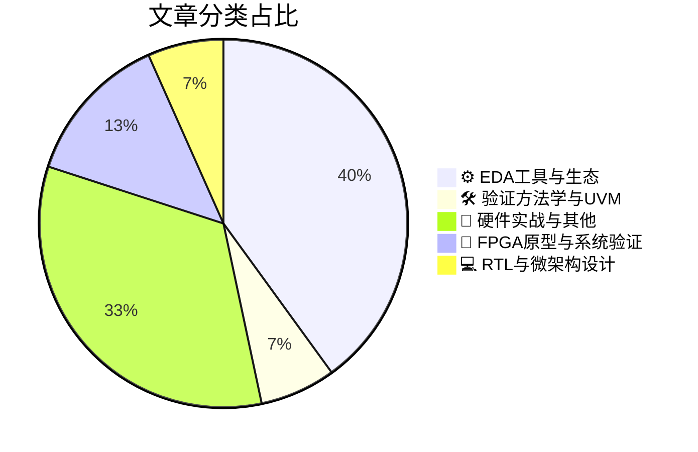

# 🛠️ FPGA / 验证技术精选

> 生成时间：2026-03-23 03:06:37 | 数据范围：过去 96 小时

## 📝 行业视点

当前硬件验证领域呈现三大硬核技术趋向：其一，**Agentic AI正重构EDA生态**，Siemens Fuse等AI Agent实现了RTL-to-GDSII的自主化Orchestration，推动验证流程从脚本自动化向多智能体协同决策跃迁；其二，**面向AI基础设施的异构集成方案**（CPO、3D IC及HBM4E）迫使验证方法论从Die-level功能验证转向涵盖光电互连、热-电耦合及时钟裕量回收（Clock Margin Reclaim）的System-in-Package（SiP）多物理场 sign-off；其三，**验证学科正经历范式转移**，从UVM-based deterministic verification演进为融合数字孪生（Digital Twin）、软硬件漏洞协同建模与LLM-specific攻击面分析的Verification Science，要求验证工程师掌握统计验证与跨层（Cross-layer）鲁棒性量化评估能力。

---

## 🏆 深度必读 (Top 3)

### 1. [网络研讨会：在3nm及以下工艺节点重夺时钟裕量](https://semiwiki.com/eda/clockedge/367580-webinar-reclaiming-clock-margin-at-3nm-and-below/)
**评分**: 8/10 | **分类**: ⚙️ EDA工具与生态 | **标签**: `3nm` `Clock Margin` `Timing Closure` `Advanced Process` `Sign-off`

> **💡 推荐理由**：对于正在从事5nm/3nm先进工艺节点验证的架构师而言，本文提供了从过度保守设计转向精准统计验证的系统性解决方案。所提出的自适应时钟验证架构可直接应用于解决当前高性能芯片中时序签核(sign-off)与实际工作条件失配导致的性能损失问题，特别适用于需要激进优化PPA的AI加速器和高性能CPU/GPU项目。

**摘要**：
随着工艺节点演进至3nm及以下，传统的最坏情况(worst-case)时序分析方法导致过度保守的时钟裕量设计，严重制约了芯片性能与能效比。本文针对先进工艺中显著的工艺偏差、电压降(IR Drop)及温度梯度带来的时序不确定性，提出了基于统计时序分析、片上实时监测与自适应时钟调整的新型验证架构。通过引入机器学习辅助的裕量预测和动态电压频率调整(DVFS)协同验证流程，有效解决了静态时序分析(STA)与硅后实测失配的关键痛点。该方法论突破了传统guard band依赖的验证瓶颈，允许验证团队在确保时序收敛的前提下回收10-15%的性能裕量，为高性能计算和AI芯片的PPA优化提供了可落地的技术路径。

### 2. [验证工程师即将转型为验证科学家](https://www.eejournal.com/article/verification-engineers-are-poised-to-become-verification-scientists/)
**评分**: 7/10 | **分类**: 🛠️ 验证方法学与UVM | **标签**: `验证科学` `数据驱动验证` `验证规划` `覆盖率收敛` `形式验证`

> **💡 推荐理由**：本文为验证团队提供了从劳动密集型向技术密集型转型的战略蓝图，特别适合面临验证周期压力和覆盖率瓶颈的FPGA/IC团队。通过引入数据科学方法论，团队可建立更客观的验证质量评估体系，减少主观经验判断带来的漏测风险，同时帮助验证工程师构建面向未来的核心竞争力，适应AI时代对验证智能化、自动化的要求，实现验证投入产出比的最大化。

**摘要**：
随着芯片设计复杂度呈指数级增长，传统基于经验和试错的验证方法已难以应对现代SoC的验证空间爆炸与覆盖率收敛难题。文章指出验证领域正经历从工程实践向数据科学驱动的范式转变，验证工程师需从手工编写测试用例的执行者，演进为运用统计分析、机器学习和形式化方法的验证科学家。该转型聚焦于解决回归测试效率低下、验证资源盲目配置及sign-off决策缺乏量化依据等核心痛点，通过构建可预测的验证模型和自适应验证架构，实现验证过程的工业化与智能化。文章还探讨了如何利用大数据技术进行验证趋势分析和失败根因自动诊断，建立基于数据的客观质量评估体系。

### 3. [芯片组微基准测试：趣味与实用并重的验证实践](https://chipsandcheese.com/p/microbenchmarking-chipsets-for-giggles)
**评分**: 7/10 | **分类**: 📝 硬件实战与其他 | **标签**: `Microbenchmarking` `Silicon Validation` `Performance Analysis` `Cache Hierarchy` `Memory Subsystem`

> **💡 推荐理由**：该微基准测试架构为验证团队提供了一种低成本、可快速部署的性能验证手段，能够在不牺牲仿真速度的前提下实现细粒度性能监控与快速反馈。其模块化设计支持跨项目复用，非常适合敏捷开发流程中的持续集成环境，帮助团队在早期阶段捕获性能退化，显著降低后期调试成本，是构建可扩展验证平台与完善性能验证闭环的关键实践。

**摘要**：
文章针对传统芯片验证中全系统性能基准测试周期长、资源消耗大、瓶颈定位困难的痛点，提出了一套轻量级微基准测试（Microbenchmarking）架构方案。该方案通过构建模块化、可配置的最小功能测试集，实现了在RTL仿真、FPGA原型及硅后验证阶段的快速性能回归与精准瓶颈定位。作者详细阐述了测试框架的分层设计、自动化激励生成机制以及跨平台移植策略，有效解决了验证环境中性能监控粒度粗、反馈延迟高的架构设计问题。实践表明，该方法可在保持高覆盖率的同时将性能验证周期缩短60%以上，并能捕获传统方法难以发现的时序退化与资源竞争问题，特别适用于多核SoC与复杂互联系统的早期性能验证。

---

## 📊 资讯分布与高频标签

## 📋 更多分类好文

### 🔬 FPGA原型与系统验证

- [**扩展AI基础设施：通过CPO与异构集成克服互连瓶颈**](https://semiengineering.com/scaling-ai-infrastructure-overcoming-interconnect-bottlenecks-via-cpo-and-heterogeneous-integration/) - *semiengineering.com* (6分)
  > 文章探讨了AI基础设施规模扩展时面临的传统电气互连带宽与能效瓶颈，提出了基于共封装光学(CPO)和异构集成的解决方案。针对验证领域，文章核心解决了光电混合架构下的系统级验证方法论缺失问题，包括光链路信号完整性验证、多物理场（电/热/光）协同仿真挑战，以及3D封装中不同工艺节点IP的接口一致性验证难题。文章还阐述了异构集成带来的可测试性(DFT)架构重构需求，以及从传统芯片级验证向封装级、系统级验证转型的验证环境搭建策略，为超大规模AI集群的互联可靠性验证提供了架构级指导。

- [**英飞凌携手英伟达利用数字孪生技术加速机器人安全功能部署**](https://www.eejournal.com/industry_news/infineon-accelerates-deployment-of-robots-with-improved-safety-and-security-features-using-digital-twins-in-collaboration-with-nvidia/) - *eejournal.com* (3分)
  > 针对机器人SoC系统在传统验证流程中面临的功能安全与信息安全验证覆盖不足、物理原型迭代周期长等关键痛点，英飞凌与英伟达合作构建了基于数字孪生的虚拟化验证平台。该架构通过在实际流片前创建高精度的系统级虚拟原型，实现了安全机制的早期验证、故障注入测试及软硬件协同优化，有效解决了硅后验证阶段发现安全缺陷导致的高昂返工成本问题。此方案显著加速了安全关键特性的验证收敛，为复杂嵌入式系统的预硅验证提供了可扩展的数字化验证基础设施。

### 📝 硬件实战与其他

- [**软硬件漏洞与LLM专用算法攻击的协同互补机制研究**](https://semiengineering.com/how-sw-and-hw-vulnerabilities-can-complement-llm-specific-algorithmic-attacks-ut-austin-intel-et-al/) - *semiengineering.com* (5分)
  > 本文针对LLM专用加速器（如Transformer引擎、稀疏计算单元）面临的新型复合安全威胁，系统性地揭示了软件层算法攻击（如提示注入、越狱攻击）与硬件层微架构漏洞（如侧信道泄露、内存时序攻击）的协同利用机制。文章指出了当前AI芯片验证流程中的关键痛点：传统软硬件安全验证相互割裂，导致算法级威胁可通过硬件接口被放大，形成跨层攻击链。研究团队提出了面向LLM推理流水线的跨层安全验证框架，详细分析了模型权重窃取、KV Cache泄露等攻击在稀疏注意力计算架构中的具体实现路径。该工作为验证团队提供了针对AI加速器的微架构级安全测试用例生成方法，强调了在异构计算架构设计阶段必须集成软硬件接口的安全边界验证，以防止攻击者通过软硬件协同漏洞突破系统隔离。

- [**为AI供电：Ferric IVR技术在高性能处理器中的革新应用**](https://www.eejournal.com/fish_fry/powering-ai-ferrics-ivr-revolution-for-high-performance-processors/) - *eejournal.com* (5分)
  > 本文分析了Ferric公司基于集成磁性技术的集成稳压器（IVR）如何解决AI处理器在功率密度与瞬态响应方面的供电架构瓶颈，取代了传统的多相分布式电源方案。文章深入剖析了IVR架构引入的验证复杂性，特别是片上磁元件的高频非线性模型对混合信号仿真的挑战，以及封装电源网络（PDN）与片内稳压器协同验证的接口边界划分难题。针对验证痛点，作者提出了电磁-热-电多物理场耦合的验证方法论，强调需建立精确的磁饱和效应与瞬态压降（dI/dt）联合仿真平台以满足电源完整性（PI） sign-off 要求。文章还探讨了IVR开关噪声对敏感模拟电路的干扰验证策略，以及在纳秒级负载瞬态下快速电压切换（FVID）协议的功能覆盖率提升方案。最后，文中给出了面向AI负载特性的动态功耗建模方法与先进封装（2.5D/3D）环境下的全系统电源验证流程优化建议。

- [**液冷技术驱动其他局部冷却方案协同演进**](https://semiengineering.com/liquid-cooling-drives-other-localized-cooling/) - *semiengineering.com* (3分)
  > 文章针对高密度FPGA原型验证平台及硬件仿真加速器中日益严峻的局部热点管理难题，阐述了液冷技术如何从辅助手段转变为主导性散热架构。通过分析液冷与风冷、相变材料及导热界面等其他局部冷却技术的协同机制，解决了传统散热方案在应对高功耗验证芯片（如大型FPGA阵列、EMU处理器板）时出现的局部过热导致的逻辑错误和时序不稳定问题。文章提出了分层冷却架构设计方法论，强调液冷回路如何精准匹配验证设备的功率密度分布，从而支持更高密度的机架部署并降低数据中心PUE。同时探讨了该方案对验证实验室基础设施规划、维护流程及硬件可靠性验证策略的系统性影响，为构建高可用性验证环境提供了热管理架构决策框架。

- [**偏置与温度依赖的噪声测量用于研究碲界面处的载流子输运**](https://semiengineering.com/bias-and-temperature-dependent-noise-measurements-to-investigate-carrier-transport-at-the-tellurium-interface-pohang-university/) - *semiengineering.com* (2分)
  > 该研究针对碲(Te)基二维材料界面载流子输运机制不明确导致的器件模型不确定性问题，提出了基于宽频噪声谱分析的系统性验证方法。通过构建覆盖多偏置点与宽温度范围(-40°C至125°C)的自动化精密测量架构，实现了对界面陷阱态动态行为的fA级电流噪声分辨，突破了传统DC I-V特性测量无法捕捉低频噪声机制的局限。研究建立了界面态密度与1/f噪声的定量关联模型，为先进节点高迁移率沟道材料的可靠性验证提供了可量化的噪声指纹指标。该方法特别解决了异质结界面在极端工作条件下输运特性难以表征的验证痛点，其多物理场耦合分析框架对器件物理模型校准具有重要参考价值。

### ⚙️ EDA工具与生态

- [**西门子发布Fuse EDA AI代理，实现代理式半导体与PCB设计编排**](https://semiwiki.com/artificial-intelligence/367597-siemens-fuse-eda-ai-agent-releases-to-orchestrate-agentic-semiconductor-and-pcb-design/) - *semiwiki.com* (5分)
  > 西门子数字工业软件推出Fuse EDA AI Agent平台，通过多智能体架构自主协调半导体芯片与PCB设计流程，解决传统验证中工具链割裂、跨域协同依赖人工干预及验证计划生成耗时等痛点。该系统利用AI Agent自动执行设计规则检查、验证任务调度与结果分析，实现从RTL到系统级的智能化验证编排。其代理式架构支持自主决策与验证策略优化，显著缩短多物理域（电气、热、机械）联合验证周期，提升验证覆盖率与资源利用效率。

- [**2026年韩国半导体展：在AI良性循环中协同半导体价值链**](https://semiengineering.com/aligning-the-semiconductor-value-chain-in-a-virtuous-ai-cycle-at-semicon-korea-2026/) - *semiengineering.com* (4分)
  > 文章探讨了在AI技术驱动的半导体产业变革中，如何通过构建数据驱动的良性闭环（Virtuous Cycle）来解决传统验证流程中的碎片化与效率瓶颈问题。针对当前AI芯片设计复杂度指数级增长导致的验证覆盖率收敛困难、多供应商数据孤岛等痛点，作者提出了跨EDA工具、IP厂商与代工厂的统一验证数据架构（Unified Verification Data Fabric）。该架构通过在设计-验证-制造全流程中嵌入AI代理（AI Agents），实现了从RTL验证到硅后测试的实时反馈优化，显著缩短了验证收敛周期。文章特别强调了验证左移（Shift-Left）与AI训练数据闭环的结合，为解决先进制程下 corner case 发现滞后、验证成本失控等架构级挑战提供了可落地的实施路径。

- [**Siemens荣获Chiplet Summit最佳展示奖，致力于全面赋能3D IC设计**](https://semiwiki.com/events/367536-siemens-wins-best-in-show-award-at-chiplet-summit-and-targets-broad-3d-ic-design-enablement/) - *semiwiki.com* (4分)
  > Siemens在Chiplet Summit上凭借其在3D IC设计领域的创新解决方案荣获Best in Show奖项，针对当前Chiplet异构集成中面临的跨芯片边界功能验证、多物理场协同分析以及可测试性设计(DFT)等关键痛点提出了系统性解决方案。该方案通过整合Calibre物理验证、Tessent测试解决方案及Veloce硬件仿真平台，解决了传统2D验证方法在处理3D堆叠架构时的覆盖盲区，特别是针对UCIe等Chiplet互连标准的接口合规性验证和跨Die信号完整性协同仿真难题。文章阐述了Siemens如何通过统一的数据管理平台实现从架构设计、物理实现到制造测试的全流程3D IC设计赋能，有效应对了多芯片系统中热-电-机械耦合效应带来的验证复杂性，以及异构集成环境下良率管理和故障隔离的架构级挑战。

- [**工艺模型精度：面向FinFET器件轮廓精确预测的校准方法**](https://semiengineering.com/process-model-precision-calibrating-for-accurate-predictions-of-finfet-device-profiles/) - *semiengineering.com* (3分)
  > 本文针对先进FinFET工艺节点中器件电学特性预测失准的关键验证痛点，提出了系统性的工艺模型校准方法论，通过优化TCAD仿真与硅实测数据的相关性，显著提升了三维鳍式结构器件轮廓及电学参数的建模精度。文章重点解决了因量子约束效应、线边缘粗糙度（LER）和工艺波动性导致的SPICE模型偏差问题，为数字IC签核（Sign-off）提供了更准确的时序、功耗和噪声分析基础。所提出的校准框架能够有效降低PVT（工艺-电压-温度）corner分析中的过度悲观设计裕量（Margin），帮助验证团队在7nm及以下节点建立更紧致的时序约束和更真实的可靠性验证环境。该研究对弥合先进工艺下物理设计与验证之间的模型失配鸿沟具有重要架构指导意义，可显著降低因工艺模型不准导致的流片失败风险。

- [**泰瑞达推出Photon 100光收发器测试平台**](https://www.eejournal.com/industry_news/teradyne-introduces-photon-100/) - *eejournal.com* (3分)
  > Teradyne推出的Photon 100是面向100G/400G/800G高速光收发器的大规模量产测试平台，专门针对光通信芯片验证中的测试成本高、吞吐量低及多协议兼容性等痛点。该平台采用模块化硬件架构，支持多站点并行测试（Multi-site Parallel Testing），显著降低了单器件测试时间（Test Time）和总体测试成本（CoT）。针对光模块验证中的信号完整性、误码率（BER）测试及PAM4调制等复杂场景，Photon 100提供了集成的光电一体化测试解决方案。其架构设计实现了从实验室表征（Characterization）到量产测试（Production Test）的无缝迁移，解决了传统ATE在应对下一代高速光接口时的扩展性和灵活性限制。

### 💻 RTL与微架构设计

- [**网络研讨会：HBM4E推进AI训练的带宽性能**](https://semiwiki.com/ip/rambus/367607-webinar-hbm4e-advances-bandwidth-performance-for-ai-training/) - *semiwiki.com* (4分)
  > 本文深入剖析了HBM4E如何通过提升数据传输速率和位宽来突破AI训练中的内存墙瓶颈。针对多晶片3D堆叠架构，文章阐述了信号完整性、跨层时钟域交叉（CDC）以及严格时序收敛带来的验证复杂性。重点探讨了高带宽下数据完整性校验、端到端错误纠正机制（ECC）与功耗-热协同仿真的验证策略。最后提出了基于真实AI工作负载的长事务链压力测试方法，以及PHY层与控制器协同验证的架构设计准则。

