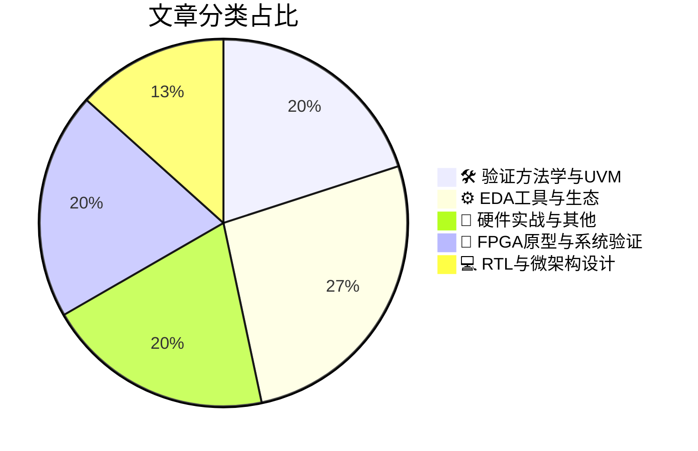

# 🛠️ FPGA / 验证技术精选

> 生成时间：2026-03-30 03:12:07 | 数据范围：过去 96 小时

## 📝 行业视点

AI驱动的验证左移（Shift-Left）与硬件辅助验证（HAV）正重构预硅验证范式，通过机器学习优化约束随机验证（CRV）收敛与形式化属性生成，结合Emulation和FPGA原型实现软件定义验证闭环，以应对AGI芯片的验证吞吐量瓶颈。功能安全与硬件安全的协同验证（Safety-Security Co-Verification）成为汽车电子与基础设施芯片的刚需，基于错误传播理论的FMEDA定量分析与预硅威胁建模（Threat Modeling）深度融合，构建覆盖ISO 26262和ISO/SAE 21434标准的统一验证框架。3D异构集成与Chiplet架构推动验证重心向系统级转移，eFPGA作为硅后可重构"保险"机制与嵌入式传感器功能监控（Functional Monitoring）结合，构建覆盖多Die互连一致性、内存墙瓶颈与近存计算（Near-Memory Computing）架构的全生命周期可观测性（Observability）基础设施。

---

## 🏆 深度必读 (Top 3)

### 1. [将错误传播理论整合至FMEDA框架中](https://semiengineering.com/integrating-error-propagation-theory-into-the-fmeda-framework-robert-bosch-gmbh/)
**评分**: 8/10 | **分类**: 🛠️ 验证方法学与UVM | **标签**: `FMEDA` `Error Propagation` `Functional Safety` `ISO 26262` `Fault Injection`

> **💡 推荐理由**：对于从事汽车电子及功能安全验证的团队，本文提供了突破传统FMEDA局限性的系统性方法论，通过引入错误传播理论的定量分析能力，能够有效解决安全机制过度设计、诊断覆盖率计算不精确等实际工程难题，是提升ISO 26262合规验证效率与硬件架构优化能力的必读文献。

**摘要**：
本文针对传统FMEDA（故障模式、影响及诊断分析）方法在建模错误传播机制时存在的精度不足问题，提出了将错误传播理论系统性整合到FMEDA框架的解决方案。通过建立定量化错误传播模型，该方法能够更准确地评估故障在系统组件间的级联效应及共因失效影响，解决了传统方法中安全机制设计过于保守或覆盖不足的关键痛点。文章详细阐述了如何基于错误传播动力学改进硬件架构的安全指标计算（如SPFM、LFM），实现了从静态故障分析向动态传播行为建模的范式转变。这一集成框架不仅提升了ISO 26262功能安全分析的置信度，还为复杂SoC和汽车电子系统的诊断策略优化与硬件安全完整性等级（ASIL）评估提供了更精确的工程决策依据。

### 2. [验证左移：利用AI工具实现更快速、更智能的芯片设计](https://semiengineering.com/shift-verification-left-ai-tools-for-faster-smarter-chip-design/)
**评分**: 8/10 | **分类**: ⚙️ EDA工具与生态 | **标签**: `Shift Left` `AI Verification` `Intelligent Debug` `Coverage Closure` `ML-based Verification`

> **💡 推荐理由**：对于面临验证空间爆炸和上市时间压力的验证团队，本文提供了从脚本驱动向AI驱动验证平台演进的清晰架构路径，能够帮助团队建立早期缺陷预防机制，降低后期调试成本，特别适合负责验证策略规划与自动化平台建设的架构师及技术负责人参考。

**摘要**：
本文探讨了如何通过AI驱动的验证左移策略解决传统芯片验证流程中晚期发现缺陷成本高昂、回归测试迭代周期过长及覆盖率收敛难以预测等核心痛点。文章详细阐述了基于机器学习的智能测试生成、覆盖率预测性分析以及自动根因定位的架构实现方案，提出了将AI验证代理集成至RTL编码阶段和早期仿真环境的流程重构方法。通过构建数据驱动的验证闭环架构，该方法能够在设计初期自动识别高风险边界条件，优化激励生成策略，显著压缩从IP级到系统级的验证收敛时间。文中还分析了AI辅助形式验证在状态空间爆炸问题上的创新应用，以及验证团队向智能化验证架构转型所需的基础设施与方法论调整。

### 3. [多GPU大语言模型推理中CPU诱导减速的系统性分析](https://semiengineering.com/systematic-analysis-of-cpu-induced-slowdowns-in-multi-gpu-llm-inference-georgia-tech/)
**评分**: 7/10 | **分类**: 📝 硬件实战与其他 | **标签**: `Multi-GPU` `LLM Inference` `CPU Bottleneck` `System Architecture` `Performance Profiling`

> **💡 推荐理由**：该研究对数字IC/FPGA验证团队在异构计算系统级验证（SoC Level Verification）中具有重要参考价值，特别是在多核CPU与GPU/NPU协同工作的场景下，提供了识别和量化CPU瓶颈的系统化方法。验证团队可借鉴其性能分析框架来完善性能验证计划（Performance Verification Plan），优化CPU-GPU接口的验证策略，并在FPGA原型验证阶段建立有效的性能基准（Performance Benchmark），确保硬件加速单元与主机控制逻辑的协同优化。

**摘要**：
本文系统性地分析了多GPU大语言模型推理系统中CPU成为性能瓶颈的根本原因，识别了CPU在请求调度、KV缓存管理和GPU同步控制等关键环节引入的延迟开销。研究揭示了传统以GPU算力为核心的优化策略往往忽视CPU侧处理能力不足导致的系统级性能衰减，提出了基于细粒度事件追踪的CPU-GPU协同性能分析框架。该工作为异构计算架构中的软硬件接口验证、系统级性能瓶颈定位以及调度算法硬件加速需求评估提供了量化方法论，对多芯片系统集成验证中的性能sign-off具有重要指导意义。

---

## 📊 资讯分布与高频标签

## 📋 更多分类好文

### 🔬 FPGA原型与系统验证

- [**面向3D多芯片设计的IP需求演进**](https://semiengineering.com/ip-requirements-evolve-for-3d-multi-die-designs/) - *semiengineering.com* (7分)
  > 随着3D堆叠和芯粒(Chiplet)架构成为突破摩尔定律限制的关键路径，传统单芯片IP验证方法面临跨 die 边界验证、互连接口一致性及系统级协同仿真的重大挑战。文章深入剖析了多物理场耦合（电热机械）对IP接口时序的影响，以及UCIe等芯粒间互联标准在物理层和协议层验证的新要求。针对验证流程碎片化问题，提出了分层验证架构，涵盖裸片级(Die-level)独立验证、中介层/封装级互连验证及系统级集成验证的三阶段方法论。特别强调了边界扫描(Boundary Scan)、内建自测试(BIST)向3D架构的扩展，以及数字孪生(Digital Twin)在预硅验证阶段对多 die 热管理和信号完整性的预测性验证价值。最后探讨了可复用IP在异构集成环境中的适配性验证策略，为解决跨工艺节点IP集成带来的时序和功耗闭环验证难题提供了架构级指导。

- [**利用传感器与功能监控实现检测、诊断与调试**](https://semiengineering.com/detect-diagnose-and-debug-using-sensors-and-functional-monitoring/) - *semiengineering.com* (7分)
  > 文章针对传统数字IC验证中硅后可见性不足、难以捕获间歇性故障及现场异常根因定位困难等痛点，提出了一种基于嵌入式传感器与功能监控器的可观测架构设计方法。该方案通过在关键逻辑节点部署轻量级硬件监控单元，构建覆盖检测（实时异常捕获）、诊断（精准根因定位）到调试（修复验证）的三层闭环体系。相比传统扫描链或逻辑分析仪，该架构显著提升了硅后验证与现场故障分析的效率，同时兼顾面积与功耗开销。文章详细阐述了传感器网络的设计原则、功能监控的覆盖率优化策略，以及如何将监控数据与验证平台集成以实现自动化诊断。该方法特别适用于复杂SoC、AI加速器和汽车电子等对可靠性要求严苛的场景，有效缩短了从故障发现到修复的周期。

- [**AI工作负载正将数据中心网络转变为融合内存与存储的架构**](https://semiengineering.com/ai-workloads-are-turning-the-data-center-network-into-a-combined-memory-and-storage-fabric/) - *semiengineering.com* (6分)
  > 文章分析了AI大模型训练对内存容量与带宽的极致需求如何推动数据中心网络从传统分离式架构向融合内存与存储的统一Fabric演进，涉及CXL、NVMe-oF等协议的深度协同与计算/内存资源池化解耦。这一转变带来了关键的验证挑战：跨协议域的缓存一致性（Coherency）验证、极低延迟约束下的数据完整性保证，以及异构计算节点间动态内存分配的场景覆盖。文章进一步探讨了此类融合架构对验证环境协议栈建模、系统级性能边界测试和故障注入策略提出的全新要求。验证团队需特别关注内存语义与存储语义转换边界的功能正确性，以及池化资源调度场景下的竞争条件（Race Condition）检测。

### 💻 RTL与微架构设计

- [**硅保险：为何eFPGA比重流片更便宜——以及在Intel 18A时代的重要性**](https://semiwiki.com/efpga/367629-silicon-insurance-why-efpga-is-cheaper-than-a-respin-and-why-it-matters-in-the-intel-18a-era/) - *semiwiki.com* (7分)
  > 文章论证了在Intel 18A等先进工艺节点下，采用eFPGA作为'硅保险'的架构策略，能有效解决硅后验证阶段发现设计缺陷或接口协议变更所导致的高昂重流片（respin）成本痛点。通过在SoC中集成嵌入式可编程逻辑，eFPGA允许团队在流片后通过固件更新修复硬件漏洞、适配新兴标准或调整关键接口，避免了传统固定逻辑ASIC数百万美元的重流片费用和数月的设计周期损失。这种架构特别针对先进制程掩膜成本激增、验证覆盖率难以达到100%以及后期需求变更频繁的验证挑战，提供了硬件级的可重构能力。文章指出，在Intel 18A等高成本工艺中，eFPGA的硅面积成本增量远小于潜在的重流片风险成本，是现代芯片验证架构中成本效益最优的风险对冲方案。

- [**内存墙持续攀升**](https://semiengineering.com/memory-wall-gets-higher/) - *semiengineering.com* (6分)
  > 随着先进制程下芯片设计规模突破百亿门，验证环境面临的内存墙（Memory Wall）瓶颈已从性能层面演变为架构级挑战——传统单体式验证平台中Scoreboard、Reference Model及Transaction Database的内存占用常导致仿真器OOM崩溃或运行速度断崖式下降。本文系统诊断了大规模SoC/AI芯片验证中内存容量受限、带宽竞争及数据局部性恶化等核心痛点，尤其指出了UVM方法学在处理海量数据流时的内存管理缺陷。针对这些问题，文章提出了基于分布式计算的验证架构解耦、稀疏内存建模（Sparse Memory Modeling）、以及分层存储与智能换页（Paging）等创新设计方案。进一步探讨了在硬件加速（Palladium/Protium）与云原生验证环境中，如何通过内存虚拟化与动态资源调度突破物理内存限制。这些架构级优化方法为验证团队提供了从算法层到系统层的完整内存优化路径，显著提升了超大规模设计的验证效率与平台可扩展性。

### 🛠️ 验证方法学与UVM

- [**DVCon US主题演讲：融合时代验证技术为何必须演进**](https://blogs.sw.siemens.com/verificationhorizons/2026/03/25/dvcon-us-keynote-why-verification-must-evolve-in-the-convergence-era/) - *blogs.sw.siemens.com* (7分)
  > 该主题演讲深入剖析了芯片设计进入“融合时代”后，传统验证方法学面临的系统性挑战。文章指出，随着AI芯片、Chiplet异构集成及软硬件深度融合的加速，验证复杂度已从模块级爆炸式增长至系统级，传统基于UVM的单一方法论难以应对多物理域、多时间尺度及场景化验证需求。演讲提出了验证架构必须从“组件验证”向“系统级验证”演进的核心观点，强调需要采用云原生验证基础设施、AI驱动的测试生成与覆盖率收敛技术，以及左移（Shift-Left）策略来应对上市时间压力。此外，文章还探讨了验证工程师角色从“测试用例开发者”向“系统架构师”转型的必要性，为解决当前验证投入占比过高但缺陷逃逸率仍居不下的行业痛点提供了战略级解决方案。

- [**流片前硬件安全验证的重要性**](https://semiengineering.com/importance-of-hardware-security-verification-in-pre-silicon-design/) - *semiengineering.com* (6分)
  > 文章阐述了在流片前阶段开展硬件安全验证对防范现代SoC安全漏洞的关键作用，针对传统功能验证无法覆盖侧信道攻击、硬件木马、调试接口滥用等安全威胁的痛点，提出了基于威胁建模的形式化验证与安全属性检查相结合的验证架构。文章重点解决了安全需求向验证计划转化的断层问题，以及如何在RTL阶段通过动态仿真与形式化方法验证访问控制、密钥存储隔离、信息流追踪等安全机制的有效性。针对当前验证团队普遍缺乏安全验证方法论的现状，文章提供了可落地的安全验证流程框架，包括攻击面识别、安全断言定义、以及针对硬件漏洞的约束随机测试策略，显著降低流片后发现安全缺陷的修复成本。

### 📝 硬件实战与其他

- [**硬件逆向工程领域187篇文献的深度解析（鲁尔大学，马普研究所）**](https://semiengineering.com/in-depth-analysis-of-187-publications-on-hardware-reverse-engineering-ruhr-u-mpi/) - *semiengineering.com* (6分)
  > 本文系统综述了187篇硬件逆向工程（HRE）领域的核心文献，全面剖析了从物理层成像、网表重构到逻辑功能恢复的完整攻击链技术现状。针对数字IC/FPGA验证中普遍存在的安全性验证盲区，该研究揭示了现有防护机制（如逻辑混淆、水印植入）在验证阶段缺乏系统性安全评估的方法论缺陷。文章深入分析了攻击者如何利用测试调试接口、扫描链等验证基础设施实施逆向，指出了当前验证架构在威胁建模和抗篡改验证方面的关键短板。通过梳理Netlist Reverse Engineering、SAT攻击破解等前沿技术，为验证团队构建面向硬件安全的验证策略（Security-Driven Verification）提供了理论依据和实践指导，填补了功能验证与安全验证之间的鸿沟。

- [**芯片行业一周综述**](https://semiengineering.com/chip-industry-week-in-review-131/) - *semiengineering.com* (3分)
  > 本周综述聚焦于先进封装技术带来的系统级验证挑战，特别是Chiplet架构下的互连一致性与跨 die 功耗验证痛点。文章深入分析了AI/ML在回归测试优化中的最新应用，解决了传统验证方法在复杂SoC中覆盖率收敛缓慢与测试向量爆炸的问题。针对FPGA原型验证环节，讨论了多片级联场景下的时钟域同步与调试可见性架构设计难题。此外，综述还涵盖了硬件仿真加速（Emulation）集群的资源调度策略，以及形式验证在RISC-V处理器边界情况检查中的突破性进展。

### ⚙️ EDA工具与生态

- [**新思科技推进面向AI时代的硬件辅助验证技术**](https://semiwiki.com/eda/synopsys/367868-synopsys-advances-hardware-assisted-verification-for-the-ai-era/) - *semiwiki.com* (4分)
  > 针对AI加速器设计规模达十亿门级且软件复杂度激增的验证挑战，Synopsys推出了面向AI时代的硬件辅助验证平台升级方案。该平台通过重构硬件仿真器（Emulator）与原型验证系统的架构，解决了超大规模设计编译时间过长、HBM/多芯粒接口验证吞吐量不足以及软硬件协同调试可视性受限的核心痛点。新方案支持将AI工作负载提前至RTL冻结前进行性能基准测试，实现了从虚拟原型到硬件仿真的连续验证流程（Verification Continuum）。通过集成云原生资源调度与分布式编译技术，显著提升了验证资源的利用率与扩展性，为AI芯片的敏捷验证提供了基础设施支撑。

- [**新思科技以全栈设计解决方案支持全新Arm AGI CPU**](https://www.eejournal.com/industry_news/synopsys-supports-new-arm-agi-cpu-with-full-stack-design-solutions/) - *eejournal.com* (4分)
  > Synopsys为Arm新一代AGI CPU提供涵盖架构设计、功能验证、物理实现的全栈式EDA解决方案。该方案针对复杂AI处理器验证中的覆盖率收敛、低功耗验证和软硬件协同调试等核心痛点，集成了先进的仿真、形式验证与原型验证技术。通过提供经过Arm认证的验证IP和参考流程，有效解决了多核AGI处理器在协议一致性、性能瓶颈分析方面的挑战。全栈方案实现了从RTL到GDSII的无缝衔接，显著优化了PPA指标并降低了集成风险。这一合作大幅加速了基于Arm架构的AI芯片开发周期，确保高性能计算设计的快速上市。

- [**是德科技在2026年汽车以太网大会上发布新一代车载网络测试解决方案**](https://www.eejournal.com/industry_news/keysight-unveils-next-generation-in-vehicle-network-test-solutions-at-automotive-ethernet-congress-2026/) - *eejournal.com* (4分)
  > 该方案针对当前车载网络向多千兆以太网（Multi-Gig Automotive Ethernet）转型过程中的信号完整性（SI）与协议一致性验证断层问题，提供了从物理层（PHY）到应用层的端到端验证架构。其核心价值在于解决了复杂ECU间TSN（时间敏感网络）时间同步精度验证、以及功能安全（ISO 26262）与网络安全协同仿真的架构设计难题。通过集成硬件在环（HIL）与虚拟原型（Virtual Prototype）的混合验证环境，该平台实现了对高带宽、低延迟车载通信场景的全面覆盖。特别针对FPGA原型验证阶段，提供了SerDes链路误码率（BER）实时监测与协议解码的联合调试能力，显著缩短了从硅片验证到系统级集成的周期。

