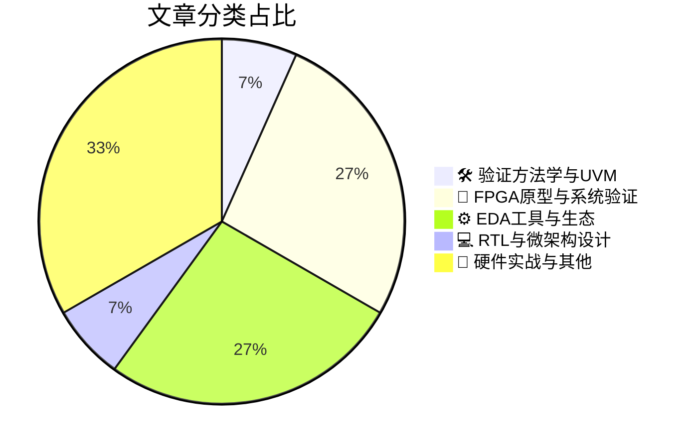

# 🛠️ FPGA / 验证技术精选

> 生成时间：2026-04-06 03:13:56 | 数据范围：过去 96 小时

## 📝 行业视点

当前硬件验证技术呈现三大硬核演进趋势：其一，LLM与AI Agent（如ChipStack）正渗透验证全流程，实现安全断言自动生成与测试平台认知自治，标志验证方法论从脚本驱动向智能体协同的范式跃迁。其二，面向Chiplet异构集成与3D-IC堆叠，验证重心已扩展至多物理场（热-电-机械）耦合仿真与跨芯粒安全边界的形式化验证，要求FPGA原型平台具备系统级物理效应抽象与硬件安全架构验证能力。其三，随着量子攻击与AI对抗样本威胁加剧，安全验证正实施严格"左移"策略，通过架构原生安全（Security-by-Design）与ISO/PAS 8800等标准合规验证，构建从RTL微架构到物理实现的全生命周期安全签核体系。最后，先进节点裕量回收与SRAM存算一体等微架构创新，进一步模糊了功能验证与物理实现的边界，推动验证流程向多物理场协同优化深度耦合。

---

## 🏆 深度必读 (Top 3)

### 1. [基于大语言模型的硬件安全断言自动生成技术](https://semiengineering.com/automated-security-assertion-generation-using-llms-u-of-florida/)
**评分**: 7/10 | **分类**: 🛠️ 验证方法学与UVM | **标签**: `Security Assertion` `LLM` `SVA Generation` `Formal Verification` `Hardware Security`

> **💡 推荐理由**：1. 直接解决安全验证领域专家资源稀缺和断言编写成本高的痛点，可快速补齐团队在信息安全验证方面的能力短板；2. 提供了LLM与传统形式化验证方法学结合的具体架构方案，有助于验证团队构建面向下一代SoC安全需求的智能化验证平台；3. 针对当前IC设计中日益突出的侧信道和信息流安全合规要求，该自动化方案能有效提升验证完备性，降低安全漏洞流片风险。

**摘要**：
针对硬件安全验证中安全断言编写依赖专家经验、手动构建耗时且难以覆盖复杂漏洞模式（如信息流违规、侧信道泄漏）的痛点，本文提出了一种利用大语言模型(LLM)从RTL代码和自然语言需求中自动化生成SystemVerilog Assertions (SVA)的方法。该架构通过结合静态代码分析与LLM的语义理解能力，能够识别关键安全路径并生成针对硬件木马、访问控制违规等威胁的形式化属性。实验验证表明，该方法在保持高语法正确率的同时，显著提升了安全验证的覆盖率和收敛速度，并提供了一套与现有形式化验证工具链集成的自动化流程框架。

### 2. [面向芯粒系统的安全框架开发](https://semiengineering.com/developing-a-security-framework-for-chiplet-based-systems/)
**评分**: 7/10 | **分类**: 🔬 FPGA原型与系统验证 | **标签**: `Chiplet Security` `System-Level Verification` `Hardware Security Framework` `Multi-Die Integration` `Security Validation`

> **💡 推荐理由**：Chiplet架构正成为后摩尔时代的主流设计范式，但其多Die集成特性带来了传统SoC验证中从未遇到的安全边界模糊和供应链信任难题。本文提供的安全框架不仅从架构层面定义了跨Die信任建立机制，更重要的是提供了可落地的验证方法论，包括形式化安全属性验证、硬件信任根的功能验证流程以及针对物理侧信道的测试向量生成方法。对于正在或计划开展Chiplet项目的验证团队，该文能够帮助建立系统级安全验证意识，避免在后期集成阶段发现跨Die安全漏洞而导致的高昂返工成本，是构建下一代安全可信计算平台的重要参考。

**摘要**：
随着Chiplet（芯粒）架构将多个异构Die集成在单个封装内，传统单芯片的安全边界被打破，导致了跨Die通信暴露、供应链完整性验证困难以及物理攻击面扩大等新型安全威胁。本文提出了一种分层安全框架，通过在每个芯粒中嵌入硬件信任根（RoT）、建立加密互连通道以及实施分布式身份认证机制，构建了从硅片制造到系统运行的全生命周期安全体系。针对验证痛点，文章重点解决了多Die间安全策略的形式化验证、侧信道攻击模型的构建以及第三方芯粒的可信接入验证等难题，提出了基于属性验证（ABV）和硬件安全属性形式化检查的方法论。该框架还定义了安全验证IP（VIP）的抽象接口标准，支持在Pre-silicon阶段进行故障注入和渗透测试，有效填补了Chiplet架构在系统级安全验证方法论上的空白。

### 3. [电子流动，不止于车辆移动](https://semiengineering.com/moving-electrons-not-just-vehicles/)
**评分**: 7/10 | **分类**: 🔬 FPGA原型与系统验证 | **标签**: `Automotive Verification` `Power Domain Crossing` `System-Level Prototyping` `Electrification`

> **💡 推荐理由**：对于从事汽车电子、功率IC及BMS FPGA原型验证的团队，本文提供了应对SiC/GaN宽禁带器件、高压平台验证的前沿架构方法论。其提出的分层验证架构与HIL协同仿真策略，可直接指导电机控制器和电池管理芯片的验证环境搭建，有效解决高压隔离、实时故障注入及ASIL-D等级功能安全覆盖率等具体技术难题，显著降低实车测试风险与硅后修复成本。

**摘要**：
文章针对电动汽车(EV)电气化转型中的核心验证痛点，提出了从传统机械系统验证向高压电子系统验证的架构范式转变。核心解决了电池管理系统(BMS)、功率电子与电机控制芯片在实时性、功能安全(ISO 26262)及800V高压环境下的硬件在环(HIL)仿真难题。作者探讨了如何构建从晶体管级到整车级的分层验证平台，以应对高电压、大电流及电磁兼容性(EMC)带来的信号完整性与隔离测试挑战。通过引入数字孪生和虚拟化验证环境，文章提供了在硅前阶段验证复杂功率转换算法与故障保护机制的架构方案。最后，强调了验证团队必须从'验证车辆机械运动'转向'验证电子能量流动'的思维转换，以确保极端工况下的芯片可靠性与系统级安全性。

---

## 📊 资讯分布与高频标签

## 📋 更多分类好文

### ⚙️ EDA工具与生态

- [**ChipStack AI超级智能体：Cadence硅验证的新纪元**](https://www.eejournal.com/fish_fry/chipstack-ai-super-agent-cadences-new-era-for-silicon-verification/) - *eejournal.com* (7分)
  > Cadence发布的ChipStack AI Super Agent标志着硅验证进入自主智能体时代，针对性解决当前复杂芯片设计中验证空间爆炸、调试周期长及验证计划与实现脱节等架构级痛点。该平台采用多智能体协作架构，集成大语言模型与形式化验证引擎，实现从自然语言规格到SystemVerilog/UVM测试平台的自动转换、智能断言生成及Root Cause自动诊断。通过构建设计知识图谱和机器学习模型，ChipStack能够预测高风险验证场景并动态优化回归测试集，解决传统方法中覆盖盲点发现和冗余测试执行的资源浪费问题。平台与Cadence Xcelium、JasperGold等工具深度耦合，支持验证环境自适应演进和覆盖率驱动的智能反馈闭环。这一架构不仅将验证效率提升数倍，更通过'人类监督+AI执行'的模式重构了验证团队的工作流，为超大规模芯片验证提供了可扩展的智能化解决方案。

- [**自动化多物理场仿真助力3D-IC设计成功**](https://semiengineering.com/automated-multiphysics-for-successful-3d-ic-design/) - *semiengineering.com* (6分)
  > 本文针对3D-IC异构集成中热-电-机械多物理场强耦合导致的验证盲区，提出了一套覆盖架构探索至物理签核的自动化多物理场协同仿真方法。文章剖析了传统分域验证无法捕捉芯片堆叠引发的信号完整性劣化、电源网络压降与热梯度协同效应等关键痛点，阐述了如何通过多物理场引擎自动化对接实现早期热感知布局、TSV应力分析与电源完整性联合优化。该方法论突破了功能验证与物理验证的边界，为3D-IC在先进工艺节点下的可靠性签核提供了系统级验证框架，显著降低了因热耗散或机械应力导致的流片失败风险。

- [**Silicon Catalyst与美国微电子2026战略：先进制程与异构集成验证新范式**](https://semiwiki.com/semiconductor-services/silicon-catalyst/368053-368053/) - *semiwiki.com* (3分)
  > 本文深入探讨了在美国CHIPS法案推动下，Silicon Catalyst孵化器如何帮助初创企业应对2026年先进制程及异构集成带来的系统性验证挑战。文章重点剖析了Chiplet架构普及导致的多Die协同仿真复杂性、接口一致性验证（UCIe等协议）及跨工艺节点的时序收敛难题。针对美国本土半导体制造回流趋势，作者提出了面向2.5D/3D先进封装的验证方法论（包括热-电-机械联合仿真对功能验证的影响）和供应链安全要求下的第三方IP可信验证流程。此外，文章还讨论了硬件安全验证（Hardware Security Verification）在出口管制背景下的合规性架构设计，以及云原生EDA工具链在分布式验证团队中的部署策略，为解决当前验证资源碎片化与算力需求激增的矛盾提供了实践路径。

- [**是德科技为虚拟制造产品组合增添组装仿真功能**](https://www.eejournal.com/industry_news/keysight-adds-assembly-simulation-to-virtual-manufacturing-portfolio/) - *eejournal.com* (3分)
  > 是德科技（Keysight）在其虚拟制造产品组合中集成组装仿真能力，旨在解决传统电子制造流程中物理原型依赖度高、封装级缺陷发现过晚以及跨域协同验证缺失的痛点。该技术允许IC设计团队在流片前对2.5D/3D封装、多芯片模块及PCB组装工艺进行高保真虚拟验证，实现从芯片设计到制造工艺的“左移”策略。对于复杂FPGA/ASIC系统而言，这填补了功能验证与可制造性设计（DFM）之间的数据断层，支持在早期阶段预测焊点可靠性、热机械应力及信号完整性退化。通过构建数字孪生（Digital Twin）环境，验证架构师能够在虚拟环境中完成物理组装风险的闭环验证，显著降低后期因封装互连或工艺偏差导致的返工成本。

### 💻 RTL与微架构设计

- [**重塑嵌入式存储器：破解SRAM扩展瓶颈**](https://semiengineering.com/reinventing-embedded-memory-solving-the-sram-scaling-wall/) - *semiengineering.com* (6分)
  > 本文针对先进工艺节点下传统SRAM面临的密度、功耗及良率扩展瓶颈，提出了基于新型非易失性存储器与3D堆叠技术的嵌入式存储架构重塑方案。文章深入剖析了存储器子系统验证中的关键痛点，包括新型存储单元读写时序容限验证、多电压Corner下的电源管理策略协同验证，以及内建自测试(MBIST)架构的适配挑战。作者提出了分层存储架构设计方法论，通过近存计算技术缓解数据搬移瓶颈，并建立了从晶体管级可靠性到系统级一致性验证的完整验证流程。特别强调了高精度行为模型与物理实现协同验证的重要性，以及针对存储单元耐久性和软错误率的加速验证方法。该方案为5nm及以下节点的存储子系统验证提供了架构级指导，解决了传统验证方法在面对新型存储技术时的覆盖盲区。

### 🔬 FPGA原型与系统验证

- [**技术研讨会 – 先进工艺节点下设计裕量的回收与优化策略**](https://semiwiki.com/eda/clockedge/368009-webinar-how-to-reclaim-margin-in-advanced-nodes/) - *semiwiki.com* (6分)
  > 本文针对先进工艺节点（如5nm/3nm）中传统静态时序分析（STA）采用的固定guard band机制导致的过度设计问题，提出了基于动态监控的裕量回收验证方法论。核心痛点在于最坏情况（Worst-Case PVT）与实际工作负载（Workload）的巨大偏差，造成芯片PPA（性能、功耗、面积）的显著浪费。文章阐述了通过片上路径延迟监测（In-situ Path Monitor）、自适应电压调节（AVS）与统计时序分析相结合的架构设计，实现对工艺偏差和动态压降（IR Drop）的精准裕量补偿。该方法解决了传统sign-off流程无法捕捉真实应用场景的验证盲区，支持在硅后验证阶段通过机器学习算法动态调整安全边界。最终目标是在保证硅片可靠性的前提下，回收被保守估计占据的10-20%时序与功耗裕量，实现从固定裕量到动态裕量管理的架构转型。

- [**瑞萨抗辐射芯片助力NASA Artemis II载人登月任务**](https://www.eejournal.com/industry_news/renesas-radiation-hardened-ics-take-flight-on-nasas-artemis-ii-crewed-lunar-mission/) - *eejournal.com* (5分)
  > 文章详述了瑞萨电子为NASA Artemis II载人登月任务提供的抗辐射加固IC所面临的高可靠性验证挑战与架构解决方案。针对太空辐射环境引发的单粒子翻转（SEU）、闩锁效应（SEL）及总剂量效应（TID）等单点故障风险，芯片采用了三模冗余（TMR）、错误检测与纠正（EDAC）及物理层隔离等容错架构设计。验证层面重点突破了传统消费级IC测试方法的局限，建立了包含重离子束加速测试、故障注入仿真及全寿命周期可靠性统计验证的完整体系，解决了极端环境下长期运行可预测性与可维护性的验证难题。该实践展示了航天级芯片如何通过分层级的故障容限架构与统计性验证手段，确保在无法现场维护的深空探测任务中实现零缺陷交付。

### 📝 硬件实战与其他

- [**芯片产业一周回顾**](https://semiengineering.com/chip-industry-week-in-review-132/) - *semiengineering.com* (4分)
  > 本周行业综述聚焦先进制程与Chiplet架构带来的系统性验证挑战，重点剖析了3nm节点下功耗-性能-面积（PPA）验证的复杂度指数级增长问题，以及多Die集成场景中互联一致性和边界条件验证的架构级难题。文章深入探讨了硬件仿真（Emulation）与原型验证（Prototyping）在左移策略（Shift-Left）中的关键作用，针对AI驱动芯片的稀疏计算架构提出了定制化验证方案。同时分析了形式验证（Formal Verification）在安全关键型设计中的自动化收敛瓶颈，以及数字孪生（Digital Twin）技术在验证环境构建中的新兴应用范式，为验证团队应对下一代芯片复杂度提供了方法学指引。

- [**全球首创：MACsec IP荣获ISO/PAS 8800认证，护航汽车与物理AI网络安全**](https://semiengineering.com/world-first-macsec-ip-receives-iso-pas-8800-certification-for-automotive-and-physical-ai-security/) - *semiengineering.com* (4分)
  > 全球首个MACsec硬件IP核成功通过ISO/PAS 8800道路车辆网络安全认证，标志着硬件安全模块在汽车电子和物理AI应用中的重大验证突破。该认证解决了车规级芯片中数据链路层安全与功能安全融合验证的关键痛点，针对传统验证方法难以覆盖的网络攻击面（如中间人攻击、重放攻击）提供了标准化的防护架构验证方案。通过系统性的威胁分析与风险评估（TARA）验证流程，结合形式化安全属性验证和故障注入测试，确保了IP在-40°C至125°C汽车温度范围内的安全可靠性。该案例为验证团队建立了符合ISO/SAE 21434和ISO/PAS 8800的硬件安全验证基准，解决了安全机制与性能优化之间的验证平衡难题。

- [**量子、人工智能与汽车技术驱动IC安全威胁激增**](https://semiengineering.com/ic-security-threats-spike-with-quantum-ai-and-automotive/) - *semiengineering.com* (3分)
  > 文章深入分析了量子计算、人工智能和汽车电子三大技术趋势对IC安全架构带来的复合型验证挑战。针对量子威胁，文章探讨了后量子密码学(PQC)算法在硬件实现中的侧信道攻击(SCA)防护验证及形式化验证方法学，指出了算法正确性与物理安全双重验证的痛点。在AI芯片领域，重点阐述了神经网络加速器面临的数据隐私泄露、模型投毒攻击的验证盲点，以及可信执行环境(TEE)与硬件安全模块(HSM)的形式化验证需求。针对汽车电子，文章剖析了功能安全(ISO 26262)与网络安全(ISO 21434)融合验证的架构冲突，提出了基于故障注入(FI)和动态信息流追踪的协同验证框架。文章特别强调了当前验证流程在侧信道泄漏量化评估、后量子算法硬件实现完备性证明以及AI芯片供应链安全验证方面的关键缺口，论证了从传统功能验证向安全属性验证转型的架构必要性。

- [**VIAVI与Ground Control合作，在GNSS拒止环境下实现可信的海事船舶跟踪与导航**](https://www.eejournal.com/industry_news/viavi-partners-with-ground-control-to-enable-assured-maritime-vessel-tracking-and-navigation-in-gnss-denied-environments/) - *eejournal.com* (3分)
  > VIAVI与Ground Control合作针对海事导航系统在GNSS信号受干扰、遮挡或欺骗环境下的可靠性验证难题，构建了多源传感器融合的导航验证架构。该方案解决了传统验证方法难以模拟GNSS拒止场景导致的测试覆盖盲区，以及极端环境下导航系统失效风险难以评估的痛点。通过集成惯性导航单元、备用卫星通信链路及多传感器数据融合算法，实现了在GNSS失效状态下的持续定位与导航能力验证。文章详细阐述了硬件在环（HIL）仿真环境的搭建方法，包括射频信号模拟、故障注入机制、以及边界条件测试策略，为高可靠性导航ASIC/FPGA设计提供了完整的验证闭环架构。该方案特别强调了在信号完整性验证、时钟同步容错及传感器交叉验证方面的架构设计考量。

- [**AI需求重塑内存市场优先级，NOR Flash供应趋紧**](https://semiengineering.com/ai-demand-resets-memory-market-priorities-tightening-nor-flash-availability/) - *semiengineering.com* (2分)
  > AI需求的爆发正在重塑内存市场格局，将NOR Flash从边缘器件推至战略储备地位，导致全球供应严重趋紧。这一转变对数字IC验证团队构成了双重挑战：一方面需在物理样片稀缺的情况下验证NOR Flash控制器与AI加速器的低延迟接口协议，另一方面必须确保启动代码存储的完整性及极端工况下的数据保持可靠性。文章剖析了传统验证方法在应对此类高密度、高可靠性需求时的架构缺陷，特别是缺乏针对AI系统快速启动（Fast Boot）和实时固件更新场景的边界case验证。针对当前供应链约束，文中提出了基于FPGA的虚拟NOR Flash验证平台架构，以及通过UVM环境早期集成软件栈的协同验证方法论。这些方案有效缓解了硬件资源短缺带来的验证瓶颈，确保在NOR Flash供应受限的市场环境下，仍能加速AI芯片的验证收敛与产品上市。

