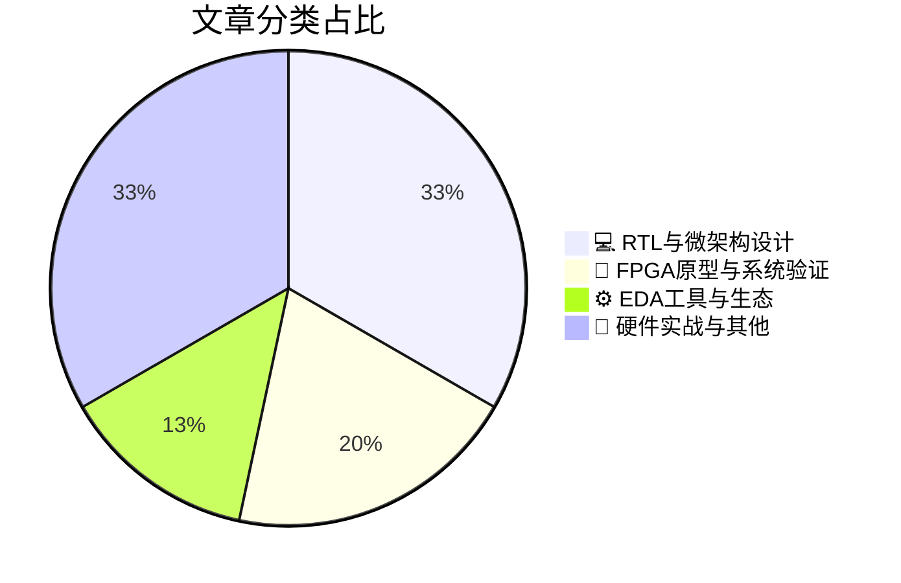

# 🛠️ FPGA / 验证技术精选

> 生成时间：2026-04-13 03:14:04 | 数据范围：过去 96 小时

## 📝 行业视点

当前硬件验证领域正面临高带宽互连与存储子系统协同验证的复杂化挑战，PCIe 8.0的PAM4信号完整性与HBM4早期FPGA原型验证并行推进，要求验证流程在RTL与微架构层面实现更紧密的前硅迭代。FPGA原型验证正从单纯的性能评估转向系统级架构探索，特别是在RISC-V Agentic AI基础设施和GPU中心存储架构的验证中，承担着软硬件协同验证与存算一体（CIM）电源传输网络（PDN）签核的关键角色。与此同时，EDA工具链正向万亿周期（trillion-cycle）规模突破，结合异构计算资源加速AI芯片的功耗-性能-面积（PPA）收敛，以应对完全神经网络计算机等新兴架构的验证需求。存算一体系统的PDN挑战与极端环境下的封装可靠性验证，进一步推动了从传统功能验证向多物理场协同签核的方法论演进。

---

## 🏆 深度必读 (Top 3)

### 1. [PCIe 8.0：赋能下一代高带宽系统](https://semiengineering.com/pcie-8-0-enabling-the-next-generation-of-high-bandwidth-systems/)
**评分**: 8/10 | **分类**: 💻 RTL与微架构设计 | **标签**: `PCIe 8.0` `PAM4 Signaling` `Flit Mode` `Clock Domain Crossing` `SerDes Architecture` `Signal Integrity` `Link Training` `Power Management`

> **💡 推荐理由**：本文直击PCIe 8.0验证中最具挑战性的物理层与协议层协同验证问题，为验证团队提供了从架构设计到具体实现的全栈指导，特别是关于PAM4信号完整性验证与数字逻辑验证的融合方法论，以及FLIT模式下低延迟FEC的验证策略，对当前正在规划或实施高性能计算（HPC）和网络芯片验证项目的团队具有极高的参考价值。

**摘要**：
本文深入剖析了PCIe 8.0规范中64 GT/s速率和PAM4信号调制技术带来的物理层架构革新，重点探讨了FLIT模式（固定时隙事务层包）和轻量级FEC机制对验证方法学的根本性影响。文章针对高速串行接口验证中的关键痛点，包括PAM4眼图张开度测试、链路训练状态机（LTSSM）的复杂度指数级增长、以及低延迟要求下的错误注入与恢复机制验证，提出了基于事务级建模和混合信号仿真的分层验证策略。作者详细阐述了如何在保持向后兼容性的前提下，构建支持64 GT/s速率的UVM验证环境，并针对信号完整性（SI）与功耗管理（ASPM/L1子状态）的协同验证挑战给出了具体的架构设计方案。此外，文章还讨论了FLIT模式下数据包边界对齐、Credit流控机制重构以及CRC/ECRC错误检测的验证重点，为应对下一代高速接口的验证收敛提供了系统性解决思路。

### 2. [HBM4早期验证为下一代AI与HPC系统指明方向](https://semiengineering.com/early-hbm4-validation-points-the-way-for-next-generation-ai-and-hpc-systems/)
**评分**: 8/10 | **分类**: 🔬 FPGA原型与系统验证 | **标签**: `HBM4` `Memory System Validation` `High-speed Interface` `Pre-silicon Prototyping` `Signal Integrity`

> **💡 推荐理由**：作为验证团队，应重点关注此文所阐述的HBM4超高速接口在2.5D封装环境下的SI/PI协同验证方法，以及针对AI工作负载特性的功耗噪声验证策略。文章提供的早期验证框架和分层测试方案，能够有效解决当前AI芯片内存子系统验证中面临的时序收敛困难、系统级corner case覆盖不足等关键瓶颈，对提升pre-silicon验证质量和缩短产品上市周期具有直接指导意义。

**摘要**：
HBM4早期验证工作针对下一代AI与HPC系统中超高带宽内存接口的关键验证挑战，提出了从架构到实现的系统性解决方案。文章聚焦于2TB/s+数据速率下的信号完整性（SI/PI）验证、2.5D/3D封装协同仿真以及复杂功耗管理场景的验证痛点，阐述了基于虚拟原型（Virtual Prototyping）和硬件仿真加速（Emulation）的早期验证方法学。通过分层验证架构设计，该方案在物理实现前识别了接口时序收敛、电源噪声耦合和热管理相关的系统级风险，有效解决了传统post-silicon验证周期过长的问题。文章特别强调了PHY与控制器协同验证、协议一致性检查以及极端corner case覆盖策略，为超大规模AI芯片的内存子系统验证提供了可复用的方法论。该验证框架通过引入先进的仿真模型和自动化测试平台，显著提升了验证效率并降低了silicon bring-up风险。

### 3. [基于DRAM的存内计算系统中的电源传输网络挑战](https://semiengineering.com/pdn-challenges-in-dram-based-compute-in-memory-systems-ut-austin/)
**评分**: 7/10 | **分类**: 💻 RTL与微架构设计 | **标签**: `Compute-In-Memory` `PDN` `电源完整性` `存内计算` `先进封装`

> **💡 推荐理由**：对于从事AI加速器、存内计算芯片及DRAM控制器验证的团队，本文提供了关键的设计验证边界条件，帮助验证工程师理解CIM架构特有的电源噪声机制，并指导建立包含大规模并行计算场景的电源完整性验证平台，有效避免因PDN设计不足导致的算精度损失和功能失效风险。

**摘要**：
本文针对基于DRAM的存内计算（CIM）架构中电源传输网络（PDN）面临的新型挑战进行了深入分析，指出传统DRAM的PDN设计在应对大规模并行乘累加（MAC）运算时出现的极端电流密度和瞬态di/dt噪声方面存在严重不足。文章揭示了多bank同时激活计算模式下导致的严重IR压降和电源完整性（PI）问题，这些问题会直接降低模拟CIM计算的精度并引发功能错误。研究进一步指出，现有EDA工具在精确建模CIM特定功耗场景和电源噪声分析方面存在局限性，难以有效评估计算-存储混合工作负载下的电源完整性风险。作者强调了必须开发新的验证方法论和测试场景，以覆盖传统DRAM验证中未考虑的高并发计算操作带来的电源完整性验证盲区，确保CIM系统的可靠性和计算精度。

---

## 📊 资讯分布与高频标签

## 📋 更多分类好文

### 🔬 FPGA原型与系统验证

- [**面向大规模并行GPU中心化存储的SSD仿真器**](https://semiengineering.com/ssd-emulator-for-massively-parallel-gpu-centric-storage-kaist/) - *semiengineering.com* (7分)
  > 本文针对GPU中心化存储架构验证中面临的真实SSD阵列成本高昂、传统软件模拟带宽不足且无法提供足够并行度的痛点，提出了一种专用SSD硬件仿真器方案。该架构通过硬件级并行模拟大量NVMe SSD设备的行为，解决了在RTL验证阶段难以评估GPU与存储系统间高并发数据流和极低延迟访问的挑战。相比真实硬件方案，该仿真器显著降低了验证成本并提高了可控性；相比纯软件模拟，它提供了接近真实的吞吐量和时序精度。该方案特别适用于验证大规模AI/ML训练场景下的存储控制器架构、数据通路带宽瓶颈以及主机与设备间的并行命令处理逻辑，填补了传统验证方法在GPU-centric存储系统性能验证方面的空白。

- [**智能架构：RISC-V CPU在自主AI基础设施中的崛起**](https://semiwiki.com/ip/sifive/368143-architecting-intelligence-the-rise-of-risc-v-cpus-in-agentic-ai-infrastructure/) - *semiwiki.com* (6分)
  > 本文探讨了RISC-V处理器在Agentic AI（自主智能体）基础设施中的架构设计范式，解决了传统封闭架构在支持动态AI推理任务时面临的灵活性与能效瓶颈。文章重点剖析了异构集成环境下软硬件协同验证的复杂性、自定义指令扩展的功能覆盖挑战，以及AI工作负载非确定性特征与传统确定性验证方法之间的根本矛盾。通过提出模块化可重构的验证架构方案，阐述了如何构建支持快速迭代AI算法的持续验证平台，并探讨了形式化验证与硬件仿真在确保自主AI系统安全关键路径上的协同策略。该研究为开放指令集生态与新兴AI工作负载的深度融合提供了可落地的验证方法论指导。

### 💻 RTL与微架构设计

- [**攻克内存墙：AI推理架构深度解析——对话Sandra Rivera**](https://www.eejournal.com/fish_fry/solving-the-memory-wall-a-deep-dive-into-ai-inference-with-sandra-rivera/) - *eejournal.com* (6分)
  > 文章深入剖析了AI推理面临的核心瓶颈——内存墙问题，揭示了传统存储架构在应对大模型参数时的带宽与延迟限制。通过分析HBM3E、近存计算及Chiplet互连等前沿架构方案，文章指出了这些创新给验证团队带来的关键挑战：包括高带宽存储接口的PHY-MAC协同验证、复杂存储层次的数据一致性检查，以及异构计算单元间的数据流调度验证。特别强调了在系统级验证中构建真实AI工作负载（如Transformer模型推理）对存储子系统进行压力测试的必要性，以避免硅后出现带宽利用率不足的架构级缺陷。文章还探讨了功耗-性能联合验证的新方法论，为验证架构师提供了应对下一代AI加速器复杂存储架构的全流程验证策略框架。

- [**面向完全神经计算机的工程路线图**](https://semiengineering.com/an-engineering-roadmap-toward-completely-neural-computers-meta-ai-kaust/) - *semiengineering.com* (5分)
  > 本文提出了完全神经计算机（CNC）的工程实现路线图，主张用可学习的神经网络组件系统性替代传统计算机架构中的确定性数字逻辑（包括控制流、算术运算和内存层次结构），以构建端到端可微分的计算系统。文章核心解决了异构架构设计中神经网络与数字逻辑接口的时序同步、精度转换和错误传播等关键架构难题，提出了渐进式替代的工程方法论。在验证层面，文章揭示了传统基于布尔逻辑的形式验证和仿真技术无法适用于概率性神经计算的本质缺陷，指出需要建立基于统计正确性、近似等价性检验和连续空间形式化方法的新型验证框架。作者进一步探讨了全神经计算机在功能一致性验证、边界条件覆盖、对抗样本鲁棒性测试以及长期漂移检测方面的独特挑战，为下一代AI硬件验证提供了理论指导。

- [**PCI Express 8.0：通过变革性互连技术驱动AI、云和HPC**](https://blogs.sw.siemens.com/verificationhorizons/2026/04/09/pci-express-8-0-powering-ai-cloud-and-hpc-with-transformative-interconnect-technology/) - *blogs.sw.siemens.com* (5分)
  > PCIe 8.0将数据传输速率提升至64 GT/s并采用PAM4调制技术，这引入了显著的验证复杂性，特别是信号完整性验证和误码率（BER）控制方面的挑战。文章阐述了如何通过引入FLIT（Flow Control Unit）架构和前向纠错（FEC）机制来解决高损耗信道中的数据可靠性问题，这对验证团队的重传机制和错误注入测试提出了新要求。针对AI和HPC工作负载的负载均衡与功耗管理，文章探讨了动态带宽调节的架构设计及其验证策略。此外，PHY/MAC层接口的时序收敛和跨代兼容性验证成为确保与PCIe 7.0/6.0/5.0设备互操作的关键架构难题。

### ⚙️ EDA工具与生态

- [**西门子借助NVIDIA技术将AI芯片验证加速至万亿周期规模**](https://www.eejournal.com/industry_news/siemens-accelerates-ai-chip-verification-to-trillion-cycle-scale-with-nvidia-technology/) - *eejournal.com* (6分)
  > AI芯片因计算单元密集、数据路径复杂且需运行完整软件栈，传统验证方法面临周期长、资源消耗大的挑战，难以满足万亿周期级别的验证需求。本文介绍了西门子EDA将其Veloce硬件仿真平台与NVIDIA技术深度融合，通过GPU加速或混合架构实现验证性能的指数级提升。该方案重点解决了超大规模AI加速器在软硬件协同验证、功耗场景模拟及全系统回归测试中的性能瓶颈问题。通过将验证周期从数月缩短至数天，该架构支持在流片前完成操作系统启动、AI框架移植及大规模工作负载验证。这一技术突破为验证团队提供了在硅前阶段进行trillion-cycle级别压力测试和覆盖率收敛的可行路径。

- [**恩智浦扩大Arteris片上网络部署，赋能边缘AI架构扩展**](https://semiwiki.com/ip/arteris/366617-nxp-expands-arteris-noc-deployment-to-scale-edge-ai-architectures/) - *semiwiki.com* (3分)
  > NXP在其下一代边缘AI SoC中扩大采用Arteris的NoC（片上网络）互连IP，以解决传统总线架构在应对多核异构计算、高带宽AI加速器集群时的扩展性瓶颈与布线拥塞问题。该部署针对边缘AI场景下的严格功耗约束和确定性延迟要求，通过可配置的分层拓扑结构实现了计算单元与存储子系统间的高效数据流转。文章深入探讨了NoC架构在复杂SoC验证中面临的关键挑战，包括多主多从拓扑的功能验证、死锁检测与避免机制验证、以及基于QoS策略的性能验证方法。此举有效解决了传统AXI Crossbar在时序收敛、模块化验证复用和系统级功耗管理验证方面的痛点，为大规模边缘AI芯片的敏捷开发提供了可复用的互连验证框架与参考流程。

### 📝 硬件实战与其他

- [**耐极端环境的光子封装技术**](https://semiengineering.com/photonic-packaging-resistant-to-extreme-environments-nist-johns-hopkins-u-of-maryland/) - *semiengineering.com* (4分)
  > 本文针对光子集成电路（PIC）在极端环境（高温、低温、高辐射或高机械应力）应用中面临的封装可靠性验证难题，提出了一种新型的鲁棒性封装架构与验证方法论。文章解决了传统光电封装在温度循环、热冲击和机械振动下易出现光耦合失效、热膨胀失配及信号完整性退化的关键验证痛点，通过创新的材料选择和结构优化实现了光电接口的高可靠性。研究团队建立了针对极端环境的光子封装加速寿命测试框架与多物理场协同验证平台，为封装级可靠性验证提供了标准化的评估方法。该工作对高可靠应用（如航天、深海、数据中心极端工况）中的光电共封装（CPO）架构设计具有重要指导意义，填补了极端环境下光子封装验证方法论的关键空白。

- [**AI与云计算的决裂：边缘智能时代的架构重构**](https://semiengineering.com/the-coming-breakup-between-ai-and-the-cloud/) - *semiengineering.com* (3分)
  > 文章深入剖析了人工智能计算范式从集中式云端向分布式边缘端迁移的技术趋势，重点探讨了端侧AI芯片在严格功耗、面积和实时性约束下的功能验证挑战。作者提出了面向异构计算架构的层次化验证策略，解决了边缘设备在离线推理场景下的精度损失与计算可靠性问题。针对分布式AI系统的网络分区风险，文章阐述了容错机制验证和数据一致性检查的关键技术路径。同时，该文分析了端云协同架构中数据隐私保护机制的形式化验证需求，为边缘智能芯片的验证环境搭建提供了可落地的架构设计框架。

- [**英特尔、马斯克与那条在沉寂海面上激起千层浪的推文**](https://semiwiki.com/semiconductor-manufacturers/intel/368228-intel-musk-and-the-tweet-that-launched-a-1000-ships-on-a-becalmed-sea/) - *semiwiki.com* (3分)
  > 本文剖析了现代超大规模芯片验证中常见的'风平浪静'困境——即当验证覆盖率进入平台期、回归测试成本指数级增长时的架构性僵局。通过类比Musk在Twitter架构重构中的激进决策风格与Intel的IDM 2.0验证转型，文章提出了打破验证停滞的'千舰战略'：从单点工具优化转向验证云平台架构的重构，利用分布式仿真、AI驱动的动态测试调度以及硬件仿真加速资源的弹性编排，解决多Die芯片异构验证的收敛难题。核心论点在于，验证架构师必须像指挥舰队一样统筹算力资源，而非仅仅优化单艘'舰船'的性能。

- [**使用高长径比针尖原子力显微镜研究极紫外光刻纳米结构**](https://semiengineering.com/study-of-euv-nanostructures-using-afm-with-high-aspect-ratio-tip-purdue-intel-bruker/) - *semiengineering.com* (2分)
  > 针对先进EUV工艺中高深宽比纳米结构（如FinFET、GAA晶体管）的精确形貌表征难题，本文提出采用高长径比针尖的原子力显微镜（AFM）技术。该方法解决了传统针尖无法触及深窄结构底部导致的关键尺寸（CD）测量失真问题，实现了对光刻胶图案及刻蚀后结构的高保真三维重建。研究精准量化了侧壁粗糙度（LWR/LER）和底部形貌等关键参数，填补了工艺变异数据获取的精度缺口。该技术为SPICE模型提取、寄生参数计算和物理验证Sign-off提供了更准确的物理基础数据。研究成果直接支撑Design-Technology Co-Optimization（DTCO）流程中的工艺-电路协同验证，有助于减少因工艺表征误差导致的验证盲区。

- [**钌互连中表面态与能带调制的影响（仁川大学、汉阳大学、德克萨斯大学达拉斯分校）**](https://semiengineering.com/impact-of-surface-states-and-band-modulations-in-ruthenium-interconnects-incheon-hanyang-ut-dallas/) - *semiengineering.com* (2分)
  > 本文研究了钌（Ru）互连材料中表面态和能带调制对载流子输运特性的影响，揭示了在先进工艺节点下互连电阻率和电容的非理想物理机制。研究表明，表面态导致的费米能级钉扎效应和量子限域引起的能带变化会显著增加有效电阻，这对传统基于体材料假设的寄生参数提取（RC Extraction）模型构成挑战。对于数字IC验证而言，这些微观物理效应会转化为宏观的时序偏差和功耗不确定性，特别是在3nm及以下节点的精细互连结构中。文章指出必须建立考虑表面散射和量子修正的互连模型，以解决当前静态时序分析（STA）中因忽略材料量子特性而导致的签核（Sign-off）乐观性偏差问题。该研究为验证团队更新先进工艺节点的互连降额（Derating）策略和噪声容限分析提供了物理基础。

