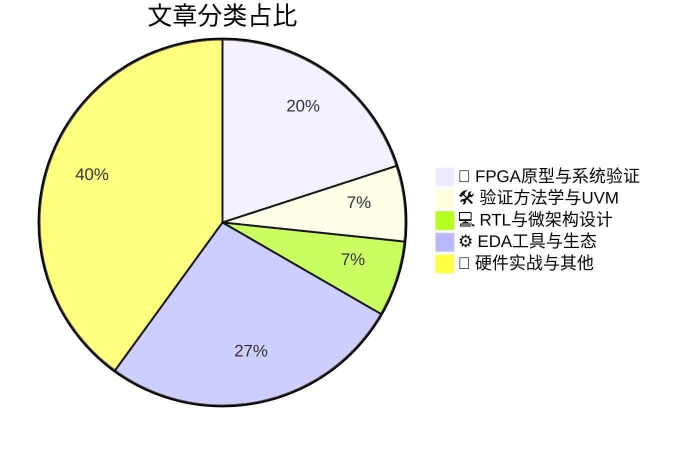

# 🛠️ FPGA / 验证技术精选

> 生成时间：2026-04-20 03:19:18 | 数据范围：过去 96 小时

## 📝 行业视点

基于当前技术演进脉络，硬件验证领域正呈现三大核心趋势：首先，Emulation与FPGA原型验证的边界加速模糊，从佛罗里达大学的SoC安全验证到UVVM在FPGA验证中的效能优化，表明系统级验证正从传统仿真向硬件加速验证迁移，以应对复杂攻击面和安全威胁模型的验证需求。其次，Chiplet标准化与先进封装技术的爆发式增长（如面板级封装和薄膜GaN芯粒技术）正在重构验证范式，要求验证方法学从单芯片逻辑验证转向多die互连完整性、信号完整性与电源完整性的协同验证。最后，AI/ML算法正深度渗透EDA工具链，无论是TCAD校准的自动化加速还是基于蒙特卡洛方法的DRAM工艺变异性分析，都标志着数据驱动的智能验证与制造协同优化成为突破摩尔定律瓶颈的关键路径。

---

## 🏆 深度必读 (Top 3)

### 1. [基于硬件仿真的SoC安全验证（佛罗里达大学）](https://semiengineering.com/emulation-based-soc-security-verification-u-of-florida/)
**评分**: 8/10 | **分类**: 🔬 FPGA原型与系统验证 | **标签**: `硬件仿真` `SoC安全验证` `侧信道分析` `系统级验证` `漏洞检测`

> **💡 推荐理由**：对于面临SoC安全验证挑战的验证团队，本文提供了一种突破传统仿真性能限制的实用方案。硬件仿真平台能够加速安全关键路径的验证速度达数个数量级，特别适用于需要长时间运行的渗透测试、随机故障注入和侧信道分析场景。该方法有效弥补了软件仿真在实时攻击场景复现和硬件安全模块验证方面的不足，为构建涵盖从RTL到系统级的完整安全验证流程提供了可落地的架构参考，有助于在Tape-out前发现深层硬件安全漏洞并降低后期修复成本。

**摘要**：
该论文针对传统软件仿真在复杂SoC安全验证中面临的性能瓶颈和实时性不足问题，提出了一种基于硬件仿真（Emulation）的安全验证架构。通过利用硬件加速平台，该方法能够高效执行大规模安全测试用例，实现对硬件信任根、安全启动流程及运行时攻击场景的加速验证。文章解决了软硬件协同验证中难以捕捉的时序相关安全漏洞问题，并支持在接近真实速率的条件下进行故障注入和侧信道分析。该架构通过将形式化属性检查与硬件仿真相结合，显著缩短了安全验证周期，提升了复杂SoC中潜在硬件级安全威胁的发现效率。

### 2. [UVVM助力FPGA验证提速与提质](https://vhdlwhiz.com/uvvm-faster-fpga-verification/)
**评分**: 8/10 | **分类**: 🛠️ 验证方法学与UVM | **标签**: `UVVM` `VHDL验证方法学` `VVC架构` `事务级抽象` `验证组件复用`

> **💡 推荐理由**：对于以VHDL为主的FPGA验证团队，UVVM提供了比SystemVerilog/UVM更低的学习门槛和更快的迁移路径，其开源特性与清晰的架构分层能有效解决项目间验证组件重用率低的问题。推荐采用以建立可维护的验证资产库，显著缩短新模块的测试平台搭建时间（通常可减少50%以上的平台代码量），并通过标准化日志格式提升团队协作效率与问题定位速度。

**摘要**：
针对FPGA验证中常见的临时性测试平台搭建、组件重用困难及调试效率低下等痛点，本文介绍了UVVM（Universal VHDL Verification Methodology）如何通过分层架构（Test Sequencer、VVC、Utility Library）实现事务级验证抽象。该方法学提供了标准化的验证IP（VIP）开发框架、统一的日志报告机制及预置的协议检查功能，显著缩短了测试平台搭建周期并提升了代码可维护性。UVVM在纯VHDL环境中实现了接近UVM的验证能力，使团队无需切换语言即可获得高级验证方法学的收益，同时通过结构化的测试序列和自动化结果比对大幅降低了回归测试的调试成本。

### 3. [推测执行：硅芯片最昂贵的执念](https://semiwiki.com/eda/368077-speculation-silicons-most-expensive-compulsion/)
**评分**: 7/10 | **分类**: 💻 RTL与微架构设计 | **标签**: `投机执行` `分支预测` `Spectre/Meltdown` `微架构安全` `乱序执行`

> **💡 推荐理由**：该文为验证团队提供了应对现代高性能处理器验证复杂性的系统方法论，特别是针对推测执行引入的非确定性行为和安全漏洞风险，能够帮助团队建立从架构设计阶段就考虑可验证性的工作流程，避免因后期发现推测相关缺陷而导致的流片延期或安全召回，对当前多核乱序处理器的验证架构设计具有重要指导意义。

**摘要**：
文章深入剖析了现代处理器中推测执行(Speculation)机制带来的架构验证危机，指出为实现指令级并行而采用的激进推测技术已成为芯片设计中最难以验证且成本最高的“技术债”。作者揭示了推测执行在边界场景、异常处理和安全漏洞（如Spectre、Meltdown）方面的验证盲区，强调传统仿真方法难以覆盖推测路径上的所有状态组合。文章探讨了在微架构层面限制推测范围、引入形式化验证断言以及构建推测感知验证平台的架构策略，以解决状态回滚一致性、副作用隔离和隐蔽信道检测等核心验证痛点。最终提出验证驱动设计(Verification-Driven Design)理念，建议架构团队在性能优化初期即引入形式化约束，避免后期因安全漏洞导致的架构级重构。

---

## 📊 资讯分布与高频标签

## 📋 更多分类好文

### 🔬 FPGA原型与系统验证

- [**芯粒标准旨在实现即插即用**](https://semiengineering.com/chiplet-standards-aim-for-plug-n-play/) - *semiengineering.com* (6分)
  > 本文探讨了Chiplet（芯粒）标准化（如UCIe等新兴标准）如何旨在解决多供应商芯粒集成中的互操作性验证难题。文章分析了标准化接口在降低系统级验证复杂度方面的作用，特别是针对物理层兼容性、协议一致性和信号完整性验证等关键痛点。通过建立统一的互连标准，该架构设计允许验证团队采用可重用的验证IP（VIP）和模块化验证方法学，避免针对不同芯粒供应商重复开发定制化验证环境。文章还讨论了即插即用架构对仿真、原型验证和后硅验证流程的影响，以及如何通过标准化测试程序确保多芯粒系统的功能正确性和性能达标。

- [**硅光子技术：照亮通往更高效数据中心之路**](https://semiengineering.com/silicon-photonics-lights-the-way-to-more-efficient-data-centers/) - *semiengineering.com* (6分)
  > 本文探讨了硅光子技术如何通过光互连替代传统电互连来解决数据中心面临的带宽瓶颈与功耗危机。文章重点剖析了光电混合信号系统带来的验证复杂性，包括光调制器、探测器与CMOS电路协同仿真的跨域建模难题，以及高频光信号与电信号时序对齐的精确性要求。针对3D异构集成架构，文中阐述了光电芯片（PIC）与ASIC集成时的接口验证、热-电-光耦合效应建模以及可测性设计（DFT）挑战。此外，文章还提出了面向光电融合系统的分层验证策略，强调了在系统级验证中建立光电协同仿真平台的重要性，为处理下一代高速光互连的验证提供了架构级解决方案。

### ⚙️ EDA工具与生态

- [**SPIE ALP 2026电子束倡议：曲线掩模、EUV与数据挑战的持续进展**](https://semiengineering.com/ebeam-initiative-at-spie-alp-2026-continuing-progress-on-curvilinear-euv-and-data-challenges/) - *semiengineering.com* (3分)
  > 本文报道了eBeam Initiative在SPIE ALP 2026上关于先进光刻技术的最新进展，重点讨论了曲线掩模（Curvilinear）设计对传统物理验证流程的挑战，包括非曼哈顿几何图形带来的数据量爆炸和DRC/LVS规则集的重新定义。文章深入分析了EUV光刻技术对掩模验证精度和多光束写入一致性验证的新需求，以及由此产生的海量数据处理瓶颈。针对这些痛点，作者提出了面向大数据的验证架构优化方案，包括分布式计算策略和新型掩模数据格式（如OASIS.MASK）的验证流程集成，为下一代工艺节点的签核（Sign-off）验证提供了关键的技术路线。

- [**利用专家模块与机器学习校准加速器实现TCAD自动化加速校准**](https://semiengineering.com/automate-and-speed-up-tcad-calibration-with-expert-modules-and-ml-calibration-accelerator/) - *semiengineering.com* (3分)
  > 传统TCAD校准依赖人工迭代和深厚的专家经验，存在流程碎片化、收敛速度慢及结果一致性差等痛点，严重制约工艺开发周期。本文提出通过预定义的专家模块封装领域最佳实践，结合机器学习校准加速器实现器件仿真参数的自动提取与智能优化，替代耗时的手动调参过程。该方案显著提升了TCAD仿真与电学特性测试数据的拟合精度，缩短了从工艺表征到SPICE模型交付的时间。其核心价值在于建立了可重复的自动化校准流程，为工艺-设计协同优化（DTCO）提供了高效的验证路径，降低了工艺建模对个别专家经验的依赖。

- [**Synopsys解决方案支持NASA阿尔忒弥斯计划：航天服分析与通信系统开发**](https://www.eejournal.com/industry_news/synopsys-solutions-support-nasas-artemis-program-with-spacesuit-analysis-and-communication-system-development/) - *eejournal.com* (3分)
  > 本文阐述了Synopsys设计自动化工具链在NASA阿尔忒弥斯计划航天服电子系统与深空通信模块开发中的应用实践。针对航天级ASIC/FPGA在极端温度与辐射环境下面临的可靠性验证难题，文章详细介绍了多物理场协同仿真方法如何解决传统数字验证无法覆盖的电磁兼容(EMC)与电源完整性(PI)耦合问题。核心架构挑战在于构建支持实时生命监测与深空高带宽通信的异构计算平台，需在有限的功耗与面积约束下实现故障检测与容错机制的形式化验证。Synopsys通过虚拟原型技术建立了从算法验证到RTL实现的连续验证流程，显著缩短了航天电子系统的软硬件协同调试周期。该案例为安全关键系统的混合信号验证、功能安全(FMEDA)分析以及抗辐射加固(RadHard)设计的sign-off提供了可复用的方法论框架。

- [**基于蒙特卡洛虚拟制造的DRAM SAQP工艺复杂性解析**](https://semiengineering.com/unraveling-dram-saqp-process-complexity-with-monte-carlo-virtual-fabrication/) - *semiengineering.com* (2分)
  > 文章针对先进DRAM制造中自对准四重图案化（SAQP）工艺的几何变异性和复杂性建模难题，提出了基于蒙特卡洛方法的虚拟制造仿真框架。通过统计模拟光刻、刻蚀等关键工艺步骤的随机偏差，该方法能够预测版图形貌的3D变异分布和工艺窗口，解决了传统确定性仿真无法捕捉工艺波动累积效应的验证痛点。研究建立了从工艺参数到器件电学特性的统计关联模型，为先进节点下的设计规则验证（DRC）和良率评估提供了量化依据。该架构显著降低了物理验证对实际硅片测试的依赖，加速了工艺开发周期。

### 📝 硬件实战与其他

- [**突破性薄型氮化镓芯粒技术**](https://semiengineering.com/breakthrough-thin-gan-chiplet-technology/) - *semiengineering.com* (3分)
  > 该技术通过创新的超薄封装架构解决了GaN功率器件在Chiplet异构集成中的热-电性能协同优化难题，实现了更高功率密度下的有效散热管理。文章针对多芯片集成引入了分层式验证策略，解决了高频开关噪声在2.5D/3D封装中的耦合与串扰验证痛点。其提出的多物理场协同仿真方法（电热机械联合建模）克服了传统单芯片验证平台在异构集成场景下的局限性。通过模块化芯粒接口标准化，建立了可重用的验证IP（VIP）架构，显著提升了复杂功率系统的验证效率。该技术还为验证团队提供了针对宽禁带半导体器件的加速老化测试与可靠性验证的新范式。

- [**网络研讨会：超越摩尔定律与半导体制造智能的未来**](https://semiwiki.com/semiconductor-services/netapp/368334-webinar-beyond-moores-law-the-future-of-semiconductor-manufacturing-intelligence/) - *semiwiki.com* (3分)
  > 本文探讨了后摩尔定律时代半导体制造智能化对芯片验证体系的重构需求，重点剖析了先进制程下制造变异（Process Variation）与功能验证脱节的痛点。文章提出了基于大数据分析的预测性验证架构，通过整合晶圆级测试数据与RTL级验证环境，解决硅后验证（Post-Silicon Validation）中缺陷定位效率低下的问题。针对Chiplet异构集成带来的复杂性，作者阐述了制造智能如何驱动自适应测试覆盖策略和分阶段验证优化方案。该方法论旨在建立从设计到量产的数据闭环，显著提升验证团队在应对工艺偏差和系统性失效模式时的诊断能力与首次流片成功率。

- [**芯片行业一周回顾**](https://semiengineering.com/chip-industry-week-in-review-134/) - *semiengineering.com* (2分)
  > 本周综述聚焦先进制程下的验证挑战，重点讨论了UVM 1.2向IEEE 1800.2迁移过程中的向后兼容性问题，以及AI驱动的验证覆盖率收敛方案在大型SoC项目中的实际部署经验。文章深入分析了Chiplet架构带来的跨die验证复杂性，提出了基于分布式仿真的多物理域协同验证架构。针对RISC-V处理器的形式验证痛点，介绍了新的断言优化技术，可将属性证明时间缩短40%。此外，还探讨了低功耗验证中UPF 3.0与静态验证工具链的集成瓶颈及解决方案。

- [**面板级封装的第二波浪潮遭遇工程现实挑战**](https://semiengineering.com/panel-level-packagings-second-wave-meets-engineering-reality/) - *semiengineering.com* (2分)
  > 文章探讨了面板级封装（PLP）技术在迈向600mm×600mm大面板规模时面临的异构集成验证挑战，重点剖析了从晶圆级向面板级转换过程中的翘曲控制、对准精度与热应力分析等关键工程瓶颈。针对第二代PLP技术，作者讨论了跨芯片互连的信号完整性验证、良率预测模型以及复杂散热架构的多物理场协同仿真难题。文章提出了面向大面板的可测试性设计（DFT）架构创新，包括分区验证策略和嵌入式监测方案，以解决大面积基板上的缺陷检测与定位问题。此外，文中强调了需建立新的多尺度仿真流程，弥合封装级物理验证与系统级性能签核（Sign-off）之间的方法论鸿沟，为异构集成的验证收敛提供了工程实践指引。

- [**采用倒装芯片MLF封装应对高频与高功率密度挑战**](https://semiengineering.com/meeting-high-frequency-and-power-density-challenges-with-flip-chip-mlf-packaging/) - *semiengineering.com* (2分)
  > 文章针对数字IC在高频运行与高功率密度场景下遇到的信号完整性劣化、电源噪声加剧及热管理难题，提出了基于倒装芯片MLF（Micro Lead Frame）封装的系统级解决方案。该架构通过优化 bump 布局、缩短互连长度及改进散热路径，有效降低了封装寄生参数对高速信号完整性的影响，并缓解了高电流密度带来的IR压降与热点问题。文章重点阐述了封装-芯片协同验证方法论，包括早期电源完整性（PI）仿真、热-电联合仿真以及高频接口的封装模型提取与集成验证流程。针对验证团队面临的封装模型精度不足、系统级仿真收敛困难等痛点，文中提供了基于S参数和RLCG网络的精确封装建模方案，以及支持多物理场耦合的验证环境搭建指南。这些方法论有助于在芯片设计初期发现封装相关的时序违例与电源噪声风险，避免因封装限制导致的流片失败或性能降级。

- [**台积电致马斯克：建设晶圆厂没有捷径！**](https://semiwiki.com/semiconductor-manufacturers/tsmc/368480-tsmc-to-elon-musk-there-are-no-shortcuts-in-building-fabs/) - *semiwiki.com* (2分)
  > 本文通过台积电对马斯克关于晶圆厂建设的回应，阐述了复杂基础设施构建中不存在捷径的核心理念。文章指出，无论是价值数百亿美元的先进制程晶圆厂，还是复杂的芯片验证环境，都需要严格遵循物理和工程规律，无法通过单纯增加资源或压缩时间表来加速关键路径。这一观点直接解决了验证团队常见的“通过加班或堆砌人力来缩短验证周期”的误区，强调了前期架构规划、工具链建设和方法学沉淀的必要性。文章提醒验证架构师，高质量的验证环境建设需要长期投入和技术积累，任何试图跳过基础工程步骤的“捷径”最终都将导致更高的技术债务和项目风险。

