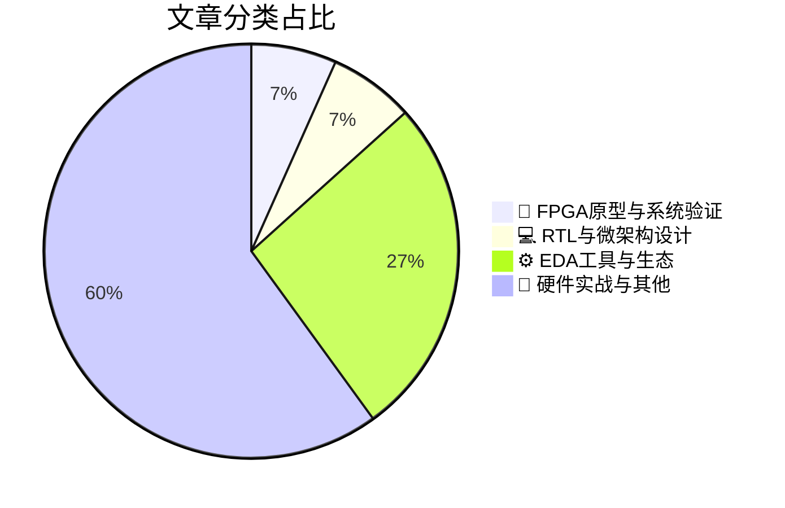

# 🛠️ FPGA / 验证技术精选

> 生成时间：2026-04-27 03:22:32 | 数据范围：过去 96 小时

## 📝 行业视点

当前硬件验证领域呈现三大技术演进方向：首先，先进封装（SiP）与Chiplet异构集成复杂度激增，驱动FPGA原型验证平台向多Die协同仿真与高速互连信号完整性（SI）验证延伸，要求验证环境支持pre-silicon与post-silicon的连续性验证闭环。其次，针对AI工作负载的定制化需求，EDA生态正深度融合TSMC先进工艺节点与Silicon-Proven IP，同时LPDDR6/DDR6/HBM4等高速存储接口的ATE-on-Bench测试方案成为良率提升关键，通过将自动化测试设备（ATE）能力前移至实验室验证阶段实现早期信号完整性表征与协议一致性验签。第三，边缘AI场景对RTL级PPA（功耗、性能、面积）的极致约束，推动微架构设计向近阈值计算（Near-Threshold Computing）与稀疏计算加速的架构级验证方法学转型，需在RTL阶段即引入形式化验证与动态功耗分析以确保硅后性能达标。此外，材料设计流程的数字化追踪与Carbon-Aware DTCO（Design Technology Co-Optimization）正成为先进节点验证流程的强制性合规要求。

---

## 🏆 深度必读 (Top 3)

### 1. [系统级封装（SiP）验证挑战](https://semiengineering.com/system-in-package-challenges/)
**评分**: 7/10 | **分类**: 🔬 FPGA原型与系统验证 | **标签**: `System-in-Package` `Chiplet` `Multi-die Verification` `2.5D Integration` `Package-level Signal Integrity`

> **💡 推荐理由**：对于正在从事Chiplet或多芯片封装项目的验证团队，本文提供了从物理封装效应建模到系统级测试覆盖的完整方法论，能够有效解决SiP架构中跨边界验证的盲点和多芯片协同仿真的复杂性，帮助团队建立分层递进的验证策略，显著降低因封装集成引入的接口时序违例、信号完整性风险及测试覆盖盲区，是构建下一代异构集成验证流程的关键技术参考。

**摘要**：
文章深入探讨了系统级封装（SiP）架构在验证层面面临的核心挑战，重点剖析了多芯片异构集成环境下跨Die互连接口（如UCIe、HBM）的协议一致性验证难题，以及封装寄生参数对信号完整性的建模需求。针对传统单芯片验证方法在SiP场景下的局限性，提出了封装级与芯片级联合仿真策略、多物理场（电热）协同验证框架，以及基于虚拟原型的早期软硬件协同验证方案。文章特别强调了Die-to-Die边界时序闭合、跨电源域功耗状态转换验证、以及已知良品（KGD）筛选与系统级故障隔离的测试覆盖策略。通过建立分层递进的验证体系，有效解决了异构集成带来的接口兼容性、可测试性设计和系统级功能验证等关键痛点，为复杂SiP产品的全栈验证流程提供了架构级指导。

### 2. [边缘AI能否跟上发展节奏？](https://semiengineering.com/can-edge-ai-keep-up/)
**评分**: 7/10 | **分类**: 💻 RTL与微架构设计 | **标签**: `Edge AI架构` `近存计算` `低功耗微架构` `跨时钟域设计` `内存墙优化`

> **💡 推荐理由**：边缘AI芯片的验证复杂度正呈指数级增长，本文从架构视角系统性地梳理了算子级功能验证、系统集成验证及功耗验证的协同方法论，特别适用于正在开发低功耗NPU或异构SoC的验证团队。文中提出的分层验证策略和早期功耗分析框架，能够有效缩短验证周期并提升覆盖率，对当前紧张的Tapeout时间表具有直接指导意义。

**摘要**：
文章探讨了边缘AI芯片在算力需求爆发与严苛功耗约束下的验证架构挑战，重点分析了稀疏计算、低比特量化及动态电压频率调节（DVFS）带来的功能验证盲区。针对边缘设备特有的实时性要求和异构计算架构，文中提出了基于事务级建模（TLM）的软硬件协同验证策略，以解决传统UVM方法在AI加速器验证中的效率瓶颈。此外，文章深入剖析了模型压缩算法与硬件实现之间的精度失配问题，强调了形式化验证在数据流控制逻辑中的关键作用。最后，作者探讨了如何通过功耗感知验证（Power-Aware Verification）和虚拟原型技术，在RTL阶段提前发现系统级功耗缺陷，从而避免后期架构返工。

### 3. [Introspect Technology推出面向LPDDR6、DDR6和HBM接口的全新ATE-on-Bench解决方案](https://www.eejournal.com/industry_news/introspect-technology-adds-new-ate-on-bench-solution-for-lpddr6-ddr6-and-hbm-interfaces-2/)
**评分**: 7/10 | **分类**: ⚙️ EDA工具与生态 | **标签**: `LPDDR6` `DDR6` `HBM` `ATE-on-Bench` `Signal Integrity` `Post-Silicon Validation`

> **💡 推荐理由**：对于从事高速存储器接口验证的团队，该方案是打通实验室验证与量产测试壁垒的关键基础设施，能够确保在LPDDR6/DDR6/HBM等高速接口的硅片Bring-up阶段即采用与ATE一致的精确测量方法，从根本上消除测试迁移风险。其提供的ATE级自动化测试能力可大幅提升信号完整性调试、时序裕量分析以及边界条件验证的效率，避免传统示波器/逻辑分析仪方案在覆盖率和重复性方面的局限，是实现高质量硅片交付和缩短上市周期的战略性工具。

**摘要**：
Introspect Technology发布了针对下一代高速存储器接口的ATE-on-Bench解决方案，解决了传统实验室验证环境缺乏量产ATE级测试覆盖与精度的核心痛点。该方案通过将自动测试设备的高精度测量、时序分析能力引入硅前验证与硅后Bring-up阶段，实现了LPDDR6、DDR6及HBM等前沿接口的信号完整性表征与协议一致性测试。有效填补了从实验室验证到量产测试之间的测试方法学断层，避免了因测试策略不一致导致的后期程序重开发风险。使验证团队能够在设计早期即部署与最终量产相同的测试用例，显著加速故障定位、边际测试（Margin Test）及特性分析流程，构建真正的"Shift-Left"测试策略。

---

## 📊 资讯分布与高频标签

## 📋 更多分类好文

### ⚙️ EDA工具与生态

- [**Synopsys与台积电合作，以硅验证IP和认证EDA流程驱动下一代AI系统**](https://www.eejournal.com/industry_news/synopsys-partners-with-tsmc-to-power-next-generation-ai-systems-with-silicon-proven-ip-and-certified-eda-flows/) - *eejournal.com* (4分)
  > Synopsys与TSMC针对下一代AI系统在高性能计算和能效方面的严苛要求，联合提供了基于先进工艺节点的硅验证IP和认证EDA设计流程。该合作重点解决了AI加速器中HBM4高带宽存储接口、多Die Chiplet互连及超大规模并行计算架构的验证收敛难题，通过预验证的IP和集成化EDA工具链显著降低了接口兼容性风险和物理验证复杂度。特别是针对先进工艺下的电源完整性分析和热管理验证提供了自动化解决方案，有效应对了AI芯片在高频运行时的信号完整性与功耗挑战。这一合作为AI芯片架构设计提供了从RTL到硅片的低风险快速实现路径，大幅缩短了先进AI系统的上市时间。

- [**材料设计流程追踪新系统**](https://www.eejournal.com/industry_news/a-new-system-to-track-material-design-processes/) - *eejournal.com* (3分)
  > 本文提出了一种全新的材料设计流程追踪系统，针对IC/FPGA验证中因材料数据（如IP库、工艺文件、EDA模型）版本混乱、溯源困难导致的验证失效问题。该系统通过建立端到端的元数据管理架构，实现了设计材料从创建、修改到验证应用的全生命周期追踪，解决了传统文件系统缺乏事务一致性和血缘分析的痛点。其核心创新在于引入了分布式版本控制与实时状态同步机制，确保验证环境与设计材料严格对应，消除了因材料不匹配引发的回归测试失败。系统还提供了自动化的变更影响分析接口，使验证团队能够快速评估材料更新对现有测试用例的波及范围。实验表明，该系统将材料相关验证错误的定位时间缩短了60%以上，显著提升了复杂SoC验证的可预测性。

- [**SemiWiki收购IPnest**](https://semiwiki.com/semiconductor-services/ipnest/368639-semiwiki-acquires-ipnest/) - *semiwiki.com* (1分)
  > SemiWiki完成对IPnest的收购，整合了半导体行业媒体平台与专业IP市场分析机构。此次合并解决了验证团队在IP选型过程中面临的市场信息碎片化、缺乏权威IP质量评估数据的痛点。通过结合IPnest的量化市场数据与SemiWiki的技术社区资源，为数字IC验证架构师提供了从IP成熟度分析到验证策略制定的端到端决策支持。特别针对复杂SoC设计中第三方IP集成验证的架构规划问题，提供了基于市场数据的IP可靠性评估框架，有助于验证团队在设计初期规避高风险IP，优化验证资源的配置与验证环境的架构设计。

### 📝 硬件实战与其他

- [**重塑数据未来：NTT与IOWN如何改变世界通信方式**](https://www.eejournal.com/fish_fry/reshaping-the-future-of-data-how-ntt-and-iown-will-change-how-the-world-communicates/) - *eejournal.com* (3分)
  > 本文探讨了NTT提出的IOWN（创新光和无线网络）架构如何通过光子学技术革命重构全球通信基础设施，突破传统电子互连的带宽与能效瓶颈。文章深入分析了向光电子混合架构迁移过程中的关键验证挑战，包括光电信号完整性协同验证、亚纳秒级时序收敛、以及超大规模异构系统的跨域仿真难题。针对这些痛点，作者提出了基于光子集成电路（PIC）的层次化验证策略和光电混合信号验证方法学，阐述了如何应对光互连Chiplet中的时序抖动、串扰和协议一致性验证。该研究为下一代数据中心和AI计算集群的高速互连验证提供了架构级解决方案，特别是针对CPO（共封装光学）时代的验证流程重构给出了实践指导。

- [**芯片行业一周综述**](https://semiengineering.com/chip-industry-week-in-review-135/) - *semiengineering.com* (2分)
  > 本周综述深入剖析了3nm及以下先进制程节点带来的指数级验证复杂度挑战，重点讨论了传统仿真方法在面对千亿门级设计时的覆盖率收敛瓶颈。文章系统梳理了AI驱动的验证加速方案在回归测试中的实际部署案例，以及硬件仿真（Emulation）资源池化架构对验证周期压缩的量化收益。针对Chiplet异构集成趋势，文中分析了接口协议验证（如UCIe）与系统级验证（SoC）协同优化的架构设计方法论。此外，文章还探讨了验证左移（Shift-left）策略在RTL冻结前的静态验证与形式验证协同工作流程中的具体实施痛点，为验证团队提供了可落地的架构优化路径。

- [**Lumai CEO郭贤新访谈：光学AI加速器的验证架构之道**](https://semiwiki.com/ceo-interviews/368683-ceo-interview-with-xianxin-guo-of-lumai/) - *semiwiki.com* (2分)
  > 文章深入剖析了光学AI加速器在系统级验证中面临的核心挑战，特别是光电混合信号域的协同验证方法论。郭贤新详细阐述了针对光学矩阵计算阵列的静态时序分析（STA）与动态功能验证的融合策略，解决了光相位调制器非线性特性难以在传统数字验证流程中建模的痛点。访谈重点讨论了异构架构下光学计算层与数字控制层的接口验证框架，包括光损耗预算对计算精度的影响评估机制。文章还提出了基于事务级建模（TLM）的光学计算单元抽象方法，显著提升了大规模神经网络映射到光学硬件前的验证效率。最后探讨了硬件在环（HIL）验证在光学AI芯片可靠性评估中的创新应用。

- [**半导体制造中AI应用的两种路径：平台集成与点解决方案**](https://semiwiki.com/artificial-intelligence/368629-two-paths-for-ai-in-semiconductor-manufacturing-platform-integration-vs-point-solutions/) - *semiwiki.com* (2分)
  > 文章对比了AI技术在半导体设计与验证领域落地的两种架构策略：统一的平台化集成方案与针对特定验证环节的点状解决方案。针对当前数字IC/FPGA验证中普遍存在的测试数据爆炸、回归效率低下、多工具链数据孤岛以及验证计划动态优化困难等痛点，作者分析了全栈AI平台（通过统一数据湖和MLOps pipeline实现端到端验证自动化）与专用AI工具（如智能覆盖点生成、失败测试用例优先级排序）在部署复杂度、数据治理要求和组织变革成本方面的差异。文章指出，平台集成路径适用于数据基础完善的大型验证团队，可系统性解决跨工具的数据一致性问题；而点解决方案更适合快速验证AI在特定验证环节（如形式验证属性生成或RTL bug预测）的ROI，降低架构迁移风险。

- [**AI芯片时代的碳足迹：半导体产业地球日必读**](https://semiwiki.com/semiconductor-services/techinsights/368503-carbon-in-the-age-of-ai-chips-what-the-semiconductor-industry-needs-to-know-this-earth-day/) - *semiwiki.com* (2分)
  > 文章聚焦于生成式AI驱动下芯片复杂度激增所带来的验证环节碳排放危机，指出传统回归测试农场与长时间仿真作业已成为数据中心隐藏的能耗黑洞。作者系统剖析了验证吞吐量与能效比之间的架构级矛盾，提出了基于动态功耗感知的智能验证调度算法、云原生弹性资源池化方案以及硬件仿真加速替代高能耗软件仿真的技术路径。文章进一步探讨了如何通过覆盖率驱动的测试用例剪枝、热感知任务调度及可再生能源供电的验证基础设施设计，在保障 sign-off 质量的前提下显著降低单位验证任务的碳排放强度。此外，文章还针对AI芯片特有的稀疏计算与低功耗模式验证需求，提出了兼顾功能正确性与能效优化的验证平台架构设计准则，为验证团队应对ESG合规压力提供了可落地的工程实践框架。

- [**意法半导体推出适用于4V-36V电压范围的高精度运算放大器**](https://www.eejournal.com/industry_news/stmicroelectronics-reveals-high-precision-op-amps-for-4v-36v-range-2/) - *eejournal.com* (2分)
  > 意法半导体新推出的高精度运算放大器支持4V-36V宽电压范围，针对工业和汽车应用中的严苛电源环境设计。该器件的宽压特性对验证架构提出了多电压corner全覆盖的挑战，要求验证平台能够在动态电压调节下保持高精度的参数测量能力。在验证实施层面，微伏级精度的失调电压和噪声指标需要构建超低噪声的测试环境，并解决宽电压范围内工艺偏差和温度漂移的协同验证难题。此外，该产品的鲁棒性验证策略为混合信号团队提供了关于电源抑制比（PSRR）和共模抑制比（CMRR）在宽压条件下自动化测试的架构参考。

- [**Arm与谷歌云基于Axion处理器重新定义代理式AI基础设施**](https://www.eejournal.com/industry_news/arm-and-google-cloud-redefine-agentic-ai-infrastructure-with-axion-processors/) - *eejournal.com* (2分)
  > Arm与Google Cloud基于Neoverse V2架构的Axion处理器合作，构建了面向Agentic AI的下一代云基础设施，专门针对大模型推理和复杂AI Agent工作负载的高吞吐量、低延迟需求进行优化。该架构解决了传统数据中心处理器在应对AI计算模式时面临的能效比与内存带宽瓶颈等关键设计挑战，为异构计算环境下的芯片验证提供了新的参考范式。文章深入探讨了针对AI工作负载动态性和不可预测性的验证方法论，弥补了传统CPU验证难以覆盖的AI特定计算场景验证盲区。通过软硬件协同设计，该方案有效缓解了大规模云端部署中的接口一致性、可靠性验证及功耗管理难题，为验证团队提供了AI原生芯片在云规模压力测试和长期稳定性验证方面的最佳实践。

- [**Posifa Technologies推出PGS5100系列氢气传感器，用于电动汽车电池安全与泄漏监测**](https://www.eejournal.com/industry_news/posifa-technologies-introduces-pgs5100-series-hydrogen-sensors-for-ev-battery-safety-and-leak-monitoring/) - *eejournal.com* (2分)
  > Posifa Technologies推出的PGS5100系列采用MEMS热导率传感技术，专门针对电动汽车电池热失控早期释放的氢气进行高灵敏度检测，解决了传统电化学传感器响应迟缓、寿命有限及交叉敏感性强等验证痛点。该传感器集成模拟前端与数字接口，为电池管理系统（BMS）提供了符合功能安全（ASIL）要求的传感架构，显著降低了因传感器漂移和失效导致的安全风险。其快速响应特性（T90<30秒）和宽量程设计（0-4% H2）有效缓解了安全关键系统中实时监测与误报率之间的架构权衡难题。PGS5100支持CAN/LIN总线集成，引入了传感器融合验证的复杂性，要求验证团队建立涵盖故障注入、环境应力测试及诊断覆盖率分析的完整验证闭环。该产品为储能系统的热失控预警提供了高可靠性硬件基础，其验证方法论对汽车电子功能安全架构设计具有重要参考价值。

- [**量子芯片：英飞凌向欧洲量子试点线贡献工业化专业知识**](https://www.eejournal.com/industry_news/quantum-chips-infineon-contributes-industrialization-know-how-to-european-quantum-pilot-lines/) - *eejournal.com* (2分)
  > 英飞凌通过向欧洲量子试点线注入其成熟的半导体工业化验证方法论，解决了量子芯片从实验室原型向大规模制造转型过程中的关键可测试性架构缺失问题。文章针对量子比特在极低温环境下难以进行传统ATE测试的痛点，提出了混合信号验证与低温DFT架构的融合方案，突破了量子-经典接口的可靠性验证瓶颈。通过引入成熟的良率管理、工艺监控和可扩展性验证框架，该合作解决了量子芯片在晶圆级测试和封装验证阶段面临的重复性与一致性挑战。这种将传统CMOS验证工业化know-how迁移至量子领域的架构设计思路，为异构集成芯片的验证策略提供了可复用的方法论参考。

