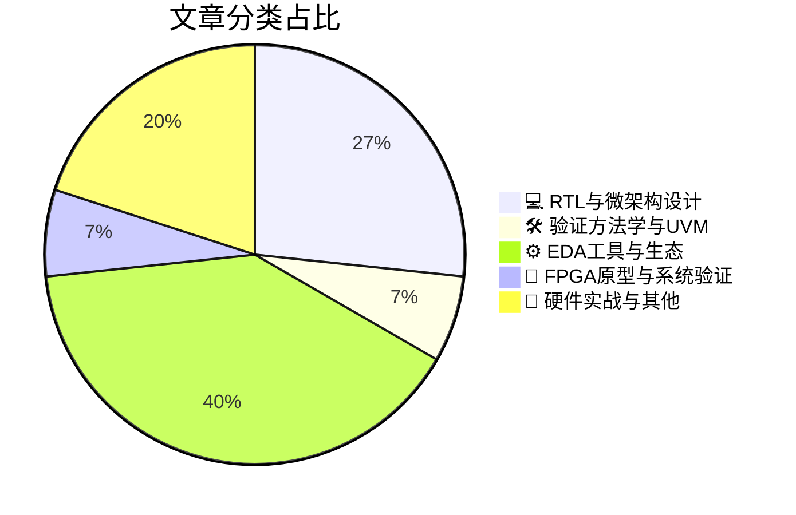

# 🛠️ FPGA / 验证技术精选

> 生成时间：2026-05-04 03:34:11 | 数据范围：过去 96 小时

## 📝 行业视点

Chiplet异构集成架构正推动验证重心从单Die RTL向多Die UCIe互连合规性转移，先进封装（Advanced Package）的跨基板信号完整性（SI）与电源完整性（PI）协同分析成为系统级签核（Sign-off）的关键瓶颈。AI Agent驱动的EDA方法论（Agentic EDA）正在瓦解传统工具链碎片化（Tool Fragmentation）壁垒，通过LLM增强的Root Cause Analysis与自动化Debug闭环，实现全芯片SoC级故障定位效率的量级提升。先进工艺节点（Advanced Nodes）的DRC收敛与高速串行链路AMI（Algorithmic Modeling Interface）建模深度融合，要求验证流程在物理实现与逻辑功能间建立实时反馈机制。此外，TSMC等代工厂的设计解决方案表明，时钟抖动（Clock Jitter）抑制与微架构级低功耗优化已成为3nm及以下节点物理验证与架构签核的交叉焦点。

---

## 🏆 深度必读 (Top 3)

### 1. [从标准到系统：Arm架构下的Chiplet时代](https://semiengineering.com/from-standards-to-systems-the-chiplet-era-on-arm/)
**评分**: 8/10 | **分类**: 💻 RTL与微架构设计 | **标签**: `Chiplet` `UCIe` `System Architecture` `Interconnect` `Heterogeneous Integration`

> **💡 推荐理由**：本文直击当前Chiplet验证的最大痛点——如何在标准不一、接口异构的分布式系统中确保功能正确性与互操作性，对验证团队制定多Die协同验证策略、搭建跨Die协议一致性检查环境具有重要参考价值。文章提供的从标准合规到系统集体验证的层次化方法，能够帮助验证工程师有效应对Die-to-Die边界测试、高速 SerDes链路验证及系统级Fault Injection等复杂场景，是构建下一代Chiplet验证平台的方法学指南。

**摘要**：
文章深入探讨了Chiplet架构在Arm生态系统中从标准制定到系统集成的演进路径，重点剖析了多Die集成带来的验证复杂性与架构设计挑战。针对Die-to-Die接口（如UCIe）的PHY/MAC层验证、跨Die缓存一致性协议验证、以及系统级功耗/性能协同仿真等核心痛点，提出了基于标准化接口的层次化验证策略。文章解决了传统单芯片验证方法学无法覆盖的多物理场耦合验证难题，强调了早期架构探索中虚拟原型与硬件仿真（Emulation）协同的重要性，为Chiplet时代的系统级验证方法论提供了实践指导。

### 2. [Bronco AI网络研讨会：15分钟实现全芯片SoC调试](https://semiwiki.com/eda/bronco-ai/368908-bronco-ai-webinar-full-chip-soc-debug-in-15-minutes/)
**评分**: 8/10 | **分类**: 🛠️ 验证方法学与UVM | **标签**: `AI辅助调试` `SoC验证收敛` `调试效率优化` `Root Cause Analysis` `全芯片验证`

> **💡 推荐理由**：对于面临Tapeout压力、需要处理大量nightly regression失败记录的验证团队而言，该文提供的AI驱动调试方法论能够从根本上改变'大海捞针'式的手工调试模式，将验证工程师从繁重的信号追踪和波形比对工作中解放出来，专注于验证场景设计和覆盖率收敛。特别是其中关于全芯片级调试效率提升的实践案例，对当前日益复杂的SoC验证项目具有极高的参考价值，有助于验证Leader构建更高效的验证流程并缩短产品上市时间。

**摘要**：
该文章介绍了Bronco AI平台如何通过人工智能驱动的调试方法解决传统全芯片SoC验证中调试周期漫长、信号追踪复杂以及根因定位困难的痛点。传统的全芯片调试往往需要数天甚至数周来手动追踪跨模块的bug，而Bronco AI利用机器学习算法自动分析仿真失败日志、智能追踪信号传播路径并快速定位根因，将调试时间压缩至15分钟。该技术特别解决了大规模SoC中跨时钟域、多电源域以及复杂互连架构下的调试难题，通过自动化根因分析显著提升了验证效率。文章还探讨了AI辅助调试在回归测试失败分析、随机约束求解失败定位以及UVM环境调试中的具体应用场景，为验证团队提供了可量化的生产力提升方案。

### 3. [基于AMI模型的高速串行链路信号完整性验证技术](https://semiengineering.com/unlocking-high-speed-serial-link-signal-integrity-with-ami-model/)
**评分**: 7/10 | **分类**: ⚙️ EDA工具与生态 | **标签**: `AMI Modeling` `Signal Integrity` `High-Speed Serial Link` `IBIS-AMI` `Channel Simulation` `SerDes`

> **💡 推荐理由**：对验证团队而言，此文价值在于提供了一种在数字验证域高效解决模拟SI问题的工程化方案，避免了传统SPICE仿真的性能瓶颈；通过AMI模型集成，团队可在芯片级验证阶段提前发现信号完整性缺陷，显著降低硅后调试风险，特别适用于需要支持56G/112G PAM4等高速接口的先进节点项目，是构建混合信号验证能力的关键技术参考。

**摘要**：
文章聚焦高速串行链路（如PCIe Gen5/6、112G Ethernet）系统级验证中信号完整性（SI）分析效率低下与数模混合仿真收敛困难的痛点，提出基于IBIS-AMI算法的分层验证架构。传统SPICE仿真无法支撑百万码流的误码率（BER）统计，而现有数字验证平台又缺乏对通道损耗、Tx/Rx均衡（FFE/DFE/CTLE）及抖动传递的精确建模能力。通过将AMI算法模型与通道S参数嵌入UVM验证环境，该方案实现了在事务级验证中快速生成眼图、浴盆曲线和链路裕量报告，将SI验证周期从数周缩短至数小时。文章详细解析了AMI模型与数字激励的协同仿真机制，解决了模拟行为模型与数字序列器同步的架构难题，为高速接口的硅后相关性（silicon correlation）提供了可预测的前端验证流程。

---

## 📊 资讯分布与高频标签

## 📋 更多分类好文

### ⚙️ EDA工具与生态

- [**通过自动化与集成加速复杂SoC设计**](https://semiengineering.com/facilitating-complex-soc-design-through-automation-and-integration/) - *semiengineering.com* (7分)
  > 本文针对现代SoC设计规模指数级增长导致的验证空间爆炸、异构IP集成困难及验证环境碎片化等核心痛点，提出了一套基于自动化与集成的验证架构方法论。文章阐述了如何通过验证环境自动生成、智能回归测试调度以及CI/CD流水线集成，解决传统人工搭建测试平台效率低、维护成本高的问题；同时探讨了基于标准化VIP（Verification IP）复用和层次化验证架构的集成策略，以应对多核、多协议SoC的验证收敛挑战。该方案强调在早期架构阶段引入可重用验证IP和统一验证平台，显著缩短验证周期并提升覆盖率收敛效率，为超大规模芯片的验证 sign-off 提供了系统化解决思路。

- [**先进工艺节点下DRC收敛方法的变革**](https://semiengineering.com/transforming-drc-closure-at-advanced-nodes/) - *semiengineering.com* (6分)
  > 文章针对先进工艺节点（7nm及以下）传统DRC流程面临的设计规则爆炸性增长、迭代收敛周期过长以及多图案化/EUV等复杂工艺规则带来的验证生产力瓶颈，提出了一种变革性的DRC收敛架构。该方案通过引入机器学习预测模型、增量式验证引擎和智能修复建议系统，重构了物理验证与设计实现之间的反馈环路，实现了DRC问题的左移（Shift-left）预防与自动修复。文章详细阐述了分布式计算架构在DRC并行处理中的应用，以及如何通过数据驱动的验证策略将传统'设计-验证-修复'的串行迭代模式转变为预测性、并发的收敛流程，显著缩短了先进节点芯片的物理验证周期。

- [**构建智能化Agent驱动的EDA方法论**](https://semiengineering.com/creating-agentic-eda-methodologies/) - *semiengineering.com* (6分)
  > 随着数字芯片设计规模与验证空间呈指数级增长，传统人工驱动的验证流程面临回归效率低下、调试周期冗长及覆盖率收敛困难等关键痛点。本文提出了一种革命性的Agentic EDA方法论，通过部署具备自主规划与执行能力的AI智能体验证代理，实现从测试生成、故障诊断到覆盖率优化的全自动化闭环。该架构采用多Agent协作框架，将验证任务分解为需求解析、激励生成、结果分析与策略调整等独立智能体模块，并通过标准化接口与现有SV/UVM验证环境深度集成。相较于传统方法，该方案可大幅减少人工编写定向测试的工作量，加速根因定位速度，并在复杂 corner case 探索中展现出超越人工的系统性搜索能力。文章进一步详细阐述了在数字IC仿真与FPGA原型验证中落地该架构的具体实施策略、工具链适配方案及人机协同的最佳实践。

- [**解决EDA工具碎片化危机**](https://semiwiki.com/eda/siemens-eda/368855-solving-the-eda-tool-fragmentation-crisis/) - *semiwiki.com* (6分)
  > 文章深入剖析了当前数字IC验证流程中因EDA工具生态碎片化导致的互操作性缺失、数据孤岛及跨平台调试效率低下等核心痛点。针对仿真、形式验证、原型验证及硬件加速等不同环节间工具链割裂带来的重复劳动与维护成本激增问题，作者提出了基于开放API和统一数据格式的可插拔式验证平台架构。该方案通过建立标准化的数据交换层，实现覆盖率、波形、断言及调试信息在异构工具间的无缝流转与协同分析。文章进一步探讨了如何通过云原生架构与开源接口打破供应商锁定，构建具备高度扩展性的验证基础设施。这一架构设计旨在显著降低流程集成复杂度，提升验证收敛效率，并增强验证团队应对复杂SoC设计挑战的敏捷性。

- [**IPLM：面向未来的IP生命周期管理网络研讨会（5月19日）**](https://semiwiki.com/eda/perforce/368866-iplm-future-forward-webinar-may-19th/) - *semiwiki.com* (3分)
  > 本文深入探讨了数字IC/FPGA设计中IP生命周期管理（IPLM）面临的核心挑战，针对验证团队普遍遭遇的IP版本混乱、多项目复用一致性难以保障、验证环境配置漂移等具体痛点，提出了基于单一事实来源（Single Source of Truth）的统一管理架构。文章详细阐述了如何通过自动化IP集成管道实现版本追溯、依赖关系智能解析及验证状态实时同步，解决了传统手工管理方式中IP状态不可见、集成错误难以定位等关键架构设计问题。此外，该研讨会还展望了云原生IPLM与CI/CD流程深度融合的未来趋势，为大规模SoC验证提供了可扩展的IP治理框架和最佳实践指南。

### 💻 RTL与微架构设计

- [**如何优化先进封装互连设计流程**](https://semiengineering.com/how-to-streamline-your-advanced-package-interconnect-designs/) - *semiengineering.com* (7分)
  > 针对2.5D/3D集成及Chiplet架构中多芯片互连的复杂验证挑战，本文提出了一套系统化的设计优化方法论。文章重点解决了跨Die高速互连的电气特性验证、协议一致性检查（如UCIe/BoW）以及系统级时序收敛等关键痛点。通过引入分层验证架构和早期虚拟原型技术，实现了从物理层信号完整性到逻辑层功能验证的纵向贯通。文中阐述了自动化互连检查流程与可重用验证IP（VIP）策略，显著缩短了多芯片协同仿真的迭代周期。最后探讨了基于硬件仿真加速的系统级验证方案，为超大规模封装设计的签核（Sign-off）提供了可行性路径。

- [**解决时钟信号完整性与抖动问题**](https://semiengineering.com/solving-clock-signal-integrity-and-jitter-issues/) - *semiengineering.com* (7分)
  > 文章针对高速数字系统中时钟信号完整性恶化和抖动累积导致的时序失效与误码问题，提出了从架构设计到验证实现的系统性解决方案。核心解决了传统功能验证难以精确建模时钟抖动、电源噪声耦合及工艺偏差对时钟质量影响的痛点，探讨了如何在仿真环境中注入基于实际物理特性的抖动场景。文章阐述了时钟抖动预算分配架构、全芯片时钟完整性验证平台搭建方法，以及高速SerDes/DDR接口中时钟恢复电路的抖动容限验证策略。通过结合混合信号仿真、静态时序分析与统计时序建模，该方法能够在流片前有效预测硅片级时钟性能，避免因时钟质量问题导致的系统失稳。

- [**吕理钦博士：台积电先进工艺设计解决方案**](https://semiwiki.com/semiconductor-manufacturers/tsmc/368891-368891/) - *semiwiki.com* (6分)
  > 文章深入剖析了台积电先进工艺节点（如3nm及以下）带来的物理验证复杂度激增、时序收敛困难及信号完整性挑战，提出了涵盖设计实现、物理签核与可靠性验证的全栈式解决方案架构。重点解决了高密度金属层叠带来的电磁效应（EM）验证、工艺变异（Process Variation）统计时序分析、以及3D IC异构集成中的热效应与应力协同验证等关键痛点。通过标准化DFT架构与先进封装协同设计方法，建立了从单元级到系统级的分层验证流程，有效应对了先进制程下设计规则（DRC）爆炸式增长带来的验证收敛难题。文章还阐述了基于机器学习辅助的验证加速技术与云原生EDA工具链集成策略，为超大规模SoC及Chiplet设计提供了可扩展的验证基础设施。

### 🔬 FPGA原型与系统验证

- [**FLUX有限公司发布国防瞄准与跟踪系统精密位置反馈技术白皮书**](https://www.eejournal.com/industry_news/flux-gmbh-releases-whitepaper-on-precision-position-feedback-for-aiming-and-tracking-systems-in-defense-applications/) - *eejournal.com* (6分)
  > FLUX GmbH发布的白皮书针对国防应用中高精度瞄准与跟踪系统的位置反馈架构进行了深入分析，重点解决了多源传感器数据同步、高带宽实时控制回路及极端电磁环境下的信号完整性验证难题。文章探讨了混合信号接口（如Resolver/Sincos编码器、激光测距）与数字处理单元协同设计中的量化误差控制和跨时钟域时序收敛问题，提出了基于硬件在环（HIL）的故障注入验证框架。针对安全关键属性，文中阐述了符合DO-254等航空电子标准的确定性延迟验证方法及容错机制的形式化验证策略，为高可靠性FPGA/ASIC实现提供了可复用的验证参考模型和覆盖率评估体系。

### 📝 硬件实战与其他

- [**AI基础设施的隐秘真相：为何“堆砌GPU”注定失败**](https://www.eejournal.com/fish_fry/the-hidden-truths-of-ai-infrastructure-why-just-add-gpus-always-fails/) - *eejournal.com* (4分)
  > 文章揭示了AI基础设施建设中单纯增加GPU数量无法解决系统性瓶颈的误区，深入剖析了网络带宽瓶颈、内存墙限制、数据流水线中断及功耗热管理等架构级验证盲区。文章指出，大规模AI集群的验证痛点在于分布式训练同步机制、节点间通信延迟、故障恢复一致性以及真实工作负载下的长尾延迟等复杂场景，而非单一算力单元功能正确性。作者强调了硬件-软件协同验证的必要性，提出需构建涵盖网络拓扑、存储层次、任务调度算法的全栈验证环境，以捕获仅在系统规模扩展时才会出现的边缘案例和性能 cliff。此外，文章讨论了验证环境复用、回退机制设计以及面对不可预测AI工作负载时的动态压力测试策略，为解决超大规模AI系统验证覆盖率难题提供了架构级思路。

- [**基于非易失性低损耗相变材料的光子FPGA潜在路径（牛津大学）**](https://semiengineering.com/potential-route-to-photonic-fpca-using-nv-low-loss-phase-change-material-oxford/) - *semiengineering.com* (3分)
  > 牛津大学研究团队提出了一种基于非易失性低损耗相变材料（PCM）的光子现场可编程门阵列（FPCA）架构创新方案，通过利用相变材料的光学特性可逆调制实现了光子器件的可重构编程，同时显著降低了传统热光调谐方案的高能耗与信号损耗问题。该架构的核心挑战在于相变材料在光波导中的集成一致性验证，以及非易失性状态保持与快速重配置之间的可靠性权衡。文章详细讨论了低损耗相变单元的光学特性建模难点，指出需要建立针对光-热-电多物理场耦合的新型验证方法论。此外，针对光子FPGA的可编程互连架构，提出了基于相变开关的路由资源验证痛点，包括插入损耗测试覆盖、相位稳定性验证以及大规模集成时的串扰分析等关键验证问题。

- [**Ambiq compressionKIT将边缘AI内存与功耗降低高达20倍**](https://www.eejournal.com/industry_news/ambiq-compressionkit-cuts-edge-ai-memory-and-power-by-up-to-20x/) - *eejournal.com* (3分)
  > Ambiq推出的compressionKIT通过先进的模型压缩与量化技术，解决了边缘AI设备在严格资源约束下的部署难题，实现了高达20倍的内存占用和能耗削减。该技术引入了对压缩后神经网络的功能等价性验证挑战，要求验证团队建立从浮点原始模型到定点压缩模型的精度对齐流程，确保在极端量化位宽下维持可接受的推理准确度。架构层面需重新验证内存子系统的带宽分配策略和计算单元利用率，以匹配压缩后模型稀疏化带来的非规则访存模式变化。此外，该方案还涉及软硬件协同验证，需确认编译器生成的压缩指令集与专用加速器的时序配合，避免流水线空泡和内存墙瓶颈。

