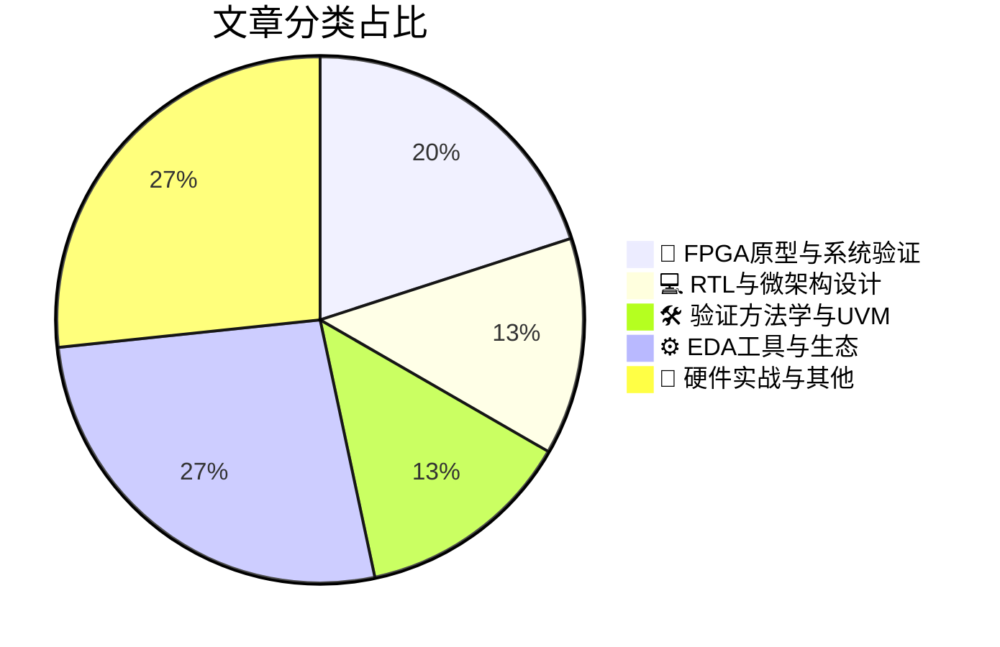

# 🛠️ FPGA / 验证技术精选

> 生成时间：2026-05-11 03:30:36 | 数据范围：过去 96 小时

## 📝 行业视点

数字孪生（Digital Twin）技术正从系统架构层面重塑硬件验证范式，通过高保真虚拟原型实现软件定义汽车与RF系统的早期软硬件协同验证，显著降低物理原型阶段的集成风险。随着2.5D/3D异构集成（Chiplet-based architectures）成为算力扩展的主流路径，验证重心正从单芯片RTL向多芯片互连安全性、3D-IC电源完整性及热-电耦合效应的多物理场协同验证迁移。形式化验证（Formal Verification）与基于UVM的动态仿真方法学呈现深度融合趋势，通过数学严谨性补充传统约束随机验证（CRV）的覆盖盲区，特别是在AI加速器与医疗边缘计算设备的可靠性和功能安全验证中形成互补验证闭环。

---

## 🏆 深度必读 (Top 3)

### 1. [走出诊所：构建高可靠边缘AI医疗设备的蓝图](https://semiengineering.com/beyond-the-clinic-a-blueprint-for-developing-reliable-edge-ai-enabled-medical-devices/)
**评分**: 8/10 | **分类**: 🔬 FPGA原型与系统验证 | **标签**: `Edge AI` `Medical Device` `Functional Safety` `System Verification` `Reliability`

> **💡 推荐理由**：对于数字IC/FPGA验证团队而言，本文提供了医疗AI芯片验证的关键方法论，特别是如何应对AI模型黑盒特性与医疗功能安全（如IEC 60601、ISO 14971）的严格要求。文中提出的边缘设备资源约束下的验证策略、算法-硬件协同验证流程以及长期可靠性监控机制，对从事低功耗AI加速器、医疗SoC验证的工程师具有直接指导意义，有助于建立符合医疗认证标准的完整验证闭环。

**摘要**：
本文针对医疗边缘AI设备提出了系统性的可靠性开发框架，重点解决了AI算法在资源受限边缘节点部署时的功能安全验证难题。文章深入探讨了医疗级设备面临的模型不确定性量化、实时推理延迟约束以及长期运行中的模型漂移检测等验证痛点，提出了融合软硬件协同验证与持续监控的架构设计方案。作者详细阐述了满足FDA/IEC 62304医疗软件标准的验证策略，包括形式化验证、故障注入测试及边缘场景下的鲁棒性验证方法。该框架特别强调了从实验室到临床环境的验证鸿沟，提出了基于数字孪生的预验证与现场监控相结合的混合验证架构，为医疗AI芯片的可靠性保障提供了可落地的技术路径。

### 2. [面向软件定义汽车的电子数字孪生技术兴起](https://semiengineering.com/the-emergence-of-electronics-digital-twins-for-software-defined-vehicles/)
**评分**: 7/10 | **分类**: 🔬 FPGA原型与系统验证 | **标签**: `Digital Twin` `SDV` `Virtual Prototyping` `System-Level Verification` `Hardware-in-the-Loop`

> **💡 推荐理由**：对于数字IC/FPGA验证团队而言，本文提供了汽车电子领域从芯片级到系统级验证的方法论演进路径，特别是在多域融合和软硬件解耦趋势下，数字孪生技术为验证左移、虚拟原型构建以及云原生验证环境部署提供了可落地的架构参考，有助于团队应对SDV时代快速迭代与高质量验证的双重挑战。

**摘要**：
文章针对软件定义汽车(SDV)中电子电气架构日益复杂、软硬件迭代周期错位的验证痛点，提出了基于电子数字孪生(Electronics Digital Twins)的虚拟验证架构。该方案通过构建高保真度的虚拟电子控制单元(ECU)和网络模型，实现了在物理硬件就绪前的软件早期开发与验证(Shift-Left)，解决了传统方法中硬件依赖导致的验证瓶颈。数字孪生环境支持软硬件协同仿真、故障注入和回归测试，为持续集成/持续部署(CI/CD)流水线提供了可扩展的虚拟化验证平台。此外，该架构通过虚实结合(Hardware-in-the-Loop与Virtual-in-the-Loop融合)的方式，实现了系统级场景验证和边界条件测试，显著提升了复杂车载电子系统的验证覆盖率和效率。

### 3. [保障芯粒平台安全：集中式权威与分布式信任相结合的架构](https://semiengineering.com/securing-chiplet-based-platforms-distributed-trust-with-centralized-authority/)
**评分**: 7/10 | **分类**: 💻 RTL与微架构设计 | **标签**: `Chiplet Architecture` `Hardware Security` `Distributed Trust Root` `System-level Verification`

> **💡 推荐理由**：该文直击多芯粒系统验证中的核心痛点——跨厂商信任边界建立和供应链完整性验证，提供了具体的安全验证架构和测试策略，有助于验证团队设计针对性的安全测试用例（如中间人攻击、重放攻击、密钥泄露场景），指导搭建包含硬件信任根的混合验证环境，并建立覆盖芯粒全生命周期的安全回归测试流程。

**摘要**：
随着Chiplet架构成为高性能计算的主流，多厂商异构芯粒集成带来了供应链安全风险、分布式信任边界模糊以及跨die通信完整性等关键验证挑战。本文提出了一种融合集中式安全管控与分布式信任执行的混合架构，通过层次化硬件信任根(RoT)、标准化安全互连协议以及统一的生命周期管理策略，解决了跨芯粒身份认证、密钥派生、固件完整性校验及动态信任度量等验证难题。该架构在保持中央安全控制器统一策略管理的同时，允许各芯粒本地执行安全操作，有效平衡了安全性与系统性能需求。文章详细阐述了针对芯粒间通信的加密验证机制、物理攻击防护策略以及供应链溯源的测试方法，为复杂异构集成系统的安全验证提供了可落地的技术路径与架构指导。

---

## 📊 资讯分布与高频标签

## 📋 更多分类好文

### 💻 RTL与微架构设计

- [**OCP S.O.L.I.D.如何补全数据中心安全验证拼图**](https://semiengineering.com/how-ocp-s-o-l-i-d-completes-the-data-center-security-picture/) - *semiengineering.com* (7分)
  > 文章针对数据中心硬件安全验证中缺乏标准化方法论、安全IP与系统级验证存在断层、以及信任链验证复杂度高等痛点，提出了OCP S.O.L.I.D.（Secure Open Architecture for Datacenter Integrity and Defense）框架的验证架构解决方案。该框架定义了从硅片到系统的全栈安全验证边界，涵盖了硬件信任根（RoT）的形式化验证、安全启动流程的时序检查、以及运行时完整性监控的自动化测试方法。通过建立标准化的安全验证检查点和可重复的测试流程，解决了传统验证中安全需求模糊、攻击面覆盖不全的问题。文章特别强调了针对侧信道攻击和故障注入（Fault Injection）的验证策略，为ASIC/FPGA安全模块提供了从RTL到门级的分层验证指导，显著降低了安全漏洞逃逸风险。

### 🛠️ 验证方法学与UVM

- [**构建无护栏的AI：开放环境芯片验证的架构突破**](https://semiengineering.com/building-ai-without-guardrails/) - *semiengineering.com* (7分)
  > 本文针对AI加速器芯片在开放部署环境中面临的验证挑战，提出了突破传统约束随机范式的无护栏验证架构。传统IC验证依赖严格的输入约束和断言监控来限定合法操作空间，但AI系统需处理真实世界中不可预测、非结构化的数据流，导致常规验证覆盖率模型在边界情况和安全漏洞检测上存在盲区。文章系统性地解决了如何在去除输入护栏的条件下，通过形式化边界探索、对抗性激励生成及概率性覆盖率收敛算法，验证AI硬件在协议违规、噪声注入和恶意攻击下的鲁棒性。该架构引入了动态自适应验证环境，能够智能调整约束策略以主动搜寻AI芯片的功能缺陷与安全漏洞，显著提升了边缘案例的发现效率，为复杂AI SoC的硅后可靠性提供了系统性验证方案。

- [**为硬件世界注入数学严谨性——形式验证探索之旅**](https://semiwiki.com/semiconductor-services/axiomise/369080-bringing-mathematical-rigour-in-the-world-of-hardware-a-journey-into-formal-verification/) - *semiwiki.com* (7分)
  > 文章探讨了如何将数学证明的严谨性引入硬件验证领域，以解决传统仿真方法在状态空间穷尽性上的根本局限。针对仿真验证难以覆盖所有边界条件、corner case遗漏以及回归测试效率低下的痛点，形式验证通过基于断言的数学证明确保设计在所有可能输入序列下的正确性。文章阐述了从基于testbench的仿真向形式化验证迁移的架构设计路径，特别是如何处理状态空间爆炸问题并建立可收敛的验证边界。重点解决了复杂协议一致性验证、并发竞争条件检测以及功能安全属性证明等关键场景下的验证完备性问题，提出了在RTL早期阶段介入（Shift-Left）与Sign-off阶段补漏相结合的双向验证策略。

### 🔬 FPGA原型与系统验证

- [**射频技术的未来：数字孪生与系统集成风险的消除**](https://www.eejournal.com/fish_fry/the-future-of-rf-digital-twins-and-the-elimination-of-system-integration-risks/) - *eejournal.com* (7分)
  > 文章针对传统射频系统集成中硬件依赖性强、物理原型验证成本高、软硬件协同调试困难等痛点，提出了基于数字孪生技术的虚拟验证架构。通过构建RF系统的精确虚拟模型，该方案允许在流片前进行全面的系统级仿真和软硬件协同验证，显著降低后期集成风险。文章详细阐述了如何将数字孪生集成到现有验证流程中，实现"左移"验证策略，使验证团队能够在虚拟环境中提前发现和解决接口时序、协议兼容性及性能瓶颈问题。该方法不仅减少了对昂贵RF测试设备的依赖，还支持自动化回归测试和场景覆盖，大幅提升了复杂RF-数字混合系统的验证效率和首次成功率。

### ⚙️ EDA工具与生态

- [**规模化AI供电：3D-IC为何亟需电源完整性新方案**](https://semiengineering.com/powering-ai-at-scale-why-3d-ics-demand-a-new-approach-to-power-integrity/) - *semiengineering.com* (6分)
  > 随着AI算力需求激增，3D-IC通过垂直堆叠技术成为突破摩尔定律的关键，但传统二维电源完整性（PI）分析方法已无法应对其复杂的跨裸片电源网络挑战。文章揭示了当前验证架构的核心痛点：现有工具链难以有效建模微凸块与硅通孔（TSV）的寄生阻抗、多物理场耦合下的动态IR压降，以及热-电交互作用导致的电源噪声传播。针对这些局限，作者提出必须在架构设计阶段就引入系统级电源意图验证，建立从RTL到物理实现的连续验证流程，而非仅在签核阶段进行静态分析。文章特别强调，AI工作负载的高动态电流特性会加剧Ldi/dt噪声，要求验证团队采用新的动态电源完整性方法学，包括早期电源架构验证和热感知协同仿真。

- [**Breker验证系统CEO Dave Kelf专访：攻克SoC系统级验证复杂性的自动化之路**](https://semiwiki.com/eda/breker-verification-systems/369053-ceo-interview-with-dave-kelf-ceo-of-breker-verification-systems/) - *semiwiki.com* (6分)
  > 本文深入探讨了现代SoC设计面临的系统级验证挑战，特别是传统UVM方法在处理多核并发、复杂软硬件交互场景时的局限性。Dave Kelf阐述了基于可移植激励标准（PSS）的图形化验证方法学，通过自动化测试生成（ATG）技术替代手工编写测试用例，有效解决了从IP级到系统级验证的迁移鸿沟。文章重点剖析了验证团队在应对架构级 corner cases、系统功耗场景及软硬件协同验证时的核心痛点，提出了以需求为导向的验证左移策略。该架构设计思路显著提升了复杂SoC的验证覆盖率与效率，为十亿门级芯片的验证提供了可扩展的解决方案。

- [**2.5D与3D融合：迈向“3.5D”集成时代的验证新范式**](https://semiengineering.com/2-5d-3d-3-5d/) - *semiengineering.com* (5分)
  > 本文提出了面向3.5D先进封装架构的系统性验证方法论，针对2.5D中介层互连与3D垂直堆叠相结合的混合集成技术所带来的多维度验证挑战。文章深入剖析了Chiplet间高速接口、跨die电源完整性及热梯度效应对功能验证的影响，解决了传统2D验证方法在应对三维异构集成时面临的调试可见性不足、多物理场耦合复杂等痛点。作者构建了分层验证架构，整合了虚拟原型、硬件仿真加速与物理感知仿真技术，实现了从单Die RTL验证到多Die系统级协同验证的无缝衔接。该方案特别针对 buried die（埋入式芯片）的边界扫描测试、TSV（硅通孔）信号完整性验证以及2.5D/3D混合拓扑下的时序收敛问题提供了创新性的验证策略，为复杂多芯片系统的 sign-off 流程建立了新的技术基准。

- [**艾睿电子推出基于Web的“数字试测”平台以简化硬件测试**](https://www.eejournal.com/industry_news/arrow-electronics-launches-web-based-digital-test-drive-to-streamline-hardware-testing/) - *eejournal.com* (3分)
  > 艾睿电子推出的“Digital Test Drive”平台通过基于Web的架构解决了传统硬件验证中物理原型获取周期长、测试环境配置复杂及异地团队协作困难等核心痛点。该平台允许工程师通过浏览器远程访问真实硬件或高保真虚拟原型，实现无需物理板卡即可进行早期软硬件协同验证，显著缩短了产品上市时间。其云原生架构支持多用户并发访问和远程调试，有效解决了验证资源碎片化与共享难题，降低了昂贵的实验室设备投入成本。平台通过虚拟化接口层将物理硬件抽象为标准化服务，使验证团队能够在芯片流片前即开展驱动开发和系统集成测试，实现了验证左移（Shift-left）策略。这一架构设计特别适用于现代分布式验证团队，支持跨地域的实时协作与测试数据管理，为复杂SoC和FPGA验证提供了灵活高效的云化解决方案。

### 📝 硬件实战与其他

- [**Geekbench 6评测：面向现代异构架构的基准验证方法论**](https://chipsandcheese.com/p/evaluating-geekbench-6) - *chipsandcheese.com* (4分)
  > 文章针对当前芯片验证流程中性能评估缺乏真实工作负载覆盖及跨平台可比性的痛点，深入评估了Geekbench 6作为验证工具的技术特性与架构适配性。作者分析了新版基准测试在机器学习、视频编解码等现代应用场景下的工作负载设计，解决了传统 synthetic benchmark 与真实使用场景脱节的验证难题。文章重点探讨了如何在FPGA原型验证和仿真环境中高效部署Geekbench 6以进行性能回归测试，并提出了针对异构多核处理器的分区验证策略。最后，作者指出了将该工具集成到CI/CD流程中的架构设计考量，包括测试用例裁剪、结果一致性校验及与参考模型的对比分析方法，为验证团队建立从RTL到硅片的性能连续性验证框架提供了实践指导。

- [**人形机器人触觉与语音技术正快速演进**](https://semiengineering.com/humanoid-touch-and-voice-are-improving-rapidly/) - *semiengineering.com* (3分)
  > 本文探讨了人形机器人触觉传感与语音交互系统的最新技术突破及其对IC验证带来的新挑战。文章重点分析了高分辨率触觉传感器阵列与低延迟语音处理芯片的协同验证难题，指出了多模态数据融合验证中存在的时序同步、噪声建模及实时响应验证等关键痛点。作者提出了基于混合信号验证平台的架构设计方案，通过虚拟传感器模型与硬件在环（HIL）相结合的方法，解决了传统验证环境难以模拟复杂物理交互场景的问题。此外，文章还探讨了AI驱动的自适应验证策略在提升多模态系统覆盖率方面的应用，为验证团队应对下一代人机交互芯片的验证复杂度提供了系统性思路。

- [**RISC-V：从利基架构到战略基石**](https://semiwiki.com/artificial-intelligence/368958-risc-v-from-niche-architecture-to-strategic-foundation/) - *semiwiki.com* (3分)
  > 文章剖析了RISC-V从特定领域向通用计算基础设施演进过程中，验证方法论面临的根本性重构挑战。针对RISC-V可定制指令集带来的验证空间爆炸与生态碎片化问题，文章提出了基于黄金参考模型的分层验证架构，系统解决了开源IP与商业工具链的协同验证难题。核心贡献在于建立了覆盖指令集架构合规性、微架构实现一致性及多核缓存一致性的三维验证框架，有效应对了模块化设计导致的验证覆盖率黑洞。文章还探讨了如何利用云端仿真与形式化验证技术，构建可扩展的CI/CD验证流水线，以支撑RISC-V快速迭代的生态发展需求。

- [**芯片行业一周回顾**](https://semiengineering.com/chip-industry-week-in-review-137/) - *semiengineering.com* (2分)
  > 本周行业综述聚焦于3nm及以下先进工艺节点带来的验证收敛挑战，特别是针对超大规模SoC的覆盖率爆炸问题提出了分层验证架构优化方案。文章深入分析了Chiplet异构集成趋势下跨Die边界协议一致性验证的架构痛点，探讨了UCIe等互连标准的形式化验证方法。同时报道了生成式AI在测试平台自动生成（TBGen）中的工程化落地架构，以及云原生验证农场对传统本地化仿真环境的资源调度重构。此外，还总结了RISC-V处理器安全验证中形式验证与动态仿真协同的混合策略实践，为解决状态空间爆炸问题提供了可复用的架构模板。

