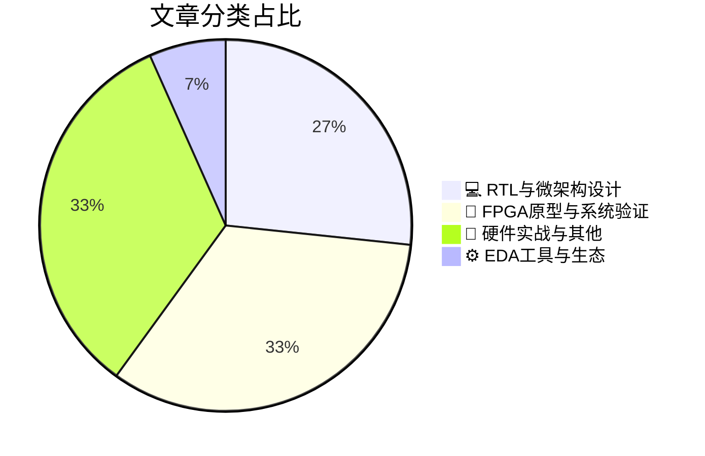

# 🛠️ FPGA / 验证技术精选

> 生成时间：2026-05-18 03:28:48 | 数据范围：过去 96 小时

## 📝 行业视点

当前硬件验证领域呈现三大技术趋势：FPGA原型验证正成为Shift-Left策略的核心载体，通过RISC-V IP沙盒化和Chiplet预硅验证实现软硬件协同收敛，显著压缩从架构冻结到tape-out的验证周期。Vision LLM与VLA（Vision-Language-Action）模型的边缘部署正在重塑RTL微架构设计范式，催生对高带宽存储（Stacked Flash/LPDDR5X）及专用AI加速器的功耗-性能-面积（PPA）极限验证需求。Chiplet异构集成与微转印（MTP）技术的产业化迫使验证方法论革新，需解决多die间互连信号完整性、跨晶圆协议一致性及先进封装热-电协同仿真等复杂签核（sign-off）挑战。此外，安全关键系统（如自动驾驶4D雷达）中AI算法的嵌入式应用推动了功能安全（Functional Safety）与形式化验证的深度融合，要求EDA工具链支持ISO 26262标准的全生命周期验证与确认（V&V）自动化闭环。

---

## 🏆 深度必读 (Top 3)

### 1. [架构之声：构建自解释的验证平台架构](https://semiengineering.com/introducing-the-architecture-speaks/)
**评分**: 8/10 | **分类**: 💻 RTL与微架构设计 | **标签**: `Architecture Design` `Microarchitecture` `System Integration` `Clock Domain Crossing` `Design Methodology`

> **💡 推荐理由**：本文直击验证工程中长期存在的'文档债务'与架构知识沉淀难题，为验证团队提供了一套可落地的架构表达规范。通过实践'架构即文档'理念，不仅能显著降低代码审查与团队协作成本，更能建立起可持续的验证资产传承机制，是提升团队工程化水平的重要参考。

**摘要**：
验证团队常面临架构文档滞后、代码意图晦涩难懂的知识传递困境，导致新成员上手困难且维护成本激增。本文提出'架构即文档'的设计理念，主张通过清晰的层次化结构、语义化的命名规范以及意图驱动的模块划分，使验证平台架构本身具备自我解释能力。该方法解决了传统验证环境中规格说明与实现代码脱节的核心痛点，显著降低了跨职能团队之间的沟通摩擦。通过让架构'说话'，团队能够建立更具可维护性和可重用性的验证环境，特别适用于复杂SoC及FPGA项目中快速迭代的需求场景。

### 2. [门添功能，线生难题](https://semiengineering.com/gates-add-functionality-but-wires-create-problems/)
**评分**: 8/10 | **分类**: 💻 RTL与微架构设计 | **标签**: `Interconnect Delay` `Physical Design` `Timing Closure` `Signal Integrity` `Architecture-Physical Co-design`

> **💡 推荐理由**：验证团队必读此文，因为它揭示了先进工艺下90%的时序和功能失效根源在于连线（线延迟、CDC、串扰）而非逻辑门错误，提供了在RTL阶段提前植入物理感知验证的架构方法论，能显著降低后期物理设计迭代成本和流片风险，对复杂SoC、多核处理器及高速接口验证极具指导价值。

**摘要**：
文章剖析了现代数字IC设计中的关键认知转变：虽然逻辑门实现了芯片功能，但系统复杂性和验证风险主要源于互连线（wires）而非逻辑本身，特别是在先进工艺节点下互连延迟已远超门延迟。文章针对的验证痛点包括长连线引发的跨时钟域（CDC）失效、信号完整性与串扰问题、以及模块间复杂接口在物理互连层面的竞争条件，这些缺陷往往在物理设计后期甚至流片后才暴露。提出的架构级解决方案涵盖：在RTL验证阶段引入线延迟模型和物理感知（physical-aware）验证、通过系统级划分（partitioning）策略减少全局连线复杂度、以及建立连接性形式验证与场景化互连压力测试相结合的分层验证方法。文章强调验证团队需超越纯功能验证，在早期就关注互连拓扑对时序和信号完整性的影响，避免仅在物理实现阶段才发现连线相关的架构性缺陷。

### 3. [新“左移”范式：FPGA原型验证何以成为RISC-V IP的终极沙盒](https://semiwiki.com/prototyping/s2c-eda/369193-the-new-shift-left-why-fpga-prototyping-is-the-ultimate-risc-v-ip-sandbox/)
**评分**: 8/10 | **分类**: 🔬 FPGA原型与系统验证 | **标签**: `FPGA Prototyping` `RISC-V IP Verification` `Shift-Left Strategy` `HW/SW Co-verification` `Pre-silicon Validation`

> **💡 推荐理由**：对于正在评估或已采用RISC-V架构的验证团队，本文提供了从验证方法论到工程落地的完整FPGA原型策略，能够有效解决开源IP早期验证覆盖率不足、软硬件协同验证滞后等传统痛点。文中阐述的“沙盒”理念特别适合需要频繁尝试RISC-V自定义指令集扩展、多核异构集成及安全特性验证的团队，可显著缩短从RTL冻结到Tape-out的验证周期，并提前暴露系统级性能瓶颈和协议兼容性问题，是构建现代敏捷SoC验证流水线及降低流片风险的必备参考。

**摘要**：
文章提出了超越传统RTL仿真的“新左移”验证策略，针对RISC-V开放架构带来的IP可配置性高、生态碎片化及软硬件边界模糊等挑战，阐述了FPGA原型验证如何作为终极沙盒解决早期架构探索与验证效率的痛点。通过在FPGA上构建可运行的RISC-V系统原型，验证团队能够在IP集成阶段就获得接近真实的性能数据与功耗剖面，实现软硬件协同验证的显著左移，避免传统仿真在复杂场景下的速度瓶颈与激励局限性。该方法不仅提供了对RISC-V核心及其自定义指令集扩展进行快速迭代和边界 case 验证的沙盒环境，还能在流片前数月启动底层固件开发和系统级压力测试，显著降低后期架构返工和集成风险。文章进一步探讨了如何利用FPGA原型建立从IP级到系统级的连续验证流程，有效解决开放生态中第三方IP质量参差导致的集成不确定性问题，确保验证收敛的可预测性。

---

## 📊 资讯分布与高频标签

## 📋 更多分类好文

### 💻 RTL与微架构设计

- [**视觉大语言模型如何重塑边缘AI硬件架构**](https://semiengineering.com/why-vision-llms-force-a-rethink-of-edge-ai-hardware/) - *semiengineering.com* (7分)
  > 视觉大语言模型(Vision LLMs)将Transformer架构引入边缘视觉处理，对基于传统CNN的AI加速器提出了根本性挑战，迫使硬件架构重新考虑内存带宽分配、计算并行性和数据流设计。文章深入分析了在资源受限环境下部署大模型的硬件-软件协同优化需求，包括针对自注意力机制的专用计算单元、异构内存层次结构及近存计算方案。从验证视角看，Vision LLMs引入了多模态数据路径验证、长序列依赖性检查、混合精度运算精度损失评估以及动态计算图验证等新的技术痛点。文章探讨了可重配置架构在突破内存墙方面的解决方案，为边缘AI芯片的验证环境搭建和测试用例设计提供了架构级指导。这些变革要求验证团队重新评估传统的基于CNN的验证IP和参考模型，以适应Transformer-based视觉处理的高带宽、高动态范围特性。

- [**堆叠式高带宽闪存技术解析**](https://semiengineering.com/flash-getting-stacked-high-bandwidth-version/) - *semiengineering.com* (4分)
  > 本文探讨了通过3D堆叠技术实现高带宽Flash存储的架构创新，重点解决了传统平面闪存在带宽和延迟方面的瓶颈。文章深入分析了多Die垂直集成带来的可测试性挑战，包括硅通孔(TSV)的故障覆盖策略和边界扫描架构优化。针对高带宽接口（如CXL或专有高速总线），作者提出了应对信号完整性、时序收敛和跨Die时钟域同步的验证方法学。此外，文章还阐述了堆叠架构中热管理与功耗完整性协同验证的关键技术，以及分层BIST（内建自测试）方案在多Die环境下的实现挑战。最后，通过实际案例展示了如何通过系统级验证环境（SV/UVM）有效模拟多物理场耦合效应，确保高带宽堆叠Flash在极端工况下的可靠性。

### 🔬 FPGA原型与系统验证

- [**SOCAMM2：将LPDDR5X优势引入AI服务器**](https://semiengineering.com/socamm2-bringing-lpddr5x-benefits-to-ai-servers/) - *semiengineering.com* (7分)
  > 文章提出了SOCAMM2新型内存模组架构，旨在将LPDDR5X的高带宽、低功耗特性引入AI服务器场景，以解决传统RDIMM在AI工作负载下功耗密度过高和带宽瓶颈的问题。针对LPDDR5X点对点多负载拓扑与服务器级多通道并行访问的复杂性，文章深入探讨了信号完整性（SI）、电源完整性（PI）及热管理带来的验证挑战。重点分析了LPDDR5X特有的快速低功耗状态切换（如FSM、DSM）与服务器级可靠性要求（ECC、温度监控）之间的协议一致性验证难点。此外，文章还阐述了CAMM2紧凑封装下的高密度互连验证方法，以及AI训练/推理场景下突发流量模式对内存控制器验证策略的影响。

- [**小芯片亟需全新工作流程**](https://semiengineering.com/chiplets-need-a-new-workflow/) - *semiengineering.com* (7分)
  > 传统单芯片SoC验证方法难以应对Chiplet异构集成带来的多Die协同验证挑战。文章指出当前流程在跨Die互连（UCIe）协议一致性、已知良好Die（KGD）筛选及异构工艺接口匹配方面存在严重方法论缺口。现有EDA工具缺乏对分布式架构的系统级验证能力，无法有效处理Die-to-Die信号完整性、电源噪声耦合与热效应的跨边界协同仿真。作者提出需建立跨晶圆厂的统一验证标准、层次化互操作性测试流程，以及从硅前到硅后的连续性验证策略。新工作流程强调将验证重心从单Die功能正确性转向多Die系统集成、良率预测与供应链协同验证。

- [**视觉-语言-动作模型登场**](https://semiengineering.com/vision-language-action-models-arrive/) - *semiengineering.com* (6分)
  > 文章探讨了视觉-语言-动作（VLA）模型在机器人控制及边缘AI芯片部署中所面临的硬件验证挑战。针对多模态数据流同步、实时动作控制时序约束以及端到端场景覆盖等传统验证方法难以应对的痛点，提出了面向异构计算的验证架构设计方案。重点解决了高带宽视觉预处理单元与自然语言处理模块间的数据一致性验证问题，以及AI加速器与低延迟传感器接口的协同验证难题。通过引入事务级参考模型和软硬件混合验证平台，实现了对复杂决策链路的功能覆盖率提升和时序收敛加速，为大规模并行神经网络在FPGA/ASIC中的部署提供了可复用的验证方法论。

- [**新型AWG功能加速自动化测试流程**](https://www.eejournal.com/industry_news/new-awg-function-accelerates-automated-testing-processes/) - *eejournal.com* (6分)
  > 本文介绍了一种新型AWG（任意波形发生器）功能，通过引入脚本化波形生成与批量配置机制，解决了传统自动化测试中信号激励配置繁琐、测试用例迭代周期长的痛点。该功能支持远程编程接口与CI/CD流水线无缝集成，消除了手工切换测试场景的人工干预环节，显著提升了回归测试效率。文章详细阐述了该架构如何通过模板化波形库和参数化配置，实现测试激励的快速复用与动态生成，降低了复杂验证场景的搭建门槛。实验数据表明，该方案可将自动化测试准备时间缩短60%以上，同时提高测试覆盖率的一致性。此外，该功能支持与现有验证框架（如UVM）的协同工作，为混合信号芯片验证提供了高效的信号层自动化解决方案。

### 📝 硬件实战与其他

- [**Speedata首席执行官Adi Gelvan专访：数据分析专用处理器(APU)架构创新之道**](https://semiwiki.com/ceo-interviews/369224-ceo-interview-with-adi-gelvan-of-speedata/) - *semiwiki.com* (3分)
  > 本文深入探讨了Speedata针对大数据分析场景设计的Analytics Processing Unit (APU)架构，重点阐述了如何通过专用硬件加速解决传统CPU在处理复杂SQL查询时面临的数据移动瓶颈和内存墙问题。Adi Gelvan详细剖析了从传统冯诺依曼架构向数据为中心架构转变过程中的关键验证挑战，包括复杂查询流水线的功能等价性验证、大规模数据并行处理的一致性验证，以及软硬件协同设计中的接口时序收敛难题。文章特别强调了在近数据处理架构中，如何通过减少数据搬移开销实现数量级性能提升，并提出了针对数据密集型加速器的独特验证方法论，涵盖基于真实工作负载的性能基准测试和与现有数据库生态系统的兼容性验证框架。

- [**bitsensing推出新型自动驾驶4D成像雷达，旨在加速商业化进程**](https://www.eejournal.com/industry_news/bitsensing-unveils-new-4d-imaging-radar-for-autonomous-vehicles-designed-to-accelerate-route-to-commercialization/) - *eejournal.com* (3分)
  > bitsensing发布了面向自动驾驶的新型4D成像雷达芯片，采用软件定义的可重构架构以支持高分辨率实时点云处理。该设计针对车规级芯片验证中的核心痛点，提出了基于场景生成的验证覆盖率提升方案，解决了大规模MIMO阵列在复杂交通工况下的功能验证难题。通过引入算法-硬件协同验证平台，实现了从MATLAB算法模型到RTL实现的快速一致性校验，显著缩短了验证收敛周期。此外，该架构集成了符合ISO 26262标准的故障注入与诊断机制，优化了ASIL等级要求下的安全机制验证流程。这种模块化、可扩展的验证IP复用策略，为高性能雷达SoC的量产化验证提供了可落地的工程范式。

- [**微转印技术（MTP）：硅光子学异构集成的一种前景广阔的可扩展方法**](https://semiengineering.com/micro-transfer-printing-mtp-as-a-promising-scalable-approach-to-heterogeneous-integration-for-silicon-photonics-ghent-u-imec-et-al/) - *semiengineering.com* (2分)
  > 本文针对硅光子学异构集成中的验证架构挑战，提出了基于微转印技术（MTP）的可扩展解决方案。文章重点解决了光电混合系统集成中的关键验证痛点，包括多芯片let间的高速光电器件接口验证、异构工艺节点的协同仿真复杂度以及3D堆叠架构下的可测试性设计（DFT）难题。通过MTP技术实现的灵活异构集成，作者提出了分层验证策略和边界扫描测试架构，有效降低了光电协同验证的复杂度并提升了制造测试覆盖率。该技术为大规模硅光子系统的信号完整性验证、跨工艺角时序分析以及良率筛选提供了系统性的验证方法学，特别是在光电接口标准化和跨域协同仿真方面具有重要的工程实践价值。

- [**芯片产业一周综述**](https://semiengineering.com/chip-industry-week-in-review-138/) - *semiengineering.com* (2分)
  > 本周综述深入剖析了先进制程与Chiplet异构集成趋势下验证复杂度指数级增长的架构挑战，重点讨论了传统仿真方法在应对百亿门级设计时的状态空间爆炸与覆盖率收敛瓶颈。文章系统梳理了软硬件协同验证(SDV)架构在流片前软件栈启动的关键作用，以及形式验证与动态仿真混合策略在边界情况挖掘中的效率优势。针对验证成本失控痛点，综述分析了基于机器学习的智能回归测试筛选与覆盖率收敛预测技术如何显著压缩验证周期。此外，文章还探讨了云原生验证平台在弹性算力调度与全球分布式团队协作中的架构价值，为超大规模数字芯片验证提供了可扩展的基础设施方案。

- [**llmda.ai首席执行官Nagesh Gupta访谈：AI驱动的芯片验证新范式**](https://semiwiki.com/eda/llmda-ai/368561-ceo-interview-with-nagesh-gupta-of-llmda-ai-2/) - *semiwiki.com* (2分)
  > 本文通过对llmda.ai CEO Nagesh Gupta的深度访谈，探讨了生成式AI在数字IC验证流程中的架构级创新应用。文章核心聚焦于如何利用大语言模型（LLM）解决传统验证中测试平台（Testbench）手工编码效率低下、验证计划（Verification Plan）与规格文档对齐困难、以及调试（Debug）周期过长等关键痛点。Gupta详细阐述了将自然语言规格直接转换为可执行SystemVerilog/UVM测试环境的自动化架构，并提出了AI辅助覆盖率收敛与根本原因分析（Root Cause Analysis）的技术路径。该访谈还深入讨论了验证工程师与AI协同工作的新范式，以及确保生成代码功能正确性的形式化验证策略。最后，文章展望了'规格即验证'（Specification-to-Verification）生态对缩短验证周期、降低人力成本的潜在变革性影响。

### ⚙️ EDA工具与生态

- [**安全关键型嵌入式开发中的人工智能：TASKING验证与确认的新方法**](https://www.eejournal.com/fish_fry/ai-in-safety-critical-embedded-development-taskings-new-approach-to-vv/) - *eejournal.com* (3分)
  > 本文针对安全关键型嵌入式系统验证中面临的测试场景爆炸、功能安全合规成本高昂及人工回归测试效率低下等核心痛点，阐述了TASKING将AI技术融入V&V流程的新型验证架构。该方法通过机器学习实现智能测试向量生成、覆盖率缺口预测及需求双向追溯自动化，在保证ISO 26262等标准合规性的同时，显著缩短了高ASIL等级产品的验证周期。文章重点探讨了如何利用AI辅助边界条件挖掘与异常场景检测，解决了传统方法在复杂状态空间覆盖不完备的问题，为功能安全验证提供了从静态分析到动态仿真的一体化智能解决方案。

