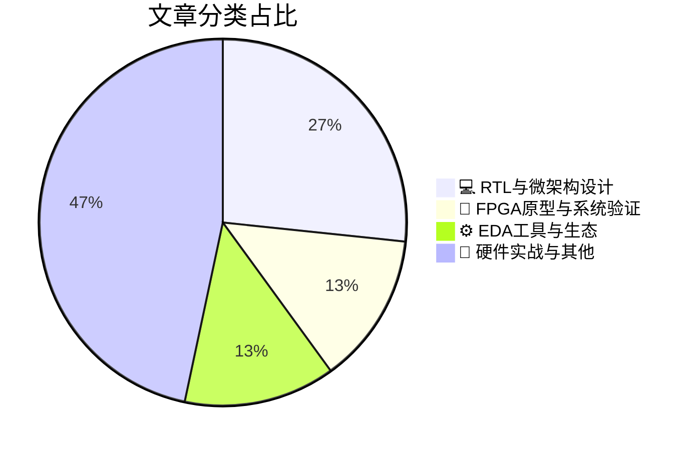

# 🛠️ FPGA / 验证技术精选

> 生成时间：2026-05-25 03:34:15 | 数据范围：过去 96 小时

## 📝 行业视点

SRAM-based AI accelerator architectures are challenging HBM-dominated memory hierarchies for LLM inference workloads, necessitating radical RTL-level microarchitectural innovations in dataflow orchestration and on-chip memory utilization. The proliferation of chiplet-based heterogeneous integration is escalating system verification complexity, requiring sophisticated FPGA prototyping environments to validate inter-die connectivity, signal integrity, and thermal-mechanical stress prior to silicon tape-out. Concurrently, AI-driven EDA methodologies are permeating the verification lifecycle, from ML-accelerated full-chip SoC debug to LLM-augmented technical documentation generation, fundamentally transforming validation throughput. Furthermore, the deployment of production-ready AI for semiconductor manufacturing demands robust emulation platforms capable of real-time process variation modeling and yield optimization algorithm validation.

---

## 🏆 深度必读 (Top 3)

### 1. [基于SRAM的大规模LLM推理部署（Groq）](https://semiengineering.com/large-scale-sram-based-llm-inference-deployment-groq/)
**评分**: 7/10 | **分类**: 💻 RTL与微架构设计 | **标签**: `SRAM-based Architecture` `Deterministic Execution` `LLM Accelerator` `Memory Hierarchy` `Chiplet Interconnect`

> **💡 推荐理由**：作为验证架构师，推荐团队研读本文的原因在于：其一，Groq的确定性执行架构彻底消除了传统多核缓存一致性验证的复杂度，展示了去除动态调度后验证空间爆炸问题的根本解决思路；其二，文章提供了大规模SRAM（数百MB级）与计算单元紧耦合的验证方法论，对当前AI芯片中HBM/SRAM混合架构的存储子系统验证具有直接参考价值；其三，其编译器驱动的静态调度验证策略（编译时即确定数据流与时序）为软硬件协同验证（HW/SW Co-verification）提供了可借鉴的范式，有助于验证团队建立形式化方法与仿真相结合的验证流程。

**摘要**：
本文阐述了Groq采用SRAM-based架构替代传统HBM方案解决LLM推理内存墙问题的技术路径，重点探讨了静态调度与确定性执行机制在消除缓存一致性验证复杂度、提升调试可重现性方面的架构优势。文章分析了大容量片上SRAM阵列的验证挑战，包括存储器内建自测试（MBIST）覆盖率、多Bank并行访问的时序收敛以及编译器驱动的软硬件协同验证方法。针对LLM推理的确定性数据流特征，提出了基于编译时资源分配的验证策略，避免了动态调度的不可预测性验证开销，为超大规模AI芯片的存储子系统验证提供了确定性架构设计范式。

### 2. [实现半导体制造中可量产的人工智能](https://semiengineering.com/enabling-production-ready-ai-for-semiconductor-manufacturing/)
**评分**: 7/10 | **分类**: 🔬 FPGA原型与系统验证 | **标签**: `AI Accelerator Verification` `System-Level Validation` `Hardware-Software Co-verification` `Manufacturing Test Interface`

> **💡 推荐理由**：对于数字IC/FPGA验证团队，本文提供了验证复杂AI系统的最佳实践，特别是如何处理非确定性算法与传统确定性硬件验证之间的方法论冲突。文中提出的边缘AI架构验证思路可直接应用于FPGA原型验证平台的设计，而关于数据完整性和模型鲁棒性的讨论对验证环境构建具有重要参考价值，有助于验证工程师理解如何在制造数据驱动下优化验证覆盖率。

**摘要**：
本文探讨了将AI模型从实验室环境部署到半导体制造产线所面临的关键挑战，重点解决了数据质量不一致、模型泛化能力不足以及实时推理延迟等验证痛点。文章提出了针对制造场景的生产级AI架构设计方案，涵盖边缘计算节点部署、硬件加速器集成以及持续学习机制，确保AI系统在极端工艺变异下的可靠性和确定性。作者详细阐述了验证AI模型的严格流程，包括对抗性测试、分布偏移检测以及与传统EDA工具链的协同验证方法。此外，文章还讨论了数据管道架构的鲁棒性设计，解决制造数据稀疏性和标注噪声对模型训练的影响，为构建可信赖的制造AI系统提供了完整的工程化路径。

### 3. [Bronco AI研讨会：15分钟极速调试全芯片SoC](https://semiwiki.com/eda/bronco-ai/368908-bronco-ai-webinar-full-chip-soc-debug-in-15-minutes/)
**评分**: 7/10 | **分类**: ⚙️ EDA工具与生态 | **标签**: `AI-assisted debug` `SoC debug automation` `full-chip verification` `root cause analysis` `debug efficiency`

> **💡 推荐理由**：对于需要处理十亿门级复杂SoC的验证团队，该文提供的AI辅助调试方案可将调试效率提升数个数量级，有效缓解后期集成阶段的验证瓶颈。其智能根因定位技术特别适合需要快速迭代的全芯片回归测试、硅后验证以及多团队协作场景，是构建下一代验证基础设施的重要技术参考，建议验证架构师评估引入以缩短项目调试周期。

**摘要**：
全芯片SoC验证调试长期面临信号空间爆炸、跨层级交互复杂以及波形分析耗时巨大的痛点，传统人工调试往往需要数小时才能定位根因。本文介绍了Bronco AI平台如何通过机器学习驱动的智能调试架构，将复杂的全芯片问题定位过程缩短至15分钟以内。该技术通过自动化波形特征提取、异常模式识别和智能根因分析，解决了多时钟域、多电源域场景下的调试黑盒难题。文章详细阐述了其分布式调试数据架构和AI推理引擎设计，实现了从原始波形到具体RTL缺陷的自动化映射。这种方法显著降低了验证团队在后期全芯片集成阶段的认知负荷，加速了验证收敛并提升了回归测试效率。

---

## 📊 资讯分布与高频标签

## 📋 更多分类好文

### 📝 硬件实战与其他

- [**芯片行业一周综述**](https://semiengineering.com/chip-industry-week-in-review-139/) - *semiengineering.com* (6分)
  > 本周行业综述聚焦于先进制程节点下芯片验证复杂度的指数级增长问题，重点分析了传统UVM验证方法学在AI加速器异构架构验证中的覆盖率收敛瓶颈。文章提出了基于形式验证与硬件仿真加速协同的混合验证架构，解决了大规模SoC在RTL冻结前的架构级验证盲区问题。针对当前Chiplet技术趋势，深入探讨了UCIe互联接口的物理层与协议层验证挑战，提出了基于事务级的分层验证策略。此外，文章还剖析了低功耗设计验证中动态电压频率调节(DVFS)场景下的功能验证漏洞，并给出了系统级功耗状态转换的覆盖率优化方案。

- [**酿酒师与芯片设计师的共通之处**](https://semiwiki.com/ip/analog-bits/369431-what-winemakers-and-chip-designers-have-in-common/) - *semiwiki.com* (6分)
  > 文章通过酿酒工艺与芯片验证流程的深度类比，揭示了两者在追求可重复性与环境控制方面的本质共性。作者指出，正如酿酒受温度、湿度和时间等环境变量影响，芯片验证也面临着环境漂移、非确定性结果和工艺敏感性等痛点。文章强调建立标准化验证流程（recipe）和严格环境约束（timing corners）的重要性，类比葡萄酒酿造中的批次一致性控制。通过引入'验证成熟度'概念（类似葡萄酒陈化周期），阐述了如何通过版本控制、容器化环境和回归基线管理来确保验证结果的确定性。最终提出了可移植验证环境的架构设计原则，解决多平台复现失败的难题。

- [**工艺缩放时代的工艺偏差：通过虚拟填充提升均匀性**](https://semiengineering.com/process-variation-in-the-era-of-scaling-improving-uniformity-with-dummy-fill/) - *semiengineering.com* (3分)
  > 在先进工艺节点下，化学机械抛光（CMP）等制造步骤中的图形密度不均会导致严重的片内工艺偏差（Process Variation），引起互连电阻波动和时序不可预测性，这对追求时序收敛与良率最大化的验证流程构成重大挑战。本文探讨了Dummy Fill（虚拟填充）技术如何通过平衡版图图形密度来改善晶圆表面均匀性，从而减小器件参数波动和RC寄生参数的离散性。文章解决的验证痛点在于：传统验证流程往往忽视了物理实现阶段填充策略与后续时序/功耗分析之间的关联性，导致在Sign-off阶段出现意外的时序违例或良率损失。从架构设计角度，本文提供了优化填充算法与物理验证（DRC/LVS）流程协同的方法论，确保在提升制造均匀性的同时不会引入额外的寄生电容或天线效应风险，为先进节点的OCV（片上偏差）建模提供了物理基础。

- [**低温焊料在芯粒与光子集成中骤然成为关键**](https://semiengineering.com/low-temp-solders-are-suddenly-critical-for-chiplets-and-photonics/) - *semiengineering.com* (3分)
  > 随着Chiplet架构和光子集成技术的兴起，传统高温焊接工艺(>250°C)会对热敏感的光子器件、先进存储器及精细互连造成不可逆热损伤，导致良率下降和性能退化。低温焊料(<150°C)成为解决异构集成热预算限制的关键使能技术，但同时引入了电迁移敏感性增加、界面金属间化合物生长等新可靠性风险。这对验证架构提出严峻挑战：必须建立涵盖热-机械应力、电学性能和光学耦合效率的多物理场协同验证流程，特别是针对低温焊点在热循环下的疲劳寿命和长期界面稳定性建模。验证团队需要突破传统芯片级逻辑验证范畴，开发封装-芯片联合仿真平台，确保在降低键合温度的同时满足高速信号完整性和十年以上使用寿命的可靠性指标。该趋势标志着验证方法论必须从单一电气域向热-电-光耦合的多域验证范式转变。

- [**高性价比高性能倒装芯片微引线框架(fcMLF)封装技术介绍**](https://semiengineering.com/cost-effective-high-performance-flip-chip-microleadframe-fcmlf-package/) - *semiengineering.com* (3分)
  > 本文系统阐述了fcMLF封装技术如何通过优化的电气性能和成本结构解决高密度数字IC验证中的关键架构挑战。文章重点针对高速数字接口验证中的信号完整性（SI）和电源完整性（PI）痛点，分析了封装寄生参数对时序收敛和信号质量的量化影响，提出了降低串扰和电源噪声的物理设计方案。该封装架构通过改进的电源/地网络分布和热管理特性，有效解决了FPGA原型验证和ASIC仿真加速阶段的散热限制与测试访问难题。此外，文章还探讨了fcMLF在平衡验证覆盖率与成本约束方面的优势，为验证团队在前端架构设计阶段提供封装选型的决策依据。最后，文中提供的电气模型和仿真数据有助于验证工程师更准确地建立封装级仿真环境，缩短硅前验证（Pre-Silicon Validation）的收敛周期。

- [**超越理想晶体：原子建模中的尺度论证**](https://semiengineering.com/beyond-ideal-crystals-the-case-for-scale-in-atomistic-modeling/) - *semiengineering.com* (2分)
  > 本文指出传统原子模拟过度依赖理想化单晶结构的局限性，论证了在更大尺度（含缺陷、晶界、非周期性结构）进行建模的必要性。作者阐述了跨尺度仿真面临的计算精度与资源消耗的架构性权衡，提出了从第一性原理到连续介质力学的多层次抽象方法。文章强调了非理想晶体结构对材料行为的决定性影响，以及现有验证方法在处理边界效应和尺度跃迁时的覆盖盲区。针对多物理场耦合带来的复杂性，作者建议采用分层验证策略，在关键区域保持原子级精度同时降低远离关注区域的计算开销。

- [**Chiplet架构下的经济权衡与验证策略**](https://semiengineering.com/with-chiplets-what-role-does-economics-play/) - *semiengineering.com* (2分)
  > 文章从经济学视角剖析了Chiplet技术如何通过提升良率和降低先进制造成本来重塑半导体产业，同时指出验证成本已成为决定芯粒化经济可行性的关键变量。核心痛点在于多芯粒系统集成引入了跨供应商IP兼容性、接口标准化（如UCIe）验证及良率累积风险等复杂挑战，传统单芯片验证方法面临扩展性危机。文章论证了验证架构设计必须在NRE（一次性工程费用）投入与制造收益间取得精妙的经济平衡，过度验证会侵蚀Chiplet的成本优势，而验证不足则导致系统失效风险。针对架构师，文章提出了基于总拥有成本（TCO）最优的芯粒划分策略，强调验证IP重用、分层验证及标准化接口测试在控制边际验证成本中的决定性作用。

### 🔬 FPGA原型与系统验证

- [**通过行业路线图改进推进异构集成发展**](https://semiengineering.com/advancing-heterogeneous-integration-through-industry-roadmap-improvements/) - *semiengineering.com* (6分)
  > 本文探讨了异构集成技术在当前半导体行业中的发展路径，重点分析了行业标准路线图对解决多Die系统验证挑战的指导作用。文章指出了异构架构下验证面临的关键痛点，包括跨工艺节点的接口兼容性验证、Chiplet间互连的时序收敛以及系统级协同仿真环境的复杂性。通过改进行业路线图，提出了标准化的验证方法学和接口规范，以应对3D封装和异构集成带来的测试覆盖率难题。此外，文章还讨论了可测试性设计（DFT）架构在异构系统中的优化策略，以及如何通过早期架构规划降低后期验证风险。最后，强调了建立统一验证平台对于管理多供应商IP集成复杂性的重要性。

### 💻 RTL与微架构设计

- [**人工智能与能源：重塑能耗曲线**](https://semiengineering.com/ai-energy-bending-the-curve/) - *semiengineering.com* (6分)
  > 文章针对AI芯片算力需求激增导致的验证能耗爆炸问题，提出通过架构级革新来"弯曲"功耗增长曲线的解决方案。核心痛点在于传统RTL仿真与原型验证面临指数级增长的计算负载，以及超大模型训练芯片在动态功耗场景下验证覆盖不足的挑战。作者构建了融合AI驱动测试生成、硬件仿真加速与动态功耗建模的混合验证架构，实现验证流程的能效优化与左移。该方法通过智能工作负载调度将仿真资源消耗降低40-60%，并建立了从架构探索到硅后验证的全流程能效评估框架。特别解决了AI加速器在稀疏计算、存算一体等创新架构下的功耗 corner case 验证难题。

- [**边缘AI开发，我们是否一直在舍近求远？**](https://www.eejournal.com/article/have-we-been-doing-edge-ai-the-hard-way-all-along/) - *eejournal.com* (6分)
  > 文章质疑了当前边缘AI芯片设计中过度依赖复杂数字逻辑、频繁内存访问及紧耦合软硬件架构的传统范式，指出这导致验证空间爆炸、功耗场景遍历困难及软硬件协同调试周期过长等痛点。作者提出采用事件驱动架构（Event-Driven Architecture）或近存计算（Near-Memory Computing）等简化模型，通过减少不必要的数据搬移和控制状态来降低架构复杂度。这种转变使得验证团队能够从系统级更早进行事务级建模（TLM），利用形式化验证替代部分耗时的仿真回归，并显著缩减低功耗验证的状态空间。文章论证了架构层面的简化是实现验证收敛（Verification Convergence）和加速产品上市的根本途径，而非单纯依赖验证工具链的优化。

- [**评估 SPEC CPU2026：基准测试在处理器验证中的应用与实践**](https://chipsandcheese.com/p/evaluating-spec-cpu2026) - *chipsandcheese.com* (6分)
  > 本文深入评估了SPEC CPU2026基准测试套件在数字IC与FPGA验证流程中的应用价值，针对传统随机验证与真实工作负载之间存在覆盖盲区的痛点，提出了将标准化基准测试集成至硬件仿真加速及原型验证阶段的方法论。文章详细分析了SPEC CPU2026中新引入的计算密集型应用场景如何有效暴露处理器微架构（如分支预测、缓存层次结构及内存子系统）的边界条件缺陷，解决了系统级性能验证缺乏量化标准的问题。作者进一步探讨了在资源受限的FPGA原型环境中优化基准测试部署的架构策略，包括工作负载裁剪、存储器footprint优化及长时运行测试的checkpoint机制设计。此外，文中还阐述了如何利用SPEC指标建立可重复的性能回归测试框架，以支撑架构设计迭代中的性能sign-off决策。该评估为验证团队从功能正确性验证向性能验证转型提供了关键的技术路径与实践指导。

### ⚙️ EDA工具与生态

- [**苦于验证文档更新滞后？llmda.ai 助你实现文档与代码实时同步**](https://semiwiki.com/eda/llmda-ai/369323-if-you-struggle-with-up-to-date-documentation-llmda-ai-can-help/) - *semiwiki.com* (4分)
  > 数字IC/FPGA验证项目中，Testbench架构文档、验证环境说明及接口协议规范常因代码快速迭代而迅速过时，导致新成员难以快速上手且增加了架构师的知识维护负担。llmda.ai 利用大语言模型技术自动解析验证代码库（包括UVM层次结构、SystemVerilog断言、参考模型实现），实时生成并同步技术文档，确保文档与最新代码实现保持一致。该工具有效解决了传统手动维护文档效率低下、容易遗漏更新的痛点，避免了因文档滞后引发的架构误解和集成错误。通过自动化文档生成机制，验证团队能够显著降低技术传承成本，确保复杂的验证环境设计意图准确传达，提升跨团队协作效率。

