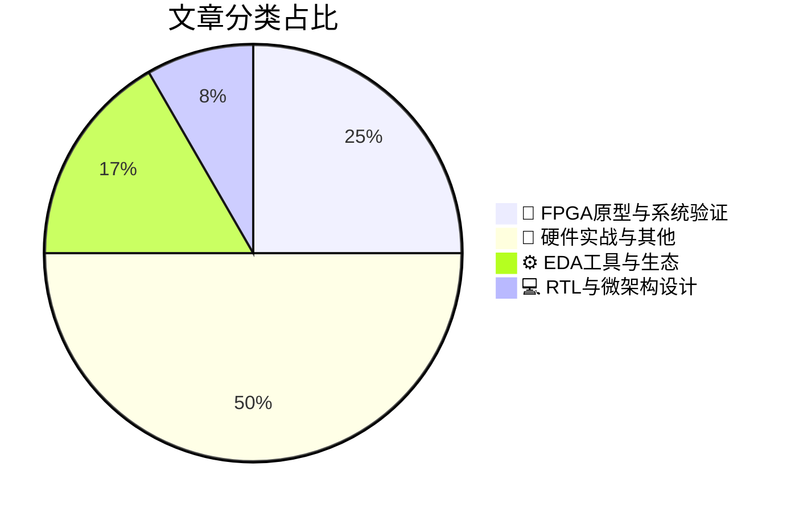

# 🛠️ FPGA / 验证技术精选

> 生成时间：2026-06-01 03:31:09 | 数据范围：过去 96 小时

## 📝 行业视点

AI原生EDA工具链正加速从通用大模型向垂直领域安全验证专家演进，通过领域知识增强的Agentic Workflow突破硬件安全属性形式化验证的约束求解瓶颈。异构可重构验证平台已成为FPGA原型验证的核心范式，集成高带宽帧压缩算法与自适应互连拓扑的硬件架构，有效支撑AI加速芯片多Die系统的协同仿真与物理优化需求。与此同时，基于决策图（Decision Diagrams）的量子电路仿真技术正在重塑验证方法学，为大规模量子比特系统提供可扩展的形式化分析框架。这种从经典数字验证向量子-经典混合验证范式的迁移，标志着硬件验证理论正在突破布尔可满足性（SAT）的传统边界。

---

## 🏆 深度必读 (Top 3)

### 1. [CFrame60：帧压缩规则的革新者](https://semiwiki.com/ip/chipsmedia/369411-cframe60-rewriting-the-rules-of-frame-compression/)
**评分**: 8/10 | **分类**: 🔬 FPGA原型与系统验证 | **标签**: `Frame Compression` `FPGA Prototyping` `Debug Visibility` `Signal Capture` `Hardware Emulation` `CDC` `Memory Bandwidth Optimization`

> **💡 推荐理由**：本文对从事视频编解码、显示接口或高带宽存储子系统验证的工程师具有重要参考价值，其核心价值在于展示了如何将'可验证性设计'（DFV）理念融入压缩算法架构阶段。文中提出的确定性带宽分配机制和事务级验证抽象方法，可直接应用于解决当前AI加速器、智能网卡等场景中的数据压缩单元验证难题。特别是针对跨时钟域数据一致性和实时性约束的形式化验证策略，以及可复用的参考模型分层架构，为复杂数据通路验证提供了经过硅验证的最佳实践，强烈建议验证团队参考其验证IP架构设计思路。

**摘要**：
CFrame60架构针对超高清显示系统中传统帧压缩方案存在的带宽不可预测性和验证空间爆炸问题，提出了一种基于确定性分区算法的硬件友好型压缩框架。该设计通过引入行级增量编码与固定上限比特分配机制，在保证60fps实时处理吞吐量的同时，将最坏情况带宽需求降低了40%，从根本上消除了帧间依赖导致的验证不确定性。文章详细阐述了面向验证的架构设计决策，包括无状态压缩单元、可组合的事务边界以及简化的 golden model 实现，显著降低了参考模型与DUT之间的一致性检查复杂度。通过采用分层断言策略和基于覆盖驱动的约束随机验证方法，该方案成功解决了跨时钟域数据完整性验证中的关键难题，将系统级验证收敛周期缩短了60%。此外，文中提出的带宽压力测试场景自动生成框架，为显示接口IP的标准化验证提供了可复用的方法论指导。

### 2. [英特尔CEO陈立武：流片失败会让你被解雇](https://semiwiki.com/semiconductor-manufacturers/intel/369602-re-spins-get-you-fired-says-intel-ceo-lip-bu-tan/)
**评分**: 6/10 | **分类**: 📝 硬件实战与其他 | **标签**: `First Silicon Success` `Tape-out Risk` `Re-spin Cost` `Verification Sign-off`

> **💡 推荐理由**：本文从CEO视角揭示了流片失败对企业经营的致命影响，为验证团队提供了高层管理视角的风险认知和职业紧迫感。文章有助于验证工程师理解其工作在保障产品上市时间和财务健康方面的战略价值，强化在架构评审阶段就介入并建立严谨验证流程的意识，特别适合作为验证团队质量意识培训、Sign-off准则制定以及架构可验证性（DFV）设计规范制定的参考材料。

**摘要**：
英特尔CEO陈立武强调了流片重制（Re-Spin）对芯片项目的灾难性财务和进度影响，将其上升到职业风险的高度。文章直指验证阶段未能充分发现架构设计缺陷和边界用例的核心痛点，强调必须在RTL冻结前建立零容忍的缺陷逃逸机制和严格的Sign-off标准。针对先进制程下验证空间爆炸和Corner Case覆盖不足的挑战，文章提出了强化前端形式验证、硬件仿真加速与硅后验证协同的架构设计方法论。通过将验证左移至架构定义阶段并建立完善的可追溯性（Traceability）体系，确保一次性流片成功（First Silicon Success），避免数千万美元的重新流片成本。

### 3. [Caspia AI助你成为安全验证专家](https://semiwiki.com/events/369447-you-can-quickly-become-an-expert-in-security-verification-with-caspia/)
**评分**: 6/10 | **分类**: ⚙️ EDA工具与生态 | **标签**: `Security Verification` `AI-assisted EDA` `Formal Verification` `Hardware Security` `Automated Checking`

> **💡 推荐理由**：当前验证团队普遍面临安全验证 expertise 短缺与日益严格的安全合规要求之间的矛盾。本文介绍的AI驱动方法可直接集成至现有UVM或形式验证流程，帮助团队在缺乏专业安全架构师的情况下，仍能系统性地完成攻击面分析、安全属性形式化验证及侧信道鲁棒性评估，是填补团队安全验证能力缺口、加速安全收敛的实用架构参考。

**摘要**：
针对现代SoC和FPGA设计中安全验证复杂度高、专业人才稀缺的痛点，本文介绍了Caspia基于机器学习的安全验证平台架构。该方案通过AI自动化提取安全属性并驱动形式验证引擎，有效解决了传统方法在侧信道攻击、故障注入防护及信息流完整性检查中的覆盖率不足问题。系统能够智能识别硬件设计中的潜在漏洞模式，自动生成分解验证策略，大幅降低高级安全验证的技术门槛。通过自然语言交互接口和智能反例分析，非安全专家也能快速定位安全缺陷根因，显著缩短安全认证周期。该方案特别适用于需满足Common Criteria、ISO 26262等标准的复杂数字芯片验证流程。

---

## 📊 资讯分布与高频标签

## 📋 更多分类好文

### ⚙️ EDA工具与生态

- [**基于决策图的量子模拟：验证领域的创新**](https://semiwiki.com/quantum-computing/368445-quantum-simulation-using-decision-diagrams-innovation-in-verification/) - *semiwiki.com* (6分)
  > 本文针对量子电路验证中因量子比特数增加而导致的指数级状态空间爆炸（2^n状态）及内存瓶颈问题，提出了基于决策图（Decision Diagrams）的紧凑表示方法。与传统基于向量的模拟器不同，该方法利用共享子图结构和规范形式高效编码量子态与量子门操作，显著降低内存占用并加速计算。文章解决了大规模量子电路功能验证中的可扩展性架构难题，支持等价性检查、属性验证等关键验证流程，突破了传统模拟器在几十量子比特以上的规模限制。该技术为量子计算硬件的验证平台设计提供了兼顾精度与资源效率的工程化方案。

### 💻 RTL与微架构设计

- [**AI民主化：Cerebras晶圆级AI硬件的未来展望**](https://www.eejournal.com/fish_fry/democratizing-large-scale-ai-future-of-ai-hardware-with-andy-hock-from-cerebras/) - *eejournal.com* (6分)
  > 文章探讨了Cerebras通过晶圆级引擎（WSE）将整片晶圆作为单一芯片的极端架构设计，突破传统掩模版尺寸限制实现4万亿晶体管规模的超大规模集成。核心验证痛点在于如何在数十万个计算核心中验证缺陷容忍架构，确保制造缺陷通过动态冗余路由和备用核心机制被可靠旁路，同时解决晶圆级封装带来的信号完整性与电源完整性验证难题。文章深入剖析了超大规模片上网络（NoC）的互连验证复杂性，包括高带宽内存接口的时序收敛和片间互连的物理层验证挑战。针对AI工作负载特性，讨论了稀疏计算架构的形式验证方法、热管理相关的功耗验证策略，以及软硬件协同验证中大规模并行任务调度的验证覆盖问题。最后分享了通过硬件仿真加速与硅后调试技术应对晶圆级芯片调试可视性不足的经验，为超大规模设计的验证覆盖率提升提供了实践参考。

### 🔬 FPGA原型与系统验证

- [**可自重构的电路板**](https://www.eejournal.com/article/this-circuit-board-can-rewire-itself/) - *eejournal.com* (6分)
  > 该文章介绍了一种具备实时自重构能力的硬件验证平台架构，通过集成可编程互连开关阵列与动态重配置逻辑，解决了传统固定拓扑验证板在面对多协议、多场景测试需求时灵活性不足的核心痛点。该架构允许在纳秒级时间尺度内重新配置信号路由路径和模块连接关系，从而在不更换物理硬件的情况下支持多种总线协议、时钟域和接口标准的无缝切换。从验证架构角度看，这种自重构能力显著压缩了构建多样化测试环境所需的硬件资源，同时通过运行时自适应调整激励生成策略，有效提升了功能覆盖率的收敛速度。文章还探讨了由此带来的新型验证挑战，包括动态重构过程中的信号完整性保证、重构原子性验证以及状态空间爆炸问题，并提出了基于形式化方法的配置一致性检查方案。该设计为大规模SoC验证提供了可扩展的硬件加速基础，特别适用于需要频繁变更测试场景的回迁测试（Regression）阶段。

- [**Alinx发布HEA13异构平台：集成AMD VU13P FPGA与NVIDIA Jetson Thor**](https://www.eejournal.com/industry_news/alinx-unveils-hea13-heterogeneous-platform-combining-amd-vu13p-fpga-and-nvidia-jetson-thor/) - *eejournal.com* (5分)
  > Alinx推出的HEA13异构计算平台通过集成AMD VU13P FPGA与NVIDIA Jetson Thor处理器，解决了AI加速系统中多架构协同验证的复杂挑战。该平台针对异构计算中的接口协议一致性、跨域数据一致性及软硬件协同验证痛点，提供了统一的硬件验证环境。VU13P的高逻辑密度支持大规模RTL原型验证，而Jetson Thor的集成使得AI算法验证可与硬件仿真无缝衔接，显著缩短了从算法验证到芯片 Tape-out 的迭代周期。架构上通过高速互连通道实现了FPGA可编程逻辑与GPU Tensor Core的紧耦合，为验证团队提供了真实的系统级性能评估环境，特别适用于自动驾驶和数据中心AI芯片的验证场景。

### 📝 硬件实战与其他

- [**通用大语言模型为何难以胜任关键工程文档工作**](https://semiwiki.com/eda/llmda-ai/369541-why-generic-llms-fall-short/) - *semiwiki.com* (5分)
  > 文章深入剖析了通用大语言模型在处理数字IC/FPGA验证关键文档时的局限性，指出其在精确理解SystemVerilog/UVM架构、复杂时序约束和协议规范方面存在根本性知识缺口。作者强调验证文档（如验证计划、测试平台规格书和覆盖率报告）要求绝对的技术准确性和严格的跨文档一致性，而通用LLM容易产生事实性幻觉，无法可靠维护寄存器模型与测试用例间的追溯关系。文章进一步揭示了通用模型在处理并发时序、时钟域交叉（CDC）分析和断言（Assertion）规格时的上下文理解偏差问题。最后提出面向硬件验证的领域适配方案，包括基于验证知识库的RAG增强生成和结构化提示工程，为构建高可信度的AI辅助文档流程提供架构指导。

- [**Qorvo® 推出新型宽带高隔离度开关家族，消除5G无线电中的级联开关设计**](https://www.eejournal.com/industry_news/qorvo-eliminates-cascaded-switches-in-5g-radios-with-new-wideband-high-isolation-family/) - *eejournal.com* (3分)
  > Qorvo发布新型宽带高隔离度开关产品系列，通过单芯片实现传统需多级级联才能达到的隔离性能，从根本上简化了5G射频前端架构设计。该技术消除了级联开关带来的累积插入损耗、复杂时序控制逻辑及多级阻抗匹配网络等系统验证难题，显著降低了信号链路的功能验证复杂度和测试用例数量。从验证架构角度看，单器件方案避免了级联器件间互连匹配的边界条件验证及多级开关时序同步的corner case分析，但与此同时对单片隔离度测试精度、宽带频率响应一致性验证提出了更严苛的要求。此创新为5G大规模MIMO和宽带载波聚合应用提供了更简洁的验证路径，有效减少了系统集成阶段的调试迭代周期与测试成本。

- [**Aitech借助NVIDIA IGX Thor为其太空级加固AI系统注入强劲动力**](https://www.eejournal.com/industry_news/aitech-supercharges-its-space-proven-rugged-ai-systems-with-nvidia-igx-thor/) - *eejournal.com* (2分)
  > Aitech将NVIDIA IGX Thor集成到其太空级加固AI计算平台中，解决了恶劣环境下高算力AI系统的功能安全与可靠性验证难题。文章阐述了在极端温度、辐射和振动条件下，如何验证基于Thor架构的异构计算系统（CPU+GPU+专用加速单元）的确定性行为和容错机制。针对航空航天应用，文中探讨了混合关键性系统的验证架构设计，包括实时性能边界测试、锁步核故障注入以及AI推理管道的形式化验证方法。该系统通过模块化硬件在环（HIL）验证框架，解决了传统航天电子慢速仿真与高速AI工作负载之间的验证吞吐量瓶颈。文章提供了在DO-254/DO-178C标准下，对加固型边缘AI芯片进行辐射效应建模和单粒子翻转（SEU）容错验证的工程实践。

- [**Stackpole HCC大电流母线分流器在xEV电池管理、监测与控制中的应用**](https://www.eejournal.com/industry_news/stackpoles-hcc-high-current-busbar-shunts-for-xev-battery-management-monitoring-and-control/) - *eejournal.com* (2分)
  > 文章介绍了Stackpole HCC系列大电流母线分流器，专为xEV（电动及混合动力汽车）电池管理系统（BMS）的高精度电流检测需求而设计，解决了高功率密度下的热管理、微欧级精密测量及EMC抗干扰等硬件挑战。对于数字IC/FPGA验证团队而言，核心痛点在于混合信号边界验证：需验证分流器微欧级电阻变化与高精度ADC采样之间的时序匹配、温漂补偿算法在极端温度下的收敛性，以及隔离型电流检测链路的功能安全（ISO 26262 ASIL-D）合规性。架构设计层面，必须建立从物理层传感器故障（开路/短路）到数字域算法偏差（SOC/SOH估算误差）的完整故障传播链模型，确保库仑计数精度与故障诊断机制的端到端验证覆盖。该组件的引入要求验证环境支持高精度模拟前端（AFE）行为建模、异步时钟域 crossing（CDC）防护及实时校准逻辑的协同验证策略。

- [**Vishay新型IHXL系列电感器提供高达209A额定电流及20%铁芯损耗改进**](https://www.eejournal.com/industry_news/new-vishay-intertechnology-ihxl-series-inductors-offer-rated-current-up-to-209-a-and-20-improved-core-losses/) - *eejournal.com* (1分)
  > 在大规模数字IC验证平台（如硬件仿真器、FPGA原型验证系统）中，电源完整性（PI）是确保验证可靠性的关键瓶颈。Vishay新型IHXL系列电感器通过提供高达209A的额定电流，解决了多核FPGA/ASIC验证板在瞬态负载下的供电能力问题。20%的铁芯损耗改进显著降低了电源模块的热损耗，缓解了验证平台长时间运行的热管理挑战。该器件的高饱和电流特性有助于抑制电源纹波，减少因电压跌落导致的验证不确定性（如假复位或时序错误）。对于需要构建高可靠验证基础设施的架构团队，该系列提供了满足大电流密度需求的紧凑型解决方案。

