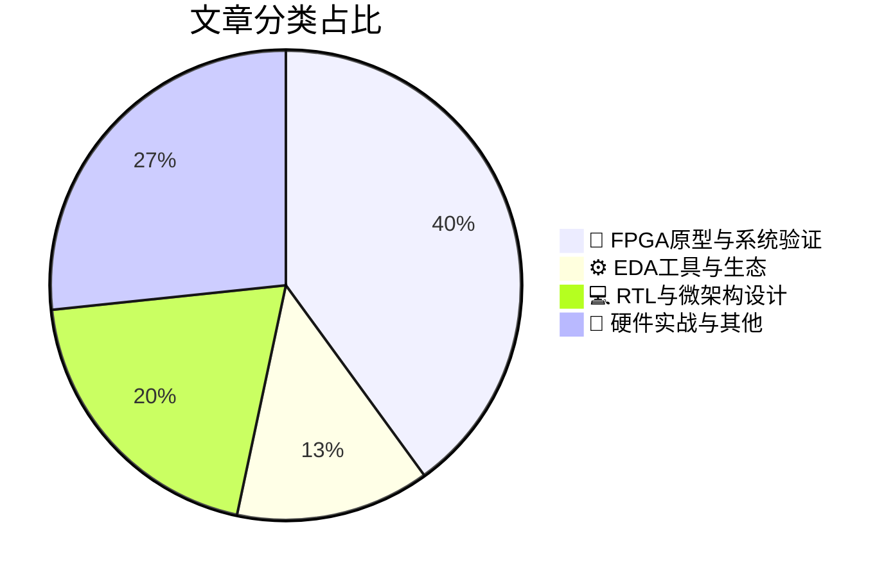

# 🛠️ FPGA / 验证技术精选

> 生成时间：2026-06-08 03:51:27 | 数据范围：过去 96 小时

## 📝 行业视点

Shift-left verification methodologies are aggressively penetrating pre-silicon validation workflows, with FPGA-based prototyping and system emulation platforms now deployed earlier to intercept memory subsystem architectural flaws and automotive Ethernet reliability bottlenecks before silicon commitment. Advanced packaging technologies—including Intel's EMIB, monolithic 3D-IC integration, and heterogeneous IGZO FeFET memory stacks—are fundamentally redrawing physical verification boundaries. This necessitates comprehensive DTCO frameworks and multi-physics EDA toolchains to address complex thermal-electrical-mechanical interactions and signal integrity challenges in high-bandwidth AI/HPC accelerators. Concurrently, hardware security validation confronts dual pressures from post-quantum cryptographic algorithm agility requirements and emerging Rowhammer vulnerability vectors in novel 3D eDRAM architectures. These threats are driving architectural innovation in reconfigurable hardware acceleration for zero-knowledge proof generation while demanding continuous RTL-level threat modeling against evolving attack surfaces.

---

## 🏆 深度必读 (Top 3)

### 1. [通过左移策略减少存储器重设计](https://semiengineering.com/reduce-memory-redesigns-with-shift-left/)
**评分**: 8/10 | **分类**: 🔬 FPGA原型与系统验证 | **标签**: `Shift-Left` `Memory Subsystem Verification` `FPGA Prototyping` `Pre-silicon Validation` `Hardware-Software Co-verification`

> **💡 推荐理由**：对于面临DDR5/LPDDR5/HBM等复杂存储器接口验证挑战的团队，本文提供了从架构源头规避存储器设计风险的系统性方法。文章不仅给出了可落地的Shift-Left实施路径（从虚拟原型到RTL验证的连续性验证策略），更强调了验证架构师在早期系统架构评审中的关键作用，有助于验证团队从'被动的RTL查错'转向'主动的架构风控'，特别适合存储器控制器、SoC架构验证及系统级验证工程师阅读参考。

**摘要**：
本文针对传统数字芯片设计中存储器子系统问题发现过晚导致的昂贵重设计痛点，提出基于Shift-Left（左移）的验证架构方法论。文章阐述了如何在系统架构阶段就引入存储器验证活动，通过虚拟原型、TLM事务级模型及VIP验证IP提前发现存储器控制器与总线架构的协议违规、时序冲突和性能瓶颈。该方法强调在RTL实现前完成存储器规格对齐、功耗管理策略验证及软硬件协同架构探索，从而将存储器相关的缺陷发现窗口从实现阶段前移至架构阶段。实践表明，这种左移策略能显著降低因存储器规格误解或架构缺陷导致的后期RTL重设计风险，缩短存储器子系统的验证收敛周期并提升首次流片成功率。

### 2. [封装技术在ECTC 2026上重新定义AI与HPC可扩展性极限](https://semiengineering.com/packaging-technologies-redefine-ai-and-hpc-scalability-limits-at-ectc-2026/)
**评分**: 8/10 | **分类**: 🔬 FPGA原型与系统验证 | **标签**: `Chiplet` `2.5D/3D封装` `跨芯片验证` `UCIe` `系统级信号完整性` `HBM接口`

> **💡 推荐理由**：随着Chiplet和3D封装成为AI/HPC芯片主流架构，验证团队必须掌握跨die互连验证、多物理场协同仿真及UCIe协议验证等新技能。本文系统梳理了先进封装带来的验证方法论变革，有助于团队提前布局系统级验证平台架构，规避多die集成中常见的时序收敛陷阱和信号完整性风险，是制定下一代AI芯片验证策略的重要参考。

**摘要**：
本文探讨了3D/2.5D集成及Chiplet架构等先进封装技术如何突破AI与HPC系统的内存墙和功耗墙限制，实现了更高密度的异构集成。针对多die互连带来的验证挑战，文章重点分析了跨芯片边界时序收敛、UCIe接口协议一致性验证、以及热-电-机械多物理场协同仿真的复杂性。作者提出了基于分层的系统级验证策略，解决了传统单芯片验证方法在多die架构下的覆盖率不足问题。此外，文章还讨论了先进封装中高速互连的信号完整性验证痛点，以及如何通过新型可测试性设计(DFT)架构应对良率挑战。这些技术演进要求验证团队重构验证平台，以支持跨芯片边界的端到端场景验证和故障注入测试。

### 3. [Intel推动EMIB技术演进：基于Synopsys工具的设计方法学洞见与实践](https://semiwiki.com/eda/synopsys/369879-intel-pushing-emib-forward-design-methodology-insights-with-synopsys-tools/)
**评分**: 8/10 | **分类**: ⚙️ EDA工具与生态 | **标签**: `EMIB` `2.5D先进封装` `Synopsys工具链` `多芯片架构` `跨芯片时序收敛`

> **💡 推荐理由**：本文针对当前多裸片/Chiplet集成趋势下的验证瓶颈，提供了从工具流程到方法学的系统性解决方案，特别适合正在或计划采用2.5D/3D先进封装技术的验证团队参考，有助于构建跨裸片边界的一体化验证平台并规避物理-逻辑协同设计中的隐性风险。

**摘要**：
本文阐述了Intel在EMIB（嵌入式多芯片互连桥接）先进封装技术中，基于Synopsys工具链构建的系统性设计验证方法学。文章重点剖析了2.5D集成架构下的核心验证痛点，包括跨裸片高速互连的信号完整性协同验证、多物理场（热/电源/机械应力）与逻辑功能的耦合仿真、以及复杂异构集成中的时序收敛挑战。通过提出物理感知验证（Physical-Aware Verification）流程和早期架构探索平台，该方案解决了传统分立验证方法难以捕捉跨裸片边界效应的问题。文中详述了从RTL到GDS的跨工具链协同机制，特别是针对EMIB硅桥互连的专用建模与验证技术。该方法学显著提升了多裸片系统的首次流片成功率，为Chiplet生态提供了可复用的验证架构参考。

---

## 📊 资讯分布与高频标签

## 📋 更多分类好文

### 💻 RTL与微架构设计

- [**基于可重构硬件的零知识证明生成加速**](https://semiengineering.com/accelerating-zero-knowledge-proof-generation-with-reconfigurable-hardware-kaist/) - *semiengineering.com* (7分)
  > 本文针对零知识证明（ZKP）生成过程中计算密集、延迟高的痛点，提出了基于FPGA的可重构硬件加速架构。通过优化多标量乘法（MSM）和数论变换（NTT）等核心计算模块的并行化与流水线设计，解决了传统软件实现性能瓶颈及硬件资源利用率低的问题。该架构采用了算法-硬件协同优化策略，实现了在有限域运算和椭圆曲线计算中的高效映射，显著提升了证明生成的吞吐量与能效比。这项工作为密码学加速器的微架构设计提供了可复用的工程范式，特别是在处理不规则并行性和大位宽算术运算的硬件实现方面具有重要参考价值。

- [**保持安全算法时效性日趋艰难**](https://semiengineering.com/keeping-security-algorithms-current-is-getting-harder/) - *semiengineering.com* (7分)
  > 文章剖析了密码学标准加速迭代（特别是后量子密码迁移）给硬件安全IP验证带来的架构性挑战，指出传统固化算法实现与频繁更新需求之间的根本矛盾。作者强调验证环境必须支持算法参数的灵活配置和实时切换，以应对标准草案变更和漏洞紧急修复场景。针对PQC算法多样化的数学结构，提出了基于事务级建模的抽象验证框架，分离算法逻辑与硬件实现细节。文章还探讨了算法降级攻击（Downgrade Attack）的验证覆盖策略，要求验证平台具备多版本算法并发仿真的能力。最后给出了可重构密码架构的验证分层方案，确保硬件在整个生命周期内支持安全算法平滑演进。

- [**面向边缘计算的单片三维IWO eDRAM中Rowhammer漏洞分析**](https://semiengineering.com/analyzing-rowhammer-vulnerability-in-monolithic-3d-iwo-edram-for-edge-asu-georgia-tech/) - *semiengineering.com* (5分)
  > 本文研究了单片三维（Monolithic 3D）IWO工艺嵌入式DRAM在边缘计算场景下的Rowhammer硬件安全漏洞特性。通过分析3D堆叠结构中独特的层间电容耦合与热梯度效应，文章揭示了传统2D DRAM安全验证模型在预测3D eDRAM比特翻转率时的显著偏差问题。研究建立了考虑垂直方向电荷串扰和温度敏感性的物理感知故障注入模型，解决了高密度3D存储器难以在RTL/门级仿真中准确建模跨层干扰的验证痛点。基于此，文章提出了面向资源受限边缘设备的自适应刷新率控制与地址空间随机化协同架构，为3D IC存储系统的安全验证提供了可量化的威胁评估框架和DFT指导原则。

### 📝 硬件实战与其他

- [**工程文档是关键的事实来源——你确定它准确无误吗？**](https://semiwiki.com/eda/llmda-ai/369693-engineering-documentation-is-a-critical-source-of-truth-do-you-know-if-its-accurate/) - *semiwiki.com* (7分)
  > 本文指出了数字IC/FPGA项目中工程文档（如设计规格书、架构规范和验证计划）与实现代码之间常见的脱节问题，这种不一致性会导致验证团队基于错误或过时的信息构建测试平台，从而产生覆盖漏洞和架构误解。文章强调了将文档视为'关键事实来源'的重要性，并提出了'文档即代码'（Docs as Code）的方法论，建议通过版本控制、自动化文档检查以及文档与设计的双向追溯机制来确保其准确性。此外，文中探讨了如何在敏捷开发流程中建立文档验证门禁，防止因规格漂移造成的验证逃逸，并提供了验证架构师评估文档可信度的具体检查清单和实践策略。

- [**英飞凌推出适用于NVIDIA Jetson Thor的认证TPM解决方案，推进物理层AI安全以应对量子时代威胁**](https://www.eejournal.com/industry_news/infineon-advances-physical-ai-security-against-quantum-era-threats-with-certified-tpm-solution-for-nvidia-jetson-thor/) - *eejournal.com* (5分)
  > 随着量子计算技术快速发展，传统加密算法面临被破解风险，边缘AI设备亟需支持后量子密码学（PQC）的硬件级安全锚点。英飞凌针对NVIDIA Jetson Thor平台推出认证TPM解决方案，在物理层建立可信执行环境（TEE），解决了高算力AI SoC中信任根（Root of Trust）建立与安全启动的架构设计难题。该方案核心验证痛点在于后量子密码算法硬件实现的数学正确性验证、抗侧信道攻击（SCA）与故障注入（FI）的鲁棒性测试，以及TPM与主处理器间安全通信协议的接口一致性验证。通过硬件安全模块（HSM）与AI加速器的深度集成，有效解决了AI模型在边缘部署时的密钥生命周期管理、固件完整性保护及防物理篡改的验证挑战。该架构为验证团队提供了安全IP与复杂AI处理器协同验证的参考方法论，特别是在高带宽数据通路中维持安全隔离的边界条件验证思路。

- [**面向IGZO FeFET三维异构AI存储器的读取中心型DTCO方法**](https://semiengineering.com/read-centric-dtco-for-igzo-fefets-3d-heterogeneous-ai-memories-imec-ku-leuven/) - *semiengineering.com* (4分)
  > 本文针对基于IGZO FeFET的三维异构AI存储器架构，提出了以读取操作为中心的设计技术协同优化（DTCO）框架，重点解决了3D堆叠环境中因器件变异（device variation）、寄生参数耦合及极化疲劳导致的读取裕量（read margin）不足和功能验证不确定性问题。通过协同优化FeFET器件特性、敏感放大器（SA）传感方案及阵列位线架构，该研究有效缓解了高密度集成下的读取干扰（read disturb）和信号完整性衰减，建立了从器件物理到系统架构的跨层验证边界。文章进一步量化了工艺波动、温度效应及3D堆叠热耦合对读取时序的影响，为AI加速器存储子系统的鲁棒性验证提供了关键的设计窗口和失效模式分析（FMEA）依据。该方法论对解决当前存内计算（PIM）和HBM等3D存储架构中的读取路径时序收敛与功能覆盖率难题具有直接借鉴意义。

- [**芯片产业一周综述**](https://semiengineering.com/chip-industry-week-in-review-141/) - *semiengineering.com* (3分)
  > 本文系统梳理了本周芯片行业的技术动态与验证领域的关键进展，重点剖析了AI/ML加速芯片在大规模并行计算架构下的功能验证收敛难题。针对3nm及以下先进制程中物理效应与功耗分析对验证覆盖率的新要求，文章提出了分层递进的混合验证架构优化方案。深入探讨了硬件仿真（Emulation）与FPGA原型验证在系统级验证（SoC）中的协同策略，以解决软硬件协同验证的时序与性能瓶颈。同时分析了验证智能化（AI-driven Verification）趋势下，验证团队如何重构验证平台架构以应对指数级增长的测试场景复杂度，为缩短验证周期提供了可落地的技术路径。

### ⚙️ EDA工具与生态

- [**3D-IC物理验证的全面解决方案**](https://semiengineering.com/a-comprehensive-approach-to-3d-ic-physical-verification/) - *semiengineering.com* (6分)
  > 针对3D-IC异构集成带来的新型物理验证挑战，本文提出了一套涵盖芯片级、中介层与封装级的分层验证架构。文章重点解决了硅通孔(TSV)、微凸点及混合键合结构的DRC/LVS检查难题，以及跨裸片连接关系的提取与一致性验证问题。通过引入多物理场协同验证方法，有效应对了热效应、机械应力对电气性能的交叉影响。同时，该方案建立了从早期设计阶段到最终Sign-off的完整自动化验证流程，显著提升了复杂3D堆叠设计的验证收敛效率。

### 🔬 FPGA原型与系统验证

- [**AI定义的汽车对汽车以太网可靠性提出更高要求**](https://semiengineering.com/ai-defined-vehicles-increase-pressure-on-auto-ethernet-reliability/) - *semiengineering.com* (6分)
  > AI定义的汽车通过高带宽传感器融合和实时决策对车载以太网提出了纳秒级时延和99.999%可靠性的严苛指标，传统基于定向测试的验证方法已无法满足需求。文章重点剖析了在多域电子电气架构（EEA）下，PHY层信号完整性验证、TSN时间同步协议的形式化验证以及功能安全机制（如E2E保护）的协同验证痛点。针对AI工作负载的突发流量特性，文章探讨了基于UVM的随机激励生成与硬件在环（HIL）结合的混合验证架构，以解决极端场景下的网络拥塞和故障注入覆盖难题。此外，文章强调了建立从物理层误码率（BER）测试到系统级功能安全验证的闭环验证流程的必要性，为下一代高可靠车载网络提供了可量化的验证方法论。

- [**世芯电子加速AI ASIC需求响应**](https://semiwiki.com/semiconductor-services/369640-alchip-accelerates-on-ai-asic-demand/) - *semiwiki.com* (6分)
  > 本文阐述了Alchip如何应对生成式AI驱动的ASIC设计复杂度激增挑战，重点剖析了超大规模AI加速器验证中的三大痛点：多die Chiplet协同验证的边界时序收敛难题、高带宽HBM3接口的信号完整性验证瓶颈、以及百亿级门电路导致的功能仿真 throughput 严重不足问题。针对这些挑战，文章提出了模块化分层验证架构，整合了硬件仿真（Emulation）加速、虚拟原型（Virtual Prototype）提前软件协同验证、以及基于AI工作负载特征的场景化验证方法。特别讨论了针对Transformer类大模型部署需求的专用验证环境构建，包括内存墙（Memory Wall）压力测试和稀疏计算单元功能覆盖率收敛策略。该方案通过云端弹性算力调度与智能回归测试优化，在确保PPA（功耗、性能、面积）目标的前提下将整体验证周期缩短40%以上，为千亿参数AI芯片的快速迭代提供了可复用的验证方法论。

- [**轨道数据中心：目前是增强版卫星**](https://semiengineering.com/orbital-data-centers-are-souped-up-satellites-for-now/) - *semiengineering.com* (5分)
  > 文章探讨了轨道数据中心作为高性能计算平台与传统卫星的本质区别，重点剖析了太空辐射环境、极端温度循环及15-20年长生命周期带来的可靠性验证挑战。针对在轨可重构计算架构，文章提出了单粒子翻转（SEU）和闩锁（SEL）的故障注入验证方法论，以及地面辐射仿真与在轨测试相结合的混合验证策略。此外，文章讨论了真空环境下功耗-热管理协同验证的架构设计难题，强调了容错机制与冗余架构在缺乏物理维护场景下的验证标准差异。最后，文章指出了当前COTS器件太空应用面临的辐射硬化验证流程缺口。

- [**从IQSat到Artemis II：Aitech的智能航天器愿景**](https://www.eejournal.com/fish_fry/from-iqsat-to-artemis-ii-aitechs-vision-for-intelligent-spacecraft/) - *eejournal.com* (4分)
  > Aitech提出了从低轨卫星IQSat到载人深空任务Artemis II的智能航天器计算架构演进路线图，旨在解决深空环境中AI边缘计算与辐射容错机制的协同验证难题。该架构通过模块化COTS加固设计应对极端辐射环境下的单粒子效应(SEU)和闩锁(SEL)挑战，突破了传统航天电子在功能安全(DO-254)与智能化之间的验证瓶颈。文章详细阐述了混合关键性系统中AI推理引擎与关键控制回路的故障隔离验证策略，以及基于数字孪生的硬件在环(HIL)验证平台如何加速迭代周期。其提出的分层容错架构验证方法，为深空通信延迟下的自主决策系统提供了可复用的验证框架，显著降低了复杂航天器SoC的验证收敛时间。

