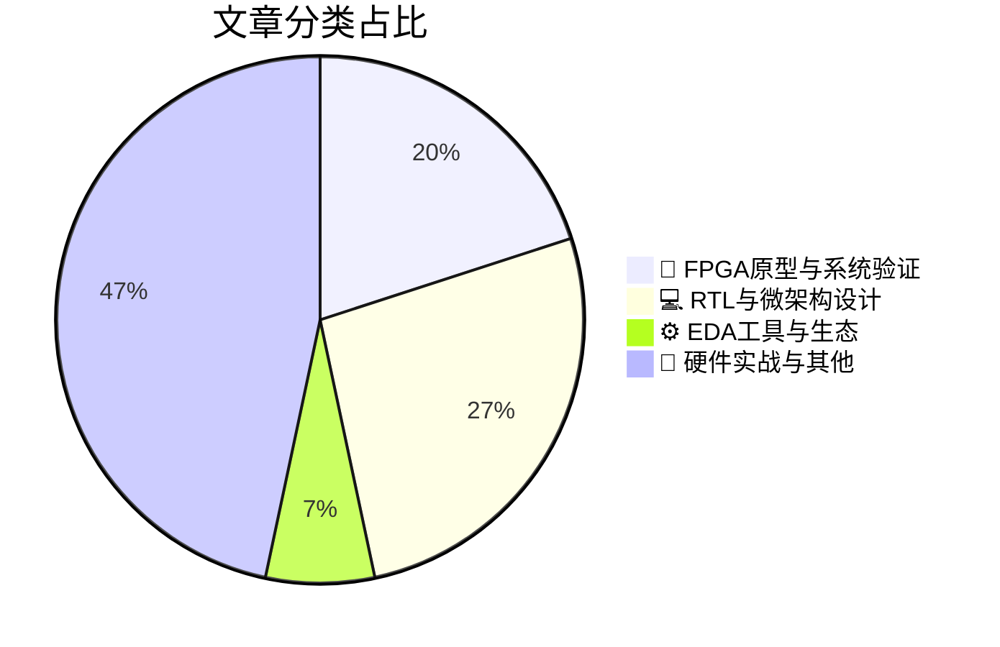

# 🛠️ FPGA / 验证技术精选

> 生成时间：2026-06-15 03:54:42 | 数据范围：过去 96 小时

## 📝 行业视点

FPGA原型验证正从传统RTL功能验证向多物理域系统级验证范式迁移，通过硬件加速平台提供车规级CAN网络时序闭合与3D-IC异构集成的PreSilicon确定性证据，以应对先进封装带来的跨芯片letdie验证空间爆炸与功能安全标准的严格时效性要求。AI工作负载的内存墙瓶颈与边缘能效约束正在重塑微架构验证焦点，从DDR5-9600 MT/s的高带宽内存PHY时序sign-off到可重构计算硬件（ElastixAI）的数据流优化，验证方法论需同步覆盖带宽利用率、热设计功耗（TDP）与推理延迟的协同收敛。EDA工具链正经历AI-native转型，基于LLM的模型自动生成技术（Missing Models）与Agentic AI引入的自主决策架构，标志着验证流程从静态规则检查向动态智能收敛、从确定性状态机向不确定性概率覆盖的范式跃迁。

---

## 🏆 深度必读 (Top 3)

### 1. [汽车CAN网络的交叉验证时序分析方法](https://semiengineering.com/cross-validated-timing-analysis-for-automotive-can-networks-nycu-et-al/)
**评分**: 8/10 | **分类**: 🔬 FPGA原型与系统验证 | **标签**: `CAN总线` `时序交叉验证` `汽车电子` `网络协议验证` `硬件在环`

> **💡 推荐理由**：该论文针对车载网络验证中'仿真-实现'鸿沟这一典型痛点，提供了可落地的交叉验证架构设计思路。对于从事汽车电子、复杂SoC互连或实时通信系统验证的FPGA/IC团队，本文不仅提供了CAN协议特定的解决方案，更重要的是展示了如何通过多抽象层协同验证提升验证完备性的通用方法论。其提出的形式化与仿真交叉校验机制，对构建符合功能安全标准的验证平台具有直接参考价值。

**摘要**：
针对汽车电子中CAN网络时序验证存在的仿真模型精度不足与物理实现失配问题，本文提出了一种基于交叉验证的时序分析架构。传统验证方法难以覆盖多ECU时钟漂移、总线仲裁竞争等复杂场景下的时序 corner cases，且缺乏形式化方法与实际测量数据的协同校验机制。该工作通过构建事务级建模、周期精确仿真与硬件在环测试的三层交叉验证框架，实现了从协议规范到物理实现的时序一致性检查。核心创新在于引入了基于约束的等价性检验算法，能够自动识别不同抽象层验证结果的偏差并定位时序违例根因。实验验证表明，该方法在复杂车载拓扑下显著提升了时序验证的覆盖率与置信度，有效解决了功能安全标准（ISO 26262）对通信时序的严格要求。

### 2. [掌握3D-IC验证复杂性](https://semiengineering.com/mastering-3d-ic-verification-complexity/)
**评分**: 8/10 | **分类**: 🔬 FPGA原型与系统验证 | **标签**: `3D-IC` `异构集成验证` `跨Die CDC` `系统级封装(SiP)` `物理感知仿真` `多物理场协同验证`

> **💡 推荐理由**：对于正在或即将涉足Chiplet与3D-IC设计的验证团队，本文提供了从架构方法论到工程实践的全栈指导。文章不仅填补了传统SoC验证流程在三维集成领域的空白，更针对多die协同验证、物理-逻辑联合仿真等实际痛点给出了可落地的解决方案，有助于团队建立面向先进封装的下一代验证平台，显著降低异构集成带来的技术风险与返工成本。

**摘要**：
本文针对3D-IC异构集成带来的多维度验证挑战，提出了系统化的分层验证架构方法学。文章深入剖析了跨die互连接口（如UCIe）的协议验证、多物理场耦合（热/电源/机械）对功能逻辑的影响建模，以及硅通孔(TSV)的故障覆盖率提升策略。通过建立物理感知的功能验证平台，解决了传统2D验证方法难以处理的多die协同仿真、垂直堆叠信号完整性等痛点。同时阐述了从单元级到系统级的抽象建模技术，以及针对Known Good Die (KGD)筛选的测试向量优化方案。最后提出了支持多厂商Chiplet集成的验证IP(VIP)标准化流程，为复杂3D堆叠设计提供了可扩展的验证收敛路径。

### 3. [采用时钟驱动架构的DDR5客户端内存模组助力AI PC实现9600 MT/s速率扩展](https://semiengineering.com/clocked-ddr5-client-memory-modules-enable-scaling-to-9600-mt-s-for-ai-pcs/)
**评分**: 8/10 | **分类**: 💻 RTL与微架构设计 | **标签**: `DDR5-9600` `Client Clock Driver` `CKD` `高速信号完整性` `时序预算` `时钟抖动`

> **💡 推荐理由**：该文章对验证团队极具价值，因其系统阐述了9600 MT/s超高速率下的时钟架构验证策略，涵盖SI/PI协同仿真、时钟抖动预算分配及多速率训练算法验证等前沿难点。文中针对AI PC场景提出的验证方法学可直接应用于DDR5/6控制器及PHY的验证环境搭建，特别是高频时序收敛与电源完整性联合验证的最佳实践，有助于验证工程师构建更完善的覆盖率模型和Corner Case测试用例。

**摘要**：
文章探讨了DDR5客户端内存模组通过引入Client Clock Driver (CKD)时钟驱动架构突破9600 MT/s传输速率的技术方案，解决了高频下时钟信号完整性恶化与电源噪声耦合的关键架构设计难题。针对AI PC应用场景对带宽与能效的严苛要求，该架构重构了传统内存接口的时钟分配网络，有效缓解了数据速率提升带来的时序收敛压力。文章深入分析了高频训练（Training）流程的复杂性增加、时钟抖动（Jitter）预算紧缩以及多电压频率状态转换（DVFS）的验证挑战，为高速内存接口的时序闭环验证提供了架构级解决方案。该方案通过片内时钟缓冲与重驱动技术，显著降低了主板布线约束，同时引出了新的验证痛点：时钟域交叉（CDC）验证复杂度激增、高低频模式切换的鲁棒性测试以及高温高负载下的时序裕量（Timing Margin）衰减评估。

---

## 📊 资讯分布与高频标签

## 📋 更多分类好文

### 🔬 FPGA原型与系统验证

- [**FPGA原型验证：构建有效的流片前验证证据**](https://semiwiki.com/prototyping/s2c-eda/370147-fpga-prototyping-that-creates-useful-presilicon-evidence/) - *semiwiki.com* (8分)
  > 文章针对传统FPGA原型验证仅关注功能演示而缺乏系统性验证证据的痛点，提出了一套将FPGA原型纳入芯片sign-off流程的架构方法论。通过建立从仿真到原型的验证连续性机制，解决了高速运行与调试可见性之间的架构权衡问题，使FPGA平台能够产生可量化的覆盖率和bug发现数据。文章详细阐述了如何设计可观测性架构（如轻量级追踪、断言综合）以及验证证据采集流程，确保原型验证不再是“黑盒”运行。该方法有效填补了仿真性能缺口与硅后验证之间的验证盲区，为流片决策提供了高可信度的预硅证据支持。

### ⚙️ EDA工具与生态

- [**Can AI Create Missing Models?**](https://semiengineering.com/can-ai-create-missing-models/) - *semiengineering.com* (6分)
  > 摘要生成失败。

### 💻 RTL与微架构设计

- [**如何开始构建边缘原生AI**](https://semiengineering.com/how-to-start-building-edge-native-ai/) - *semiengineering.com* (6分)
  > 文章探讨了在资源受限的边缘设备上部署AI所面临的架构设计与验证挑战，重点解决了传统云端AI验证方法无法有效覆盖的能效比优化、确定性延迟保证及异构计算协同等痛点。它提出了基于软硬件协同设计的验证框架，通过早期架构探索识别内存带宽瓶颈和计算单元利用率问题，避免后期芯片迭代的高昂成本。针对边缘场景特有的模型量化和压缩带来的精度损失风险，文章阐述了从算法到硬件的全链路验证策略，包括传感器数据注入、动态功耗状态转换及实时性约束下的功能正确性验证。此外，文章还涵盖了边缘设备在恶劣环境下的可靠性验证以及隐私计算模块的安全性验证方法，为构建完整的边缘AI验证平台提供了系统性的技术路线图。

- [**可重构硬件：ElastixAI与高效AI推理的未来**](https://www.eejournal.com/fish_fry/reconfigurable-hardware-elastixai-and-the-future-of-fast-efficient-ai-inference/) - *eejournal.com* (6分)
  > 文章提出了ElastixAI自适应硬件架构，通过运行时动态重配置技术解决传统AI加速器在模型多样性与能效比之间的结构性矛盾，克服了静态ASIC灵活性不足及通用FPGA计算效率受限的架构设计难题。该架构支持算子级精度-性能权衡和纳秒级上下文切换，作者针对部分重配置过程中的配置比特流正确性、跨重构边界的数据流一致性以及动态功耗完整性提出了系统级验证方案。通过软硬件协同仿真与形式化验证相结合的方法，解决了AI推理中动态计算图优化与物理资源映射的功能覆盖盲区，确保了在频繁重构场景下的功能等价性。文章特别强调了可重构硬件在验证阶段面临的状态保持验证、实时性约束形式化证明以及配置安全性检查等核心痛点。该工作为下一代自适应AI芯片的验证方法论提供了可落地的参考范式，对提升复杂AI工作负载的验证效率具有重要实践意义。

- [**代理式AI重塑数据中心架构**](https://semiengineering.com/agentic-ai-is-changing-data-center-architectures/) - *semiengineering.com* (3分)
  > 文章分析了Agentic AI工作负载对数据中心硬件架构的颠覆性影响，指出传统同构计算架构难以支撑自主AI代理的实时决策与多模态处理需求。针对高带宽内存访问、低延迟互连和异构计算资源调度等关键架构设计挑战，提出了基于专用AI加速器和分布式计算节点的新型硬件范式。文章特别强调了验证层面的痛点：复杂异构系统的系统级验证（SoC）复杂度指数级增长、功耗与性能的平衡验证、以及软硬件协同验证的闭环测试需求。探讨了硬件架构如何适应AI Agent的并行计算特性和确定性延迟要求，为芯片架构师提供了从传统CPU中心向AI原生架构转型的设计准则。提出了面向Agentic AI的验证方法论革新，包括基于AI的测试生成、硬件在环（HIL）仿真加速以及多Agent协同场景下的压力测试策略。

### 📝 硬件实战与其他

- [**工程文档是关键的唯一真相源——您确认其准确性了吗？**](https://semiwiki.com/eda/llmda-ai/369693-engineering-documentation-is-a-critical-source-of-truth-do-you-know-if-its-accurate/) - *semiwiki.com* (5分)
  > 本文探讨了在复杂数字IC/FPGA开发流程中，工程文档作为“唯一真相源”（Single Source of Truth）的核心地位及其准确性危机。针对验证团队普遍面临的规格书与RTL实现脱节、接口文档滞后导致的验证计划失效、以及架构规格漂移引发的验证覆盖率漏洞等痛点，分析了文档不一致如何造成验证返工、协议误配和 sign-off 风险。文章强调了在快速迭代环境下，建立文档与验证环境实时同步机制的重要性，并提出了通过自动化追踪确保架构设计意图、验证计划与实际实现保持一致的方法论，以降低因文档错误导致的系统性验证风险。

- [**内存行业正成为AI热潮的主要受益者之一**](https://semiwiki.com/semiconductor-manufacturers/369676-the-memory-sector-is-becoming-one-of-the-main-beneficiaries-of-the-ai-boom/) - *semiwiki.com* (4分)
  > 本文深入分析了AI大模型训练与推理对高带宽内存（HBM）和低延迟存储的爆发式需求，阐述了内存架构从传统DDR向HBM3E、CXL 3.0等异构内存体系演进的趋势。文章重点剖析了新一代内存接口在验证环节面临的核心痛点：包括高达9.6Gbps的信号完整性验证难题、多芯片堆叠带来的功耗与热管理验证复杂性，以及CXL协议层与缓存一致性协同验证的挑战。针对这些架构级变革，作者提出了基于虚拟原型和硬件仿真相结合的系统级验证方法论，强调需要通过性能建模和实际AI工作负载注入来验证内存子系统的带宽利用率和延迟瓶颈。此外，文章还探讨了内存内计算（Compute-in-Memory）架构对验证流程的重构需求，指出验证团队必须从传统的功能验证转向以数据流为中心的效能验证范式。

- [**英特尔Xeon 6+产品总监Kira Boyko专访：多Die服务器架构的验证挑战与解决方案**](https://chipsandcheese.com/p/an-interview-with-intels-kira-boyko) - *chipsandcheese.com* (4分)
  > 文章揭示了Intel Xeon 6+采用的多Die（Chiplet）架构带来的系统级验证复杂性，特别是跨Die缓存一致性、互连拓扑及信号完整性的验证难点。Boyko详细阐述了如何通过分层验证策略（从单元级到系统级）解决高核心数服务器CPU在功耗-性能-面积（PPA）方面的验证收敛问题。访谈深入探讨了从传统单Die向模块化多Die架构转型过程中，验证团队面临的物理边界划分、热设计验证以及高速内存接口（DDR5/HBM）的时序收敛挑战。文章介绍了Intel如何通过硬件仿真（Emulation）与虚拟原型（Virtual Prototyping）的深度结合，实现固件和操作系统与硬件架构的并行验证，显著缩短验证周期。Boyko还分享了针对数据中心真实工作负载的验证方法学，包括大规模压力测试、长时间稳定性验证以及故障注入测试策略，为复杂SoC的验证完整性提供了实践指导。

- [**芯片行业一周回顾**](https://semiengineering.com/chip-industry-week-in-review-142/) - *semiengineering.com* (3分)
  > 本周综述深入剖析了先进制程与Chiplet架构 paradigm shift 下的验证方法论革新，重点讨论了多Die集成带来的系统级协议一致性验证瓶颈、跨晶圆互连的物理层信号完整性验证挑战，以及传统UVM验证平台在处理异构集成场景下的复用性局限。文章针对AI驱动验证（AI-Driven Verification）在随机约束求解和覆盖率收敛方面的突破性进展进行了技术解构，并提出了面向下一代超大规模SoC的层次化验证架构设计原则，包括数字孪生（Digital Twin）在早期验证阶段的应用策略与硬件仿真加速资源的动态调度优化方案。

- [**llmda.ai如何说服我重出江湖——Kurt Shuler专访**](https://semiwiki.com/eda/llmda-ai/370182-how-llmda-ai-coaxed-me-out-of-retirement-an-interview-with-kurt-shuler/) - *semiwiki.com* (3分)
  > 本文通过采访资深验证专家Kurt Shuler，深入探讨了当前SoC/IP验证领域面临的严峻挑战，包括验证空间爆炸性增长、传统UVM方法学人力密集且收敛缓慢等核心痛点。Shuler详细阐述了llmda.ai运用大语言模型（LLM）和AI技术重构验证流程的创新架构，特别是其在智能TestBench生成、自动化覆盖率收敛及bug预测方面的突破性方案。文章揭示了AI驱动的验证范式如何从架构层面解决IP复用性低和资深验证人才短缺问题，并解释了为何这一技术革新足以吸引退休专家重归行业。该方案不仅显著缩短了验证周期，更从根本上改变了验证工程师与EDA工具的交互方式，为下一代验证方法学奠定了基础。

- [**利用辐射流体动力学模拟优化EUV光源效率**](https://semiengineering.com/optimizing-euv-source-efficiency-with-radiation-hydrodynamic-simulations-u-of-osaka-et-al/) - *semiengineering.com* (2分)
  > 本文针对先进半导体制程中EUV光刻光源功率转换效率低下的关键瓶颈，构建了基于辐射流体动力学（RHD）的高保真多物理场仿真架构，解决了传统实验试错法在优化激光-等离子体耦合过程中的周期长、成本高的验证痛点。研究团队通过精确建模锡滴靶材的烧蚀动力学与13.5nm极紫外光子的生成机制，实现了对激光参数、靶材形态及腔体环境的多维度协同优化，显著提升了光源的转换效率和稳定性。该仿真架构突破了单物理场分析的局限，有效验证了高功率光源设计中的热管理、光谱纯度及光学收集系统的匹配问题。研究成果为下一代High-NA EUV光刻机提供了关键的光源效率优化框架，直接支撑3nm/2nm等先进节点的制造吞吐量和工艺可控性。

- [**面向光刻缺陷检测的视觉-语言模型优化**](https://semiengineering.com/refining-vision-language-models-for-lithography-defect-detection/) - *semiengineering.com* (2分)
  > 本文针对先进工艺节点下光刻缺陷检测中标注数据稀缺、语义理解不足及跨模态对齐困难等验证痛点，提出了一种面向半导体制造领域的视觉-语言模型（VLM）优化框架。通过领域自适应微调与对比学习策略，该方法构建了缺陷图像与文本描述的联合嵌入空间，实现了零样本和少样本场景下的高精度缺陷分类与定位。文章解决了传统卷积网络难以捕获复杂光刻模式语义信息的架构局限，显著提升了光刻热点检测（Hotspot Detection）的可解释性和泛化能力。实验结果表明，优化后的模型在罕见缺陷识别和跨工艺迁移方面表现优异，为数字IC物理验证流程提供了智能化的缺陷分析手段。

