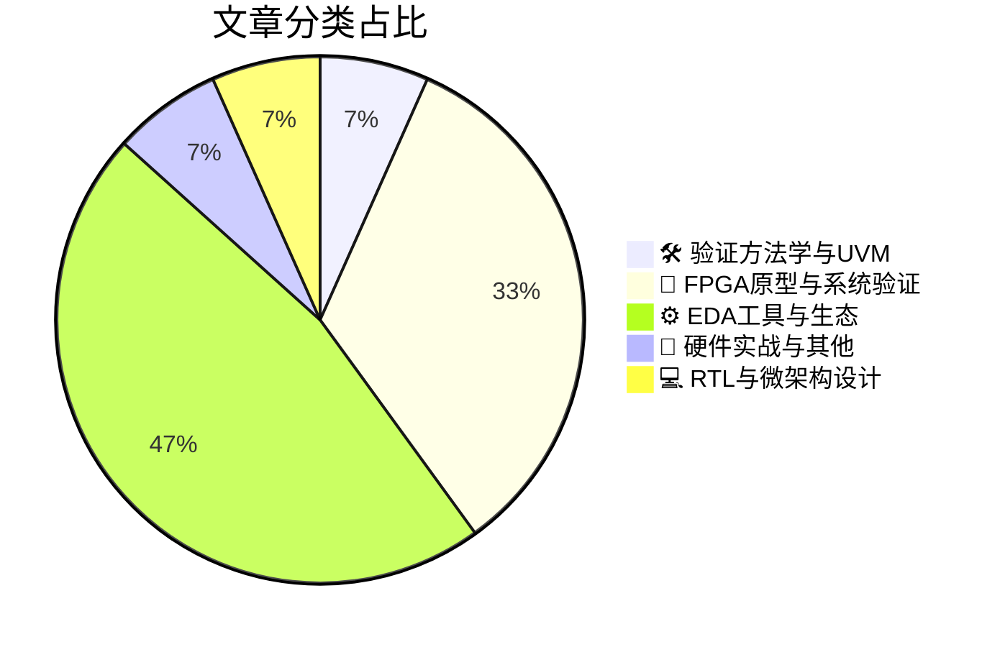

# 🛠️ FPGA / 验证技术精选

> 生成时间：2026-06-22 03:59:02 | 数据范围：过去 96 小时

## 📝 行业视点

先进节点GAA晶体管与3DIC异构集成的物理复杂度激增，正推动EDA工具链向多物理场融合（Multiphysics Fusion）与数字孪生（Digital Twin）范式迁移，通过IP-XACT标准化实现从器件物理到系统架构的跨层级数字连续性，以应对Intel 18A等先进工艺的全流程协同优化需求。随着ADAS多摄像头架构与Chiplet生态的爆发，FPGA原型验证正从功能仿真转向"Feed Forward Intelligence"驱动的可测试性设计（DFT）与系统级验证，通过硬件在环（HIL）与数字孪生融合，解决千亿级凸点互连带来的制造测试（Manufacturing Test）与硅后调试（Post-Silicon Debug）挑战。与此同时，在Security-by-Construction与良率爬坡的双重压力下，验证方法学正从传统UVM约束随机向基于晶圆级统计随机化（Wafer-Level Randomization）的数据驱动范式演进，整合工艺感知（Process-Aware）故障模型与实时良率数据，实现从RTL微架构到制造缺陷的跨抽象层风险预测。

---

## 🏆 深度必读 (Top 3)

### 1. [网络研讨会：Caspia揭秘如何在流片前根治芯片安全漏洞](https://semiwiki.com/events/370203-webinar-caspia-shows-you-how-to-fix-security-flaws-before-its-too-late/)
**评分**: 8/10 | **分类**: 🛠️ 验证方法学与UVM | **标签**: `硬件安全验证` `早期漏洞检测` `形式验证` `安全微架构` `左移验证`

> **💡 推荐理由**：对于验证团队而言，硬件安全已成为高可靠性芯片设计的核心挑战，传统验证方法往往难以发现非功能性安全缺陷。本文提供的左移安全验证策略可帮助团队建立系统化的安全验证流程，在RTL阶段即拦截潜在的安全漏洞，显著降低后期修复成本。建议负责安全关键型芯片（如AI加速器、加密芯片、车规芯片）的验证工程师深入研读，以完善验证方案中的安全属性检查能力。

**摘要**：
本文针对传统数字IC验证流程中难以有效发现硬件安全漏洞的痛点，介绍了Caspia提出的左移安全验证方法学。文章指出，仅依赖功能验证和代码审查无法捕捉侧信道攻击、信息泄露等深层安全隐患，而后期流片后修复安全缺陷的成本极高。Caspia展示了如何通过形式化验证、安全属性断言和架构级威胁建模，在RTL阶段系统性地识别和修复安全边界违规、未授权访问路径等关键漏洞。该方法强调了在验证规划阶段就融入安全需求，建立从架构设计到实现的全链条安全保障机制，避免因安全漏洞导致的芯片召回或声誉损失。

### 2. [将ADAS扩展至10路以上摄像头：架构与验证挑战](https://semiengineering.com/scaling-adas-to-10-cameras/)
**评分**: 7/10 | **分类**: 🔬 FPGA原型与系统验证 | **标签**: `ADAS` `Multi-camera` `System Architecture` `CDC` `FPGA Prototyping` `Bandwidth`

> **💡 推荐理由**：对于正在开发多摄像头融合SoC的验证团队，本文提供了从架构级验证到系统级验证的完整方法论，特别是针对多路并发数据通路的验证激励生成、带宽性能监控及跨时钟域（CDC）验证策略具有直接指导意义。文章提出的分层验证架构（单元级→子系统级→芯片级→HIL）和针对高吞吐数据流的性能验证方案，可帮助验证团队提前发现架构瓶颈，避免后期流片后的带宽不足或延迟超标问题，强烈推荐给负责ADAS/自动驾驶芯片验证的架构师与工程师。

**摘要**：
本文针对ADAS系统从传统4-6摄像头向10路以上高清摄像头演进过程中的架构瓶颈与验证难题，提出了可扩展的SoC互连架构与数据流优化方案。核心挑战在于解决多路高分辨率视频流并发传输时的带宽争用、延迟抖动及跨摄像头同步验证问题，同时满足ISO 26262功能安全对数据完整性的严苛要求。文章详细阐述了基于虚拟原型（Virtual Prototyping）的早期架构探索方法，以及针对多摄像头并发场景的UVM验证环境分层抽象策略，有效解决了传统验证方法在应对10+路并行数据通路时的组合爆炸与调试复杂度问题。此外，还探讨了硬件在环（HIL）验证环境的扩展性设计，确保在系统级验证阶段能够复现真实道路上的多传感器融合场景与极端corner cases。

### 3. [技术研讨会：利用IP-XACT加速从设计规范到实现](https://semiwiki.com/eda/defacto-technologies/370274-webinar-faster-design-spec-to-implementation-using-ip-xact/)
**评分**: 7/10 | **分类**: ⚙️ EDA工具与生态 | **标签**: `IP-XACT` `寄存器自动化` `UVM RAL` `设计流程` `元数据标准`

> **💡 推荐理由**：对于验证团队而言，该方法能够自动生成UVM RAL模型和寄存器序列，彻底避免手工编写寄存器模型时因Spec理解偏差导致的bit-wise验证失败；同时确保设计与验证环境的寄存器定义同源，消除集成阶段因地址映射不一致引发的调试时间浪费，特别适合需要频繁变更寄存器规格的复杂SoC项目。

**摘要**：
本文探讨了如何通过IP-XACT标准（IEEE 1685）解决传统数字芯片设计中手工编码导致的规格与实现不一致问题。核心方案是基于机器可读的XML规格自动生成RTL设计、验证环境（特别是UVM寄存器抽象层RAL模型）及软件驱动代码，从而消除人工翻译Spec时的寄存器地址映射错误、位域偏移失误等常见验证痛点。该方法实现了规格变更的自动同步传播，确保在SoC集成阶段各IP配置的一致性，显著缩短了从架构定义到验证环境就绪的迭代周期。文章还讨论了如何通过标准化接口定义解决多团队协同时的总线协议匹配和寄存器访问冲突问题。

---

## 📊 资讯分布与高频标签

## 📋 更多分类好文

### 🔬 FPGA原型与系统验证

- [**前馈智能：赋能芯粒时代的可测试性设计**](https://semiwiki.com/artificial-intelligence/370248-feed-forward-intelligence-enabling-testability-in-the-chiplets-era/) - *semiwiki.com* (7分)
  > 文章针对芯粒(Chiplet)架构下多 die 集成带来的可测试性挑战，提出了一种前馈智能(Feed Forward Intelligence)架构方案。该方案通过在各芯粒间建立标准化的测试数据前向传输通道，解决了分区封装后测试访问端口受限、跨 die 边界扫描链路断裂以及制造缺陷定位困难等验证痛点。核心创新在于利用片上智能测试控制器实现测试模式的预配置与结果预判，在封装前阶段即完成芯粒级筛测数据的转发与聚合。该架构显著提升了多芯粒系统的可观测性和可控制性，降低了 2.5D/3D 集成后的测试成本与调试复杂度，为异构集成芯片的量产测试提供了可扩展的解决方案。

- [**弥合AI验证速度与湿实验现实之间的脱节**](https://www.eejournal.com/article/addressing-the-disconnect-between-ai-speed-and-wet-lab-reality/) - *eejournal.com* (7分)
  > 本文针对AI驱动验证方法的高吞吐特性与传统硬件实验室测试（湿实验）的低频特性之间的结构性脱节，提出了分层验证架构解决方案。核心痛点在于AI模型可在虚拟环境中高速生成海量测试场景，但物理硅片验证受限于实验室资源、调试时间和环境搭建成本，导致验证闭环延迟。文章建议构建数字孪生（Digital Twin）验证平台，通过虚拟-物理协同机制，使AI预测结果经关键性筛选后再映射到实际硬件验证，避免资源浪费。该架构特别强调建立AI模型精度与实测数据的反馈校准回路，确保高速仿真与物理现实的一致性。最终目标是在保持验证完备性的前提下，利用AI加速前仿阶段，而将有限的实验室资源聚焦于高风险边界场景，实现验证效率与成本的最优平衡。

- [**如何构建数十亿个凸点：超大规模芯片封装验证架构之道**](https://semiengineering.com/how-to-build-billions-of-bumps/) - *semiengineering.com* (6分)
  > 本文针对先进2.5D/3D封装及Chiplet架构中面临的超大规模凸点（bump）互连验证挑战，提出了分层可扩展的验证架构方案。文章详细阐述了如何通过分布式验证IP、自动化连接性检查及物理-逻辑协同仿真方法，解决传统验证环境在处理数十亿级I/O端口时遇到的内存爆炸、仿真速度下降和调试困难等痛点。作者介绍了基于层次化抽象和事务级建模的优化策略，实现了从物理凸点电气特性到系统级功能验证的高效覆盖，为超大规模集成芯片的验证方法论提供了可落地的架构设计思路。

- [**如何利用数字孪生与人工智能构建下一代基于模型的系统工程**](https://www.eejournal.com/fish_fry/leveraging-digital-twins-and-ai-for-modern-model-based-systems-engineering/) - *eejournal.com* (6分)
  > 文章探讨了将数字孪生技术与人工智能深度融合到基于模型的系统工程(MBSE)框架中，以解决传统V型开发流程中系统级验证滞后、软硬件边界模糊导致的协同困难，以及复杂异构架构早期验证覆盖不足等核心痛点。通过构建高保真虚拟原型（Digital Twins），验证团队能够在RTL实现乃至架构设计阶段即开展系统级功能验证、接口协议检查和性能瓶颈分析，实现真正的验证左移。AI技术被应用于智能测试场景生成、覆盖率收敛预测及异常行为检测，有效应对传统随机验证方法在状态空间爆炸时的效率瓶颈。该方法还建立了持续验证的数字主线，支持从概念设计到运维全生命周期的架构一致性确认，显著降低了后期集成阶段的设计返工风险。

### ⚙️ EDA工具与生态

- [**基于数字孪生技术的GAA逻辑良率加速优化方法**](https://semiengineering.com/accelerating-gaa-logic-yield-optimization-with-digital-twins-2/) - *semiengineering.com* (6分)
  > 面对GAA（Gate-All-Around）工艺节点下纳米片结构带来的复杂工艺变异和多物理场耦合挑战，传统基于硅后数据回溯的良率分析方法已无法满足先进逻辑芯片的验证周期要求。本文提出了一种融合数字孪生技术的良率优化架构，通过构建虚拟工艺-设计协同仿真平台，解决了硅前预测精度不足、版图敏感性与电学性能关联建模困难等核心验证痛点。该架构实现了制造数据、物理仿真与设计验证环境的实时闭环，支持在流片前对关键工艺窗口（Process Window）进行高保真度仿真与风险评估。通过引入机器学习增强的虚拟量测和统计学习模型，显著加速了从设计规则优化到最终良率提升的迭代周期，为GAA时代的可制造性设计（DFM）验证提供了系统性解决方案。

- [**VLSI 2026：英特尔18A平台从器件到布线设计的发展动力**](https://semiengineering.com/vlsi-2026-intel-18a-platform-momentum-from-devices-to-routed-designs/) - *semiengineering.com* (6分)
  > 本文系统阐述了Intel 18A工艺平台从器件物理到布线实现的完整技术突破，重点剖析了RibbonFET晶体管与PowerVia背面供电架构在物理验证环节引入的新型复杂性。针对先进节点下电源网络完整性（PNI）验证、三维器件模型的电路级仿真精度以及超密集金属层的DRC/LVS收敛等关键痛点，文章提出了覆盖从SPICE建模到GDS签核的全流程验证策略。作者通过实际测试芯片数据，论证了背面供电网络（BSPDN）对传统电磁验证（EM）和热效应分析流程的重构需求，并展示了应对晶体管级缺陷密度挑战的DFT可测性设计方案。该研究为3nm以下工艺节点的验证团队提供了关于新型晶体管结构电气特性验证、复杂供电网络静态/动态压降分析以及先进封装协同仿真的关键方法论指导。

- [**面向曲边掩膜及MULTIGON掩膜数据的新型图形分割引擎**](https://semiengineering.com/a-new-fracture-engine-for-curvilinear-masks-and-multigon-mask-data/) - *semiengineering.com* (6分)
  > 针对先进工艺节点下曲边掩膜数据量激增与传统分割引擎性能瓶颈的矛盾，本文提出了一种新型图形分割（Fracture）引擎架构。该引擎专为处理Curvilinear（曲边）掩膜和MULTIGON格式数据设计，通过改进的几何算法和分层并行数据流架构，解决了复杂曲线几何体在转换为电子束写入格式时的精度与吞吐量平衡问题。文章重点阐述了如何处理非曼哈顿几何图形带来的数据爆炸挑战，以及针对MULTIGON特定格式的内存优化与I/O加速策略。该方案有效缓解了掩膜数据准备（MDP）流程中的内存占用过高和计算延迟问题，为处理大规模几何数据集提供了可扩展的架构参考。

- [**多裸片设计中高效凸点与硅通孔规划方法**](https://semiengineering.com/how-to-create-efficient-bump-and-tsv-plans-for-multi-die-designs/) - *semiengineering.com* (4分)
  > 本文聚焦多裸片集成中Bump与TSV物理规划对系统架构的关键影响，解决了异构集成时代跨裸片互连密度与信号完整性难以协同优化的痛点。通过阐述早期物理-架构协同设计（Physical-Architecture Co-Design）方法，文章提供了优化凸点布局、TSV阵列分布及电源地网络规划的具体策略，有效避免了后期因物理约束导致的功能ECO和时序收敛失败。针对验证团队关心的可测试性（DFT）和接口协议验证，文中强调了物理连接规划对边界扫描（Boundary Scan）和裸片间互连测试（Interconnect Test）架构的支撑作用。该方法通过建立标准化的Bump/TSV设计规则库，显著提升了多裸片设计在系统级验证（SiL）阶段的调试效率与一次成功率。

- [**良率合作伙伴关系：英特尔与PDF Solutions携手攻克先进工艺节点难题**](https://semiwiki.com/semiconductor-manufacturers/intel/369950-the-yield-partnership-intel-and-pdf-solutions-tackle-advanced-nodes/) - *semiwiki.com* (3分)
  > 本文阐述了Intel与PDF Solutions在先进工艺节点良率提升方面的战略合作，重点解决了3nm及以下工艺中由于物理复杂性增加导致的硅后验证与量产良率脱节的痛点。双方通过整合PDF的Exensio数据分析平台与Intel的制造流程，实现了从设计验证到量产测试的全链路数据闭环，有效应对了先进节点中缺陷密度上升、工艺变异加剧带来的验证覆盖率不足问题。该合作架构将机器学习驱动的良率预测前移至设计阶段，突破了传统硅后验证仅关注功能正确性而忽视制造敏感性的局限。通过建立统一的数据接口和分析方法论，显著缩短了从芯片回片到量产爬坡的周期，为先进工艺节点的快速商业化提供了可复用的验证与制造协同框架。

- [**新思科技推出多物理场融合解决方案，统一电气、热、机械与光学分析**](https://semiwiki.com/eda/synopsys/370446-synopsys-unifies-electrical-thermal-mechanical-and-optical-analysis-with-multiphysics-fusion-solutions/) - *semiwiki.com* (3分)
  > Synopsys Multiphysics Fusion Solutions针对3D IC与先进封装中电气、热、机械及光学效应深度耦合的复杂性，解决了传统单物理场工具割裂导致的验证精度损失与迭代效率低下问题。该方案通过统一的数据模型与求解引擎，实现了电-热-机械-光学的协同仿真，有效捕捉热梯度对时序的影响、机械应力对互连可靠性的影响以及光电协同效应等多物理场交互现象。平台消除了跨工具数据转换的误差与冗余，支持从架构探索到Signoff的全流程多物理场分析，显著缩短异构集成设计的验证周期。特别针对Chiplet堆叠、硅光互连等场景中的电源完整性、信号完整性与热管理协同验证需求，提供了系统级的精度保障。这一统一验证架构为先进制程下的多物理场签核提供了完整的基础设施支撑。

### 📝 硬件实战与其他

- [**通过晶圆随机化快速定位工艺问题**](https://semiengineering.com/randomizing-wafers-to-zero-in-on-process-problems-much-faster/) - *semiengineering.com* (4分)
  > 文章针对半导体制造中工艺缺陷诊断周期长、传统晶圆测试方法样本效率低且难以快速识别系统性偏差的验证痛点，提出了一种基于统计学随机采样的晶圆测试架构。该方法通过随机化晶圆选择及测试点位分布，替代传统的顺序或网格化扫描模式，显著减少了定位工艺窗口边界和失效根因所需的测试样本量。其核心架构价值在于将随机化验证思想引入硅后阶段，通过最大化信息熵的采样策略快速收敛到工艺偏差源，解决了工艺调试滞后的问题。该方案建立了从制造数据到设计反馈的高效闭环，将工艺问题定位周期从数周压缩至数天，为先进节点的良率学习(Yield Learning)提供了可量化的加速路径。

### 💻 RTL与微架构设计

- [**意法半导体无乘法器PFC控制器助力成本敏感型高能效应用**](https://www.eejournal.com/industry_news/stmicroelectronics-multiplier-less-pfc-controller-enhances-cost-sensitive-energy-efficient-applications/) - *eejournal.com* (4分)
  > 本文介绍了意法半导体推出的无乘法器PFC（功率因数校正）控制器架构，通过采用查找表（LUT）或移位相加算法替代传统硬件乘法器，显著降低了芯片面积和制造成本，同时满足高精度功率因数校正需求。该设计解决了成本敏感型电源管理IC中硅片面积与计算精度难以兼顾的架构难题，但引入了算法近似验证、非线性边界条件覆盖以及控制环路稳定性验证等特定挑战。文章详细阐述了针对无乘法器架构的参考模型重构策略，提出了基于误差容忍度的功能覆盖率定义方法，并探讨了如何在去除复杂算术单元后验证数字控制算法的等效性。该架构为数字电源控制器在极致成本优化场景下的验证方法论提供了实践参考，特别是在轻量级参考模型设计和算法精度边界分析方面具有指导意义。

