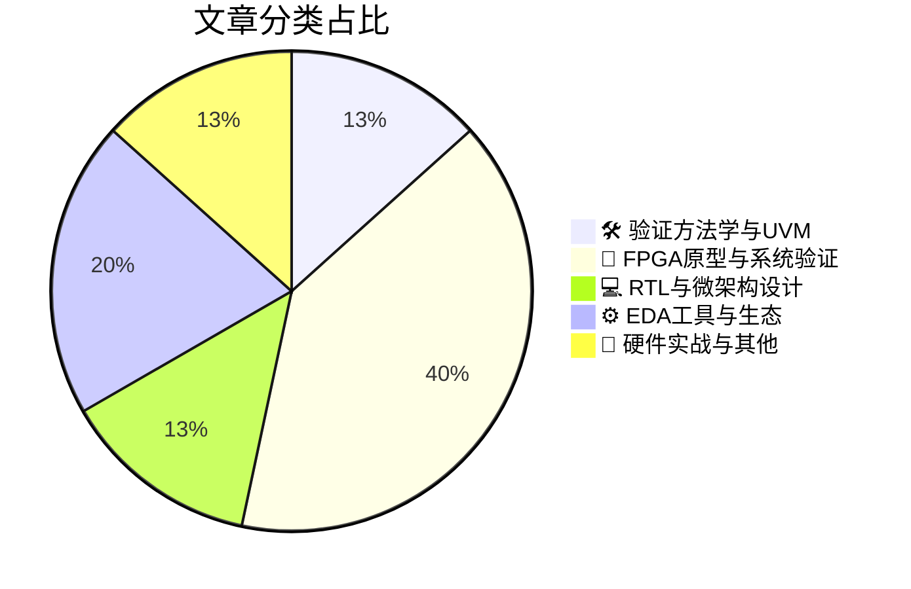

# 🛠️ FPGA / 验证技术精选

> 生成时间：2026-06-29 03:43:44 | 数据范围：过去 96 小时

## 📝 行业视点

当前硬件验证领域正经历Agentic AI驱动的范式变革，LLM-based智能体与云原生EDA工具链正在重构传统UVM验证方法学，以突破AI芯片设计复杂度指数级增长带来的验证瓶颈。与此同时，"左移验证"（Shift Left）的物理极限与系统级验证需求产生结构性张力，特别是在3D-IC、Chiplet异构集成领域，FPGA原型验证与硬件仿真（Emulation）已成为验证超大尺度AI/HPC基础设施的关键基础设施。此外，面向AI数据中心的高带宽存储与I/O架构验证——涵盖HBM内存子系统访存优化、高带宽I/O接口时序收敛及晶圆级集成方案——正推动验证方法学向多物理域协同仿真演进。最终，跨层次统一验证流程（Unified Design Approach）与商业航天、5G通信等新兴场景的严苛可靠性需求，共同定义了下一代硬件验证的技术路线图。

---

## 🏆 深度必读 (Top 3)

### 1. [验证左移的极限：我们究竟能走多远？](https://semiengineering.com/how-far-left-can-we-really-shift-verification/)
**评分**: 8/10 | **分类**: 🛠️ 验证方法学与UVM | **标签**: `Shift Left` `Pre-silicon Verification` `Virtual Prototyping` `Formal Verification` `System-level Verification`

> **💡 推荐理由**：该文系统性地解构了验证左移的理论边界与实践约束，为验证团队提供了从RTL级向架构级跃迁的系统性方法论。文中提出的分层左移策略和ROI评估框架，可直接指导团队避免过度工程化，在资源受限条件下最大化早期验证收益。特别对于正在推行敏捷验证或面临Tape-out时间压力的大型数字IC/FPGA团队，本文有助于建立科学的验证里程碑决策机制，显著降低后期回片风险。

**摘要**：
传统RTL后验证模式导致关键缺陷发现过晚，修复成本呈指数级增长，严重制约产品上市周期。本文探讨了将验证活动前移至系统架构阶段的极限边界，提出通过虚拟原型、事务级建模(TLM)及形式化方法在算法定型前捕获架构级缺陷。文章剖析了过度左移带来的抽象精度损失、参考模型维护负担及验证闭合难题，指出架构探索灵活性与实现细节验证之间存在根本性张力。作者建议采用分层左移策略，重点强化接口契约验证和关键路径早期验证，而非盲目追求全流程前置。针对复杂SoC场景，文中提供了可量化的ROI评估框架，帮助验证架构师在投入产出比和验证完备性之间做出理性权衡。

### 2. [COMPUTEX 2026：S2C与晶心科技展示面向AI时代的硬核“EDA+IP”协同验证方案](https://semiwiki.com/prototyping/s2c-eda/370252-computex-2026-s2c-and-andes-technology-showcase-hardcore-edaip-synergy-for-the-ai-era/)
**评分**: 8/10 | **分类**: 🔬 FPGA原型与系统验证 | **标签**: `FPGA原型验证` `RISC-V` `AI加速器` `多FPGA分区` `系统级验证` `CDC` `软硬件协同验证`

> **💡 推荐理由**：该文为验证团队提供了IP供应商与EDA工具深度协同的最佳实践，特别是在AI芯片异构架构验证场景中，展示了如何通过FPGA原型验证加速RISC-V-based系统的软硬件协同验证。对于面临复杂SoC集成验证和早期软件验证挑战的验证架构师，该方案提供了降低验证周期、提升验证完备性的有效路径，值得在验证策略规划时参考。

**摘要**：
S2C与Andes Technology在COMPUTEX 2026联合展示了面向AI时代的“EDA+IP”硬核协同方案，针对性解决了AI芯片异构架构设计中IP集成验证困难及软硬件协同验证周期过长的痛点。该方案通过将晶心科技RISC-V处理器IP深度集成至S2C FPGA原型验证平台，突破了传统验证流程中仿真速度与模型精度不可兼得的瓶颈。针对AI SoC架构设计中的早期性能评估和软件栈开发需求，该协同架构实现了从RTL到原型的快速迁移，显著降低了架构变更风险。通过EDA工具与处理器IP的原生协同，为复杂AI芯片提供了覆盖架构验证、系统集成到软件验证的完整解决方案，有效缩短了产品上市前的验证闭环时间。

### 3. [验证方法学难以跟上AI发展步伐](https://semiengineering.com/verification-methodologies-struggle-to-keep-up-with-ai/)
**评分**: 7/10 | **分类**: 🛠️ 验证方法学与UVM | **标签**: `AI加速器验证` `方法学演进` `系统级验证` `覆盖率收敛` `软硬件协同验证`

> **💡 推荐理由**：对于正在或即将开展AI芯片/AI加速器的FPGA/ASIC验证团队，本文提供了从验证架构顶层视角解决AI硬件特殊复杂度的系统性思路，有助于团队提前规避传统验证方法在并行度、数据流和精度验证方面的陷阱，建立适应下一代AI芯片的验证方法论体系。

**摘要**：
文章指出传统基于UVM的验证方法学在应对AI芯片设计时面临根本性挑战，主要源于AI加速器超大规模并行架构导致的验证空间爆炸、稀疏计算模式对传统覆盖率驱动随机验证效率的削弱，以及数据流架构带来的软硬件边界模糊问题。针对这些痛点，文章深入分析了AI硬件验证中的特殊难点，包括低精度数值计算（BF16/INT8）的精度边界验证、存算一体架构的存储一致性检查，以及大规模Chiplet互联的协议验证复杂度。在架构层面，文章提出需要突破单一仿真验证模式，构建形式验证与仿真协同、高层次综合（HLS）与RTL混合验证、以及基于机器学习的智能测试点生成的新型分层验证平台。此外，文章强调了验证左移（Shift-left）策略在AI芯片开发中的必要性，倡导通过虚拟原型和硬件仿真加速（Emulation）提前进行软件栈与硬件架构的协同验证，以应对AI工作负载动态变化带来的验证不确定性。最后，文章探讨了验证基础设施的智能化转型，建议采用数据驱动的验证覆盖率分析与自动化调试技术，构建能够自我适应AI设计复杂度的弹性验证方法论体系。

---

## 📊 资讯分布与高频标签

## 📋 更多分类好文

### 🔬 FPGA原型与系统验证

- [**实现3D-IC设计的未来**](https://semiengineering.com/realizing-the-future-of-3d-ic-design/) - *semiengineering.com* (7分)
  > 本文探讨了3D-IC（三维集成电路）技术从概念走向量产所面临的核心验证挑战与架构创新。针对多芯片堆叠带来的异构集成复杂性，文章分析了传统2D验证方法在应对跨芯片互连、热-电-机械多物理场耦合以及分区测试访问时的局限性。提出的解决方案包括分层验证架构、基于UCIe等标准化接口的互操作性验证方法，以及支持早期系统级协同仿真的数字孪生平台。重点解决了Chiplet集成中的信号完整性、电源完整性和可测试性（DFT）架构设计难题，为复杂3D系统的 sign-off 验证提供了新的方法论框架。

- [**太空已非昔日模样：终极边疆的商业化转型**](https://www.eejournal.com/article/space-isnt-what-it-used-to-be-the-final-frontier-has-gone-commercial/) - *eejournal.com* (7分)
  > 文章分析了商业航天（New Space）的兴起如何颠覆传统航天电子系统的验证范式，从追求绝对零缺陷的rad-hard器件验证转向成本驱动的COTS器件统计验证。针对商业级FPGA/ASIC在太空辐射环境（单粒子翻转、总剂量效应）下的可靠性验证难题，作者提出了分层验证架构，结合硬件冗余、EDAC（错误检测与纠正）和动态重配置技术。文章解决了传统航天验证周期过长（数年）与商业航天快速迭代（数月）之间的矛盾，提出了基于故障注入的加速验证流程和置信度评估模型。通过对比传统确定性验证与新兴的概率性验证方法，文章为验证团队提供了在资源受限条件下实现'足够好'可靠性的量化决策框架。特别强调了在系统架构层面采用异构冗余和graceful degradation（优雅降级）策略，以弥补商用器件在辐射耐受性上的不足。

- [**晶圆级集成 vs. 芯粒架构：新的战争？第二部分**](https://semiengineering.com/wafer-scale-vs-chiplets-the-new-war-part-2/) - *semiengineering.com* (6分)
  > 本文深入对比了晶圆级集成（Wafer-Scale）与芯粒（Chiplets）架构在验证方法论上的根本差异，重点解决了超大规模设计中的跨die信号完整性验证、可测试性设计（DFT）复杂度管理以及良率敏感性分析等核心痛点。文章探讨了分区验证策略的架构决策，包括模块化芯粒的验证复用机制与整晶圆级全掩模仿真的资源权衡，并分析了两种架构在bring-up阶段面临的边界扫描测试与多物理场协同仿真挑战。针对硬件仿真（Emulation）平台的选择，作者提出了基于互联拓扑的验证资源分配模型，以及面对制造缺陷时如何通过冗余设计和自检逻辑提升验证覆盖率。最后，文章阐述了芯粒间UCIe/D2D接口的协议验证陷阱与晶圆级热效应导致的时序收敛问题，为验证团队提供了从架构探索到硅后验证的全流程决策框架。

- [**规模空前：AI基础设施为何亟需统一的设计方法**](https://semiengineering.com/more-massive-still-why-ai-infrastructure-demands-a-unified-design-approach/) - *semiengineering.com* (6分)
  > AI基础设施芯片的复杂度正呈指数级增长，传统分散式的验证方法已难以应对超大规模多Die集成、高带宽内存接口及复杂软硬件协同带来的挑战。文章指出当前验证面临的核心痛点在于子系统验证环境的割裂、接口协议一致性难以保证，以及缺乏从架构到硅后验证的全流程统一数据视图。为此，作者提出了一种统一设计方法，强调通过标准化验证平台、统一验证IP库和贯穿始终的验证规划，实现从模块级到系统级的无缝验证覆盖。该方法特别关注AI工作负载在系统级的正确性和性能验证，解决了传统方法中软硬件边界模糊导致的验证盲区问题。通过采用统一的数据格式和工具链，团队能够显著提升回归测试效率，缩短复杂AI芯片的上市时间。

- [**RANsemi与TechPhosis联合推出面向集成小基站的5G OCUDU解决方案**](https://www.eejournal.com/industry_news/ransemi-and-techphosis-enable-5g-ocudu-for-integrated-small-cells/) - *eejournal.com* (4分)
  > RANsemi与TechPhosis合作开发了针对5G集成小基站的OCUDU（Open CU/DU）验证解决方案，重点解决了CU/DU集成架构中基带处理与射频前端协同验证的复杂性难题。该方案通过构建基于UVM的层次化验证平台，实现了L1物理层加速引擎与L2/L3协议栈的软硬件协同验证环境，有效应对了多载波聚合场景下的实时性验证挑战。针对开放前传接口（eCPRI/O-RAN）与专用ASIC间的异步时钟域交叉（CDC）问题，提出了基于断言（Assertion）的形式验证与动态仿真相结合的混合验证策略。该架构支持从单元级IP验证到系统级SOC集成的无缝迁移，显著提升了5G小基站在大规模MIMO和毫米波频段下的功能验证效率。

### 💻 RTL与微架构设计

- [**减少HBM系统中不必要的内存访问行程**](https://semiengineering.com/reducing-avoidable-memory-trips-in-hbm-systems/) - *semiengineering.com* (7分)
  > 本文针对HBM（高带宽内存）系统中由于访问模式低效、缓存未命中或请求未合并导致的冗余内存访问（avoidable memory trips）问题，提出了系统性的优化与验证方法。文章分析了不必要内存行程对带宽利用率和系统功耗的负面影响，并探讨了通过智能预取、请求合并及数据局部性优化来减少此类访问的架构设计策略。重点阐述了如何在验证环境中建立性能监控机制，以精准识别和量化可避免的内存访问，从而弥补传统功能验证无法捕捉性能损失的盲点。该方法论不仅适用于HBM控制器的设计验证，也为系统级性能验证（Palladium/FPGA原型验证）提供了可量化的评估指标，帮助团队在硅前阶段优化内存子系统效率。

- [**AI数据中心与HPC集群中I/O设计挑战日益严峻**](https://semiengineering.com/i-o-design-challenges-grow-in-ai-data-centers-and-hpc-clusters/) - *semiengineering.com* (6分)
  > 随着AI训练和HPC工作负载对带宽需求的指数级增长，现代数据中心面临着多协议高速接口（PCIe 6.0/7.0、CXL、UCIe）共存带来的复杂验证挑战。文章深入探讨了Chiplet架构下跨芯片互连的信号完整性（SI/PI）与协议一致性协同验证难题，以及高功耗场景下热管理与电气特性的闭环验证需求。针对这些痛点，作者提出了分层验证策略，强调了从物理层眼图测试到系统级流量生成的全栈验证环境搭建方法，特别关注了多速率切换、链路训练（Link Training）和功耗状态转换的鲁棒性验证。此外，文章还讨论了多厂商IP集成时的互操作性验证陷阱，以及硬件仿真（Emulation）与原型验证在系统级性能瓶颈分析中的关键作用。

### ⚙️ EDA工具与生态

- [**面向芯片设计的智能体大语言模型技术介绍**](https://semiengineering.com/introducing-an-agentic-llm-for-chip-design/) - *semiengineering.com* (6分)
  > 本文提出了一种面向芯片设计的Agentic LLM（智能体大语言模型）架构，旨在解决传统验证流程中人工编写测试用例效率低、调试周期长及跨工具协同复杂等痛点。该系统通过多智能体协作机制，能够自主解析设计规格、生成UVM验证环境、执行约束随机激励生成，并基于失败波形进行智能根因分析。区别于传统LLM的单轮问答模式，该架构集成了规划-执行-反思闭环，支持验证计划的动态调整与覆盖率导向的回归优化。特别针对复杂SoC验证中多协议交互检查、跨层次验证一致性维护等挑战，提供了端到端的自动化解决方案。实验表明，该方法可显著缩短验证准备周期，加速临界bug收敛，并降低验证人员的技术门槛。

- [**网络研讨会：Google Cloud NetApp Volumes 如何赋能现代 EDA 工作负载**](https://semiwiki.com/semiconductor-services/netapp/370477-webinar-why-google-cloud-netapp-volumes-matter-for-modern-eda-workloads/) - *semiwiki.com* (5分)
  > 现代数字IC/FPGA验证面临海量仿真数据管理、多站点协同及高并发回归测试对存储I/O的极端性能挑战。Google Cloud NetApp Volumes通过企业级NFS服务解决了传统云存储在EDA场景中的高延迟和吞吐量瓶颈，支持验证团队低延迟访问大规模设计数据库与仿真结果。其高效的快照与克隆功能允许秒级创建独立验证环境副本，显著加速回归测试并行化部署与版本控制。该方案实现了本地数据中心与云端资源的无缝混合云架构，使验证团队能够弹性扩展计算资源而无需重构现有EDA工具流，同时通过数据压缩和分层存储优化验证数据的生命周期成本。

- [**行业前瞻：代理式AI对芯片设计的变革性影响**](https://semiengineering.com/executive-outlook-agentic-ais-impact-on-chip-design/) - *semiengineering.com* (4分)
  > 本文探讨了Agentic AI（自主智能体）如何通过自主决策与多代理协作重构数字芯片验证与架构设计范式。文章核心解决了传统验证流程中覆盖率收敛缓慢、调试周期冗长以及架构空间探索爆炸性增长等痛点，提出将AI Agent深度集成至EDA工具链，实现测试用例自主生成、智能覆盖率引导及故障根因自动定位。在架构设计层面，该方案通过代理驱动的PPA（性能-功耗-面积）早期优化与规格到RTL的自主转换，显著压缩了设计迭代周期。文章还论证了验证工程师角色从脚本开发向AI工作流编排的范式转移，并提出了适用于复杂SoC的多代理协同验证架构，为验证环境的自主进化提供了技术路线图。

### 📝 硬件实战与其他

- [**Intel 18A与Intel 18A-P：工艺差异解析及其验证架构影响**](https://semiwiki.com/semiconductor-manufacturers/intel/370512-intel-18a-vs-intel-18a-p-what-is-the-difference-and-why-does-it-matter/) - *semiwiki.com* (4分)
  > Intel 18A-P作为18A的性能增强变体，通过引入更高工作电压容忍度和优化晶体管驱动能力来满足AI/高性能计算需求，但这导致时序 corners 数量增加40%以上且物理设计规则发生显著变化。文章系统性地解决了验证团队在多工艺节点并行开发时面临的核心痛点：包括IP重用时的接口时序失配、功耗模型差异化带来的动态功耗验证复杂度，以及高压场景下电源完整性（IR Drop）和电迁移（EM）验证的 signoff 标准差异。针对这些挑战，作者提出了基于工艺抽象的验证架构设计方案，涵盖可配置的UVM验证环境、跨工艺的约束管理系统（SDC）以及差异化的低功耗验证（UPF/CPF）策略。文章详细阐述了从18A向18A-P迁移时的回归测试优化方法，包括关键路径重定向、 corners 剪枝技术和物理验证规则的增量检查机制，显著降低了验证周期和计算资源消耗。

- [**如何尽早摆脱不一致工程文档的束缚**](https://semiwiki.com/eda/llmda-ai/370598-how-to-free-yourself-from-inconsistent-engineering-documentation-before-its-too-late/) - *semiwiki.com* (4分)
  > 在数字IC/FPGA验证流程中，工程文档（如验证计划、规格说明、接口定义）与实际设计实现之间的不一致性是长期困扰验证团队的架构性痛点，常导致验证策略偏离实际设计、跨团队沟通产生歧义以及维护成本指数级增长。文章提出通过"文档即代码"（Docs-as-Code）的架构范式，结合版本控制、自动化检查与单一数据源（Single Source of Truth）机制，建立文档与验证环境、DUT代码之间的实时追溯性。强调将文档纳入CI/CD流程，利用自动化工具检测规格变更与文档描述的偏差，确保验证计划始终与设计规格保持同步。该方法有效解决了传统文档管理中的架构债务问题，为复杂SoC验证项目提供了可扩展的文档治理框架，避免因文档过时造成的验证覆盖遗漏。

