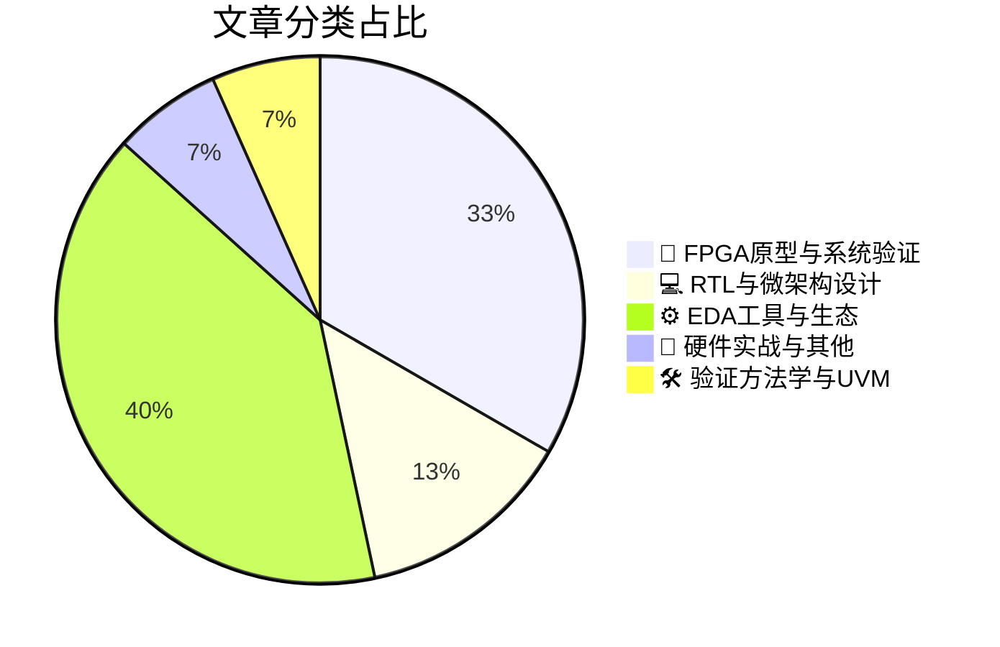

# 🛠️ FPGA / 验证技术精选

> 生成时间：2026-07-06 03:40:45 | 数据范围：过去 96 小时

## 📝 行业视点

当前硬件验证领域呈现三大技术演进方向。首先，生成式AI正深度渗透EDA工具链，从LLM驱动的HLS代码重构、AI赋能的SoC前端设计到GPU加速的计算光刻，实现从RTL生成到物理实现的智能化全流程覆盖。其次，FPGA原型验证已从功能验证扩展到系统级安全验证，在软件定义汽车、AI数据中心与边缘计算融合场景下，承担着对抗AI数据融合攻击和异构架构软硬件协同验证的关键基础设施角色。第三，存储子系统验证正向深度协议分析与可靠性工程延伸，涵盖eMMC故障机制剖析、概率存储架构创新及DDR/LPDDR高速接口的亚纳秒级采样精度突破，以应对AI工作负载对内存带宽和确定性的严苛需求。这些趋势共同指向验证方法论正从传统仿真向AI加速、系统级原型与高精度协议分析的多维融合范式转变。

---

## 🏆 深度必读 (Top 3)

### 1. [eMMC验证失败根因分析与调试方法论](https://zipcpu.com/blog/2026/07/04/emmc-bug.html)
**评分**: 8/10 | **分类**: 🔬 FPGA原型与系统验证 | **标签**: `eMMC协议` `硬件Debug` `时序分析` `FPGA实现` `接口验证`

> **💡 推荐理由**：本文针对存储类IP验证中最棘手的协议时序耦合问题提供了系统化的调试思路，其分层验证架构和断言检查清单可直接迁移至UFS/SD等其他存储接口验证项目。对于验证团队而言，文中关于参考模型与DUT时钟域交叉（CDC）及状态同步问题的分析具有典型借鉴意义，能够帮助团队建立更完善的接口协议验证方法论，特别适合正在进行复杂SoC存储子系统验证的工程师阅读。

**摘要**：
本文针对eMMC控制器验证中高频出现的初始化协商失败、HS400模式时序违例及数据CRC错误等顽固缺陷，提出了基于协议分层的根因分析（RCA）方法论。文章深入剖析了验证环境在时钟相位对齐、电压切换时序及命令队列管理方面的架构性漏洞，特别是参考模型（Reference Model）与DUT在多速率模式切换时的状态同步缺失问题。作者系统阐述了如何通过增强SystemVerilog断言（SVA）检查点、优化约束随机激励（CRS）的边界条件覆盖，以及引入物理层（PHY）与控制器协同验证机制，来构建更鲁棒的验证闭环。文中提供的可重用调试脚本和协议覆盖率收集策略，为复杂存储接口的失效分析提供了标准化流程，有效解决了传统黑盒验证中调试效率低、错误定位难的问题。

### 2. [弥合随机数采样与内存访问差距的概率存储架构](https://semiengineering.com/probabilistic-memory-architecture-that-bridges-the-gap-between-rng-sampling-and-memory-access-notre-dame-georgia-tech-villanova/)
**评分**: 7/10 | **分类**: 💻 RTL与微架构设计 | **标签**: `概率内存架构` `RNG采样` `随机访问模式` `内存子系统` `微架构创新`

> **💡 推荐理由**：验证团队可将此架构应用于高性能验证IP（VIP）和硬件仿真加速平台，以解决约束随机验证（CRV）中随机地址生成的延迟瓶颈和总线拥塞问题。该方案特别适用于需要大规模随机内存访问的SoC子系统验证、缓存一致性测试和内存压力测试场景，能够显著提升随机事务吞吐量和验证覆盖率收敛速度。对于基于FPGA的原型验证平台，该架构可减少主机与验证环境之间的通信开销，实现更接近真实场景的随机测试模式，是提高验证效率和缩短产品上市时间的潜在关键技术。

**摘要**：
该论文提出了一种创新的概率存储架构，专门解决硬件验证中随机数生成（RNG）采样与实际内存访问之间的架构断层和低效问题。传统验证环境依赖软件RNG生成随机地址并通过标准总线协议访问内存，导致显著的延迟和带宽瓶颈，严重制约了约束随机验证（CRV）和模糊测试的吞吐量。作者通过在存储控制器或存储阵列中直接集成硬件概率采样引擎，实现了随机地址生成与内存访问的原子化操作，消除了传统分层架构的接口开销和通信延迟。该设计显著优化了随机访问模式下的内存能效和访问延迟，支持更高密度的随机事务注入，适用于大规模SoC验证和FPGA原型加速平台。实验验证表明，该架构在保持统计随机性质量的同时，将随机内存访问延迟降低了一个数量级以上，为高性能验证基础设施提供了关键的架构支撑。

### 3. [防御AI赋能数据融合攻击的芯片验证架构设计](https://semiengineering.com/defending-against-ai-enabled-data-fusion/)
**评分**: 7/10 | **分类**: 🔬 FPGA原型与系统验证 | **标签**: `AI安全架构` `多传感器融合` `系统级验证` `硬件防御机制` `CDC设计`

> **💡 推荐理由**：强烈推荐负责AI加速器、智能感知SoC或安全加密IP验证的团队阅读本文。其提出的对抗性验证方法与多模态数据融合覆盖模型，可直接解决当前AI芯片验证中缺乏安全威胁场景建模的关键短板，帮助验证工程师在RTL阶段发现并修复硬件级AI安全漏洞，显著提升复杂AI系统的硅后安全性与可靠性。

**摘要**：
本文针对AI驱动的多源数据融合技术在硬件实现中引入的新型安全威胁，提出了系统化的功能验证与安全性验证架构方案。文章核心解决的痛点在于传统UVM验证平台难以有效建模对抗性数据融合攻击场景，以及多模态AI加速器中特征级融合管道的验证盲区问题。作者构建了包含威胁模型注入、鲁棒性形式化验证和覆盖率驱动的分层验证环境，专门用于检测数据融合算法在FPGA/ASIC实现中的对抗样本逃逸与隐私泄漏路径。该架构集成了硬件安全模块（HSM）与AI引擎的协同验证方法，确保防御机制（如差分隐私噪声注入与安全聚合协议）在硅片级的正确实现。此外，文章还提供了针对数据融合决策边界的模糊测试策略，以及用于验证AI硬件抵御模型反演攻击的参考模型设计方法。

---

## 📊 资讯分布与高频标签

## 📋 更多分类好文

### 🔬 FPGA原型与系统验证

- [**保障软件定义汽车安全始于信任架构的重构**](https://semiengineering.com/securing-the-software-defined-vehicle-starts-with-re-architecting-trust/) - *semiengineering.com* (7分)
  > 文章针对软件定义汽车（SDV）面临的分布式安全威胁与传统域控制器架构的信任边界模糊问题，提出了基于零信任模型的硬件信任根（RoT）重构方案。重点解决了多租户异构SoC环境下安全启动链、密钥管理与OTA更新的验证难题，强调了从芯片级安全IP（如HSM/TEE）到系统级架构的端到端形式化验证方法。文章指出当前验证痛点在于缺乏对供应链软件物料清单（SBOM）的静态/动态联合验证手段，以及混合关键性系统中安全域与非安全域的隔离验证覆盖率不足。通过引入分层信任锚点与形式化安全属性验证，为汽车电子电气架构（E/E架构）提供了可度量的安全验证框架。

- [**AI数据中心与汽车行业面临相同挑战**](https://semiengineering.com/ai-data-centers-and-auto-industry-converge-on-same-issues/) - *semiengineering.com* (6分)
  > 文章指出AI数据中心与自动驾驶汽车芯片设计需求正在趋同，两者均面临大规模异构计算架构的验证难题，包括确定性低延迟、功能安全（FuSa）与极高可靠性的平衡。核心痛点在于如何验证十亿门级SoC在极端负载下的系统级功耗、热管理以及高速接口（SerDes/PCIe）的完整性，同时满足自动驾驶的实时性约束与数据中心的吞吐率要求。文章探讨了从传统UVM向软硬件协同验证迁移的必要性，提出融合硬件在环（HIL）、仿真加速（Emulation）及虚拟原型（Virtual Prototype）的混合验证策略，以解决AI工作负载的动态随机性与汽车电子确定性行为之间的验证鸿沟。此外，还涉及AI驱动的覆盖率收敛技术在复杂场景生成和故障注入测试中的应用，为跨领域验证团队提供了可复用的架构设计思路。

- [**Syslogic与Ark Vision联合交付边缘AI完整硬件解决方案**](https://www.eejournal.com/industry_news/syslogic-and-ark-vision-deliver-complete-hardware-solution-for-edge-ai/) - *eejournal.com* (5分)
  > Syslogic与Ark Vision合作推出面向边缘AI应用的集成化工业硬件平台，解决了传统边缘AI部署中软硬件协同验证困难、实时推理性能不确定及异构计算架构复杂等痛点。该方案通过预集成工业级计算单元与专用AI视觉加速模块，显著缩短了从算法原型到量产硬件的验证周期。针对FPGA/ASIC在边缘场景下的低延迟数据流验证和功耗-性能权衡问题，提供了标准化的硬件参考架构。文章详细阐述了如何通过硬件-算法协同设计优化内存带宽瓶颈，并给出了多传感器数据融合接口的验证策略。该方案特别适用于需要高可靠性AI推理的工业自动化和智能监控场景。

### ⚙️ EDA工具与生态

- [**面向高层次综合的LLM智能体软件重构方法**](https://semiengineering.com/llm-agents-to-refactor-software-for-high-level-synthesis-carnegie-mellon-ucla/) - *semiengineering.com* (6分)
  > 本文针对传统软件代码无法直接综合为硬件的痛点，提出了基于LLM智能体的自动化重构框架，将标准C/C++代码转换为符合HLS规范的硬件友好型代码。该方法解决了动态内存分配、递归调用和复杂指针操作等HLS综合障碍的自动消除问题，显著降低了手动代码重构的人力成本。通过多智能体协作机制，系统能够在保持功能等价性的前提下完成代码并行化优化和硬件架构映射。这对于验证团队意味着需要建立针对AI生成HLS代码的形式化等价性验证流程，确保重构前后软件语义与生成RTL的行为一致性。

- [**基于GPU光栅化的计算光刻加速技术**](https://semiengineering.com/accelerating-computational-lithography-with-gpu-rasterization/) - *semiengineering.com* (6分)
  > 本文提出了一种创新的计算光刻加速架构，通过将传统基于物理光学的光刻模拟映射到GPU光栅化流水线，解决了先进工艺节点下光刻仿真计算量巨大、验证周期过长的问题。该方法利用GPU硬件的并行光栅化能力替代传统CPU串行计算，实现了数量级的性能提升，使得实时光刻效应仿真成为可能。文章详细阐述了将光学邻近效应修正（OPC）模型转换为图形渲染管线的架构设计，有效缓解了亚波长工艺下光刻验证的算力瓶颈。这一方案不仅缩短了光刻规则检查（LRC）和光刻友好性验证（LFV）的迭代周期，还为早期设计阶段快速评估光刻可制造性提供了新的硬件加速范式。

- [**网络研讨会：Defacto 借助 AI 驱动的 EDA 工具加速 SoC 前端设计**](https://semiwiki.com/eda/defacto-technologies/370738-webinar-defacto-is-boosting-front-end-soc-design-with-ai-powered-eda-tools/) - *semiwiki.com* (6分)
  > 本文探讨了 Defacto 如何利用 AI 技术革新 SoC 前端设计流程，重点解决多源 IP 集成、设计规则检查（DRC）和 RTL 重构中的手动操作瓶颈。通过部署机器学习算法，该 EDA 方案可自动化执行复杂的网表转换、时钟域交叉（CDC）预检查和物理感知综合，大幅缩短设计收敛周期。工具能够在架构阶段预测下游实现和验证挑战，提前修复影响验证收敛的结构性问题。这种智能化的前端流程不仅提升了 RTL 质量，还为验证团队提供了更稳定、可预测的设计交付，减少因设计迭代导致的验证资源浪费。

- [**Intel 18A基础IP技术概述及其重要性**](https://semiwiki.com/semiconductor-manufacturers/intel/370748-foundation-ip-for-intel-18a-technical-overview-and-why-it-matters/) - *semiwiki.com* (5分)
  > 本文深入剖析了Intel 18A先进工艺节点下基础IP（包括标准单元、I/O和SRAM）的技术架构与物理特性，重点解决了先进工艺中因量子效应和变异增加导致的时序收敛难题、物理验证复杂度指数级增长以及电源完整性 sign-off 挑战。文章详细阐述了针对18A工艺特有的RibbonFET晶体管架构和PowerVia背面供电技术的验证方法论，提供了从单元级特征化到系统级集成的分层验证策略，有效应对了先进节点下 corners 数量爆炸和可靠性验证（如电迁移、热载流子注入）的痛点。此外，文中还探讨了基础IP与SoC验证环境的协同优化方案，包括低功耗状态转换验证和高速接口的信号完整性仿真方法，为复杂数字系统的物理实现与功能验证闭环提供了关键参考。

- [**实时智能：半导体测试的下一个差异化竞争力**](https://semiwiki.com/eda/yieldhub/370603-why-real-time-intelligence-is-the-next-differentiator-in-semiconductor-test/) - *semiwiki.com* (5分)
  > 本文聚焦半导体测试领域数据爆炸与实时决策能力缺失的核心矛盾，指出传统ATE架构无法在生产测试过程中即时分析海量数据并反馈优化测试流程，导致测试成本居高不下且良率损失难以避免。文章提出通过嵌入实时智能（Real-Time Intelligence）架构，将AI/ML推理能力下沉至测试设备边缘端，实现测试数据的毫秒级分析与动态测试程序调整，从而解决静态测试流程无法适应工艺波动、故障诊断滞后以及设备利用率低下的验证痛点。该架构支持自适应测试（Adaptive Test）、实时良率监控和预测性维护，突破了传统测试数据需离线分析后再反向优化流程的局限性。通过在生产线上构建数据闭环决策系统，能够显著降低测试时间、减少过杀漏筛，并为先进封装和复杂SoC的验证提供可扩展的智能化测试基础设施。

- [**Introspect Technology发布第二代DDR/LPDDR协议分析仪，具备业界最高采样率**](https://www.eejournal.com/industry_news/introspect-technology-introduces-second-generation-ddr-lpddr-protocol-analyzer-offering-the-highest-sampling-rate-in-the-industry/) - *eejournal.com* (4分)
  > Introspect Technology推出了其第二代DDR/LPDDR协议分析仪，该产品以业界最高的采样率解决了高速存储器接口验证中的关键挑战。该设备能够精确捕获和分析DDR5/LPDDR5等高速接口的复杂信号，解决了传统工具在高速数据传输过程中难以准确捕获瞬态时序违规和信号完整性问题的痛点。其超高采样率架构使验证团队能够进行更精细的眼图分析和抖动测量，确保在复杂的多速率切换和低功耗状态转换场景下的协议合规性验证。该分析仪显著提升了调试效率，使工程师能够快速定位物理层和协议层的问题，从而缩短高性能存储控制器和接口IP的验证周期。

### 📝 硬件实战与其他

- [**NVMe 2.0详解：新特性及其重要性**](https://semiengineering.com/nvme-2-0-explained-whats-new-and-why-it-matters/) - *semiengineering.com* (6分)
  > NVMe 2.0引入模块化架构，将规范解耦为基础规范与独立命令集（如ZNS、KV等），解决了传统单一庞大规范导致的验证维护困难与版本迭代冲突问题。新标准新增Zoned Namespace和Key-Value命令集，要求验证团队针对顺序写入区域管理和非块存储访问模式设计全新的测试场景与参考模型。强化性能追踪、遥测日志及Endurance Group管理功能，带来了更复杂的系统级调试、性能合规测试与功耗验证需求。同时，对PCIe 5.0/6.0的增强支持及多路径I/O优化，要求验证架构升级物理层协议检查与链路训练测试方案。模块化设计允许命令集独立演进，验证团队需建立可扩展的验证平台以支持快速迭代的合规性回归测试。

### 🛠️ 验证方法学与UVM

- [**技术研讨会：Caspia演示如何在硬件流片前修复安全漏洞**](https://semiwiki.com/events/370203-webinar-caspia-shows-you-how-to-fix-security-flaws-before-its-too-late/) - *semiwiki.com* (6分)
  > 本文介绍了Caspia关于硬件安全验证的网络研讨会，重点解决了传统功能验证无法覆盖安全架构缺陷的痛点。文章阐述了在IC设计早期阶段识别和修复安全漏洞的系统方法论，针对侧信道攻击防护、权限提升漏洞和硬件木马检测等安全验证挑战提出了形式化验证与仿真结合的解决方案。该方案通过建立安全属性检查与威胁建模流程，能够在RTL阶段发现潜在漏洞，避免流片后因安全问题导致的高昂召回成本。文章还探讨了如何构建安全验证闭环，包括安全需求追溯、攻击面分析和自动化漏洞扫描等关键架构设计环节。

### 💻 RTL与微架构设计

- [**DSP采用经验对边缘AI的三点启示**](https://semiengineering.com/three-things-dsp-adoption-can-teach-us-about-edge-ai/) - *semiengineering.com* (5分)
  > 文章通过回顾DSP技术的发展历程，提炼出对当前边缘AI芯片验证与架构设计的关键启示。作者指出边缘AI验证面临算法快速迭代与硬件固化实现之间的结构性矛盾，建议借鉴DSP领域的软硬件协同验证方法，建立从算法模型到RTL实现的完整验证闭环。文章进一步讨论了可编程性与能效平衡的验证挑战，强调需要针对AI工作负载的稀疏性和数据依赖性设计专门的验证激励生成策略。最后，文章提出了面向边缘场景的低功耗和实时性约束验证框架，解决了传统验证方法在动态电源管理和确定性时序分析方面的覆盖盲区。

