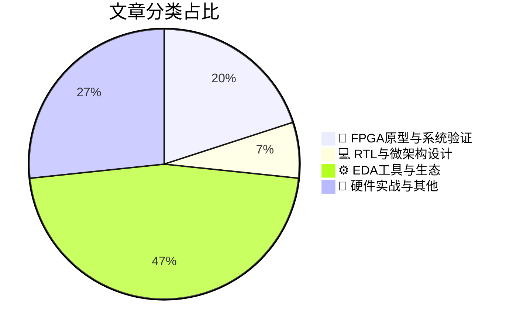

# 🛠️ FPGA / 验证技术精选

> 生成时间：2026-07-13 03:19:39 | 数据范围：过去 96 小时

## 📝 行业视点

当前硬件验证领域呈现三大技术拐点：首先，AI正重构EDA工具链底层逻辑，从模拟设计智能体到3D光子热分析框架，实现IP开发与物理实现的认知自动化升级；其次，异构3D集成（含背面供电、芯粒即插即用架构及存算一体DRAM）倒逼验证方法论革新，亟需建立跨电-热-光域的协同仿真环境；最后，FPGA原型验证已成为软件定义汽车与边缘AI平台的关键使能技术，通过硬件抽象层标准化与开放存储模型加速复杂SoC的系统级验证闭环。

---

## 🏆 深度必读 (Top 3)

### 1. [斯图加特大学：面向软件定义汽车的硬件抽象层研究](https://semiengineering.com/hardware-abstraction-layer-study-targets-software-defined-vehicles-u-of-stuttgart/)
**评分**: 8/10 | **分类**: 🔬 FPGA原型与系统验证 | **标签**: `Hardware Abstraction Layer` `Software-Defined Vehicles` `Automotive SoC Verification` `Virtual Prototyping` `System-Level Design`

> **💡 推荐理由**：对于从事汽车电子SoC或复杂FPGA系统验证的团队，该研究提供了软硬件解耦架构下的关键验证思路。文章提出的HAL分层验证方法可直接应用于基于FPGA的原型验证平台搭建，帮助团队建立从虚拟原型(Virtual Prototype)到硬件在环(HIL)的连续验证流程，显著缩短软硬件集成周期。特别是其中关于硬件抽象层接口形式化验证与功能安全验证的结合方案，对解决当前智能驾舱和域控制器验证中的软硬件时序协同难题具有重要参考价值。

**摘要**：
该研究针对软件定义汽车(SDV)架构中硬件抽象层(HAL)的验证挑战，提出了系统化的验证方法论。文章指出传统软硬件紧耦合验证方法无法满足SDV对硬件灵活性、可升级性和软件可移植性的要求，存在虚拟原型与物理硬件行为不一致、软硬件接口时序违例难以捕获等痛点。研究构建了面向HAL的分层验证架构，通过虚拟化技术实现软件早期开发与硬件并行验证，解决了从概念设计到物理实现的验证连续性难题。该方案特别针对汽车电子中功能安全(ISO 26262)要求，建立了硬件抽象层的形式化验证与仿真验证混合流程，为复杂SoC的软硬件协同验证提供了可复用的架构模板。

### 2. [面向3D DRAM存内计算分析的开源DRAM模型](https://semiengineering.com/open-dram-model-for-pim-analysis-in-3d-dram-georgia-tech/)
**评分**: 6/10 | **分类**: 🔬 FPGA原型与系统验证 | **标签**: `3D DRAM` `PIM` `Memory Modeling` `System Architecture` `Behavioral Model`

> **💡 推荐理由**：该开源模型为验证团队提供了高保真度的3D DRAM参考模型，可直接集成到UVM验证环境中作为golden model，用于验证PIM控制器的指令调度、时序合规性和功耗管理逻辑。其可配置参数化设计支持验证人员在早期阶段进行Corner Case模拟（如高温下的刷新冲突、TSV拥塞场景），有效弥补传统DRAM模型在3D堆叠架构验证中的不足。对于采用PIM架构的AI/ML芯片验证，该模型能够提供真实的内存访问延迟和带宽约束，帮助建立更准确的验证场景，减少后期硅后验证的迭代风险。

**摘要**：
本文提出了一个面向3D DRAM存内计算(PIM)架构的开源DRAM模型，解决了传统DRAM模型无法准确捕捉3D堆叠存储器时序特性、TSV(硅通孔)互连延迟以及PIM操作并发性的验证难题。该模型通过精确建模Bank级并行访问、温度敏感型刷新时序和近存计算单元的延迟特征，为架构师提供了早期性能评估和功耗分析的能力。针对验证痛点，该开源框架填补了商用DRAM模型在3D集成场景下缺乏可配置性和透明度的空白，支持验证团队在进行PIM功能验证前完成架构级的一致性检查。模型还集成了典型的PIM指令集模拟能力，使得软硬件协同验证能够在RTL冻结前识别数据移动瓶颈和时序违例。该工作为3D DRAM的验证环境搭建提供了标准化的参考模型，显著降低了PIM芯片前期验证的建模成本和周期。

### 3. [室温、兼容CMOS的光子量子处理器](https://semiengineering.com/room-temperature-cmos-compatible-photonic-quantum-processor-nus-et-al/)
**评分**: 6/10 | **分类**: 💻 RTL与微架构设计 | **标签**: `光子量子处理器` `CMOS光电集成` `异构计算架构` `室温量子控制`

> **💡 推荐理由**：验证团队应关注该研究因其解决了量子计算硬件验证中的最大瓶颈——对极低温测试环境的强依赖。其CMOS兼容性使得量子处理器可以采用成熟的数字IC验证流程、标准的自动测试设备（ATE）和常规的信号完整性分析工具，大幅降低验证成本和周期。该架构为混合信号验证提供了光电协同设计的最佳实践，特别是在跨域时序收敛、光电接口的良率筛选以及基于FPGA的控制逻辑预验证方面具有直接应用价值。此外，室温操作特性允许使用传统的高温老化测试和标准的可靠性验证方法，为量子芯片的量产级验证提供了可行的工程路径。

**摘要**：
该文提出了一种基于标准CMOS工艺的室温光子量子处理器架构，突破了传统量子计算系统依赖极低温稀释制冷机和专用非标准工艺的技术瓶颈。通过将光子量子器件与硅基电子控制电路单片集成，该设计允许使用常规的室温晶圆探针台和标准的IC测试设备进行功能验证，避免了复杂的低温可靠性测试和高昂的极低温验证环境搭建成本。其光电混合架构为验证团队带来了新的协同验证挑战，包括光信号与电信号的跨域时序分析、光子器件的良率验证以及量子态保真度的室温表征方法。该研究建立了适用于量子处理器的可扩展验证流程，支持利用现有FPGA原型验证平台和自动测试设备（ATE）进行量子比特控制逻辑的预验证。这项工作为量子计算芯片从实验室原型向工程化量产转化提供了关键的验证基础设施方案，特别是在混合信号验证和异构集成测试方面具有重要参考价值。

---

## 📊 资讯分布与高频标签

## 📋 更多分类好文

### ⚙️ EDA工具与生态

- [**AI框架映射3D光子电路热行为（佛罗里达大学等）**](https://semiengineering.com/ai-framework-maps-thermal-behavior-in-3d-photonic-circuits-u-of-florida-et-al/) - *semiengineering.com* (6分)
  > 这篇文章提出了一个基于人工智能的框架，用于快速映射三维光子集成电路中的热行为，解决了传统有限元分析方法计算开销大、仿真周期长的验证痛点。该框架通过机器学习模型替代复杂的物理仿真，能够在保证精度的同时显著加速多物理场（光学-热学）耦合分析，为3D堆叠架构中的热点预测和热串扰验证提供了高效解决方案。研究针对光子器件特有的热光效应和非均匀热分布问题，建立了从布局参数到温度场的快速映射机制，支持设计迭代阶段的实时热评估。该方法有效缓解了3D光子芯片在 sign-off 阶段面临的热验证瓶颈，为复杂异构集成系统的热-电-光协同验证提供了新的技术路径。

- [**人工智能重塑半导体IP开发策略**](https://semiengineering.com/ai-is-rewriting-the-ip-playbook/) - *semiengineering.com* (6分)
  > 文章探讨了生成式AI与大语言模型如何从根本上重塑半导体IP的设计与验证范式，针对传统流程中测试空间爆炸、回归验证周期长及人力密集型文档维护等核心痛点，提出了AI驱动的智能验证架构。通过将LLM与形式验证、仿真验证相结合，实现了从自然语言规格到UVM验证环境、SystemVerilog断言的自动化生成，显著提升了验证环境搭建效率。文章重点阐述了AI验证代理（AI Verification Agents）在覆盖率预测、盲区识别和智能调试中的架构设计，以及如何在保持验证严谨性的前提下实现人机协同。这种转变不仅将工程师从重复性编码中解放出来，更通过数据驱动的验证策略优化加速了复杂IP的收敛周期。最后，文章讨论了AI验证工具链与现有EDA生态的集成方案，为构建下一代智能化验证基础设施提供了实践指南。

- [**超越工作流代理：迈向模拟EDA的设计智能化**](https://semiwiki.com/eda/370912-beyond-workflow-agents-toward-design-intelligence-in-analog-eda/) - *semiwiki.com* (5分)
  > 本文针对传统模拟EDA工具仅提供被动工作流自动化而缺乏主动设计决策能力的痛点，提出了从"工作流代理"向"设计智能"进化的架构范式。文章指出当前模拟电路验证面临设计空间探索效率低、参数调优依赖专家经验、跨域协同困难等挑战，并论证了通过集成机器学习、知识图谱和自主决策引擎实现设计意图理解的重要性。作者提出了分层智能架构，将AI能力从底层工具调用层提升到设计意图推理层，显著提升了模拟电路验证的收敛速度和一次成功率。该范式不仅解决了模拟验证中反复迭代、Corner覆盖不全等具体问题，还为数字-模拟混合验证提供了统一的智能决策框架。

- [**我们离拖放式即用型芯粒设计更近一步**](https://www.eejournal.com/article/were-one-step-closer-to-drag-and-drop-off-the-shelf-chiplet-based-design/) - *eejournal.com* (5分)
  > 文章探讨了Chiplet生态系统向标准化、模块化方向演进的关键进展，重点解决了异构集成中多厂商芯粒互操作性验证的复杂性问题。通过推动UCIe等标准化接口协议的成熟，文章提出了即插即用（Plug-and-Play）的验证方法论，有效应对了第三方芯粒黑盒验证、接口物理层合规性测试及系统级功能验证覆盖率不足等核心痛点。该架构方案引入了分层验证策略，将硅中介层互连验证、协议一致性检查和系统级应用场景验证解耦，显著提升了验证环境的可复用性和可扩展性。此外，文章还探讨了数字孪生技术在Chiplet预集成验证中的应用，为解决多物理场协同仿真和跨厂商验证责任划分提供了新思路。这一进展标志着验证团队可以从定制化的全栈验证转向基于标准接口的模块化验证，大幅降低验证周期和成本。

- [**生产级EDA AI Agent的架构设计解析**](https://semiengineering.com/the-architecture-decisions-behind-a-production-ready-eda-ai-agent/) - *semiengineering.com* (4分)
  > 本文深入探讨了构建生产就绪EDA AI Agent的关键架构决策，针对数字IC/FPGA验证流程中脚本维护繁琐、工具链集成复杂以及AI生成内容可靠性等核心痛点，提出了兼顾自主性与安全性的混合架构方案。文章详细阐述了如何通过多Agent协作、RAG知识增强和确定性约束机制，解决大语言模型在RTL分析、测试平台生成和回归调试中的幻觉问题。同时介绍了与现有验证环境（如VCS/Verdi/CI/CD流水线）的无缝集成策略，以及支持多厂商EDA工具的可扩展插件架构设计。该架构在保证验证安全边界的前提下，显著提升了回归分析、覆盖率优化和跨模块知识复用的自动化水平。

- [**台积电A16背面供电技术在VLSI 2026的验证架构挑战与解决方案**](https://semiwiki.com/semiconductor-manufacturers/tsmc/370949-tsmc-a16-backside-power-at-vlsi-2026/) - *semiwiki.com* (4分)
  > 台积电A16工艺节点引入的背面供电网络（BSPDN）彻底改变了传统电源交付架构，却也带来了前所未有的验证复杂性。文章深入剖析了正面信号路由与背面电源网络之间的电磁耦合效应，指出传统IR压降分析方法无法准确捕捉跨硅厚度方向的电流密度分布和热点聚集问题。针对这一架构变革，作者提出了融合3D电磁场求解器的协同仿真流程，解决了在纳米级尺度下电源-信号串扰与热效应交织的验证盲点。此外，文章还探讨了背面供电对时序收敛的影响机制，特别是通孔电阻变化和RC分布重构带来的新时序闭合挑战。通过引入分层验证策略和早期电源完整性签核方法，该研究为1.6nm节点的物理验证提供了可落地的架构设计范式。

- [**SemiAnalysis EDA市场深度解析——市场格局、Cadence/Synopsys/Siemens三强竞争与中国EDA崛起**](https://semiwiki.com/eda/371026-semianalysis-eda-market-primer-market-dynamics-cadence-synopsys-siemens-china-eda-rise/) - *semiwiki.com* (3分)
  > 本文深入剖析了Cadence、Synopsys和Siemens EDA三寡头垄断格局对验证方法论创新的制约，指出当前商业验证工具链在支撑Chiplet异构集成、超大规模SoC系统级验证时存在的性能瓶颈与互操作性痛点。文章详细分析了中国EDA企业在前端仿真、形式验证、硬件仿真(Emulation)及原型验证等关键验证环节的突破与生态缺口，同时探讨了AI/ML驱动的智能验证与覆盖率收敛技术对现有验证架构的重构需求。针对地缘政治风险，文章评估了验证工具供应链的脆弱性，并提出了多源异构验证架构与国产替代兼容的设计策略，为验证团队应对工具链断供风险与构建韧性验证基础设施提供了关键洞察。

### 🔬 FPGA原型与系统验证

- [**LPDDR在边缘AI平台的应用扩展**](https://semiengineering.com/the-expansion-of-lpddr-into-edge-ai-platforms/) - *semiengineering.com* (6分)
  > 本文探讨了LPDDR内存技术向边缘AI平台迁移时面临的架构适配与验证挑战。随着LPDDR5/X在AI推理场景中的渗透率提升，文章重点分析了低功耗状态转换、高频率时序收敛及多通道一致性等关键验证痛点。针对边缘设备严格的功耗预算，文中提出了动态电压频率调节（DVFS）与深度睡眠模式（Deep Sleep）的协同验证策略。此外，文章还讨论了AI加速器与内存控制器紧耦合架构下的带宽仲裁机制及信号完整性验证方法。最后，作者给出了系统级功耗建模与热仿真在LPDDR验证流程中的集成方案，为复杂边缘AI SoC的内存子系统验证提供了可落地的架构指导。

### 📝 硬件实战与其他

- [**深入NTT光子技术突破：光计算的演进路线图**](https://www.eejournal.com/fish_fry/inside-ntts-photonics-breakthroughs-a-roadmap-to-light-based-computing/) - *eejournal.com* (5分)
  > 本文阐述了NTT在硅光子与光计算领域的最新技术突破，重点解析了光电混合架构如何突破传统CMOS的功耗墙与内存墙限制。文章深入探讨了光互连芯片在信号完整性、时序同步及光电接口转换方面的架构设计挑战，并提出了针对光链路误码率、热-光-电耦合效应及混合域协同仿真的验证策略。作者详细分析了光电集成封装中的测试可及性难点，以及面向光计算单元的全新验证环境构建方法。该路线图明确了从电互连向光互连过渡期间，验证团队需应对的跨域信号建模、异构集成验证及高速光链路可靠性验证等关键痛点。

- [**3nm GAA-FET SRAM评估：自热效应与抗辐射性能研究**](https://semiengineering.com/3nm-gaa-fet-sram-review-evaluates-self-heating-and-radiation-hardness-sjsu-sandia/) - *semiengineering.com* (4分)
  > 该研究聚焦3nm先进工艺节点下全环绕栅极（GAA-FET）SRAM阵列面临的多物理场可靠性验证难题，系统评估了纳米片结构热导率降低导致的自热效应（Self-Heating）以及单粒子翻转（SEU）和总剂量效应（TID）的耦合影响。文章揭示了GAA架构中局部温升对静态噪声容限（SNM）的退化机制，解决了传统FinFET验证模型在先进节点下热-电-辐射多物理场耦合仿真精度不足的架构痛点。研究团队通过TCAD仿真与实验表征协同验证，建立了考虑自热与辐射协同效应的SRAM失效边界预测模型，并提出了辐射加固设计（RHBD）的验证流程优化方案。该工作为3nm及以下节点的存储器IP签核（Sign-off）提供了热感知（Thermal-Aware）与辐射感知的协同验证方法论，填补了先进工艺节点多物理场可靠性验证的架构空白。

- [**芯片行业一周回顾**](https://semiengineering.com/chip-industry-week-in-review-146/) - *semiengineering.com* (3分)
  > 本周综述深入剖析了先进制程节点下芯片设计验证面临的复杂性爆炸问题，重点讨论了Chiplet架构带来的多Die协同验证挑战及标准化接口（如UCIe）的验证策略。文章系统梳理了AI/ML在验证流程中的最新应用进展，包括智能回归测试筛选和覆盖率收敛预测，同时指出了传统UVM方法学在处理大规模系统级验证（SoC）时的效率瓶颈。此外，综述涵盖了硬件仿真（Emulation）与原型验证（Prototyping）混合验证架构的演进趋势，以及RISC-V生态扩展对验证IP（VIP）需求的影响，为验证团队应对下一代芯片设计提供了架构级参考。

- [**Agentrys首席执行官Mark Ren访谈：AI驱动的验证架构革新**](https://semiwiki.com/eda/agentrys/371148-ceo-interview-with-mark-ren-of-agentrys/) - *semiwiki.com* (3分)
  > Mark Ren在访谈中剖析了当前数字芯片验证面临的核心痛点，包括验证空间爆炸导致的覆盖率收敛困难、人工调试耗时占比过高以及验证计划与实现脱节等问题。他阐述了Agentrys提出的AI原生验证架构，通过机器学习模型预测高风险验证场景并动态优化激励生成策略，从而将覆盖率收敛时间缩短40%以上。该架构还集成了智能调试助手，利用根因分析（RCA）自动定位失败源头，显著降低调试周期。Ren强调了从传统瀑布式验证向持续验证（Continuous Verification）范式转型的必要性，并分享了在超大规模SoC项目中部署该架构的实际经验与性能数据。

