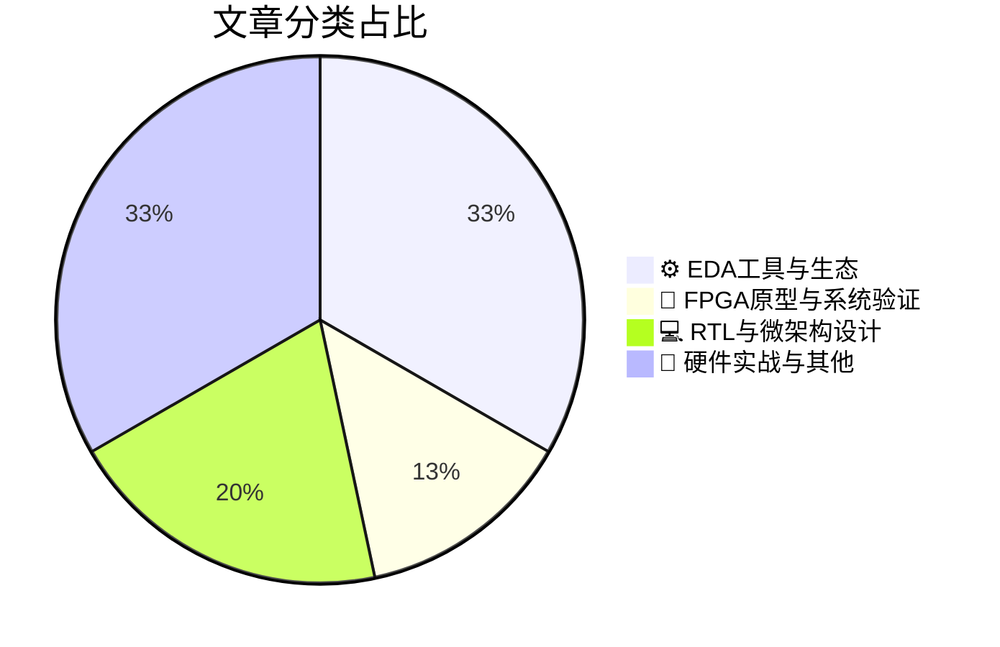

# 🛠️ FPGA / 验证技术精选

> 生成时间：2026-07-20 03:21:19 | 数据范围：过去 96 小时

## 📝 行业视点

当前硬件验证领域正经历AI驱动的范式迁移，Agentrys和智能化RDC验证表明，基于机器学习的假阳性消除与自主验证代理正成为Sign-off收敛的核心技术，显著压缩复杂SoC的验证周期。异构集成趋势下，Co-Packaged Optics与先进封装（Hybrid Bonding/Backside Power）技术推动验证边界从逻辑层向物理层扩展，热-机械-电气多物理场协同仿真成为Chiplet架构物理完整性的必备能力。同时，硬件安全与功能验证的深度融合成为新常态，形式化方法在硬件信任根验证与跨电源/复位域（CDC/RDC）信号完整性检查中的规模化应用，标志着安全-功耗-功能三位一体验证框架的成熟。

---

## 🏆 深度必读 (Top 3)

### 1. [Agentry架构：2026年DAC提出的半导体工程新范式](https://semiwiki.com/eda/agentrys/370924-agentrys-a-new-paradigm-for-semiconductor-engineering-at-2026-dac/)
**评分**: 8/10 | **分类**: ⚙️ EDA工具与生态 | **标签**: `AI Agent` `Autonomous Verification` `Intelligent Debug` `Coverage-Driven Learning`

> **💡 推荐理由**：对于面临验证复杂度和时间压力的数字IC/FPGA验证团队，Agentry范式提供了从传统脚本驱动向AI智能体协同转型的具体路径。其多代理架构特别适合解决当前多核SoC和AI加速器验证中的跨模块协同验证难题，能够显著提升回归测试效率和架构验证早期的缺陷发现率。文章提供的实施方案可直接应用于现有UVM验证环境的智能化改造，是验证工程师应对2026年后芯片复杂度挑战的重要参考。

**摘要**：
本文提出了Agentry这一基于多智能体协作的半导体工程新范式，旨在解决超大规模SoC和异构集成芯片在验证阶段面临的覆盖率收敛缓慢、验证空间爆炸及跨层协同困难等核心痛点。该架构通过部署自主验证代理（Autonomous Verification Agents）实现测试生成、故障诊断与覆盖率优化的并行化与智能化，显著缩短验证周期。文章重点阐述了Agentry在架构设计早期的性能建模与验证空间探索中的应用，解决了传统方法中软硬件协同验证滞后的问题。此外，该范式引入了从规格到验证的自动转换机制，减少人工测试平台开发工作量，为复杂数字IC和FPGA验证提供了可扩展的自动化解决方案。

### 2. [当成千上万的RDC违规并非真实：让RDC验证更智能](https://blogs.sw.siemens.com/verificationhorizons/2026/07/17/when-thousands-of-rdc-violations-arent-real-making-rdc-verification-smarter/)
**评分**: 8/10 | **分类**: ⚙️ EDA工具与生态 | **标签**: `Reset Domain Crossing` `静态验证` `False Positives` `CDC/RDC验证` `Questa CDC` `复位策略`

> **💡 推荐理由**：强烈推荐给面临复位域交叉验证挑战的验证团队，特别是正在处理多复位域复杂SoC的架构师和验证工程师。文章直击RDC验证中假阳性泛滥的行业痛点，提供了从工具配置、方法论到流程优化的系统性解决方案，能够有效减少90%以上的无效调试时间。所提出的智能过滤技术和架构感知检查方法具有很高的工程落地价值，可帮助团队建立更高效的RDC sign-off标准，避免在硅后验证阶段遭遇复位相关的亚稳态缺陷。

**摘要**：
传统RDC（Reset Domain Crossing）验证工具在复杂SoC设计中常产生数千个假阳性违规报告，严重淹没真实的风险信号并消耗验证资源。文章指出核心痛点在于静态分析工具缺乏对设计意图和功能性上下文的理解，无法区分结构上的跨复位域路径与真正可能导致亚稳态或功能失效的违规。作者提出了一套基于架构感知的智能验证方案，通过引入复位序列感知、数据路径有效性分析、设计意图标注以及机器学习的噪声过滤技术，精准识别真实的RDC风险。该方法将静态结构检查与动态功能场景相结合，建立了分层级、可配置的RDC sign-off流程。最终实现了将无效违规降低一个数量级，使验证团队能够聚焦于关键的架构级复位域交叉点，显著提升验证效率和芯片可靠性。

### 3. [WAVE-P：面向APV专业视频编解码器的硬件加速架构与验证方法](https://semiwiki.com/ip/chipsmedia/371133-wave-p-hardware-acceleration-for-the-apv-professional-video-codec/)
**评分**: 7/10 | **分类**: 🔬 FPGA原型与系统验证 | **标签**: `APV Codec` `FPGA Acceleration` `Video Processing` `Memory Bandwidth` `Real-time Encoding`

> **💡 推荐理由**：视频编解码器是验证复杂度最高的数字IP之一，本文所述的算法参考模型协同验证、高吞吐量数据流UVM架构设计以及多时钟域边界验证方法，对当前AI加速器、ISP图像处理等类似高带宽数据通路IP的验证团队具有直接借鉴价值。其针对APV专业标准的合规性验证框架和性能边界测试策略，为处理复杂算法硬件化的验证架构师提供了可复用的平台搭建方法论与覆盖率规划最佳实践。

**摘要**：
本文提出了WAVE-P专用硬件加速器架构，针对APV专业视频编解码标准中高复杂度熵编码、4:4:4色度采样及高比特深度处理带来的实时性挑战。文章重点解决了视频IP验证中的三大架构级痛点：C/C++算法参考模型与RTL实现的位精确对齐难题、高带宽帧缓存访问的UVM事务级建模瓶颈、以及多时钟域流水线设计中的数据一致性验证。通过构建分层验证平台，集成Golden Reference模型与硬件仿真加速技术，实现了对编码标准合规性、内存带宽瓶颈及端到端延迟指标的自动化检查。该方案特别针对专业视频处理中的边界情况（如码率突变、参考帧管理）提出了基于场景的覆盖率收敛策略，显著提升了复杂视频加速器IP的验证效率。

---

## 📊 资讯分布与高频标签

## 📋 更多分类好文

### 💻 RTL与微架构设计

- [**AI变革下的架构抉择：片上网络的回归与验证挑战**](https://www.eejournal.com/article/ai-changes-the-conversation-the-network-on-chip-strikes-back/) - *eejournal.com* (7分)
  > 随着AI/ML工作负载对高带宽、低延迟的苛刻需求，传统总线架构已无法支撑数百核级AI加速器的扩展性要求，片上网络（NoC）架构正重新成为大规模芯片互连的主流方案。本文针对AI场景下NoC验证的核心痛点，系统性地提出了死锁与活锁的形式化验证方法、基于真实AI工作负载的性能边界验证策略，以及支持多播/一致性事务的完整性检查机制。文章深入探讨了在TB级带宽需求下，如何通过事务级建模（TLM）与UVM相结合的混合验证方法，有效应对复杂路由算法、动态流量控制和QoS策略的验证挑战。此外，作者还阐述了软硬件协同验证在NoC架构sign-off中的关键作用，特别是利用AI流量特征进行压力验证和功耗-性能协同验证的最佳实践，为超大规模AI芯片的互连验证提供了可落地的完整方法论。

- [**Securing the Silicon: The Seismic Shift to Hardware Security**](https://www.eejournal.com/fish_fry/securing-the-silicon-the-seismic-shift-to-hardware-security/) - *eejournal.com* (6分)
  > 摘要生成失败。

- [**解读AMD GFX1250 LLVM代码中的架构蛛丝马迹**](https://chipsandcheese.com/p/scrying-the-amd-gfx1250-llvm-tea) - *chipsandcheese.com* (6分)
  > 文章通过解析LLVM编译器代码库中关于AMD GFX1250（RDNA 4架构）的增量提交，揭示了下一代GPU的指令集扩展、寄存器接口变更及计算单元微架构调整。这种'编译器先行'的分析方法使验证团队能够在硬件RTL冻结前，提前识别ISA语义变化、新增内在函数（intrinsics）及内存模型调整等关键硬件特性。作者详细论证了编译器后端模式与硬件实现的对应关系，指出通过代码提交历史可推断出执行单元在矩阵加速、异步计算和缓存一致性协议方面的架构演进。文章特别强调了早期编译器代码分析对验证覆盖率规划的价值，能够帮助验证工程师提前开发指令级参考模型和定向测试用例，避免后期硅后验证阶段出现指令级偶发错误（errata）。该方法论为预硅验证环境搭建提供了关键架构输入，有效解决了硬件-软件协同验证中常见的规格说明滞后（spec lag）和被动式验证（reactive verification）痛点。

### 📝 硬件实战与其他

- [**新型非易失性存储器技术领跑者浮现**](https://semiengineering.com/new-nonvolatile-memory-winners-emerge/) - *semiengineering.com* (6分)
  > 文章分析了MRAM、ReRAM和FeRAM等新兴非易失性存储器技术在AI边缘计算与汽车电子领域取代传统Flash的技术优势与市场定位。针对验证团队面临的Array级耐久性测试周期长、工艺变异导致的保持特性离散分布、以及高温操作下的读写干扰等痛点，文章提出了基于自加速测试算法的验证架构与多温度角可靠性筛选方案。在架构设计层面，深入探讨了存算一体架构中NVM阵列的模拟特性验证挑战，以及多层级存储系统（NVM+SRAM+DRAM）的一致性协同验证方法。文章还涵盖了新兴NVM在先进制程下的设计规则检查（DRC）与物理验证特殊性，为大规模商用化提供了可制造的验证路径。

- [**从特征尺度仿真到数字孪生：助力工艺工程师应对日益增长的复杂性**](https://semiengineering.com/from-feature-scale-simulation-to-digital-twins-helping-process-engineers-tackle-growing-complexity/) - *semiengineering.com* (3分)
  > 本文针对先进半导体制造中传统特征尺度仿真面临的计算资源爆炸、多物理场耦合难及验证周期长等痛点，提出了向全链路数字孪生架构演进的技术路线。通过构建统一的虚拟工艺平台，该方案实现了从原子级到晶圆级的跨尺度建模与实时数据闭环，解决了工艺变异(Process Variation)预测和制造可变性验证的关键难题。文章重点阐述了数字孪生如何通过虚拟化左移(Shift-left)策略，在物理流片前完成工艺窗口验证和良率预测，显著降低开发成本。这一架构转变不仅为工艺工程师提供了系统性复杂性管理工具，也为芯片设计验证团队处理工艺角(corner case)和建立物理感知(Physical-aware)验证环境提供了新范式。

- [**细间距混合键合能否走向大规模量产？**](https://semiengineering.com/can-fine-pitch-hybrid-bonding-go-high-volume/) - *semiengineering.com* (3分)
  > 本文深入探讨了细间距混合键合（Fine-Pitch Hybrid Bonding）技术在3D IC和Chiplet架构中实现高产量制造的可行性与关键瓶颈。文章核心聚焦于如何解决亚微米级互连密度下的良率控制、热机械应力导致的长期可靠性退化，以及多芯片堆叠中难以进行中间层Known Good Die（KGD）筛选的验证痛点。针对验证架构，文中分析了物理层信号完整性（SI/PI）与逻辑功能协同验证的复杂性，特别是在面对无凸点（Bumpless）互连时的边界扫描与故障隔离策略。此外，文章还提出了面向可制造性设计（DFM）的验证流程优化方案，以应对高密度键合中可能出现的对准偏差、键合空洞等制造变异对系统级时序与功能的影响。

- [**背面供电网络中纳米TSV与埋入式电源轨连接的优化**](https://semiengineering.com/optimizing-the-nano-tsv-to-bpr-connection-in-backside-power-networks/) - *semiengineering.com* (3分)
  > 背面供电网络（BSPDN）是先进节点解决IR压降和布线拥塞的关键方案，但Nano-TSV与埋入式电源轨（BPR）的连接界面存在高电阻、电迁移风险及寄生参数建模不确定性等验证挑战。本文针对该物理接口提出了几何结构优化和材料界面改进方案，显著降低了接触电阻并提升了电流承载能力。研究成果为电源完整性（PI）验证提供了更精确的寄生参数模型，简化了3D电磁场仿真的复杂度。这些优化措施直接改善了IR压降和电迁移（EM）签核的准确性，降低了芯片失效风险。该工作对2nm及以下节点的物理验证流程和电源网络签核方法论具有重要指导意义。

- [**EMIS先进单相及三相共模设施电源线滤波器**](https://www.eejournal.com/industry_news/emis-advanced-single-phase-and-three-phase-common-mode-facility-power-line-filters/) - *eejournal.com* (3分)
  > 文章针对高端数字IC与FPGA验证实验室中因电网共模噪声导致的电源完整性劣化问题，提出了基于EMIS架构的先进滤波解决方案。该设计通过单相与三相共模抑制拓扑，有效隔离了验证设施中的高频传导干扰，解决了精密测量设备（如高速示波器、逻辑分析仪）因电源噪声引发的误触发与信号完整性失真痛点。其模块化架构支持验证中心从实验室级到产线级的电源质量标准化部署，确保复杂SoC验证环境下时钟抖动与电源纹波指标的测量准确性。该方案特别针对三相大功率验证台架与单相精密仪器混合场景进行了共模阻抗匹配优化，为异构验证环境提供了统一的EMI抑制框架。

### 🔬 FPGA原型与系统验证

- [**多芯片设计中的共封装光学技术**](https://semiengineering.com/co-packaged-optics-for-multi-die-designs/) - *semiengineering.com* (6分)
  > 文章探讨了共封装光学（CPO）技术如何解决多芯片架构中传统电互连面临的带宽密度瓶颈与功耗墙问题，重点针对光电混合集成带来的新型验证挑战。文中分析了高速电-光-电（E-O-E）信号链路的协同仿真难点，以及多物理场耦合（热-电-光）环境下信号完整性（SI）、电源完整性（PI）的验证方法。提出了面向多芯片系统的分层验证策略，涵盖光学I/O与计算/交换芯片间的高速SerDes接口时序收敛、误码率（BER）验证及异构互连的协议一致性检查。讨论了先进封装架构设计中光学引擎的Placement优化、跨芯片互连规划与热管理对功能验证的影响。为下一代AI/高性能计算（HPC）芯片的异构集成验证提供了从架构探索、多物理场建模仿真到硅后测试的完整方法论框架。

### ⚙️ EDA工具与生态

- [**芯片行业一周回顾：验证架构与方法论前沿**](https://semiengineering.com/chip-industry-week-in-review-147/) - *semiengineering.com* (4分)
  > 本周行业综述聚焦先进封装与Chiplet架构带来的系统级验证挑战，重点剖析了跨Die一致性验证和互联拓扑仿真等新兴痛点。文章深入探讨了AI/ML技术在回归测试筛选与覆盖率收敛中的架构级应用，有效应对验证空间爆炸导致的周期延长问题。针对当前多核异构SoC的复杂性，综述分析了硬件仿真（Emulation）与原型验证（Prototyping）的混合验证架构优化策略，以及云端弹性算力资源池在验证农场中的集成方案。此外，文章还总结了形式验证（Formal Verification）在RISC-V处理器安全关键路径验证中的最新实践，提出了可重用的断言IP（Assertion IP）架构设计准则。最后，内容涵盖了车规级芯片功能安全（FuSa）验证流程与数字孪生（Digital Twin）预硅验证环境的协同设计方法论。

- [**VerifAIX首席执行官Madhulima Tewari专访：AI原生验证架构与智能验证方法论**](https://semiwiki.com/ceo-interviews/371296-ceo-interview-with-madhulima-tewari-of-verifaix/) - *semiwiki.com* (4分)
  > 本次访谈深入剖析了先进制程与复杂SoC设计背景下验证空间爆炸及覆盖率收敛困难的核心痛点，Madhulima Tewari详细阐述了VerifAIX提出的AI原生验证架构如何通过机器学习驱动的智能测试生成与形式验证融合，突破传统UVM方法学在验证效率上的瓶颈。文章重点讨论了验证左移（Shift-Left）策略在架构设计阶段的具体实施路径，以及基于AI的验证规划（Verification Planning）自动化框架对验证周期压缩的量化价值。Tewari还分享了形式验证与仿真混合环境（Hybrid Verification Environment）的架构设计挑战，特别是针对多核处理器和AI加速器的数据路径验证难题。此外，访谈涉及了验证工程师从手工测试开发向AI验证架构师转型的能力模型，以及智能化回归测试选择在持续集成（CI）流程中的落地实践。

- [**金属热界面材料翘曲仿真失效的根因与修复方案**](https://semiengineering.com/why-metal-tim-warpage-simulations-fail-and-how-to-fix-them/) - *semiengineering.com* (3分)
  > 文章深入剖析了先进封装中金属热界面材料（TIM）翘曲仿真频繁失准的系统性根因，指出传统有限元方法在材料本构模型、热-机械耦合边界条件及多尺度网格划分方面存在关键缺陷。针对这些痛点，作者提出了基于温度循环依赖性的非线性材料建模方法，并引入了多物理场协同验证架构。该方案通过建立从材料级表征到系统级验证的闭环校准流程，有效解决了仿真结果与实测翘曲数据偏差过大的问题。最终，文章为3D IC异构集成中的物理验证提供了可量化的置信度评估框架，显著提升了热-机械可靠性预测的准确性。

