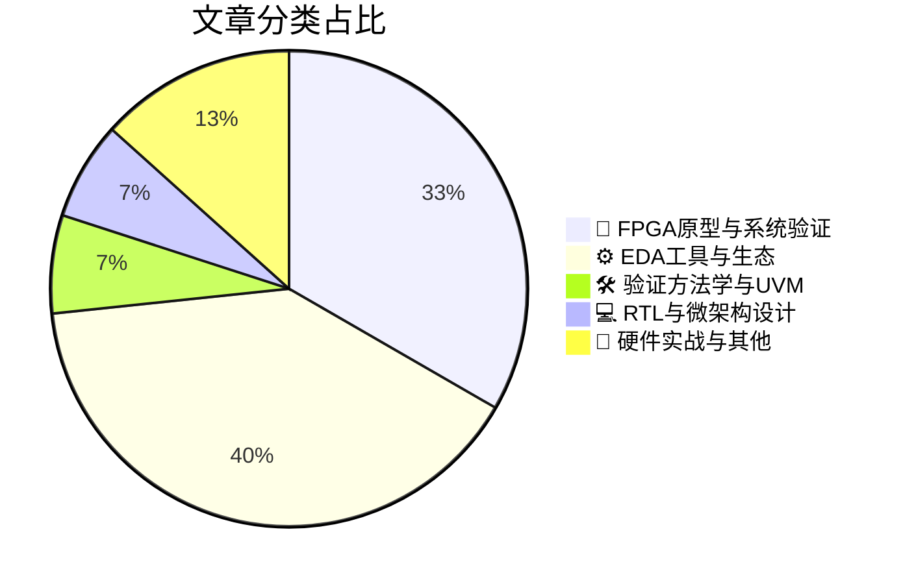

# 🛠️ FPGA / 验证技术精选

> 生成时间：2026-07-27 03:27:28 | 数据范围：过去 96 小时

## 📝 行业视点

当前硬件验证领域正经历从模块级向系统级的范式跃迁。FPGA原型验证平台通过增强可观测性（Observability）架构，解决光电异构集成与大规模Chiplet互联中的traffic congestion与系统集成瓶颈，实现从架构愿景到硅后调试的敏捷闭环。同时，AI技术正深度重构验证方法论，基于LLM的智能行为建模（Behavioral Modeling）与多智能体（Multi-Agent）协同设计显著压缩了验证空间探索周期。此外，随着3D-IC与先进封装（CoPoS/EMIB）的规模化部署，验证重心已前移至跨域物理效应（Cross-Domain Physics）的协同签核，要求EDA工具链在电热耦合、信号完整性等多物理场层面实现统一Scenario Sign-off与硅前-硅后数据闭环。

---

## 🏆 深度必读 (Top 3)

### 1. [芯片互连流量拥堵的验证与化解](https://semiengineering.com/untangling-chip-traffic-jams/)
**评分**: 8/10 | **分类**: 🔬 FPGA原型与系统验证 | **标签**: `NoC` `Traffic Congestion` `System-level Verification` `Interconnect` `Performance Debug`

> **💡 推荐理由**：本文直击现代SoC验证中最难验证的互连并发性和时序敏感问题，提供了从架构评审到测试实现的完整方法论，特别适合正在开发多核处理器、AI加速芯片或复杂SoC的验证团队参考，能有效提升互连验证的完备性和sign-off信心。

**摘要**：
随着多核SoC和异构计算架构的复杂度激增，片上互连网络面临的流量拥堵、死锁和仲裁冲突已成为功能验证与性能验证的核心挑战。本文针对传统定向测试难以覆盖动态流量模式、并发竞争及跨时钟域流量不均衡的验证痛点，提出了一套系统化的互连验证方法论，涵盖基于场景的随机激励生成、死锁形式化验证及性能瓶颈断言检查。文章深入剖析了AXI/ACE总线协议中的环路依赖、QoS优先级反转及路由热点等关键架构缺陷，并给出了可复用的验证IP配置策略与流量可视化分析方案。通过引入自动降额检测和全系统压力测试机制，该方法能够在RTL阶段早期暴露互连架构设计缺陷，显著降低硅后性能调试与死锁风险。

### 2. [实现3D-IC的未来：终局验证场景与签核策略](https://semiengineering.com/realizing-the-future-of-3d-ic-final-scenario-and-sign-off/)
**评分**: 8/10 | **分类**: ⚙️ EDA工具与生态 | **标签**: `3D-IC` `Sign-off` `Multi-die Verification` `System-level Closure` `Heterogeneous Integration`

> **💡 推荐理由**：随着Chiplet和3D封装技术成为后摩尔时代主流，验证团队亟需建立跨裸片、跨工艺节点的系统级验证方法学。本文不仅厘清了3D-IC中逻辑、物理、热学多域协同验证的技术边界，更提供了可落地的Sign-off检查清单与收敛标准，对于构建支持异构集成的验证平台、制定多芯粒测试策略具有直接的工程指导价值，是验证架构师应对先进封装复杂度爆炸的必读参考。

**摘要**：
文章聚焦3D-IC异构集成带来的系统性验证挑战，提出了面向多芯粒（Multi-Chiplet）架构的终局验证场景（Final Scenario）与Sign-off方法论。针对垂直互连（如TSV、混合键合）的信号完整性、跨工艺节点接口一致性、以及热-电-机械多物理场耦合等核心痛点，文章构建了从芯粒级到系统级的分层验证收敛策略。通过统一逻辑等效性检查、物理验证、时序签核及可靠性评估的标准，该方案解决了传统2D验证方法在3D堆叠架构下的覆盖盲区，为复杂3D-IC设计的验证闭合（Validation Closure）提供了可落地的技术路径与检查清单。

### 3. [规避大规模集成验证的隐性瓶颈](https://semiengineering.com/avoid-the-hidden-bottleneck-of-integration-at-scale/)
**评分**: 8/10 | **分类**: 🔬 FPGA原型与系统验证 | **标签**: `SoC Integration` `System-Level Verification` `Debug Visibility` `Hardware-Software Co-verification` `Regression Efficiency`

> **💡 推荐理由**：针对当前多核SoC和复杂IP集成场景下验证周期过长、资源利用率低的普遍痛点，本文提供了系统性的架构优化方法论。其提出的分层解耦与智能调度策略可直接应用于验证环境搭建和CI流程优化，帮助团队在保持验证质量的同时显著缩短集成周期，特别适合正在经历规模扩张的验证团队参考实施。

**摘要**：
文章聚焦大规模SoC/IP集成验证过程中常见的隐性性能瓶颈问题，深入剖析了传统集成验证流程在应对多核、多子系统并行开发时面临的资源竞争、依赖冲突及回归测试效率低下等核心痛点。作者提出了基于分层验证策略、智能测试调度与模块化环境架构的解决方案，有效解耦了模块级与系统级验证的耦合度，显著缩短了集成验证周期。通过引入动态资源分配与增量验证机制，该方法能够在不牺牲验证覆盖率的前提下，大幅提升回归测试吞吐量和硬件资源利用率。文章还探讨了如何在CI/CD流程中嵌入早期集成检查点，避免缺陷在集成后期集中爆发，为超大规模芯片验证提供了可落地的架构优化路径。

---

## 📊 资讯分布与高频标签

## 📋 更多分类好文

### 🔬 FPGA原型与系统验证

- [**从未来愿景到运行硬件：DAC 2026的验证技术**](https://semiengineering.com/from-future-vision-to-running-hardware-verification-at-dac-2026/) - *semiengineering.com* (8分)
  > 本文提出了面向2026年及以后的下一代验证方法论，针对当前多核异构系统验证中存在的软硬件协同验证断层、覆盖率收敛瓶颈以及虚拟原型与物理硬件衔接不畅等核心痛点。文章创新性地构建了基于AI驱动的自适应验证平台架构，实现了从早期虚拟验证到最终硅后验证的连续验证流程（Continuous Verification Flow），显著缩短了从规格定义到硬件运行的时间周期。通过引入形式化验证与机器学习相结合的混合验证策略，有效解决了复杂SoC中边界场景（corner cases）的自动挖掘难题。此外，文章还提出了云原生验证基础设施的标准化框架，为大规模分布式验证团队协作提供了可扩展的架构方案，特别适用于AI加速器、RISC-V多核系统等前沿领域的验证需求。

- [**增强系统可观测性**](https://semiengineering.com/enhancing-system-observability/) - *semiengineering.com* (8分)
  > 本文针对现代复杂SoC及FPGA验证中信号可见性不足、硅后调试困难等核心痛点，提出了系统级可观测性增强的完整架构方案。通过部署嵌入式逻辑分析仪、智能跟踪缓冲器及分层监控单元，实现了对关键信号和总线事务的非侵入式实时捕获与高效压缩存储。文章详细阐述了可观测性基础设施的设计方法学，包括探针插入策略、触发机制优化及软硬件协同调试接口，有效解决了传统验证中调试周期长、深层Bug定位困难的问题。该方案在最小化面积与功耗开销的前提下，显著提升了硅前验证覆盖率和硅后诊断能力，为大规模数字系统的可靠验证提供了可落地的工程实践指导。

- [**电光芯片设计**](https://semiengineering.com/designing-electro-optical-chips/) - *semiengineering.com* (7分)
  > 本文针对电光集成芯片中电子与光子域深度融合带来的验证挑战，提出了系统级的分层验证架构与跨域协同仿真方案。文章重点解决了光电接口（如硅光调制器与TIA前端）的混合信号时序闭合难题，以及热-电-光多物理场耦合效应的建模精度与仿真效率矛盾。通过引入光子器件的行为级抽象模型和基于SystemVerilog/UVM的混合信号验证环境，实现了从算法级到物理实现的多层次验证覆盖。此外，文章还探讨了光互连高速SerDes在工艺偏差和温度漂移下的约束随机测试策略，为复杂光电系统的功能验证与覆盖率收敛提供了可落地的架构设计方法论。

### 🛠️ 验证方法学与UVM

- [**芯片工程师为何应关注AI生成的行为模型**](https://semiengineering.com/why-chip-engineers-should-care-about-ai-created-behavioral-models/) - *semiengineering.com* (7分)
  > 文章针对传统芯片验证流程中RTL交付前缺乏可执行规格模型的关键痛点，阐述了AI生成行为模型如何填补从架构规格到具体实现之间的验证空白。这类智能模型解决了验证团队面临的早期架构探索困难、参考模型开发耗时、以及软硬件协同验证滞后等核心问题，为UVM验证环境提供了高保真度的黄金参考。通过自动从自然语言规格或历史RTL中提取行为特征，AI模型能够在设计早期阶段实现可执行的架构验证和性能分析，显著降低后期因架构缺陷导致的RTL重构成本。文章进一步论证了这些模型如何支持验证左移策略，加速Testbench开发收敛，并提升复杂SoC系统级验证的覆盖率与可靠性。

### 💻 RTL与微架构设计

- [**AMD Instinct MI455X：剑指算力巅峰**](https://chipsandcheese.com/p/amds-instinct-mi455x-aiming-for-the) - *chipsandcheese.com* (7分)
  > 本文深入剖析了AMD面向下一代AI训练与HPC负载的Instinct MI455X加速器架构，重点阐述了其采用的多Chiplet 3.5D封装与超大容量HBM内存子系统带来的系统级验证挑战。文章针对千安级电流瞬态响应验证、跨Die高速互连（Infinity Fabric）的信号完整性/协议一致性验证、以及极端功耗密度下的热-电协同仿真等核心痛点，提出了基于分层验证平台（Emulation+FPGA原型）和AI工作负载压力测试的创新验证方法论。作者详细探讨了如何利用硬件仿真加速（Palladium/Zebu）解决数百亿晶体管级别的功能验证收敛难题，并针对高带宽内存接口的物理层误码率验证分享了基于UVM和SystemC的混合验证环境架构优化方案。此外，文章还剖析了在多Die一致性缓存（Coherent Cache）验证中面临的死锁检测与性能瓶颈分析的具体策略。

### ⚙️ EDA工具与生态

- [**AI自动化对芯片设计的影响**](https://semiengineering.com/the-impact-of-ai-automation-on-chip-design/) - *semiengineering.com* (6分)
  > 本文系统阐述了AI自动化技术在数字芯片验证流程中的架构级应用，重点解决了传统验证中面临的验证空间爆炸、约束随机测试盲目性以及回归调试效率低下等关键痛点。文章提出了基于机器学习的智能验证规划框架，通过历史数据分析实现测试用例的定向生成与覆盖率盲区的精准预测，显著提升了验证资源的配置效率。针对调试环节，作者介绍了利用深度学习进行故障模式识别和根因自动定位的技术方案，大幅缩短了从失败到修复的迭代周期。此外，文章还探讨了验证基础设施向AI原生架构迁移的设计原则，包括数据管道构建、模型训练流水线和人在回路（Human-in-the-loop）的决策机制，为验证团队提供了可落地的技术转型路径。

- [**Agentrys借助多智能体工作流完成真实芯片设计**](https://semiwiki.com/eda/agentrys/371377-agentrys-designs-a-real-chip-with-its-multi-agent-workforce/) - *semiwiki.com* (6分)
  > 本文介绍了Agentrys公司如何利用多智能体（Multi-Agent）工作流成功完成真实芯片的端到端设计，重点解决了传统芯片验证流程中人力密集、迭代周期长及跨域协作效率低的核心痛点。该架构通过部署具备专业分工的AI智能体团队，实现了从架构探索、RTL编码到验证收敛的全流程自动化任务分配与决策优化。文章详细阐述了多智能体在复杂验证场景中的协作机制，包括测试用例生成、覆盖率驱动的反馈闭环以及跨层次验证策略的自主调整。这种范式显著缩短了验证收敛时间，降低了人工干预依赖，为应对现代芯片设计复杂度指数级增长提供了可落地的智能化解决方案。

- [**是德科技应对跨域物理问题，化解电子设计后期失效风险**](https://www.eejournal.com/industry_news/keysight-addresses-cross-domain-physics-issues-that-leave-electronic-designs-vulnerable-to-late-stage-failure/) - *eejournal.com* (6分)
  > 针对现代电子系统中电热磁机多物理场深度耦合导致的晚期失效风险，Keysight提出跨域协同验证方案以解决传统分域仿真方法无法捕捉的交互效应。该方案重点攻克电源完整性(PI)、信号完整性(SI)与热-机械应力间的闭环分析难题，填补了数字功能验证与物理实现之间的验证盲区。通过建立从芯片到系统级的多物理场联合仿真平台，有效识别先进封装中的电磁耦合、电热协同退化等潜在失效模式。此方法将物理层可靠性验证左移至设计早期，避免了因跨域效应引发的硅后时序失效、热失控及长期可靠性下降，显著降低了流片前的验证不确定性和后期返工成本。

- [**Verific应用商店上线，提供解析器平台应用可下载示例**](https://www.eejournal.com/industry_news/verific-app-store-opens-with-downloadable-examples-of-parser-platform-applications/) - *eejournal.com* (5分)
  > Verific正式推出应用商店，提供基于其HDL解析器平台的可下载应用示例，解决了验证团队在构建自定义EDA工具时面临的高开发门槛问题，特别是SystemVerilog/VHDL语法解析的复杂性痛点。通过提供现成的解析应用示例，验证团队无需深入编译器前端技术，即可快速开发RTL静态分析、SDC约束提取、代码覆盖率分析或自定义Lint检查等辅助工具。该架构填补了商业EDA工具与项目定制化需求之间的空白，允许验证工程师针对特定芯片架构快速搭建专属的验证工具链。此举显著降低了开发自定义验证自动化工具的技术壁垒，有助于提升验证流程的效率和Sign-off质量。

- [**DAC必看专题讨论 – 自研还是外购：谁将掌控未来芯片的智能技术？**](https://semiwiki.com/events/371283-must-see-dac-panel-build-vs-buy-who-owns-the-intelligence-behind-tomorrows-chips/) - *semiwiki.com* (3分)
  > 该文章记录了DAC专题讨论中关于芯片设计智能化"自研与外购"的战略辩论，核心聚焦于验证团队面临的关键架构决策：是将AI/ML能力内化为核心验证IP，还是依赖外部EDA供应商的黑盒解决方案。讨论揭示了验证智能化的三大痛点：训练数据所有权与隐私保护、验证算法定制化需求与通用工具局限性之间的矛盾，以及长期技术债与短期交付压力的权衡。架构层面的核心争议在于如何划定内部智能验证平台与商业工具的边界，确保关键的回归测试优化、覆盖率收敛策略等核心能力不被锁定。文章强调，在AI重塑验证流程的转折点，团队必须建立混合架构策略，在利用外部创新的同时，保持对验证数据与核心算法的自主可控，以维护长期技术竞争力。

### 📝 硬件实战与其他

- [**芯片行业一周回顾**](https://semiengineering.com/chip-industry-week-in-review-148/) - *semiengineering.com* (5分)
  > 文章系统梳理了当前先进制程与Chiplet架构下SoC验证面临的核心痛点，包括回归测试资源爆炸、覆盖率收敛瓶颈及跨Die一致性验证难题。重点剖析了AI/ML算法在智能测试生成、故障诊断与根因分析中的落地架构设计，以及云原生弹性算力调度对验证吞吐量的提升机制。同时探讨了车规级功能安全（ISO 26262）在混合关键性系统中的验证左移（Shift-Left）策略与形式化验证工具链集成方案，为解决复杂场景下的验证完备性与效率矛盾提供了架构级思路。

- [**台积电CoPoS与英特尔EMIB半导体封装技术对比**](https://semiwiki.com/semiconductor-manufacturers/tsmc/371548-tsmc-copos-versus-intel-emib-semiconductor-packaging/) - *semiwiki.com* (2分)
  > 本文系统对比了台积电CoPoS与英特尔EMIB两种先进2.5D封装技术在互连架构、信号完整性和集成密度方面的核心差异，重点剖析了异构集成场景下的关键验证痛点。文章深入探讨了硅中介层与嵌入式桥接方案在D2D高速接口时序收敛、跨芯片let电源完整性协同仿真及热-电耦合效应建模方面的验证挑战，指出了不同封装拓扑对UCIe协议物理层一致性测试环境搭建的特定要求。针对可测试性设计，文章对比分析了两种封装在KGD筛选策略、边界扫描测试覆盖率及系统级故障隔离机制上的架构差异，提出了相应的DFT验证方案优化建议。此外，文章还阐述了封装选型对多芯片系统级验证平台搭建、仿真资源分配及早期架构验证流程的影响，为复杂Chiplet设计的验证规划提供了决策依据。

