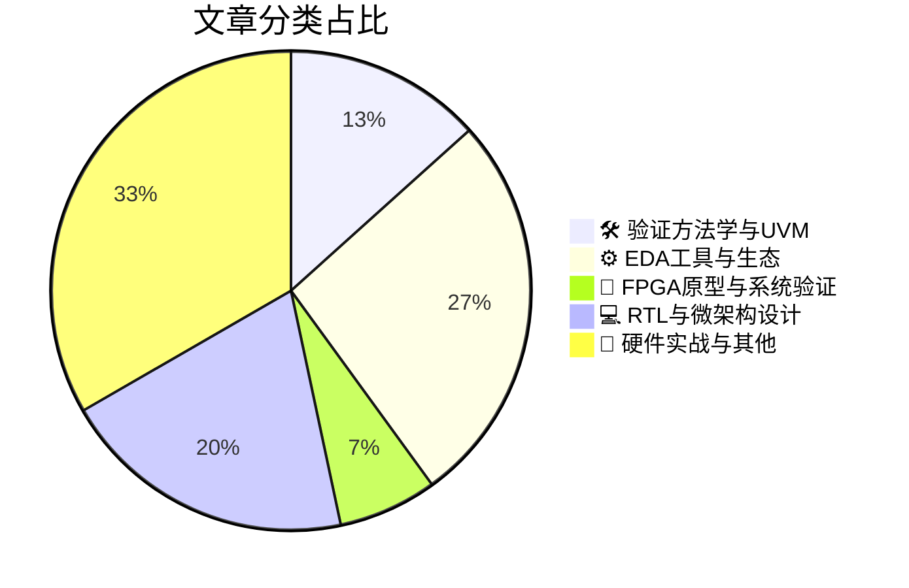

# 🛠️ FPGA / 验证技术精选

> 生成时间：2026-08-03 03:36:49 | 数据范围：过去 96 小时

## 📝 行业视点

形式化验证方法学正加速从仿真辅助向数学严格的ISA契约验证演进，MIT与Google推动的模块化分解技术实现了处理器RTL与架构规范的端到端一致性证明。开源LLM在Verilog生成任务的系统化基准测试与Synopsys-NVIDIA自主工程工作流的协同，标志着AI正深度渗透至RTL生成-形式化验证闭环，驱动EDA工具链向"生成-验证"一体化范式转移。与此同时，异构集成架构（如NAND-DRAM混合存储、Chiplet先进封装及超大规模AI计算集群）的复杂性激增，催生了基于FPGA的形式化加速与系统级原型验证需求。验证重心正从单芯片功能正确性向多 die 互连信号完整性、汽车级功能安全（ISO 26262）及硬件可信根（PUF）认证延伸，形成覆盖架构设计到硅后验证的全栈验证体系。

---

## 🏆 深度必读 (Top 3)

### 1. [针对ISA合约的RTL处理器模块化验证](https://semiengineering.com/modular-verification-of-rtl-processors-against-isa-contracts-mit-google-uw/)
**评分**: 8/10 | **分类**: 🛠️ 验证方法学与UVM | **标签**: `ISA契约` `模块化验证` `形式验证` `处理器验证` `Refinement验证`

> **💡 推荐理由**：形式化验证与模块化设计的结合为处理器验证提供了新范式。该方法不仅解决了传统随机验证覆盖率不足的问题，其分层抽象和模块解耦思想更可借鉴到现有UVM/形式化混合验证流程中，帮助团队构建可复用、易维护的处理器验证环境，特别适用于对正确性要求极高的AI加速器或车规级CPU开发。

**摘要**：
本文提出了一种基于形式化方法的模块化验证框架，用于严格证明RTL级处理器实现与其指令集架构（ISA）规范的一致性。针对传统仿真验证难以穷尽状态空间、缺乏数学正确性保证的痛点，该方法通过分层抽象将复杂处理器分解为可独立验证的模块，建立了从高层ISA合约到低层RTL的精化关系（refinement）。该架构支持增量式验证，当设计修改时只需重新验证受影响模块，显著提升了验证的可扩展性和维护性。实验表明，该方法能有效捕获传统验证遗漏的微架构边界错误，为安全关键处理器设计提供了高可信度的功能正确性保障。

### 2. [开源大语言模型在Verilog RTL生成任务上的基准测试：基于50项硬件设计案例的评估](https://semiengineering.com/benchmarking-open-source-llms-on-verilog-rtl-generation-across-50-tasks-nmims-iit-roorkee-bits-pilani/)
**评分**: 7/10 | **分类**: ⚙️ EDA工具与生态 | **标签**: `LLM` `RTL Generation` `Benchmark` `Open Source` `AI-assisted Design`

> **💡 推荐理由**：验证团队必读此文，因为它提供了开源LLM在RTL生成领域最全面的性能基线数据，有助于架构师客观评估将AI集成到验证工作流中的ROI与风险，特别是在选择用于生成参考模型（reference models）、测试平台（testbench）组件或SystemVerilog断言（SVA）的AI工具时做出数据驱动的决策，同时明确识别了当前技术下必须保留人工代码审查和形式验证的关键环节。

**摘要**：
该研究系统评估了多款主流开源大语言模型（LLM）在50个不同复杂度Verilog RTL生成任务中的实际表现，填补了AI辅助硬件设计领域缺乏定量评估的空白。文章深入剖析了生成代码在功能正确性、可综合性（synthesizability）和时序收敛方面的关键缺陷，明确指出当前开源模型在处理复杂状态机、多位宽运算及标准总线协议（如AXI、APB）时存在系统性架构理解不足。研究进一步量化了不同模型在语法错误率、逻辑功能匹配度以及代码风格规范性方面的差异，揭示了将AI生成RTL直接集成到现有验证流程中的具体风险点。通过建立涵盖从简单组合逻辑到复杂流水线处理器的多层次测试基准，该文为验证团队评估AI工具链的可靠边界提供了实证依据。最终结论指出，尽管开源LLM可加速初始代码骨架生成，但在关键路径时序优化和形式验证属性生成方面仍需大量人工干预，无法直接替代专业验证工程师的核心工作。

### 3. [FPGA形式验证加速：验证技术的创新](https://semiwiki.com/eda/371437-formal-acceleration-on-fpga-innovation-in-verification/)
**评分**: 7/10 | **分类**: ⚙️ EDA工具与生态 | **标签**: `Formal Verification` `FPGA Acceleration` `SAT Solver Hardware` `Emulation` `Verification Performance`

> **💡 推荐理由**：验证团队应关注本文，因为它提供了一种突破传统形式验证性能瓶颈的实用架构方案，使原本仅适用于小型模块的形式验证能够扩展到子系统级验证。该方案在保证数学完备性的前提下显著提升验证吞吐量，为构建下一代混合验证平台（仿真+形式验证+硬件加速）提供了关键的技术路径和工程实现参考，有助于提升复杂SoC的验证完备性和效率。

**摘要**：
传统形式验证受限于软件求解器的串行处理能力和状态空间爆炸问题，难以应对现代超大规模集成电路的验证需求。本文提出了一种创新的FPGA加速形式验证架构，通过将约束求解引擎和状态空间遍历逻辑映射到可编程硬件，实现了比传统软件方法数量级的性能提升。该方案采用软硬件协同设计范式，在保持形式验证数学完备性的同时，利用FPGA的并行计算特性加速关键证明步骤，有效解决了形式验证在大规模设计上的可扩展性瓶颈。文章详细阐述了从形式化模型到FPGA硬件的编译流程、内存架构优化策略以及证明结果的回溯验证机制，为工业界部署硬件加速形式验证提供了完整的工程化方法论。

---

## 📊 资讯分布与高频标签

## 📋 更多分类好文

### 🛠️ 验证方法学与UVM

- [**数学优先的人工智能：Kodamai如何内嵌验证与信任**](https://www.eejournal.com/fish_fry/math-first-ai-how-kodamai-embeds-verification-and-trust/) - *eejournal.com* (7分)
  > 本文针对传统AI系统黑盒特性导致的验证难题（如概率性输出不可解释、边界条件覆盖不全、形式化保证缺失），提出了基于Math-First理念的验证架构。Kodamai通过将数学形式化方法（如定理证明、抽象解释）嵌入AI设计与部署全流程，构建了从算法层到硬件层的确定性验证框架。该方案解决了AI推理在功能安全关键场景下的可解释性验证痛点，实现了对神经网络边界行为的数学级严格证明，而非仅依赖统计测试。文章阐述了如何通过硬件-算法协同设计，在芯片架构层面内建形式化验证机制，确保AI决策的数学可解释性与可审计性。这一方法显著降低了传统仿真验证在AI领域的完备性盲区，为自动驾驶、医疗AI等安全关键应用提供了形式化信任基础。

### 🔬 FPGA原型与系统验证

- [**计算集群突破国家实验室局限，实现AI规模化扩展**](https://semiengineering.com/compute-clusters-break-out-of-national-labs-to-scale-ai/) - *semiengineering.com* (6分)
  > 文章探讨了国家实验室级别的大规模计算集群架构向商业AI基础设施扩展的技术路径，重点解决了超大规模异构系统在系统级验证中的复杂性挑战。针对数千计算节点互联的拓扑验证、高速互连协议一致性检查以及分布式存储系统的数据一致性验证等痛点，提出了分层验证与软硬件协同仿真相结合的新方法论。文章还阐述了在功耗热管理、可靠性预测和故障注入验证方面的架构创新，突破了传统单芯片验证的局限。通过引入FPGA原型验证和硬件仿真（Emulation）的混合验证策略，实现了从硅片到系统级的全栈验证覆盖，为AI集群的规模化部署提供了可扩展的验证框架。

### 💻 RTL与微架构设计

- [**混合内存结合NAND闪存与DRAM实现更高速数据传输（首尔大学）**](https://semiengineering.com/nad-memory-combines-nand-flash-and-dram-for-faster-data-transfer-u-of-seoul/) - *semiengineering.com* (6分)
  > 首尔大学提出的混合内存架构通过整合NAND Flash的大容量非易失性存储与DRAM的高速随机访问特性，构建了层次化存储解决方案。该设计解决了传统架构中存储容量与访问速度难以兼顾的瓶颈，通过智能存储控制器管理数据在两种异构介质间的动态迁移。从验证架构角度看，该技术面临跨时钟域数据传输同步、异构存储接口协议一致性、以及不同存储介质间时序收敛等核心验证挑战。文章针对混合存储系统提出了专门的验证策略，重点解决了NAND Flash慢速页写入与DRAM纳秒级访问之间的数据一致性验证难题，并涉及高低温环境下混合存储阵列的可靠性验证方法。该架构要求验证团队开发能够精确模拟不同存储介质延迟特性的Verification IP，并建立覆盖全温度范围的功耗与性能协同验证流程。

- [**RosaicLabs、Atom RTL与32-Tile AMX：试图拼凑x86架构拼图**](https://chipsandcheese.com/p/rosaiclabs-atom-rtl-and-32-tile-amx) - *chipsandcheese.com* (6分)
  > 文章通过分析RosaicLabs泄漏的Intel Atom处理器RTL代码，揭示了现代x86架构中32-Tile AMX（高级矩阵扩展）单元的微架构实现与多Tile互连拓扑结构。研究深入探讨了在高密度计算阵列中解决数据一致性验证、跨Tile时序收敛以及功耗分析等关键验证痛点的方法论。作者通过逆向工程手段拼凑出了AMX指令执行流水线、寄存器堆配置和内存层次结构，暴露了复杂指令集架构中模块化验证与全系统协同仿真的技术挑战。该分析为理解Intel的机密验证策略提供了独特视角，特别是针对异构计算单元集成时的边界情况处理与参考模型构建。最终，这项工作为处理大规模多Tile架构的验证团队提供了关于验证计划制定、激励生成和覆盖率收敛的实用参考框架。

- [**全球首款通过认证的汽车级PUF（物理不可克隆函数）用于软件定义汽车**](https://semiwiki.com/artificial-intelligence/371723-industrys-first-certified-automotive-grade-puf-for-software-defined-vehicles/) - *semiwiki.com* (4分)
  > 该文章发布了业界首款通过汽车级功能安全与网络安全双重认证的PUF（物理不可克隆函数）IP，旨在为软件定义汽车（SDV）构建高可靠的硬件安全根（Root of Trust）。核心解决了传统PUF在汽车严苛环境（宽温范围、电压波动、电磁干扰）下因物理特性漂移导致的密钥生成不稳定这一关键验证痛点，通过集成自适应补偿算法与高级纠错码（ECC）架构实现了比特错误率（BER）的严格控制。文章详细阐述了符合ISO 26262 ASIL等级及ISO 21434标准的混合信号验证流程，涵盖熵源统计特性分析、老化加速仿真与故障注入测试等方法学。该方案为SDV的OTA安全升级、V2X通信认证及防克隆保护提供了可信任的硬件锚点，其验证架构对车规级安全IP的全生命周期质量保证具有重要参考价值。

### ⚙️ EDA工具与生态

- [**DAC 2026：John Cooley Troublemaker小组讨论之困局**](https://semiwiki.com/events/371717-dac-2026-the-trouble-with-john-cooleys-troublemaker-panel/) - *semiwiki.com* (6分)
  > 本文深入剖析了John Cooley在DAC 2026组织的Troublemaker Panel所揭示的当前IC验证领域核心矛盾，重点探讨了传统UVM验证方法学在面对超大规模SoC和AI芯片时的收敛效率瓶颈，以及形式验证与仿真验证在架构层面的融合困境。文章指出了验证环境复用性不足、随机约束求解空间爆炸、以及软硬件协同验证中虚拟原型与RTL仿真断层等具体痛点，并提出了基于AI的智能测试生成和云原生分布式验证架构作为潜在解决方案。作者从验证架构师视角批判了当前EDA工具链在跨平台集成和验证IP标准化方面的碎片化问题，强调需要建立更灵活的验证抽象层以应对Chiplet时代的验证挑战。

- [**新思科技展示基于英伟达技术的从芯片到系统的全面自主工程工作流**](https://www.eejournal.com/industry_news/synopsys-showcases-comprehensive-autonomous-engineering-workflows-from-silicon-to-systems-developed-with-nvidia-technology/) - *eejournal.com* (4分)
  > Synopsys联合NVIDIA展示了覆盖从硅片到系统层的全栈自主工程工作流，针对当前芯片验证中回归周期冗长、覆盖率收敛困难及跨域协同复杂等核心痛点提供系统性解决方案。该架构深度融合NVIDIA AI计算平台与Synopsys EDA工具链，实现验证流程的智能化自治，包括自主测试点生成、智能回归调度及系统级软硬件协同验证。通过构建从RTL到系统级的统一验证环境，有效解决了复杂SoC设计中多域验证一致性及早期软件栈验证的架构难题。引入的AI驱动决策机制可动态优化验证资源配置，显著降低人工干预和调试成本，加速验证收敛。

### 📝 硬件实战与其他

- [**从光子学精度到可复现验证证据**](https://semiwiki.com/photonics/371218-from-photonics-precision-to-repeatable-evidence/) - *semiwiki.com* (6分)
  > 本文针对硅光子集成芯片验证中光信号量子不确定性与电子域确定性验证需求之间的根本性矛盾，提出了一种将物理层精密光学测量转换为可重复数字验证证据的系统架构。文章解决了传统光子学仿真因工艺偏差、温度漂移和散粒噪声导致的非确定性回归失败问题，通过引入确定性蒙特卡洛边界条件固化、光-电接口行为级抽象以及基于Seed管理的可重复随机激励技术，构建了符合功能安全标准的验证环境。该架构实现了从亚皮秒级光脉冲精度到数字逻辑周期精度的确定性映射，特别适用于共封装光学（CPO）器件中高速SerDes与光调制器的混合信号验证场景。通过建立可追溯的验证证据链，该方法显著提升了复杂光电融合芯片 sign-off 的可重复性和调试效率，为光互连FPGA及硅光计算芯片的量产验证提供了标准化方法论。

- [**芯片行业一周回顾**](https://semiengineering.com/chip-industry-week-in-review-149/) - *semiengineering.com* (3分)
  > 本周综述聚焦于先进制程节点下芯片验证复杂度的指数级增长，重点分析了多核异构架构带来的场景覆盖难题及形式化验证方法的最新突破。文章深入探讨了AI驱动验证在回归测试优化中的实际落地痛点，包括训练数据稀缺性与覆盖率收敛的权衡策略。针对RISC-V生态扩张，文中剖析了开源IP集成验证的标准化缺失问题，以及硬件安全验证（Root of Trust）在FinFET工艺下的新型攻击面防护架构设计。此外，还涵盖了云原生EDA工具链对验证算力弹性调度的架构革新，为解决大规模芯片仿真资源瓶颈提供了分布式验证方案。

- [**台积电CoWoS-S与CoWoS-R技术差异解析**](https://semiwiki.com/semiconductor-manufacturers/tsmc/371759-the-difference-between-cowos-s-and-cowos-r/) - *semiwiki.com* (3分)
  > 文章系统对比了台积电CoWoS-S（硅中介层）与CoWoS-R（重分布层中介层）在材料特性、布线密度及机械柔性方面的架构差异，解决了验证团队在2.5D封装选型阶段面临的物理验证规则与电气模型选择痛点。针对CoWoS-S的高密度TSV和HBM集成场景，文章深入剖析了高频信号完整性(SI)验证中的插入损耗、串扰及电源完整性(PI)协同仿真挑战；而对于CoWoS-R的有机RDL基板，重点阐述了大面积封装中热膨胀系数(CTE)失配导致的可靠性验证难题及相应的DFT架构优化策略。文章进一步明确了两种技术在IO密度、带宽需求与成本间的权衡，为验证团队提供了从物理层ERC/DRC到协议层分层验证的规划依据。最后，通过对比二者的良率测试方法与故障隔离机制，解决了多芯片系统集成中边界扫描和JTAG调试可达性的验证架构设计问题。

- [**铠侠发布全新UFS 5.0嵌入式闪存器件，赋能端侧AI**](https://www.eejournal.com/industry_news/new-ufs-5-0-embedded-flash-memory-devices-from-kioxia-enable-on-device-ai/) - *eejournal.com* (3分)
  > KIOXIA发布了业界首款符合UFS 5.0标准的嵌入式闪存器件，通过将接口带宽翻倍至23.2Gbps并优化延迟，解决了端侧AI模型加载与实时推理中存储子系统成为性能瓶颈的验证痛点。该架构引入增强型WriteBooster 2.0与多级深度睡眠模式，要求验证团队重新设计针对高吞吐量数据传输、功耗状态快速转换及MIPI M-PHY信号完整性的全栈验证策略。文章指出，传统存储验证方法难以覆盖AI工作负载的突发流量特征与确定性延迟需求，需构建从协议层命令队列调度到系统级AI推理流水线的协同验证环境。此外，UFS 5.0与主机控制器之间复杂的数据一致性管理，对验证架构的参考模型精度及场景覆盖率提出了更高要求。

- [**基于二维P型半导体和氧化物N沟道晶体管的互补后端CMOS技术（斯坦福、汉阳大学）**](https://semiengineering.com/2d-p-type-semiconductors-with-oxide-n-channel-transistors-for-complementary-beol-cmos-stanford-hanyang/) - *semiengineering.com* (2分)
  > 该研究通过在BEOL（后端线）中集成二维P型半导体与氧化物N沟道晶体管，实现了低温工艺下的互补CMOS逻辑，突破了传统高温工艺对单片三维集成（M3D）多层堆叠的限制。该架构解决了在金属互连层上直接构建高性能计算层缺乏合适晶体管的关键瓶颈，使得逻辑与存储的紧密三维集成成为可能。然而，该方案引入了非传统半导体器件的表征验证难题，包括二维材料界面态导致的阈值电压漂移、氧化物晶体管的偏压温度不稳定性（BTI）及低迁移率带来的时序收敛挑战。从验证架构角度，这要求建立针对BEOL器件的可靠性验证流程、开发适应低温工艺变异性的SPICE模型提取方法，以及设计跨层热-电耦合效应的功耗完整性分析方案。该工作为后摩尔时代的三维集成芯片验证提供了器件-架构协同设计的重要参考，特别是在处理新型沟道材料的老化效应建模和容错测试架构设计方面具有前瞻价值。

