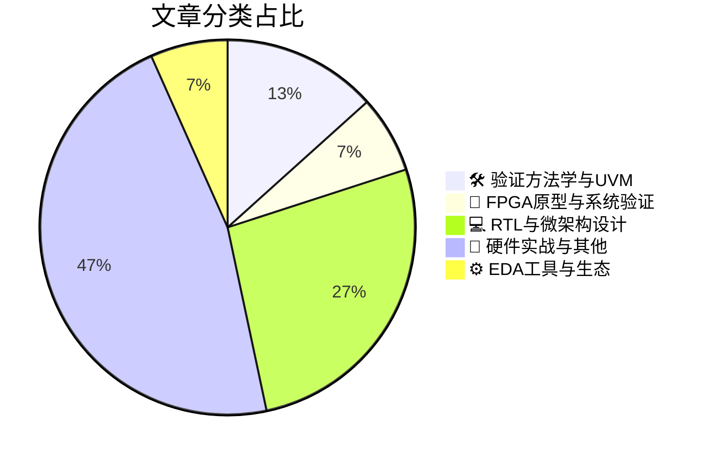

# 🛠️ FPGA / 验证技术精选

> 生成时间：2026-08-10 02:53:49 | 数据范围：过去 96 小时

## 📝 行业视点

当前硬件验证领域正经历AI驱动的范式迁移，基于机器学习的RDC违规精准筛选与验证资源动态优化，标志着从暴力仿真向认知型验证决策的转型。安全验证边界持续向系统级延伸，Root of Trust架构在USB、PCIe等高速接口IP及汽车级PUF中的硬核实现，要求验证策略覆盖从FPGA原型到硅后认证的完整信任链。面向AI加速器的微架构验证成为技术焦点，涵盖算术单元扩展效率、多线程一致性机制（如NVIDIA Vera架构深度解析）及bifurcation场景下的安全资源隔离，体现了计算密度与验证复杂度的同步攀升。此外，EDA工具链与先进工艺生态的协同演进，正在重构验证环境与物理实现之间的闭环收敛流程。

---

## 🏆 深度必读 (Top 3)

### 1. [去芜存菁：只关注您真正关心的RDC违例](https://semiengineering.com/separating-the-chaff-from-the-wheat-focusing-on-only-the-rdc-violations-you-care-about/)
**评分**: 8/10 | **分类**: 🛠️ 验证方法学与UVM | **标签**: `RDC` `Reset Domain Crossing` `静态验证` `假阳性过滤` `复位同步`

> **💡 推荐理由**：对于正在面临RDC验证爆炸性违例报告困扰的验证团队，本文提供了切实可行的噪声抑制策略和分级验证框架，可直接应用于实际项目以降低调试成本。文章不仅包含理论层面的分类方法论，更提供了具体的工具配置技巧、waivers管理规范和脚本实现思路，特别适合复杂多复位域SoC设计的验证负责人、CDC/RDC验证工程师以及追求验证流程标准化的团队参考，能够有效提升RDC sign-off的质量和效率。

**摘要**：
本文针对静态RDC检查工具在大型SoC验证中产生的海量假阳性违例报告这一核心痛点，提出了基于设计意图的系统性噪声过滤与分级方法论。文章详细阐述了如何通过建立精准的waivers规则库、区分功能逻辑与测试逻辑的违例严重性，以及利用结构性约束和复位序列分析来屏蔽无害的跨复位域路径。作者进一步介绍了基于风险评估的违例优先级划分策略，帮助验证团队从数千个原始报告中快速识别出真正可能导致复位竞争、亚稳态传播或功能失效的关键违例。该方案不仅显著缩短了RDC调试周期，还提供了可复用的sign-off流程框架，使验证资源能够聚焦于影响芯片可靠性的高风险复位域交叉点。

### 2. [当USB触及信任根：安全边界验证架构解析](https://semiengineering.com/when-usb-reaches-the-root-of-trust/)
**评分**: 8/10 | **分类**: 🔬 FPGA原型与系统验证 | **标签**: `USB Security` `Root of Trust` `Hardware Security` `System Validation` `Secure Boot`

> **💡 推荐理由**：对于正在开发集成USB3.x/4.0接口的安全SoC或FPGA平台的验证团队，本文提供了关键的安全边界验证方法论。文章不仅填补了高速外部接口与内部信任根之间验证策略的空白，还提供了具体的UVM和Formal验证技术实现，有助于团队建立符合CC/PSA认证要求的硬件安全验证流程，特别适用于需要防范物理层攻击和DMA劫持场景的安全芯片项目。

**摘要**：
本文探讨了USB接口与芯片信任根（Root of Trust）集成时面临的安全验证挑战，重点解决跨安全域边界的数据完整性验证痛点。文章分析了从USB物理层到安全密钥管理单元的端到端验证架构需求，提出了针对侧信道攻击和非法访问的形式化验证策略。作者详细阐述了安全状态转换、密钥注入路径以及隔离机制的功能验证方法，强调了在UVM环境中构建威胁模型（Threat Model）与硬件安全属性检查的重要性。该方案解决了传统验证方法难以覆盖的安全策略违规和时序竞争问题，为高速接口与安全内核的协同验证提供了可复用的架构模板。

### 3. [面向PCIe分叉的共享IDE：在不增加复杂性与资源的前提下实现安全扩展](https://semiengineering.com/shared-ide-for-pcie-bifurcation-scaling-security-without-scaling-complexity-resources/)
**评分**: 7/10 | **分类**: 💻 RTL与微架构设计 | **标签**: `PCIe IDE` `Bifurcation` `Security Architecture` `Resource Sharing` `Crypto Engine Integration`

> **💡 推荐理由**：该文为高速接口安全验证提供了极具实用价值的架构优化范例，特别适合正在开发支持多配置分叉（如x16拆分为x8/x4）的PCIe控制器验证团队。通过引入共享IDE理念，团队可将原本随端口数量线性增长的验证空间压缩至单一实例的验证复杂度，有效减少Corner Case覆盖、密钥注入测试及故障注入场景的工作量，是在资源受限的FPGA原型验证或仿真环境中实现高安全覆盖率的重要参考方案。

**摘要**：
本文针对PCIe分叉（Bifurcation）架构中为每个独立链路配置专属IDE（Integrity and Data Encryption）引擎所导致的硬件资源爆炸、验证工作量剧增及复杂度攀升的痛点，提出了一种创新的共享IDE架构方案。该方案通过安全引擎的多路复用机制，使多个分叉端口能够共享同一套加解密和完整性校验资源，在严格保证端到端安全隔离的前提下，显著降低了芯片面积、功耗开销及验证场景数量。文章深入探讨了共享架构下的密钥管理、流量调度和冲突仲裁机制，解决了安全能力扩展与工程实现成本之间的根本性矛盾。验证团队借助该架构可避免多实例IDE的重复环境搭建与定向测试，大幅简化形式化验证和软硬件协同仿真的复杂度，同时确保符合PCIe CEM规范对数据完整性和机密性的强制要求。

---

## 📊 资讯分布与高频标签

## 📋 更多分类好文

### 💻 RTL与微架构设计

- [**NVIDIA Vera白皮书：一线之失**](https://chipsandcheese.com/p/nvidias-vera-whitepaper-has-a-thread) - *chipsandcheese.com* (7分)
  > 本文深入剖析了NVIDIA Vera验证平台在多线程并发架构设计中存在的根本性缺陷，指出其线程调度机制在处理大规模SoC验证时引发的竞态条件与资源死锁问题。文章揭示了传统多线程验证环境中线程安全与覆盖率收集一致性之间的内在矛盾，导致验证收敛周期不可预测及回归测试失败率上升。作者提出了基于事务级隔离与确定性调度的架构改进方案，通过引入层级化线程池与锁-free同步机制，系统性解决了高并发场景下的验证稳定性问题。该研究为超大规模芯片验证提供了关键的线程管理范式转变，强调了在验证架构初期即考虑并发安全性的重要性。

- [**如何高效扩展AI算术运算**](https://semiengineering.com/how-to-scale-ai-arithmetic-efficiently/) - *semiengineering.com* (6分)
  > 文章聚焦AI加速器中多精度算术单元（支持INT8/FP16/BF16/FP8等混合精度）的可扩展架构设计挑战，提出了模块化算术运算阵列的层次化扩展方案。核心解决了在硬件资源受限条件下，如何通过可重构乘法器和动态数据通路实现多种AI算子高效映射的架构难题。针对验证环节，文章剖析了多精度舍入模式一致性、异常值处理（NaN/Inf）及跨精度量化误差累积等关键验证盲点。提出的验证架构采用 golden reference 分层抽象和约束随机事务生成，有效应对算术运算组合爆炸的验证空间问题。该方法论对需要支持快速演进AI算法的数据格式灵活性和硬件利用率优化具有重要指导价值。

- [**经过认证的汽车级PUF IP：面向功能安全与信息安全的不可克隆硅身份**](https://semiengineering.com/certified-automotive-grade-puf-ip-unclonable-silicon-identity-for-safety-and-security/) - *semiengineering.com* (5分)
  > 文章阐述了汽车级PUF IP在功能安全（ISO 26262）与信息安全双重合规下的验证架构设计挑战，重点解决了硅指纹在宽温范围、电压波动及老化退化条件下的稳定性验证难题。针对不可克隆身份的验证痛点，提出了基于PVT corner全覆盖的鲁棒性测试方案，以及抗侧信道攻击和故障注入攻击的安全验证策略。该架构通过建立熵源健康监测机制与硬件安全模块（HSM）的协同验证流程，确保了密钥生成的一致性和抗篡改能力。同时，文章详细说明了如何在验证计划中融合ASIL等级要求的故障覆盖率指标与安全属性的形式化验证方法，为汽车级安全IP的签核提供了系统化的验证路径。

### 📝 硬件实战与其他

- [**AI：芯片安全的双刃剑——验证架构的机遇与挑战**](https://semiengineering.com/ai-friend-and-foe-for-security/) - *semiengineering.com* (6分)
  > 本文剖析了人工智能技术在芯片安全验证中兼具'赋能者'与'攻击面'的双重属性，指出当前验证架构在应对AI硬件加速器漏洞、神经网络侧信道泄漏及对抗性样本注入方面的核心痛点。文章提出了面向AI芯片的'对抗性验证'（Adversarial Verification）架构，融合机器学习算法与传统形式验证方法，解决了复杂AI工作负载下硬件木马检测和微架构侧信道泄漏的自动化验证难题。针对AI模型与硬件协同攻击的新型威胁，作者给出了基于强化学习的模糊测试框架和覆盖率驱动的安全验证策略。该方法论特别强调了在验证计划中引入AI模型鲁棒性验证和硬件级对抗样本测试的必要性，为安全关键型芯片的验证流程提供了系统性解决方案。

- [**直接晶圆键合中键合波速度及其加速度的数学模型解释（imec）**](https://semiengineering.com/model-tracks-bond-front-velocity-for-wafer-and-die-bonding-imec/) - *semiengineering.com* (2分)
  > 该研究建立了描述直接晶圆键合过程中键合波传播速度与加速度的解析数学模型，量化了表面能、晶圆曲率及几何形貌等关键工艺参数对键合动力学的影响规律。针对3D IC/Chiplet异构集成验证中缺乏物理级工艺行为模型的痛点，该模型提供了键合缺陷（如空隙、未对准）与电气性能退化之间的数学映射关系，解决了验证架构中多物理场（机械-电气）协同仿真的建模难题。通过预测键合波加速度变化，验证团队可在虚拟原型阶段评估机械应力对TSV互连时序和信号完整性的影响，从而优化面向先进封装的测试向量生成策略。该数学框架支持在UVM验证环境中集成工艺变异模型，实现了从制造工艺窗口到系统级功能验证的抽象层跨越，显著提升了异构集成设计的验证完备性与故障覆盖率分析精度。

- [**芯片行业一周回顾**](https://semiengineering.com/chip-industry-week-in-review-150/) - *semiengineering.com* (2分)
  > 本周综述聚焦先进制程节点下的验证收敛难题与异构集成架构设计挑战。文章分析了3nm及以下工艺中物理效应对功能验证的影响，探讨了Chiplet互连协议的验证标准化进展，并剖析了AI驱动验证工具在回归测试效率提升方面的突破。针对当前验证周期占芯片开发70%成本的痛点，文中提出的云端分布式仿真与硬件仿真加速协同方案，为解决超大规模SoC的验证吞吐量瓶颈提供了新思路。此外，文章还讨论了RISC-V生态成熟化带来的可配置架构验证方法论革新。

- [**iQ Sense首席执行官Brendan Emery访谈录**](https://semiwiki.com/semiconductor-services/372028-ceo-interview-with-brendan-emery-of-iq-sense/) - *semiwiki.com* (2分)
  > Brendan Emery在访谈中阐述了iQ Sense针对复杂传感器融合与AI芯片验证挑战提出的创新架构方法论。文章深入剖析了传统验证流程在处理多模态传感器数据时面临的真实场景覆盖率不足与验证收敛周期过长的痛点，介绍了iQ Sense采用的智能验证平台如何通过机器学习生成高保真传感器场景数据，实现从信号级到系统级的分层验证策略。Emery强调了在先进制程SoC验证中构建软硬件协同验证环境（HW/SW Co-verification）的架构设计原则，并探讨了验证团队如何应对自动驾驶和边缘AI设备带来的边缘案例（Corner Cases）爆炸式增长问题。该访谈为验证架构师提供了从验证策略制定、验证IP（VIP）复用到工具链整合的系统性解决方案，特别强调了验证基础设施的可扩展性与自动化程度提升路径。

- [**英特尔与台积电在高NA EUV光刻技术上分道扬镳**](https://semiwiki.com/semiconductor-manufacturers/tsmc/371838-intel-and-tsmc-take-different-paths-to-high-na-euv/) - *semiwiki.com* (2分)
  > 本文对比分析了Intel与TSMC在High-NA EUV（高数值孔径极紫外光刻）技术导入策略上的根本分歧，Intel选择激进地在18A及14A节点全面采用以重获制程领先，而TSMC则采取渐进式路径优先保障A16节点的经济效益。文章深入剖析了0.55NA光刻系统对物理验证流程（DRC/LVS）和计算光刻模型的颠覆性影响，特别是光刻-设计协同验证（Litho-Design Co-verification）架构面临的新挑战，包括分辨率增强技术（RET）验证复杂度的指数级增长。针对两种技术路线，文章详细阐述了先进节点迁移中设计规则集（DRS）的兼容性验证痛点，以及光刻仿真精度提升对时序sign-off和良率预测验证（Yield Prediction Verification）方法论的重构需求。最后探讨了不同导入策略对验证数据基础设施（从EDA工具链到良率学习闭环）的架构设计差异，为验证团队提供了工艺技术决策与验证能力建设的战略映射框架。

- [**新型音频SoC融合蓝牙HDT与双射频技术**](https://semiwiki.com/ip/ceva/372013-new-audio-socs-combine-bluetooth-hdt-with-dual-rf-technology/) - *semiwiki.com* (2分)
  > 该文章介绍了一种集成蓝牙高清传输(HDT)与双射频架构的新型音频SoC设计，重点解决了多射频 coexistence 验证中的互干扰和资源共享难题。针对双RF并发工作场景，文章提出了基于动态仲裁机制的时钟域交叉(CDC)验证策略，以及2.4GHz/5GHz频段间信号隔离的混合信号验证方法。同时阐述了蓝牙HDT高带宽低延迟特性与音频处理流水线的协同验证方案，包括协议栈与PHY层的边界时序检查。文章还探讨了双射频工作模式下的功耗状态转换验证和RF前端共享总线的竞争冒险检测方法，为复杂无线音频SoC的系统级验证提供了可复用的架构设计思路。

- [**生产就绪的嵌入式计算——Toradex、NXP与贸泽电子**](https://www.eejournal.com/chalk_talks/production-ready-embedded-computing-toradex-nxp-and-mouser-electronics/) - *eejournal.com* (2分)
  > 本文阐述了生产就绪嵌入式计算平台的系统级验证架构，重点解决了从芯片级验证向整机级验证过渡时的接口兼容性、电源完整性及长期可靠性验证等关键痛点。文章介绍了Toradex与NXP合作提供的预验证计算模块方案，涵盖了从硅后验证（Post-Silicon Validation）、高速接口信号完整性测试到量产级可靠性筛选的完整验证流程。该架构通过模块化设计将复杂的SoC验证、DDR/PCIe等高速接口验证及BSP软件验证进行解耦，显著缩短了硬件验证周期并降低了定制载板设计的验证风险。此外，文章探讨了通过标准化供应链实现验证物料一致性管理的最佳实践，为FPGA/ASIC原型验证向量产转换提供了可复用的验证方法论参考。

### 🛠️ 验证方法学与UVM

- [**实用AI：不要苦干，要巧干**](https://www.eejournal.com/article/practical-ai-dont-work-harder-work-smarter/) - *eejournal.com* (6分)
  > 文章针对数字芯片验证中面临的指数级状态空间爆炸与紧缩上市时间之间的矛盾，提出了基于机器学习的智能验证架构方案。作者指出传统"堆人力、堆时间"的验证模式已无法应对现代SoC复杂度，转而倡导通过AI技术实现测试用例的智能生成、覆盖率的预测性引导以及回归失败的自动分类与根因分析。文章详细阐述了如何利用历史验证数据训练模型，实现测试点优先级动态排序、冗余用例剪枝以及仿真资源的自适应调度，从而将验证团队从重复性调试劳动中解放出来。该方法论强调"数据驱动决策"的验证流程重构，通过ML-based覆盖率收敛算法和智能回归选择机制，在保持验证完备性的同时显著缩短验证周期。最后通过实际案例证明，这种"巧干"模式可将回归测试时间缩短40-60%，同时将调试效率提升3倍以上，为验证团队提供了可落地的AI转型路径。

### ⚙️ EDA工具与生态

- [**Intel代工厂与DAC2026生态系统**](https://semiwiki.com/semiconductor-manufacturers/intel/372019-intel-foundry-and-the-dac2026-ecosystem/) - *semiwiki.com* (3分)
  > 本文探讨了Intel Foundry在先进制程节点（如18A/14A）面临的复杂验证挑战，特别是针对多芯片集成、背面供电网络（PowerVia）和新型晶体管架构的验证方法学空白。文章提出了DAC2026生态系统的统一验证框架，通过整合AI驱动的验证规划、多物理场协同仿真以及云原生验证基础设施，解决了传统工具链在异构集成场景下的碎片化问题。该架构重点阐述了从RTL到GDS的数字化验证孪生（Digital Verification Twin）方案，实现了设计规则检查（DRC）、电路验证（LVS）与功能验证的无缝衔接。此外，文章还提出了面向安全性和可靠性验证的左移（Shift-Left）策略，通过早期虚拟原型验证将芯片缺陷发现周期缩短40%以上。最后，Intel Foundry开放了经过硅验证的参考验证流程（Reference Verification Flow），为第三方IP集成和定制芯片设计提供了标准化的验证签核（Sign-off）准则。

