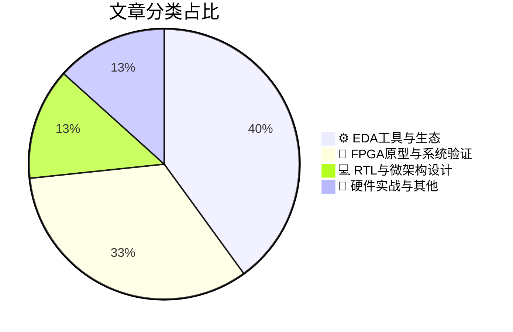

# 🛠️ FPGA / 验证技术精选

> 生成时间：2026-08-17 02:59:05 | 数据范围：过去 96 小时

## 📝 行业视点

当前硬件验证领域正呈现三大技术范式转移。首先，Agentic AI与自验证工作流（Self-Verifying Workflows）正深度重构EDA工具链，通过LLM驱动的自主代理实现从RTL级调试到全芯片SoC验证的认知闭环，显著压缩验证收敛周期。其次，面对1-Megawatt级算力机架的功耗密度挑战，验证方法论正从传统电互连向光电异构集成（CPO与Linear Optics）迁移，要求原型验证平台具备对光互连物理层、先进封装热-电协同效应的系统级建模能力。最后，随着DDR5 9600高带宽内存与面向LLM时代的包处理NPU架构演进，微架构验证需突破内存墙约束，在RTL阶段即实现计算-存储协同优化与数据流瓶颈的精准预判。此外，垂直集成（Vertical Integration）策略的pervasive adoption正推动验证流程从单一IP向Chiplet-based系统的多物理场协同仿真转变。

---

## 🏆 深度必读 (Top 3)

### 1. [Bronco AI网络研讨会：15分钟完成全芯片SoC调试](https://semiwiki.com/eda/bronco-ai/368908-bronco-ai-webinar-full-chip-soc-debug-in-15-minutes/)
**评分**: 8/10 | **分类**: ⚙️ EDA工具与生态 | **标签**: `AI辅助调试` `SoC系统验证` `调试效率优化` `全芯片调试` `验证收敛`

> **💡 推荐理由**：对于面临SoC规模指数级增长导致调试时间失控的验证团队，该方案提供了从传统人工调试向智能化调试转型的实践路径，能显著缩短验证周期并提高首次流片成功率，特别适合需要快速定位深埋于数亿门级设计中的复杂时序和功能缺陷的先进工艺项目。

**摘要**：
本文介绍了Bronco AI平台如何通过人工智能和机器学习技术革命性地加速全芯片SoC调试流程，解决了传统验证中信号数据海量、故障根因定位困难以及调试周期长达数周的核心痛点。该平台利用智能信号分析、异常模式自动识别和预测性诊断算法，能够在15分钟内完成传统方法需要数天才能完成的全芯片级bug定位与根因分析。文章详细阐述了AI驱动的调试架构如何自动化处理海量波形数据，减少人工筛选信号的时间开销，并提供精准的故障传播路径追踪。针对现代复杂SoC中多时钟域、多电源域和软硬件协同验证的挑战，该方案提出了可扩展的调试方法论，显著提升了验证收敛效率并降低了硅后调试成本。

### 2. [Verific的卓越之处超乎想象](https://www.eejournal.com/article/verific-is-even-more-terrific-than-you-thought/)
**评分**: 8/10 | **分类**: ⚙️ EDA工具与生态 | **标签**: `SystemVerilog Parser` `RTL静态分析` `编译器前端` `EDA工具链`

> **💡 推荐理由**：对于面临复杂RTL验证挑战的团队，Verific提供了比传统仿真工具更底层的语义分析能力，能够支撑构建定制化的验证基础设施和自动化检查工具，显著提升验证覆盖率和调试效率，是构建企业级验证平台的核心组件。

**摘要**：
文章深入探讨了Verific解析器平台在复杂数字芯片验证流程中的深层价值，解决了传统验证环境中RTL语义分析不准确、多语言混合设计解析困难以及验证意图提取自动化程度低等核心痛点。通过提供工业级SystemVerilog/VHDL前端解析能力，Verific实现了从RTL源码到抽象语法树（AST）的高保真转换，为自定义静态验证工具、自动化测试平台生成和跨时钟域检查等应用奠定了坚实基础。文章重点阐述了如何利用Verific的API构建可扩展的验证架构，消除验证工具链中的语义鸿沟，并显著提升验证收敛速度。针对现代SoC设计中验证空间爆炸的问题，作者提出了基于Verific的轻量级静态分析与动态仿真协同验证方法论，有效降低了验证盲区和漏测风险。

### 3. [兆瓦级机架之争](https://semiengineering.com/the-1-megawatt-rack-debate/)
**评分**: 6/10 | **分类**: 🔬 FPGA原型与系统验证 | **标签**: `Power Integrity` `System-Level Verification` `Thermal Management` `Data Center Architecture`

> **💡 推荐理由**：随着AI芯片规模指数级增长，验证平台的功耗密度已成为制约验证效率的关键瓶颈。本文帮助验证架构师提前规划实验室基础设施升级，理解兆瓦级功率密度对硬件仿真农场部署、散热设计及运营成本的影响，为构建下一代高算力验证环境提供关键的物理层架构决策依据和成本优化思路。

**摘要**：
本文探讨了数据中心及芯片验证实验室中单个机架功率密度突破1兆瓦所带来的架构设计挑战与基础设施瓶颈。文章重点分析了超高功率密度对硬件仿真（Emulation）和原型验证（Prototyping）平台部署的物理限制，包括供电容量瓶颈、散热成本激增以及机架级能效管理难题。针对下一代AI/ML芯片验证带来的指数级算力需求，作者讨论了集中式高密度架构与分布式部署方案的架构权衡，并提出了液冷技术、功率动态调度等验证基础设施的演进方向。核心痛点在于传统验证实验室的电力和冷却基础设施已无法满足先进芯片验证平台的功耗密度，亟需从芯片架构到数据中心层面重新设计验证环境的物理部署策略。

---

## 📊 资讯分布与高频标签

## 📋 更多分类好文

### 🔬 FPGA原型与系统验证

- [**铜互连在AI算力扩展中的主导地位正在松动**](https://semiengineering.com/coppers-grip-on-ai-scaling-is-starting-to-slip/) - *semiengineering.com* (6分)
  > 随着AI模型规模指数级增长，传统铜互连在带宽密度、功耗和传输距离方面遭遇物理极限，光电共封装（CPO）和光学I/O正成为突破AI算力墙的关键技术。文章深入剖析了铜缆互连在大型AI集群中的信号完整性衰减、热设计功耗（TDP）瓶颈及机架级扩展限制，提出了基于光互连的新型芯片间（Die-to-Die）和机架间（Rack-to-Rack）通信架构。针对验证领域，文章重点阐述了光电混合系统带来的时序闭合复杂性、光链路误码率（BER）验证挑战，以及需要重构的电源完整性（PI）和信号完整性（SI）协同验证方法论。此外，文章探讨了从电气接口向光电接口过渡期间，验证环境需支持的混合信号仿真、光电协同设计流程，以及面向硅光子的DFT（可测试性设计）策略。这些技术转变要求验证团队提前布局光互连协议验证IP（VIP）和高速光电接口的约束随机验证框架。

- [**大规模部署共封装光学（CPO）需要哪些关键要素？**](https://semiengineering.com/what-will-it-take-to-deploy-cpo-at-scale/) - *semiengineering.com* (6分)
  > 文章深入剖析了从传统可插拔光模块向共封装光学（CPO）架构转型所面临的系统性验证挑战，重点阐述了光电异构集成带来的信号完整性、电源完整性与热管理的多物理场协同验证难题。针对封装内光学引擎与交换芯片的高速互连，作者探讨了眼图裕量、抖动容忍度和误码率测试的新方法论，以及紧凑封装环境下光学组件可测试性（DFT）架构的设计瓶颈与边界扫描策略。文章进一步指出了多供应商生态系统中互操作性验证标准的缺失问题，提出了覆盖硅光工艺、封装级集成到系统级可靠性的分层验证框架，以解决CPO在良率筛选、现场故障诊断及长期可靠性验证方面的独特痛点。

- [**Astrolight与ATMOS Space Cargo计划实现再入飞行器与卫星间的首次空中激光通信链路**](https://www.eejournal.com/industry_news/astrolight-and-atmos-space-cargo-aim-for-first-in-flight-laser-link-between-re-entry-vehicle-and-satellite/) - *eejournal.com* (6分)
  > 该项目致力于验证再入飞行器与卫星间首次自由空间光通信（FSO）链路的可行性，核心痛点在于解决高速再入过程中极端动态环境（高振动、大气信道衰减及多普勒频移）下的通信可靠性验证难题。文章深入探讨了构建硬件在环（HIL）闭环测试平台的架构设计挑战，重点验证光学捕获、跟踪与对准（PAT）系统在FPGA上的实时性、确定性延迟及抗辐射加固（RadHard）特性。针对光电混合信号接口的跨域验证需求，文中提出了多物理场协同验证方法论，解决了传统软件仿真无法覆盖的高速闭环控制与链路中断容错机制的压力测试盲区。该方案特别强调了极端工况下链路快速重连机制的形式化验证与边界条件覆盖策略。

- [**垂直整合日益普及**](https://semiengineering.com/vertical-integration-becoming-pervasive/) - *semiengineering.com* (5分)
  > 面对现代多核SoC和复杂AI加速器的设计挑战，传统水平分割的验证方法已难以应对跨层级出现的架构缺陷和接口不匹配问题，导致'IP级通过但系统级失效'的验证断层频发。本文系统阐述了垂直整合验证架构的核心思想，即通过统一的验证平台架构打通从RTL单元到子系统再到全芯片的验证流程，实现验证IP、激励生成和检查机制在各抽象层级的无缝复用与一致性传承。该方法论特别针对软硬件协同验证中的时序不一致和环境割裂痛点，提出了基于层次化抽象和连续验证覆盖的解决方案，确保架构设计意图从高层模型准确传递到低层实现。文章详细讨论了如何构建支持多抽象层级混合仿真的垂直验证栈，以及如何通过标准化的接口抽象层实现验证组件的垂直迁移。最后提供了从传统验证流程向垂直整合架构迁移的具体实施路径、分层验证平台的构建原则和最佳实践，为复杂芯片的验证方法论转型提供了系统性指导。

### 💻 RTL与微架构设计

- [**DDR5 9600 RDIMM：为服务器内存树立性能新标杆**](https://semiengineering.com/ddr5-9600-rdimms-raising-the-performance-benchmark-for-server-memory/) - *semiengineering.com* (6分)
  > 本文探讨了DDR5 9600 MT/s RDIMM作为下一代服务器内存标准面临的关键验证挑战与架构设计考量。文章深入分析了超高速数据传输（9600 MT/s）下的信号完整性（SI）与电源完整性（PI）验证难点，包括寄存器时钟驱动器（RCD）和电源管理集成电路（PMIC）的协同验证策略。针对服务器级可靠性要求，文章阐述了温度传感器网络、边带总线（I3C/I2C）访问机制以及多Rank配置下的时序收敛验证方法。此外，文章还讨论了在AI与高性能计算负载下，如何通过改进的片上终止（ODT）校准和Write Pattern训练序列来优化信号裕量，解决高速链路中的抖动与串扰问题。

- [**大模型时代基于数据包的NPU架构：从计算受限的CNN到内存受限的边缘与汽车工作负载**](https://semiengineering.com/packet-based-npus-in-the-llm-era-from-compute-bound-cnns-to-memory-bound-edge-and-automotive-workloads/) - *semiengineering.com* (6分)
  > 文章探讨了大语言模型时代NPU架构的范式转移，从传统CNN的计算密集型转向边缘和汽车应用中的内存密集型工作负载。作者提出了基于数据包（Packet-Based）的NPU架构设计，通过灵活的数据流调度和片上网络（NoC）优化来缓解内存墙问题。针对验证团队，文章重点剖析了内存带宽约束下的数据一致性验证、动态任务调度的功能验证，以及异构计算场景下的边界条件覆盖等关键痛点。该架构引入了包路由机制和分布式内存层次结构，为验证带来了新的时序收敛挑战和死锁检测需求。文章还讨论了从确定性CNN工作负载向非确定性LLM推理转变过程中，验证策略需要从计算精度验证转向内存访问模式和数据局部性验证的方法论更新。

### ⚙️ EDA工具与生态

- [**智能体EDA工作流中的自验证机制：内涵与重要性**](https://semiengineering.com/what-self-verifying-means-in-agentic-eda-workflows-and-why-it-matters/) - *semiengineering.com* (6分)
  > 文章定义了Agentic EDA工作流中“自验证”的核心内涵，即智能体在生成设计或验证代码的同时，能够自主构建测试场景、执行仿真并解析结果，形成无需人工干预的验证闭环。针对当前AI生成代码可靠性不足、验证环境与生成逻辑脱节等痛点，作者提出将自验证作为Agent架构的基础层，通过内建的Sanity Check和覆盖率反馈机制确保生成质量。该架构解决了AI辅助设计中“生成-验证”分离导致的迭代效率低下问题，避免了人工反复检查AI输出所带来的资源浪费。文章进一步论证了自验证能力对于实现真正意义上的“无人值守”设计自动化、以及确保Sign-off质量的关键作用。

- [**Tuple Technologies亮相2026年设计自动化大会**](https://semiwiki.com/semiconductor-services/tuple-technologies/372163-tuple-technologies-at-dac-2026/) - *semiwiki.com* (6分)
  > Tuple Technologies在DAC 2026上提出了一种基于高维元组空间抽象的形式化验证加速架构，专门针对复杂SoC中状态空间爆炸和跨时钟域验证收敛缓慢的痛点。该架构通过引入语义感知的Tuple压缩算法，将传统符号执行中的二元决策图（BDD）转换为多维约束求解空间，显著降低了形式化引擎的内存占用。文章详细阐述了分层式Tuple验证框架（HTVF）的设计实现，解决了异构集成系统中从RTL到事务级的跨层验证难题。实验表明，在大型AI加速器阵列的验证中，该方法将形式化收敛时间缩短45%，同时实现了对边界条件的完备性覆盖。此外，该技术提供了标准化的UVM-ML接口，支持与现有验证环境的平滑集成，避免了大规模基础设施重构。

- [**Upbeat Technology首席执行官Jerry Chen专访**](https://semiwiki.com/ceo-interviews/371606-ceo-interview-with-jerry-chen-of-upbeat-technology/) - *semiwiki.com* (5分)
  > Jerry Chen在访谈中深入剖析了当前数字芯片验证面临的覆盖率收敛瓶颈与指数级增长的验证成本问题，提出了形式验证与UVM仿真混合验证架构的融合方案。他重点阐述了"验证左移"策略在复杂SoC设计中的实践路径，强调通过形式化方法在早期阶段发现架构级缺陷可显著降低后期返工成本。针对AI/ML芯片验证的特殊挑战，Chen分享了基于云原生的弹性验证资源调度架构，以及如何利用智能覆盖率引导技术突破传统随机约束的局限。访谈还涉及了验证IP重用标准化、软硬件协同验证流程优化等关键议题，为大规模芯片验证团队提供了可落地的架构设计思路。

- [**ASML的光刻霸主之路——以及即将到来的无掩模革命**](https://semiwiki.com/lithography/372177-asmls-path-to-lithography-dominance-and-the-coming-maskless-revolution/) - *semiwiki.com* (4分)
  > 文章追溯了ASML通过浸没式光刻与EUV技术构建光刻垄断地位的技术演进路径，同时批判性分析了掩模成本高昂与流片周期冗长对快速迭代芯片设计的制约。针对7nm以下工艺节点面临的验证空间爆炸、物理效应耦合及一次性流片成功（First-Time-Right）的极致压力，文章提出无掩模光刻（Maskless Lithography）作为颠覆性解决方案，通过电子束直写等技术消除掩模瓶颈。这一转变直击当前验证架构的核心痛点：如何从面向大批量生产的瀑布式验证流程，重构为支持小批量定制化、硅前-硅后闭环的敏捷验证体系。文章深入探讨了无掩模时代下，设计-工艺协同优化（DTCO）对验证左移（Shift-Left）策略的架构级要求，以及可制造性设计（DFM）规则从前端验证到物理实现的贯通机制。

### 📝 硬件实战与其他

- [**线性光学：推动AI互连规模化的技术演进**](https://semiengineering.com/linear-optics-and-the-push-to-scale-ai-interconnects/) - *semiengineering.com* (5分)
  > 随着AI集群规模指数级增长，传统铜缆互连面临带宽密度与功耗墙的双重瓶颈，线性光学（Linear Optics）技术通过去除DSP和复杂调制来降低光互连功耗，成为突破AI基础设施互联瓶颈的关键路径。文章深入剖析了从电互连向光互连转型中的架构设计挑战，特别是多通道并行光学引擎与电芯片的异构集成难题。核心验证痛点聚焦于混合信号域的协同仿真鸿沟——如何在数字验证环境中精确建模光电转换的非线性特性、光路损耗及热漂移对信号完整性的影响。此外，文章指出了大规模光电融合系统的可扩展性验证困境，包括数千路光链路的误码率（BER）统计验证、光功率预算的 corner case 分析，以及光电接口的时序收敛问题。针对这些挑战，作者提出了基于数字孪生的光电联合验证策略，强调需要建立跨电域/光域/热域的统一验证平台，以应对线性光学架构下的系统级功耗与信号完整性验证难题。

- [**Is Pergrammable A Word?**](https://semiengineering.com/is-pergrammable-a-word/) - *semiengineering.com* (3分)
  > 摘要生成失败。

