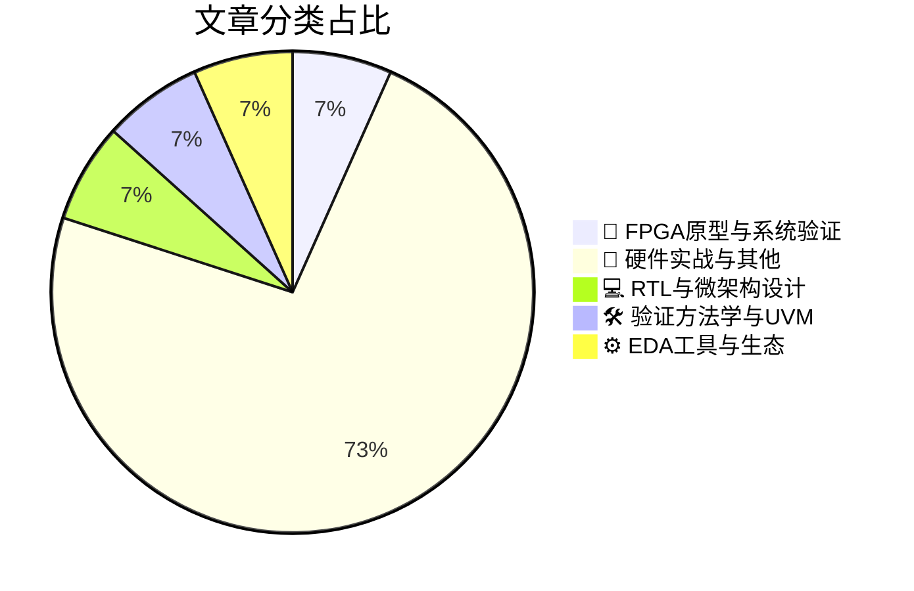

# 🛠️ FPGA / 验证技术精选

> 生成时间：2026-08-24 02:44:27 | 数据范围：过去 96 小时

## 📝 行业视点

数字孪生（Digital Twin）技术正从FPGA原型验证向全栈置信工程（Confidence Engineering）范式演进，通过高保真虚拟化实现系统级行为预判与故障注入，显著压缩硅后调试周期。多智能体系统（Multi-Agent Systems）与UVM方法学的深度融合标志着验证流程的智能化跃迁，利用自主代理实现测试场景生成、覆盖率收敛与回归分析的自动化闭环。先进封装（如Interposer与HBM异构集成）及CFET等新型晶体管结构引入了严峻的热-电-机械耦合可靠性挑战，迫使物理验证从传统DRC/LVS向多物理场协同 sign-off 转型。面向能效AI计算的RTL/微架构极致优化需求，催生了功耗-性能联合约束下的形式化验证与动态仿真融合新方法。汽车安全关键软件（ISO 26262）的复杂性激增则推动EDA工具链向功能安全驱动的自动代码生成与故障覆盖率量化方向迭代。

---

## 🏆 深度必读 (Top 3)

### 1. [从数字孪生到置信工程——与是德科技首席技术官Jonathan Wright的深度对话](https://www.eejournal.com/fish_fry/from-digital-twins-to-confidence-engineering-a-deep-dive-with-keysight-chief-technologist-jonathan-wright/)
**评分**: 7/10 | **分类**: 🔬 FPGA原型与系统验证 | **标签**: `Digital Twin` `Virtual Prototyping` `System-Level Verification` `Hardware-in-the-Loop` `Confidence Engineering`

> **💡 推荐理由**：该文为验证架构师提供了从'功能正确'向'置信可量化'转型的系统方法论，特别是在处理先进封装、多物理域协同验证等复杂场景时，其提出的数字孪生驱动验证架构可有效降低硅后失效风险。对于面临 sign-off 决策困难的团队，文中关于置信度建模与数据驱动验证覆盖的技术实践具有直接参考价值。

**摘要**：
本文探讨了数字孪生技术如何革新传统IC验证范式，提出'置信工程'方法论以系统性解决验证完备性评估难题。文章深入剖析了硅前仿真与物理实现之间存在的置信度鸿沟，阐述了通过高保真建模与实时数据融合构建虚拟验证环境的技术路径。针对当前多物理域协同验证和异构集成带来的复杂性挑战，作者提出了基于量化置信度的分层验证架构设计思路。最后，文章论证了测试测量数据如何反馈优化验证计划，从而建立从设计到量产的连续性验证闭环。

### 2. [通过中介层设计管理热膨胀与电迁移](https://semiengineering.com/managing-thermal-expansion-and-electromigration-through-interposer-design/)
**评分**: 5/10 | **分类**: 📝 硬件实战与其他 | **标签**: `Interposer` `Thermal Expansion` `Electromigration` `Advanced Packaging` `Physical Constraints`

> **💡 推荐理由**：当前高性能计算与AI芯片广泛采用CoWoS、HBM等2.5D封装技术，验证团队亟需建立涵盖热机械应力与电迁移的跨尺度可靠性验证体系。本文不仅提供了Interposer层级的具体物理设计优化策略，更重要的是构建了连接物理实现与可靠性验证的架构框架，帮助验证工程师建立包含多物理场耦合效应的先进封装 sign-off 标准。对于负责Chiplet集成与异构封装的验证架构师而言，文中提出的协同仿真方法与失效预测模型可有效填补传统功能验证与物理实现之间的可靠性验证鸿沟，是建立下一代3DIC验证流程的关键参考。

**摘要**：
文章聚焦2.5D/3D集成中因热膨胀系数（CTE）失配引发的机械应力集中与电迁移（EM）失效难题，系统阐述了通过硅中介层（Interposer）结构设计缓解可靠性风险的方法论。研究提出了基于材料热力学匹配的微凸点（μBump）布局优化、电源分配网络（PDN）动态电流密度管控及热缓冲层设计等关键技术，有效解决了多芯片封装在温度循环下的界面分层与互连退化问题。针对验证环节，文章建立了热-机械-电多物理场协同仿真模型，填补了传统数字IC验证中缺乏封装级物理效应考量的短板。该研究为Chiplet架构的长期可靠性验证提供了从应力分析到EM寿命预测的标准化 sign-off 流程，并给出了先进封装与芯片协同设计（Co-Design）中可量化的可靠性评估指标。

### 3. [芯片产业一周回顾](https://semiengineering.com/chip-industry-week-in-review-152/)
**评分**: 4/10 | **分类**: 📝 硬件实战与其他 | **标签**: `Industry Trends` `Market Analysis` `Weekly Roundup`

> **💡 推荐理由**：作为验证架构师，建议团队重点关注本文对云原生验证基础设施和Emulation/Prototype融合架构的前瞻分析，其提出的分层验证策略可直接应用于当前多Die芯片的验证规划。文中关于验证左移与形式化验证协同的方法论，对优化验证资源投入、加速验证收敛具有直接指导意义，适合作为验证团队季度技术规划的参考基准。

**摘要**：
本文综述了当前芯片设计复杂度激增背景下的验证架构演进趋势，重点剖析了先进制程SoC在系统级验证阶段面临的覆盖率收敛与功耗验证协同难题。文章探讨了基于UVM的验证环境向云原生架构迁移的技术路径，以及硬件仿真（Emulation）与FPGA原型验证融合平台在缩短验证周期中的关键作用。针对AI芯片和Chiplet架构的兴起，文中提出了异构计算环境下的分层验证策略，解决了传统验证方法在处理大规模并行计算单元时的效率瓶颈。此外，文章还分析了验证左移（Shift-left）实践中形式化验证与仿真验证的协同机制，为验证团队提供了从IP级到系统级的完整验证闭环架构设计思路。

---

## 📊 资讯分布与高频标签

## 📋 更多分类好文

### 💻 RTL与微架构设计

- [**高效能AI计算的三项战略要务**](https://semiengineering.com/three-strategic-imperatives-for-energy-efficient-ai-computing/) - *semiengineering.com* (4分)
  > 文章系统阐述了应对AI计算能耗挑战的三大核心战略：算法-硬件协同优化（包括稀疏计算与动态精度调整）、先进制程与三维封装集成、以及系统级自适应能效管理。针对IC验证环节，文章深入剖析了多电压域切换、动态功耗门控和近似计算引入的功能正确性验证复杂性，以及稀疏算子在不同激活模式下的覆盖率保证难题。作者特别强调了在存算一体架构中，模拟计算单元与数字控制逻辑混合验证的 sign-off 标准制定问题。文章还探讨了硅后验证阶段如何建立准确的功耗模型以校准架构级功耗估计，为验证团队在低功耗AI芯片的全流程验证规划提供了关键架构洞察。

### 🛠️ 验证方法学与UVM

- [**Agentrys实战指南：30分钟快速构建多智能体验证系统**](https://semiwiki.com/eda/agentrys/372384-agentrys-shows-you-how-to-build-a-multi-agent-system-in-30-minutes/) - *semiwiki.com* (4分)
  > 本文针对传统IC/FPGA验证平台中多代理环境搭建周期长、组件间耦合度高的痛点，提出了基于Agentrys框架的快速构建方法论。文章详细演示了如何在30分钟内完成从基础配置到多智能体协同验证的完整流程，解决了复杂SoC验证中多协议接口并发控制与资源调度的架构设计难题。通过模块化的智能体封装和标准化的通信机制，该方法实现了验证组件的高度解耦与灵活复用。其实战案例特别适用于需要快速迭代的集成验证场景，能够显著降低多代理系统的维护成本并提升测试吞吐量。

### ⚙️ EDA工具与生态

- [**TASKING团队赢得AWS黑客马拉松大奖，展示汽车安全关键软件开发的云端验证未来**](https://www.eejournal.com/industry_news/with-aws-hackathon-win-tasking-led-team-demonstrates-the-future-of-automotive-safety-critical-software-development/) - *eejournal.com* (4分)
  > 该文介绍了TASKING领导的团队在AWS黑客马拉松中获胜的方案，其核心是构建了面向汽车安全关键系统的云原生验证架构，解决了传统车载软件开发中硬件在环（HIL）仿真资源受限、回归测试周期冗长及ISO 26262功能安全合规验证成本高昂的痛点。通过利用AWS弹性计算集群，该团队实现了虚拟ECU的大规模并行仿真与持续验证（Continuous Testing）流程，显著提升了复杂自动驾驶软件的安全覆盖率与验证吞吐量。该架构采用软硬件协同验证方法，将传统FPGA/硬件仿真能力迁移至云端，为应对车规级芯片日益增长的功能安全验证需求提供了可扩展的分布式解决方案，代表了汽车电子验证从本地硬件依赖向云原生范式转型的技术趋势。

### 📝 硬件实战与其他

- [**勿废弃，善挽救：现代半导体制造中的前馈控制**](https://semiengineering.com/dont-scrap-it-save-it-feedforward-control-for-modern-semiconductor-manufacturing/) - *semiengineering.com* (3分)
  > 文章针对先进制程节点下因工艺偏差导致芯片良率损失和测试成本激增的痛点，提出将前馈控制（Feedforward Control）机制引入半导体制造与测试流程。与传统反馈控制不同，该方法通过在制造早期阶段实时采集关键工艺参数，预测性地调整后续测试阈值或修复策略，从而避免将仅存在轻微偏差的边际芯片（Marginal Die）直接报废。文章详细阐述了如何在现代异构集成和先进封装环境中部署该架构，以动态挽救潜在缺陷芯片并显著降低制造成本。此外，该控制策略为硅后验证（Post-Silicon Validation）提供了更灵活的容错机制，使得验证团队能够在最终测试前识别并纠正系统性偏差。这一方法不仅优化了制造与验证的协同效率，还为高可靠性芯片的自适应测试提供了可扩展的架构设计思路。

- [**从研究到量产：协作是半导体创新的关键**](https://semiengineering.com/from-research-to-production-collaboration-is-key-for-semiconductor-innovation/) - *semiengineering.com* (3分)
  > 本文探讨了半导体领域从学术研究到工业量产转化过程中的关键挑战，特别聚焦于验证环节存在的协作断层问题。文章指出，学术原型与生产级验证环境之间存在显著鸿沟，主要体现在验证方法学的可扩展性、工具链的成熟度以及跨团队知识传递机制上。作者强调了架构师、验证工程师与研究人员早期深度协作的重要性，提出通过建立标准化的验证IP接口规范和联合开发流程，将前沿研究成果有效集成至企业级验证平台。文中还分析了学术界与工业界在验证完备性、收敛标准及资源约束认知上的差异，并给出了具体的协作框架建议，以加速创新技术的产业化落地。

- [**定制HBM业务将如何运作？**](https://semiengineering.com/how-will-the-custom-hbm-business-work/) - *semiengineering.com* (3分)
  > 文章深入剖析了AI芯片驱动下定制化HBM（高带宽内存）的新兴商业模式及其对验证架构的深远影响。核心论证了标准HBM向客户定制规格转变过程中，如何在PHY接口、时序收敛和电源状态机等方面产生架构级差异，进而引发多供应商IP集成兼容性、非标准协议一致性及系统级信号完整性等验证痛点。文章提出通过建立可配置的UVM验证平台、实施分层验证策略（从PHY层到系统级）以及强化早期架构协同设计，来应对定制化带来的测试用例爆炸和回归周期延长问题。特别强调了在定制HBM场景下，验证团队需重新定义硅前/硅后验证边界，并建立覆盖多配置变体的自动化测试流程。最终为解决高性能计算芯片中内存子系统的可扩展验证架构提供了实践指导。

- [**CFET技术打造更优互连新范式**](https://semiengineering.com/cfets-forge-better-connections/) - *semiengineering.com* (3分)
  > CFET（互补场效应晶体管）技术通过垂直堆叠nFET与pFET器件，突破了传统平面架构的微缩极限，但也引入了复杂的三维互连验证挑战。文章针对CFET结构带来的层间寄生参数提取、信号完整性分析及热-电耦合效应等验证痛点，提出了涵盖物理验证、时序签核与可靠性分析的系统化方法论。通过构建支持3D DRC规则检查的新型验证流程和多层协同仿真框架，有效解决了高密度垂直堆叠导致的电源完整性及电磁干扰难题。该架构创新性地整合了TCAD仿真与EDA验证工具链，为2nm及以下先进工艺节点的复杂结构签核提供了可扩展的解决方案。研究表明，该方法显著提升了三维器件的验证收敛效率并降低了后期改版风险。

- [**台积电如何以光互连技术布线AI时代**](https://semiwiki.com/semiconductor-manufacturers/tsmc/372488-how-tsmc-is-wiring-the-ai-era-with-light/) - *semiwiki.com* (3分)
  > 文章阐述了台积电(TSMC)通过硅光技术(Silicon Photonics)和COUPE(Compact Universal Photonic Engine)平台，利用光互连替代传统铜线连接来解决AI芯片面临的带宽墙与功耗瓶颈。该技术核心在于通过光学I/O实现芯粒(Chiplet)间及板级的高速低功耗数据传输，但引入了光电混合信号协同验证、光电器件非线性建模、以及封装级热-光-电多物理场耦合等全新验证痛点。架构层面需解决光电接口标准化、异构集成中的信号完整性(SI)与电源完整性(PI)协同分析、以及高速光链路误码率(BER)的系统级验证方法学问题，这对传统数字验证流程提出了跨域融合的新要求。

- [**新接口简化基于Matter协议的智能家居管理**](https://www.eejournal.com/industry_news/new-interface-simplifies-management-of-matter-powered-smart-homes/) - *eejournal.com* (3分)
  > 该文章针对Matter协议在多协议栈（Thread/Wi-Fi/蓝牙低功耗）集成验证中存在的配置复杂、跨生态系统兼容性测试覆盖不足等痛点，提出了一种新型统一接口架构。通过引入硬件抽象层（HAL）与标准化配置管理模块，该方案解决了传统验证环境中多厂商协议栈（如Apple HomeKit、Google Home、Amazon Alexa）协同验证时环境搭建繁琐、回归测试难以自动化的问题。文章详细阐述了如何利用该接口实现可重用的验证IP（VIP）架构，支持在UVM环境中快速构建跨协议事务（cross-protocol transactions）的测试场景，并提供了针对Matter控制器与终端设备边界条件（corner cases）的验证策略。该设计显著降低了SoC级系统验证的搭建成本，尤其适用于验证团队在芯片集成阶段高效收敛多协议并发交互的时序和功能正确性。

- [**Innatera首席执行官Sumeet Kumar访谈：神经形态芯片的验证架构之道**](https://semiwiki.com/ceo-interviews/371350-ceo-interview-with-sumeet-kumar-of-innatera/) - *semiwiki.com* (2分)
  > 本文深入探讨了Innatera在开发第三代脉冲神经网络（SNN）处理器时面临的混合信号验证挑战，重点阐述了异步数字逻辑与模拟前端集成时的跨域协同验证策略。Sumeet Kumar详细解析了事件驱动架构下传统同步验证工具的局限性，以及团队如何通过定制化的形式验证与混合信号仿真方案解决亚稳态和时序收敛难题。文章还分享了在先进工艺节点下，针对神经形态计算特有的稀疏性与随机脉冲活动模式，构建高效功能验证平台的方法学创新。此外，访谈涵盖了超低功耗边缘AI场景中的功耗验证架构设计，以及算法-硬件协同验证在缩短神经形态芯片上市周期中的关键作用。

- [**AI重塑芯片经济格局，Intel剑指内存市场复兴**](https://semiwiki.com/semiconductor-manufacturers/intel/372371-intel-eyes-a-memory-comeback-as-ai-rewrites-chip-economics/) - *semiwiki.com* (2分)
  > 在AI大模型训练对内存带宽和容量提出指数级增长需求的背景下，Intel正通过发力HBM高带宽内存与CXL互连技术重返内存市场，试图打破制约算力提升的'内存墙'。文章剖析了传统DDR架构在AI工作负载下的带宽瓶颈，以及近存计算架构带来的芯片经济学重构，指出先进封装与异构集成如何改变内存子系统的成本结构。针对验证领域，文章重点揭示了高频宽内存接口（如HBM3E）的信号完整性验证、多Die堆叠的热功耗协同验证，以及CXL协议一致性验证面临的挑战，强调传统功能验证方法难以覆盖AI场景下极端的内存访问模式。文章还探讨了存算一体架构对验证环境提出的新要求，包括模拟真实AI数据流的traffic generator设计，以及跨芯片边界的内存一致性验证复杂度激增问题。

- [**《彩虹六号：围攻》借助Modulate ToxMod将关键毒性语音聊天削减50%**](https://www.eejournal.com/industry_news/tom-clancys-rainbow-six-siege-cuts-critical-toxic-voice-chat-by-50-with-modulates-toxmod/) - *eejournal.com* (2分)
  > 该文介绍了育碧部署Modulate ToxMod实时AI语音审核系统，在《彩虹六号：围攻》中实现关键毒性语音内容50%削减的工程实践。该系统采用流式音频处理架构，针对每秒数千路并发语音流实施上下文感知的实时分类，解决了大规模并发数据通路验证中精度与延迟不可兼得的架构痛点。其分级响应机制（从实时标记到自动处置）展示了如何在关键数据路径上集成复杂AI推理而不引入不可接受的性能开销，为IC验证中实时断言检查、智能覆盖率收敛及假阳性过滤提供了可复用的架构范式。特别是在高吞吐量场景下平衡漏检率（逃逸缺陷）与误报率（验证噪音）的工程权衡，直接对应于现代SoC验证中调试信号完整性与验证收敛效率的核心挑战。

