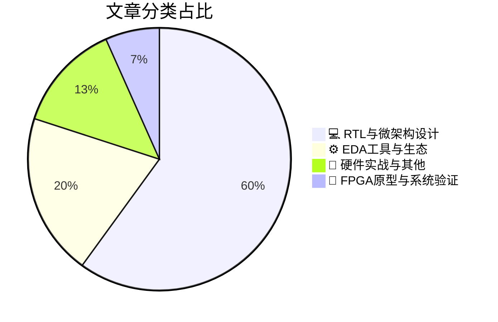

# 🛠️ FPGA / 验证技术精选

> 生成时间：2026-08-31 04:55:27 | 数据范围：过去 96 小时

## 📝 行业视点

近存计算与存内计算架构正成为突破AI内存墙的核心路径，从Samsung的PIM与CXL近存计算设备到Intel Crescent Island的内存扩展方案，配合HBM-HBF混合架构与铁电光互连调优，架构师正通过异构内存层次重构LLM推理的微架构验证边界。EDA工具链正经历AI原生转型，基于机器学习的Post-Route PPA预测、针对2.5D/3D异构集成的开源基准测试套件，以及Agentic AI在开源EDA市场的渗透，标志着物理验证从规则驱动向数据驱动的范式转移。硬件安全验证与可靠性工程在先进节点下的重要性同步凸显，Rowhammer后门注入攻击的RTL级防护与DUV光学系统的十亿级脉冲可靠性测试，结合国防级硬件的TRL评估与分布式GPU的Cycle-Level仿真方法论，共同构成了覆盖硅前验证到战场级边缘部署的全生命周期验证闭环。

---

## 🏆 深度必读 (Top 3)

### 1. [面向LLM推理的混合HBM-HBF架构设计](https://semiengineering.com/hybrid-hbm-hbf-architecture-in-llm-inference-university-of-oxford/)
**评分**: 7/10 | **分类**: 💻 RTL与微架构设计 | **标签**: `HBM` `LLM推理加速器` `存储架构` `高带宽存储器` `AI芯片架构`

> **💡 推荐理由**：验证团队应重点关注此文，因其系统性地阐述了异构内存架构的验证复杂性，特别是跨HBM-HBF数据一致性的形式化验证策略、非对称延迟下的极端边界场景构造方法，以及面向LLM特定访问模式（如KV Cache动态换入换出）的激励生成技术。文中提出的死锁检测框架与性能断言（Assertion）设计模式，对当前AI芯片存储子系统的验证覆盖率提升和调试效率优化具有直接指导价值，有助于团队建立针对多级存储架构的标准化验证流程。

**摘要**：
针对大语言模型推理中HBM容量受限与参数规模激增的矛盾，该文提出了一种混合HBM-HBF（高带宽存储器-高容量闪存/缓冲）架构，通过异构存储分层与动态数据放置策略，在保持高吞吐的同时显著扩展有效存储容量。文章深入探讨了跨域带宽匹配、非对称延迟隐藏及数据预取引擎等关键架构设计，并重点剖析了随之而来的验证挑战，包括多接口协议一致性、跨存储域数据完整性以及复杂调度器的死锁与活锁场景。作者进一步提出了面向异构内存的时序边界条件分析方法与功耗-性能联合验证框架，为AI加速器存储子系统的功能验证与性能 sign-off 提供了可复用的工程方法论。实验表明该架构在接近纯HBM性能的前提下，实现了数倍的有效容量扩展，为超大规模模型部署提供了经济可行的硬件方案。

### 2. [面向AI工作负载的分布式GPU周期级仿真器](https://semiengineering.com/cycle-level-simulator-for-distributed-gpus-for-ai-workloads-purdue/)
**评分**: 7/10 | **分类**: 💻 RTL与微架构设计 | **标签**: `GPU微架构` `周期级仿真` `AI加速器` `分布式系统` `架构验证`

> **💡 推荐理由**：对于数字IC/FPGA验证团队，该仿真器提供了介于高抽象性能模型与底层RTL仿真之间的关键验证层，特别适合早期架构验证和Corner Case挖掘。验证团队可利用此工具在RTL冻结前验证分布式一致性协议、网络死锁场景及极端负载下的时序行为，避免后期芯片级验证中发现架构级缺陷导致的高昂返工成本。此外，其周期级精度支持生成准确的参考模型（Reference Model），用于后续RTL仿真的结果比对和性能回归测试，显著提升复杂GPU集群验证的收敛效率。

**摘要**：
本文针对大规模分布式GPU集群在AI训练/推理场景下的架构验证难题，提出了一种高精度周期级仿真框架。传统RTL仿真无法扩展到数千GPU规模的系统级验证，而高抽象级模拟又难以准确捕捉网络拥塞、内存一致性和计算-通信重叠等关键时序问题。该工作通过创新的并行仿真引擎和针对AI工作负载特性的计算抽象，实现了在保持周期级精度的同时大幅提升仿真吞吐率。文章解决了分布式AI加速器架构设计中缺乏有效前置验证平台的痛点，使得在硬件实现前评估不同互联拓扑、调度策略和内存层次结构的性能瓶颈成为可能。该仿真器支持全栈软件运行，为软硬件协同优化提供了关键的基础设施。

### 3. [推理阶段的Rowhammer后门注入攻击（美国东北大学）](https://semiengineering.com/rowhammer-backdoor-injection-attack-during-inference-northeastern/)
**评分**: 7/10 | **分类**: 💻 RTL与微架构设计 | **标签**: `Rowhammer` `硬件安全` `AI加速器` `内存控制器` `故障注入`

> **💡 推荐理由**：对于AI芯片验证团队，此文提供了关键的安全验证维度——建议参考其攻击场景构建针对DDR/LPDDR接口的故障注入验证IP（VIP），并在系统级验证中增加比特翻转容忍度测试用例，以建立覆盖硬件物理漏洞到算法安全性的全栈验证方案，特别适用于含有片外DRAM的FPGA原型验证和ASIC仿真阶段。

**摘要**：
本文揭示了在AI/ML推理阶段利用Rowhammer硬件漏洞向神经网络注入恶意后门的新型攻击机制，暴露了当前SoC验证流程中物理层内存安全与功能验证脱节的重大缺口。研究指出传统UVM-based验证环境缺乏对DRAM比特翻转故障的精确建模能力，无法有效检测针对模型权重参数的内存扰动攻击。文章提出了硬件-软件协同的对抗验证需求，强调需在建模阶段引入故障注入和噪声模拟，以验证AI加速器在内存位错误下的推理鲁棒性。该工作为验证架构师提供了具体的威胁模型，要求将内存控制器安全验证、ECC有效性测试及推理结果完整性检查纳入标准验证计划，防止硬件物理漏洞被利用破坏算法安全性。

---

## 📊 资讯分布与高频标签

## 📋 更多分类好文

### 💻 RTL与微架构设计

- [**Hot Chips 2026: XCENA与三星的近内存计算CXL设备**](https://chipsandcheese.com/p/hot-chips-2026-xcena-and-samsungs) - *chipsandcheese.com* (7分)
  > 本文介绍了XCENA架构与三星联合开发的近内存计算CXL设备，通过将计算逻辑集成至CXL内存控制器，有效缓解了传统架构中的“内存墙”瓶颈与数据移动能耗问题。针对该异构集成架构，文章深入剖析了CXL 3.0协议栈与近内存计算协同带来的验证复杂性，特别是CXL.mem语义一致性、缓存一致性协议边界条件以及计算单元与内存子系统的并发访问竞态场景。作者提出了基于事务级建模（TLM）与形式化验证相结合的混合验证策略，解决了近内存架构中难以调试的时序违例与数据一致性问题。此外，文章还探讨了CXL Fabric拓扑下多设备互联的验证环境搭建方法，为大规模CXL内存池化（Memory Pooling）提供了可复用的验证IP架构参考。该工作对CXL生态中的计算型内存（CXL Type 3 with Compute）验证方法学具有重要指导意义。

- [**Hot Chips 2026：三星存内计算（PIM）架构设计与验证挑战**](https://chipsandcheese.com/p/hot-chips-2026-samsungs-processing) - *chipsandcheese.com* (7分)
  > 本文介绍了三星在Hot Chips 2026上展示的新一代Processing-in-Memory (PIM)架构，重点解决了传统冯·诺依曼架构中内存墙瓶颈与高能效AI计算的矛盾。文章详细阐述了3D堆叠HBM-PIM的硬件微架构创新，包括bank-level计算单元集成、近存计算数据流优化以及混合精度（FP16/INT8）MAC阵列设计。针对验证领域，作者深入分析了存内计算架构带来的独特挑战：计算-存储边界模糊导致的传统UVM验证环境适配困难、模拟计算单元与数字控制逻辑间的混合信号协同验证、以及新型ISA扩展与遗留内存协议的兼容性验证。文章提出了基于事务级建模（TLM）的软硬件协同验证方法，并讨论了3D封装热效应对时序验证的影响及解决方案。

- [**新月岛：以内存容量重构代理式AI吞吐率**](https://semiwiki.com/semiconductor-manufacturers/intel/372665-crescent-island-turning-memory-capacity-into-agentic-ai-throughput/) - *semiwiki.com* (6分)
  > 本文针对Agentic AI工作负载中内存容量利用率低与计算吞吐率不匹配的核心矛盾，提出Crescent Island架构，通过近内存计算与智能数据放置策略将物理内存容量直接转化为有效AI吞吐能力。文章重点剖析了该架构带来的验证挑战，包括非确定性Agent决策路径下的内存一致性验证、TB级内存池的时序收敛难题，以及容量-带宽转换效率的功能覆盖率建模困境。作者创新性地提出了基于场景驱动的分层验证平台，结合形式化验证与动态仿真，解决了传统UVM方法在验证自适应内存管理策略时的状态空间爆炸问题，为超大规模AI芯片的内存子系统验证提供了可量化的收敛标准。

- [**Hot Chips 2026：专访IBM的Christian Zoellin与Christian Jacobi**](https://chipsandcheese.com/p/hot-chips-2026-interviewing-ibms) - *chipsandcheese.com* (6分)
  > 本文深入探讨了IBM新一代企业级处理器在超大规模集成背景下所面临的验证挑战与架构创新。针对AI加速器与通用计算核心深度集成带来的功能验证复杂性，作者阐述了基于形式验证与高级仿真协同的混合验证策略，有效解决了多芯片模块（MCM）间缓存一致性及数据完整性的验证痛点。文章详细剖析了在数百亿晶体管规模下，如何通过架构级验证规划与硬件-软件协同验证方法学，显著缩短验证收敛周期。此外，访谈还分享了IBM在应对异步时钟域跨越、低功耗状态转换验证等关键微架构挑战时的工程实践与自动化验证平台构建经验。

- [**Hot Chips 2026：Intel Crescent Island多芯粒架构验证解析**](https://chipsandcheese.com/p/hot-chips-2026-intels-crescent-island) - *chipsandcheese.com* (6分)
  > 本文介绍了Intel Crescent Island架构在应对超大规模3D封装芯片验证挑战时的创新方法论。针对多芯粒间互连一致性、跨die电源状态转换及系统级调试等核心痛点，文章提出了分层可扩展的验证架构，通过统一的多物理域仿真平台实现了从硅前验证到硅后调试的无缝衔接。特别地，该工作构建了基于UVM-MS（Multi-Slice）扩展的验证IP重用框架，解决了传统单芯片验证方法在芯粒异构集成场景下的覆盖率缺口问题。此外，文中详述的硬件仿真加速策略将完整系统启动时间从数周缩短至数小时，为复杂封装芯片的验证效率设立了新的行业标杆。

- [**铁电调谐技术减少LLM训练中的光互连停顿**](https://semiengineering.com/ferroelectric-tuning-reduces-optical-interconnect-stalls-in-llm-training-georgia-tech/) - *semiengineering.com* (5分)
  > 文章针对大规模语言模型（LLM）训练集群中光互连链路因温度漂移和工艺偏差导致的带宽降级与通信停顿问题，提出了基于铁电材料的动态调谐架构。该技术利用铁电电容的快速极化切换特性，在纳秒级时间尺度内实时补偿光路损耗和色散，显著降低了GPU间的All-to-All通信延迟。研究揭示了光电混合接口在动态调谐过程中的时序收敛挑战，以及传统静态时序分析方法在处理铁电非线性响应时的局限性，为混合信号验证提出了新的约束条件。文章进一步探讨了光互连系统中动态调谐算法的功能验证策略和故障注入方法，对异构计算芯片的高速光接口验证具有直接的工程指导价值。

### ⚙️ EDA工具与生态

- [**基于宏单元和标准单元布局预测布线后PPA**](https://semiengineering.com/predicting-post-route-ppa-from-macro-and-standard-cell-placements-u-of-alberta/) - *semiengineering.com* (6分)
  > 传统数字IC设计流程中，准确的PPA（功耗、性能、面积）指标必须等到布线完成后才能获取，导致优化迭代周期长且后期返工成本高昂。本文提出了一种基于宏单元和标准单元早期布局信息预测布线后PPA的机器学习方法，通过提取线长、拥塞度和单元密度等物理特征建立预测模型。该方法解决了验证与物理设计团队在早期阶段缺乏准确PPA反馈的痛点，使架构师能在布局阶段就评估时序收敛风险和功耗热点。实验表明该预测模型可在布线前提供高精度的PPA估计，显著缩短设计收敛周期并避免因PPA不达标导致的大规模架构返工。

- [**面向2.5D/3D异构集成物理设计研究的开源基准测试套件（UCLA）**](https://semiengineering.com/open-source-benchmark-suite-for-2-5d-3d-heterogeneous-integration-research-in-physical-design-ucla/) - *semiengineering.com* (6分)
  > 该文针对2.5D/3D异构集成（Chiplet）领域缺乏标准化开源测试载体、物理设计EDA工具在先进封装场景下难以系统验证的痛点，提出了一套完整的开源基准测试套件。该套件提供了涵盖2.5D Interposer、3D堆叠等多种先进封装技术与异构工艺节点的真实设计案例，解决了多芯片集成架构中物理实现算法缺乏公平对比基准、跨工艺节点布局布线流程验证困难等关键架构问题。研究建立了从网表到GDSII的完整物理设计验证环境，包含时序收敛、功耗分析、热完整性及TSV/Bump规划等关键指标的测试向量，为Chiplet物理设计的sign-off流程提供了可复现的标准化验证平台，填补了异构集成物理验证方法论的基础设施空白。

- [**智能体AI能否助力开源EDA市场发展？**](https://semiwiki.com/eda/372107-will-agentic-ai-help-the-open-source-eda-market/) - *semiwiki.com* (5分)
  > 文章探讨了Agentic AI（自主智能体）在开源EDA工具链中的应用前景，重点分析了当前开源验证流程中工具碎片化、脚本集成复杂及学习曲线陡峭等核心痛点。作者提出基于大语言模型的自主代理可自动化完成从RTL编译、测试平台生成到覆盖率分析的端到端验证流程，显著降低开源工具（如Verilator、Cocotb、Yosys等）的使用门槛。通过智能体自主决策能力，可实现验证环境的自动配置、回归测试的智能调度及调试信息的语义化解析，解决开源生态中缺乏全流程自动化支持的架构缺陷。文章还讨论了多智能体协作架构在形式验证、仿真加速及物理验证中的潜在应用，为构建低成本、高效率的验证基础设施提供了新思路。最后评估了该技术对缩小开源与商业EDA工具差距、加速芯片设计民主化的战略价值。

### 📝 硬件实战与其他

- [**五十亿脉冲之后的启示：DUV光学测试对半导体设备正常运行时间的揭示**](https://semiwiki.com/lithography/372789-five-billion-pulses-later-what-duv-optics-testing-reveals-about-semiconductor-tool-uptime/) - *semiwiki.com* (6分)
  > 本文基于DUV光刻光学系统完成的50亿次激光脉冲实测数据，深入剖析了超长期运行验证（long-duration reliability verification）中的关键架构挑战与失效预测难题。文章揭示了传统加速寿命测试难以捕捉的光学涂层渐进退化、热循环疲劳及微污染累积等'长尾'失效机制，提出了融合高频传感器采样与边缘计算的数据采集架构设计。针对验证痛点，作者构建了基于脉冲级粒度的健康状态监测模型，解决了如何在数十亿操作周期内实现实时异常检测与剩余寿命（RUL）预测的技术瓶颈。该研究为验证团队提供了从静态功能验证向动态可靠性数字孪生（digital twin）转型的方法论，特别是在处理高价值半导体设备的长周期MTBF验证和预测性维护策略制定方面具有重要参考价值。

- [**2纳米节点采用BEOL传输门的单片三维6T SRAM**](https://semiengineering.com/m3d-6t-sram-with-beol-pass-gates-at-2nm-georgia-tech-synopsys/) - *semiengineering.com* (4分)
  > 本文提出了在2nm先进工艺节点下，利用单片三维(M3D)集成技术将6T SRAM单元与后段制程(BEOL)传输门相结合的新型存储器架构，有效解决了传统平面SRAM在极先进节点面临的面积密度饱和与读写裕度衰退问题。该架构通过垂直堆叠逻辑层与存储层并采用BEOL材料作为传输门，显著降低了位线电容和字线延迟，但同时引入了3D堆叠的热梯度管理、BEOL器件电学特性漂移以及跨层时序收敛等复杂验证挑战。文章系统阐述了针对BEOL pass-gates的定制SPICE建模与特征化方法、考虑垂直互连寄生参数的静态时序分析(STA)流程，以及基于温度梯度的静态噪声裕度(SNM)与写入裕度(WM)验证方案。此外，文中还探讨了M3D工艺变异对存储阵列良率的影响机制，并提出了相应的统计验证方法与DFT架构优化策略，为先进节点高密度存储器的设计验证提供了完整的解决方案。

### 🔬 FPGA原型与系统验证

- [**从实验室到战场：国防硬件、技术成熟度等级与边缘计算的融合之道**](https://www.eejournal.com/fish_fry/from-lab-to-battlefield-navigating-hardware-trls-and-the-edge-in-defense/) - *eejournal.com* (6分)
  > 本文聚焦国防电子系统从实验室研发向战场实战部署转化过程中的验证架构挑战，深入剖析了硬件技术成熟度等级（TRLs）与FPGA/ASIC验证流程的映射关系，指出实验室理想环境与战场极端条件之间存在严重的验证覆盖鸿沟。文章针对国防边缘计算节点在高可靠性与实时性方面的严苛要求，明确提出了应对高低温、振动、辐射等恶劣环境因素的可靠性验证痛点，以及长时运行稳定性保障的架构设计难题。作者倡导基于TRL的渐进式验证策略，强调在硬件开发早期即引入环境应力筛选（ESS）和加速老化测试，并构建了硬件在环（HIL）仿真与数字孪生相结合的混合验证平台。该方法论特别关注了从TRL 4-6阶段（实验室环境验证）向TRL 7-9阶段（实战环境验证）过渡时的验证完备性缺口，为高可靠性国防芯片的全生命周期验证提供了可落地的技术框架与最佳实践。

