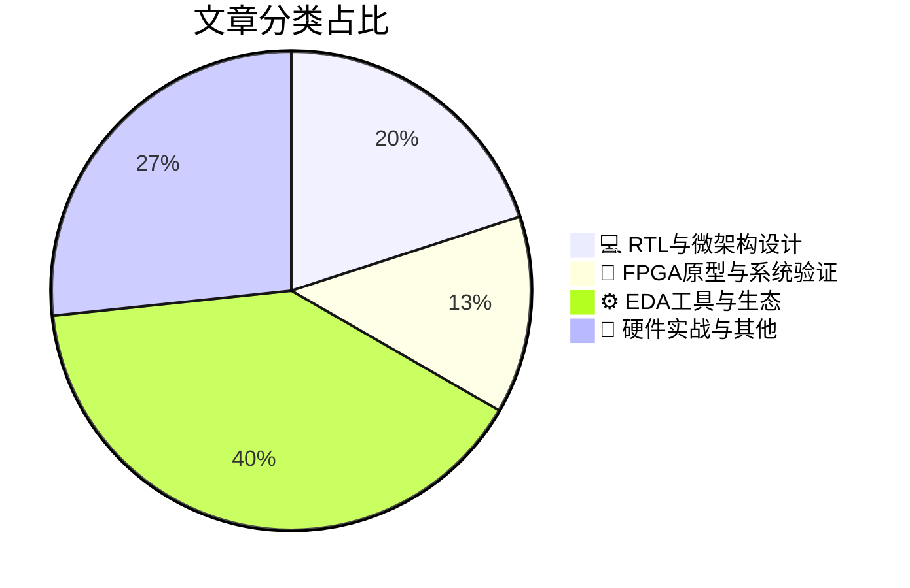

# 🛠️ FPGA / 验证技术精选

> 生成时间：2026-09-03 10:49:36 | 数据范围：过去 96 小时

## 📝 行业视点

基于今日高分文章，当前硬件验证领域呈现三大技术趋势：

**Agentic AI重构EDA全流程**：从辅助工具演进至自主决策代理，通过知识图谱与语义索引驱动测试激励生成、corner case探索及仿真失败诊断，核心挑战在于构建持续自验证机制以确保每个决策在物理约束下闭环验证，而非后置检查——这要求工具接口标准化、设计上下文持久化及流程级评估体系。

**边缘AI安全验证新范式**：针对感知管道的故障注入揭示"静默失败"威胁——系统持续运行但接受错误现实状态，电压毛刺攻击可在商用NPU上实现可重复误分类而不触发异常检测，迫使验证策略从传统功能正确性转向对抗性鲁棒性与跨层故障传播建模。

**Multi-Die架构主导车规级AI**：ADAS/IVI应用驱动异构Chiplet集成，通过复用同构设计突破光罩限制提升良率，同时IBM双ISA核心展示单核原生执行Z/Architecture与ARM的微架构创新，车规安全要求促使Multi-Die方案在设计早期嵌入safety-aware分区与隔离验证流程。

---

## 🏆 深度必读 (Top 3)

### 1. [Hot Chips 2026：专访IBM的Christian Zoellin与Christian Jacobi](https://chipsandcheese.com/p/hot-chips-2026-interviewing-ibms)
**评分**: 7/10 | **分类**: 💻 RTL与微架构设计 | **标签**: `IBM` `微架构` `Hot Chips` `处理器架构`

> **💡 推荐理由**：强烈推荐验证团队阅读，因其精准针对高端处理器验证中的一致性、可扩展性与AI集成痛点给出IBM实战架构方案，能直接提升团队在复杂FPGA/ASIC项目中的验证效率与设计决策能力。

**摘要**：
本文通过Hot Chips 2026访谈，深入剖析IBM专家Christian Zoellin与Christian Jacobi分享的下一代处理器架构验证实践。文章重点解决了大规模多核SoC中缓存一致性协议与内存子系统验证的核心痛点，以及AI加速器集成带来的跨域时序与功耗验证挑战。两位专家详述了基于FPGA原型与混合仿真的可扩展验证架构设计，强调形式化方法在关键安全特性与错误注入场景中的高效应用。同时揭示了如何通过分层验证策略应对复杂互连与动态功耗管理的覆盖率瓶颈。整体为高端数字IC验证提供了可落地的架构洞察与方法论。

### 2. [当边缘AI说谎时：实时感知管道中的故障注入与虚假状态](https://semiengineering.com/fault-injection-and-false-state-in-live-perception-pipelines/)
**评分**: 6/10 | **分类**: 🔬 FPGA原型与系统验证 | **标签**: `Fault Injection` `Edge AI` `Perception Pipeline` `安全验证`

> **💡 推荐理由**：强烈推荐给验证团队，因其精准击中边缘AI感知系统可靠性验证的架构痛点，提供可落地的故障注入与虚假状态检测方法，能显著提升团队在实时流水线鲁棒性、安全验证及覆盖率策略上的专业能力。

**摘要**：
本文聚焦边缘AI实时感知管道中因硬件故障或软错误注入导致AI输出虚假状态（如幻觉检测或漏检）的问题，揭示了这些错误如何悄然传播并误导下游决策。它解决了传统功能验证难以覆盖动态、非确定性AI流水线中故障效应与状态一致性的核心痛点。文章提出针对性的故障注入方法与运行时状态监控架构，用于暴露并缓解虚假感知风险。通过案例展示如何在FPGA/ASIC实现中验证系统鲁棒性，确保边缘设备在恶劣条件下仍保持可靠行为。这对安全关键型应用如自动驾驶感知验证具有直接指导意义。

### 3. [芯片安全签核即将到来——但标准可能不够](https://semiengineering.com/security-sign-off-is-coming-for-chips-but-standards-may-not-be-enough/)
**评分**: 6/10 | **分类**: ⚙️ EDA工具与生态 | **标签**: `Security Sign-Off` `Hardware Security` `Verification Standards` `Chip Security`

> **💡 推荐理由**：推荐验证团队阅读，因其精准指出安全签核趋势下的方法论缺口，帮助团队提前规划安全覆盖策略、工具链升级和架构级安全验证流程，从而应对即将到来的行业强制要求并降低安全漏洞风险。

**摘要**：
文章探讨了硬件安全签核正成为芯片发布的强制性流程，类似于传统功能签核，以应对日益复杂的威胁。然而，现有标准如ISO 21434和Common Criteria在覆盖现代SoC的侧信道攻击、故障注入及供应链风险方面存在明显不足。核心验证痛点包括缺乏统一的安全属性覆盖度量、形式化安全证明工具链不完善，以及安全验证与功能验证流程的割裂。文章强调需构建超越标准的定制化验证架构，集成威胁建模、早期安全检查点和端到端攻击场景仿真。这要求验证团队在架构设计阶段即嵌入安全签核机制，避免后期高成本返工并提升整体芯片鲁棒性。

---

## 📊 资讯分布与高频标签

## 📋 更多分类好文

### 💻 RTL与微架构设计

- [**面向汽车应用的多Die设计**](https://semiengineering.com/multi-die-design-for-automotive-applications/) - *semiengineering.com* (6分)
  > 本文探讨了多Die（多裸片）架构在汽车电子中的应用，重点解决了传统单芯片SoC在高性能计算、功耗效率和系统集成度上的瓶颈问题。文章深入分析了多Die设计中的关键验证痛点，包括Die-to-Die高速互连的信号完整性、时序收敛以及跨Die功能一致性验证难题。针对汽车严苛环境下的高可靠性与功能安全需求（如ISO 26262 ASIL等级），提出了分层验证策略、热-电协同仿真方法和冗余架构优化方案。此外，还讨论了多Die系统的DFT扩展、功耗完整性验证以及大规模仿真/仿真加速技术，以应对验证复杂度爆炸式增长的挑战。通过实际案例，展示了如何构建可扩展的验证环境，确保多Die汽车芯片从原型到量产的可靠交付。

- [**Hot Chips 2026：XCENA与三星的近内存计算CXL设备**](https://chipsandcheese.com/p/hot-chips-2026-xcena-and-samsungs) - *chipsandcheese.com* (6分)
  > 本文介绍了XCENA与三星在Hot Chips 2026上联合展示的近内存计算CXL设备架构，通过将计算单元紧密集成到内存侧并利用CXL接口实现高效数据访问，直接解决了传统CPU/GPU与内存间数据搬运导致的带宽瓶颈与高延迟问题。该设计针对AI/HPC工作负载优化了近存加速逻辑与CXL.mem/CXL.cache协议扩展，显著降低系统功耗与数据移动开销。文章重点剖析了多芯片CXL互连一致性、近存计算单元的功能正确性以及动态负载下的性能可扩展性等架构挑战。从验证视角，它明确指出了CXL协议合规性验证、近存逻辑与主机侧缓存一致性检查、以及FPGA原型中的时序与功耗协同验证等核心痛点，并提供了相应的验证策略与覆盖率方法。整体为验证团队展示了如何构建针对新兴近存CXL设备的分层验证环境。

### ⚙️ EDA工具与生态

- [**构建从半导体创意到商业硅片的更快路径**](https://semiwiki.com/semiconductor-services/silicon-catalyst/372828-building-a-faster-path-from-semiconductor-idea-to-commercial-silicon/) - *semiwiki.com* (6分)
  > 本文聚焦半导体从创意到商用硅片的漫长路径中，验证环节成为主要瓶颈的问题，包括传统仿真速度过慢、复杂SoC覆盖率收敛困难、调试迭代周期长以及首次硅成功率低等痛点。文章提出了一种加速验证架构，通过硬件辅助验证（仿真/原型）、形式验证与AI驱动的智能回归相结合，实现真正的左移验证和可扩展平台设计。它解决了验证环境碎片化、资源利用率低以及跨团队协作效率差的架构设计难题。通过实际案例展示了如何将验证周期缩短数倍，并提升硅前缺陷发现率。最终给出了可落地的验证方法论与工具链整合建议，帮助团队从想法快速通向商业硅片。

- [**为什么Agentic AI可能重新定义设计与验证的未来**](https://blogs.sw.siemens.com/verificationhorizons/2026/08/31/why-agentic-ai-could-redefine-the-future-of-design-and-verification/) - *blogs.sw.siemens.com* (5分)
  > 文章指出当前芯片设计复杂度（AI加速器、Chiplet、3D IC）的增长速度已超越传统EDA工具的扩展能力，验证团队面临TB级波形数据和数百万条覆盖率点的挑战，单个设计师往往需要6名验证工程师支持。Agentic AI通过多智能体协同架构，能够跨RTL、波形、仿真日志、UVM环境、断言和覆盖率数据库进行推理，自动执行回归分类、根因分析、测试平台生成等重复性任务。不同于传统脚本或孤立AI助手，Agentic系统可自主链接任务、评估输出并迭代改进，已有团队报告3-10倍生产力提升。核心突破在于将工程师角色从代码编写者转变为架构审查者，通过多智能体并行探索设计空间并呈现最优方案供人类决策。

- [**电子书 — 加速物理AI的硅芯片设计（第一部分）**](https://semiengineering.com/ebook-accelerate-silicon-design-for-physical-ai-part-1/) - *semiengineering.com* (4分)
  > 本文探讨了物理AI芯片（如用于机器人、自动驾驶等实时边缘推理场景）在硅设计阶段面临的验证挑战。重点关注高算力AI加速器的功耗、时序收敛和片上互连架构验证问题，提出通过早期架构探索、多层级验证策略和物理感知设计方法来缩短设计周期。文章强调了在物理AI场景下，传统验证流程需要针对实时性、能效比和多模态数据流进行针对性优化。同时讨论了如何在前端验证阶段引入物理实现约束，以减少后端迭代成本。

- [**智能系统的演进：从优化到自动化再到AI**](https://semiengineering.com/the-evolution-of-intelligent-systems-from-optimization-to-automation-to-ai/) - *semiengineering.com* (4分)
  > 文章阐述了半导体工程方法论正在经历从优化、自动化到AI驱动的三阶段演进。传统的信号完整性和电源完整性分析方法已无法满足现代设计需求，需要转向集成化的智能系统来增强决策能力、执行效率和适应性。文章强调这三个领域（优化、自动化、AI）并非孤立发展，而是相互关联、逐步深化的技术演进路径。通过AI技术的引入，工程团队能够从重复性任务中解放出来，将精力集中在更高层次的架构设计和创新上。这种演进对芯片设计、3D-IC封装、PCB设计以及整个电子系统的热分析都带来了革命性影响。

- [**Agent AI 如何将 IC 工程师转变为架构师**](https://semiwiki.com/eda/chipagents-ai/372781-how-agentic-ai-turns-ic-engineers-into-architects/) - *semiwiki.com* (4分)
  > 文章探讨了 Agentic AI 工具如何从简单的代码补全演进为能够理解自然语言需求、检查代码库、自主修改并迭代的智能代理。这种转变使 IC 工程师能够从编写底层验证代码的执行者，转变为专注于架构决策和系统级思考的架构师角色。AI 代理通过自动化验证任务的实现细节，让工程师将精力集中在定义验证策略、识别覆盖率缺口和做出关键技术决策上。文章指出这不仅提升了生产效率，更重要的是改变了工程师的工作模式和技能要求，使他们能够承担原本属于资深架构师的职责。

### 🔬 FPGA原型与系统验证

- [**MicroZed Chronicles：图像处理算法一览**](https://www.adiuvoengineering.com/post/microzed-chronicles-a-look-at-image-processing-algorithms) - *adiuvoengineering.com* (6分)
  > 本文深入探讨了在MicroZed/Zynq平台上实现常见图像处理算法（如卷积滤波、边缘检测、颜色空间转换等）的FPGA架构设计与验证方法。文章重点解决了验证团队在图像处理流水线中面临的实时数据流同步、算法硬件正确性验证以及资源/性能权衡等痛点。通过具体示例展示了如何使用Vivado HLS进行高层次综合，并构建高效的验证环境（包括仿真与硬件在环测试）。它还分析了像素级处理中的延迟、吞吐量和内存带宽挑战，提供了可复用的架构模式。整体为数字IC/FPGA验证工程师提供了从算法到硬件落地的完整验证思路。

### 📝 硬件实战与其他

- [**量子计算时代的安全**](https://semiengineering.com/security-in-the-era-of-quantum-computing/) - *semiengineering.com* (4分)
  > 文章探讨了量子计算对现有密码学体系带来的颠覆性威胁，特别是RSA和椭圆曲线等公钥加密算法在量子算法（如Shor算法）面前的脆弱性。针对硬件验证领域，文章指出了后量子密码学（PQC）算法在芯片级实现时面临的验证挑战，包括抗量子攻击的密码IP核功能验证、时序和功耗约束下的安全性验证，以及传统加密模块向PQC迁移过程中的兼容性测试。文章强调在Q-Day（量子计算机破解现有加密的时间点，预计2035年前后）到来前，验证团队需要建立针对格基、哈希基等新型密码算法的验证框架和测试基础设施。

- [**Research Bits: Sept. 1**](https://semiengineering.com/research-bits-sep-1/) - *semiengineering.com* (4分)
  > 摘要生成失败。

- [**通过显著的功耗和性能提升扩展18A工艺**](https://semiengineering.com/extending-18a-with-significant-power-and-performance-gains/) - *semiengineering.com* (3分)
  > 本文介绍Intel 18A-P工艺节点，这是18A系列首个性能增强版本，通过协同优化晶体管、互连和设计技术实现了在相同功耗下性能提升超过9%或在相同性能下功耗降低超过18%。该工艺针对AI、移动和数据中心应用，将芯片级热阻降低20-40%，并提供10-30%的设计灵活性改进。18A-P作为18A的直接升级方案已进入风险量产阶段，将应用于Panther Lake和Xeon 6+等产品。这为验证团队带来了新的PPA（Power-Performance-Area）权衡验证场景，需要在多个工艺角点下验证热管理和时序收敛。

- [**imec报告：推进基于CFET的器件路线图**](https://semiengineering.com/advancing-the-cfet-based-device-roadmap-novel-integration-modules-and-standard-cell-configurations/) - *semiengineering.com* (3分)
  > 文章介绍了imec在互补场效应晶体管(CFET)架构方面的最新进展，CFET通过垂直堆叠n型和p型晶体管突破了传统平面布局的面积限制。imec提出了可扩展的顺序CFET架构，支持分离栅极和共用栅极两种器件配置，同时展示了首个功能性单片CFET器件，采用堆叠式上下触点结构，在18nm栅极长度和60nm栅极间距下实现集成。该架构通过外壁forksheet设计改善了栅极控制能力，解决了从纳米片晶体管向CFET过渡的工艺复杂性问题。研究还探讨了将2D材料引入CFET沟道以进一步延伸逻辑工艺路线图的可能性，为1nm及更先进节点的标准单元库设计和SRAM缩放提供了关键技术路径。

