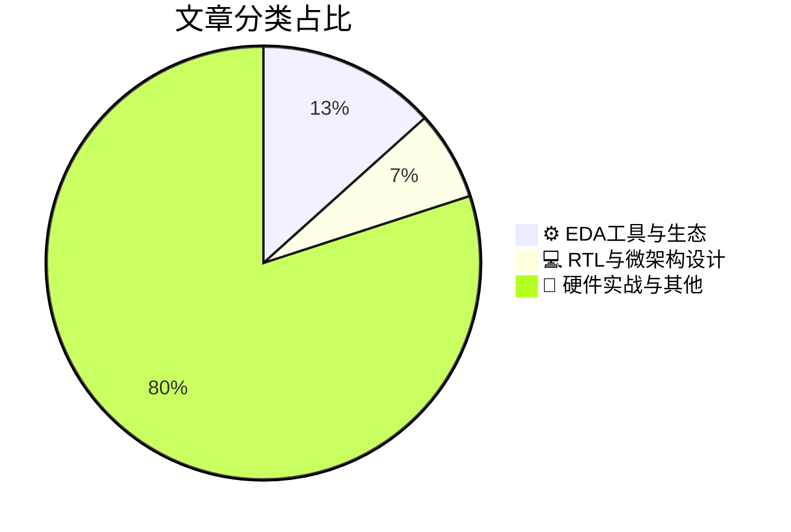

# 🛠️ FPGA / 验证技术精选

> 生成时间：2026-09-07 04:27:38 | 数据范围：过去 96 小时

## 📝 行业视点

作为硬件验证专家，基于今日高分文章，提炼出三大硬核技术趋势：EDA工具正从传统优化范式跃迁至AI驱动的智能工程，机器学习预测器大幅压缩设计实验迭代次数，加速验证闭环与收敛效率；AI系统部署迫使安全架构重构，内联内存加密必须叠加完整性保护以抵御SoC外威胁，物理AI、人形计算及数据中心信任边界远超传统AV复杂度；先进封装在TSMC/Intel/Samsung间激烈博弈，叠加Arm垄断下的RISC-V IP生态反击与800VDC AI数据中心电源可靠性挑战，共同推高验证覆盖率与异构集成风险管控门槛。

---

## 🏆 深度必读 (Top 3)

### 1. [智能工程：从优化到人工智能](https://semiengineering.com/intelligent-engineering-from-optimization-to-ai/)
**评分**: 5/10 | **分类**: ⚙️ EDA工具与生态 | **标签**: `AI optimization` `intelligent engineering` `EDA AI` `design automation`

> **💡 推荐理由**：推荐给验证团队，因其精准针对覆盖率闭合、测试生成效率和调试瓶颈等核心痛点，提供从传统优化向AI智能验证架构转型的实用洞察与落地思路，有助于团队构建更高效、自适应的验证体系。

**摘要**：
本文探讨了工程领域从传统优化方法向人工智能驱动的智能工程的演变过程。文章重点指出了数字IC/FPGA验证中传统优化技术面临的痛点，如设计空间爆炸导致的覆盖率收敛困难、随机测试效率低下以及回归调试周期过长等问题。通过引入机器学习与深度学习等AI技术，可实现智能测试激励生成、关键路径预测和异常自动检测，从而优化验证架构。文章解决了如何将AI无缝集成到现有验证流程中以提升自动化水平和减少人工干预的架构设计挑战。最终展示了AI如何从辅助优化工具转变为核心智能决策引擎，显著提高验证生产力与质量。

### 2. [保护SoC之外的关键任务数据：为什么内联内存加密需要完整性](https://semiengineering.com/protecting-mission-critical-data-beyond-the-soc-why-inline-memory-encryption-needs-integrity/)
**评分**: 5/10 | **分类**: 💻 RTL与微架构设计 | **标签**: `Inline Memory Encryption` `Data Integrity` `SoC Security` `Memory Protection`

> **💡 推荐理由**：推荐给验证团队，因其精准定位了内存加密与完整性结合的架构验证挑战，有助于设计覆盖功能正确性、安全属性和攻击场景的全面测试平台，显著提升关键系统验证覆盖率和可靠性。

**摘要**：
文章指出仅靠加密无法充分保护SoC外部关键任务数据，必须引入完整性机制以检测篡改和重放攻击。它深入分析了内联内存加密架构设计中的核心问题，包括性能开销、延迟与安全强度的权衡。针对验证痛点，文章强调如何验证加密引擎与完整性检查（如MAC或哈希树）的正确交互，避免侧信道泄漏和协议漏洞。通过具体案例说明，完整性保护如何增强对物理探测和总线攻击的抵抗力。这为验证工程师提供了构建安全内存子系统测试策略的实用指导。

### 3. [在物理AI系统中构建信任](https://semiengineering.com/building-trust-into-physical-ai-systems/)
**评分**: 5/10 | **分类**: 📝 硬件实战与其他 | **标签**: `Physical AI` `Trustworthy Systems` `Safety Verification` `System Reliability`

> **💡 推荐理由**：强烈推荐给数字IC/FPGA验证团队，因为文章精准剖析了物理AI硬件验证的独特痛点（如AI不确定性与物理实时性冲突），并给出实用的架构设计和验证流程建议，能直接帮助团队应对新兴边缘AI/机器人芯片项目中的安全与信任挑战，提升验证效率和系统可信度。

**摘要**：
文章针对物理AI系统（如机器人、自动驾驶和边缘智能硬件）中信任构建的核心挑战，指出传统数字IC/FPGA验证方法难以应对AI模型的非确定性、物理环境交互的复杂性和实时安全约束。它重点解决了验证痛点：如何在硬件加速器、传感器融合和控制系统中确保功能安全、鲁棒性和可解释性，避免黑盒AI带来的信任缺口。提出了分层验证架构，结合形式化方法、硬件仿真、数字孪生和运行时监控，从RTL到系统级嵌入信任机制。强调早期架构设计阶段集成验证策略，以覆盖corner cases和物理故障注入。最终通过案例展示如何提升物理AI系统的可靠性和合规性，为验证工程师提供可落地的方法论。

---

## 📊 资讯分布与高频标签

## 📋 更多分类好文

### ⚙️ EDA工具与生态

- [**机器学习预测器实际需要多少设计实验？**](https://semiengineering.com/how-many-design-experiments-does-a-machine-learning-predictor-actually-need/) - *semiengineering.com* (5分)
  > 本文针对数字IC/FPGA设计空间探索中机器学习预测器的样本效率问题，系统分析了训练准确PPA（功耗、性能、面积）预测模型实际所需的最少设计实验数量。文章直击验证与架构设计的核心痛点：每次综合、布局布线或仿真实验成本极高，导致无法充分采样设计空间，传统暴力实验方法不可扩展。通过对比随机采样、主动学习与贝叶斯优化等策略，作者量化证明仅需数十到数百个精心选择的设计点即可构建可靠预测器，远低于直觉预期。研究结果为验证架构师提供了可落地的数据预算指导，显著降低探索阶段的计算开销。文章进一步讨论了预测不确定性量化与迁移学习在跨工艺/跨设计复用中的价值，帮助团队在有限验证资源下加速架构决策与参数调优。

### 📝 硬件实战与其他

- [**人形机器人计算与安全比自动驾驶汽车更复杂**](https://semiengineering.com/humanoid-compute-security-more-complex-than-avs/) - *semiengineering.com* (4分)
  > 文章对比人形机器人与自动驾驶车辆（AVs），指出人形机器人在异构计算架构、多模态传感器融合、实时运动控制与AI推理方面的复杂度远超AVs，带来更严峻的验证挑战。核心痛点包括验证高度动态的全身协调系统、确保功能安全与实时性在复杂物理交互中的一致性，以及处理更广泛的攻击面（如物理接触、边缘设备暴露）。架构设计上需应对分布式异构SoC/FPGA集群的功耗、延迟与可靠性权衡，同时强化硬件信任根与运行时安全监控。验证团队面临覆盖率不足、仿真加速困难及安全漏洞建模难题，文章强调需从AV经验迁移并扩展至机器人特有场景。这些复杂性要求新的验证方法论，如形式化验证结合硬件在环（HIL）与数字孪生。

- [**AI正迫使数据中心重新思考信任**](https://semiengineering.com/ai-is-forcing-data-centers-to-rethink-trust/) - *semiengineering.com* (4分)
  > 文章分析了AI工作负载爆发如何迫使数据中心重新审视硬件信任模型，特别是在GPU、ASIC加速器和异构计算平台中。核心验证痛点在于确保复杂AI芯片的供应链完整性、无硬件后门以及机密计算环境的安全属性验证。架构设计问题聚焦于重新构建Root of Trust、可信执行环境和多芯片互连的信任边界，以应对AI动态负载和规模扩展。验证团队需强化形式化方法、安全属性断言和侧信道防护验证，以证明硬件可信度。文章还强调了FPGA/ASIC加速器在数据中心部署中的信任验证挑战，推动从传统功能验证向安全信任验证的范式转变。

- [**台积电、英特尔Foundry与三星Foundry先进封装技术对比**](https://semiwiki.com/3dic/372087-comparing-advanced-packaging-from-tsmc-intel-foundry-and-samsung-foundry/) - *semiwiki.com* (4分)
  > 文章系统对比了TSMC的CoWoS/InFO、Intel的EMIB/Foveros以及Samsung的I-Cube/X-Cube等先进封装方案在互连密度、带宽、功耗和热管理上的架构差异与权衡。它深入剖析了chiplet多die集成中die-to-die接口（如UCIe）的协议一致性、跨die时钟域交叉和电源域隔离等关键验证痛点。针对3D堆叠和2.5D中介层，文章指出了信号完整性、时序收敛以及DFT可测试性在封装层级面临的架构设计挑战。通过量化比较不同Foundry方案对FPGA/ASIC良率和性能的影响，揭示了如何选择封装以缓解单片SoC的面积与成本瓶颈。这些分析直接指导验证团队构建分层验证环境，覆盖多die协同仿真与系统级可靠性测试。最终帮助架构师优化验证策略，提升先进封装芯片的覆盖率和上市效率。

- [**芯片产业一周回顾**](https://semiengineering.com/chip-industry-week-in-review-154/) - *semiengineering.com* (3分)
  > 本文作为芯片产业周报，系统梳理了本周在先进节点、AI加速器和异构集成领域的关键动态，重点剖析了数字IC/FPGA验证中的核心痛点。文章指出，随着设计复杂度激增，传统UVM仿真面临覆盖率收敛慢、回归时间过长的架构瓶颈，尤其在多时钟域和低功耗场景下验证完备性难以保证。针对这些问题，报告强调了形式验证与硬件加速仿真协同架构的必要性，以缓解FPGA原型验证中的调试可见性不足。同时讨论了验证IP复用和智能覆盖驱动方法在SoC级验证中的落地挑战。总体来看，文章为验证架构师提供了应对硅前风险的具体设计思路。

- [**800VDC AI数据中心中可能出现的问题**](https://semiengineering.com/what-can-go-wrong-in-800vdc-ai-data-centers/) - *semiengineering.com* (3分)
  > 文章深入分析了800VDC高压直流供电在AI数据中心应用中的潜在故障模式，包括绝缘击穿、电弧闪络、瞬态过压以及功率分配网络的可靠性问题。它重点揭示了电源架构设计中的关键挑战，如高功率密度下的热管理和故障保护机制不足。针对数字IC/FPGA验证痛点，文章指出了高压监控逻辑、安全联锁系统和电源管理接口验证中的难点，例如故障注入覆盖率低、混合信号时序验证复杂以及EMI对数字信号完整性的影响。此外，还讨论了如何通过系统级仿真和硬件加速验证来提前暴露这些架构缺陷。这些内容直接针对AI加速器芯片在极端电源环境下的验证盲区。

- [**IN2FAB公司CEO Timothy Regan访谈**](https://semiwiki.com/ceo-interviews/372531-ceo-interview-with-timothy-regan-of-in2fab/) - *semiwiki.com* (3分)
  > 本文通过采访IN2FAB的CEO Timothy Regan，深入探讨了数字IC与FPGA验证架构中的核心挑战。文章重点指出当前验证流程在处理复杂异构IP集成、多时钟域同步以及仿真性能瓶颈时的具体痛点，如覆盖率收敛困难和调试周期过长。Regan分享了IN2FAB在构建可扩展验证环境方面的实践经验，强调采用模块化UVM架构与自动化回归框架来提升效率。讨论还涉及如何通过早期架构级验证和硬件加速技术解决资源受限下的可重用性问题。整体上，文章为验证团队提供了针对FPGA/ASIC设计迭代加速的实用架构洞察。

- [**95亿美元设计IP市场：边界转移、Arm的垄断与RISC-V的回应**](https://semiwiki.com/ip/373010-the-9-5-billion-design-ip-market-shifting-boundaries-arms-monopoly-and-the-risc-v-response/) - *semiwiki.com* (3分)
  > 文章剖析了价值95亿美元的设计IP市场格局，聚焦边界转移（如软硬IP融合与垂直整合）、Arm在CPU/处理器IP的长期垄断地位，以及RISC-V开源生态的快速崛起与挑战。它揭示了这些市场动态如何重塑SoC架构设计决策，尤其是IP选型、可定制性与生态系统依赖问题。针对验证痛点，文章明确指出Arm IP验证虽成熟但成本高昂且封闭，而RISC-V则带来ISA合规性验证、自定义扩展形式验证、开源IP质量不确定性及多核一致性检查等新挑战。验证架构师需应对IP集成时的接口协议覆盖不足、仿真加速与形式方法结合难题。整体强调在架构设计中平衡性能、成本与验证复杂度，以应对异构IP集成的可靠性风险。

- [**Chronova公司走出隐身模式，宣布收购英特尔精密定时项目**](https://www.eejournal.com/industry_news/chronova-corp-comes-out-of-stealth-announces-acquisition-of-intel-precision-timing-project-2/) - *eejournal.com* (3分)
  > Chronova Corp正式走出隐身模式，宣布收购英特尔精密定时（Precision Timing）项目，将其高精度时钟生成、同步与抖动控制技术整合到自身平台。该技术直接针对数字IC/FPGA验证中的核心痛点：多时钟域交叉（CDC）验证困难、相位噪声与抖动导致的时序不确定性、以及高精度同步场景下仿真模型不准确的问题。通过引入硬件级精密定时IP与配套验证环境，架构师可更精确地建模时钟树、约束时序路径，并提升形式验证与仿真覆盖率。文章还阐述了新架构如何简化SerDes、5G/通信及高性能计算芯片中的定时关键路径验证流程，减少因时钟不确定性引发的硅后失败风险。整体方案为验证团队提供了从RTL到门级的端到端定时验证增强能力。

- [**延续太空探索的遗产：NASA的南希·格雷斯·罗曼太空望远镜**](https://semiengineering.com/continuing-a-legacy-of-space-exploration-nasas-nancy-grace-roman-space-telescope/) - *semiengineering.com* (2分)
  > 本文深入探讨了NASA南希·格雷斯·罗曼太空望远镜的数字IC与FPGA架构设计及验证挑战，重点解决了太空辐射环境下高可靠性系统的验证痛点。文章详细阐述了如何通过辐射硬化设计、SEU缓解技术和形式验证方法，确保FPGA在极端条件下的功能正确性与容错能力。它针对复杂仪器控制系统的架构问题，提出了覆盖率驱动验证与断言基验证的优化策略，以应对多时钟域和高速接口的验证难题。验证流程强调了仿真加速与硬件在环测试的结合，有效提升了空间应用中的验证效率与覆盖率。最终，这些方法延续了哈勃望远镜的技术遗产，为高精度宇宙观测提供了坚实的数字基础。

- [**Delmic公司CEO Sander den Hoedt访谈**](https://semiwiki.com/ceo-interviews/372406-ceo-interview-with-sander-den-hoedt-of-delmic/) - *semiwiki.com* (2分)
  > 本文通过采访Delmic CEO Sander den Hoedt，深入探讨了公司在开发相关显微镜系统时面临的数字IC与FPGA验证挑战。文章重点指出了高吞吐量实时成像数据处理中的多时钟域同步验证痛点，以及复杂传感器接口的架构设计难题。它详细分析了如何通过模块化验证环境解决硬件加速器与软件协同验证的覆盖率不足问题。此外，讨论了在资源受限FPGA平台上实现高效断言检查和形式验证的架构优化策略。整体上，文章揭示了从原型到量产过程中验证流程的瓶颈，并提出了可扩展的验证IP复用方案。这些内容直接针对嵌入式视觉系统中的时序收敛与功能安全验证问题。

- [**Semicon West：一次一颗芯片，改变明天**](https://semiwiki.com/events/372515-semicon-west-transforming-tomorrow-one-chip-at-a-time/) - *semiwiki.com* (2分)
  > 文章聚焦Semicon West展会主题，探讨半导体芯片如何通过持续创新推动未来技术转型。核心指出复杂先进节点SoC和异构集成架构中验证面临的关键痛点，包括功能覆盖率不足、仿真性能瓶颈以及多物理域协同验证难题。针对这些架构设计问题，提出采用分层验证方法论、增强UVM环境和硬件加速仿真的解决方案。同时强调FPGA原型与仿真协同在缩短验证周期中的关键作用。最后展望AI驱动验证工具如何进一步优化芯片可靠性与上市时间。

