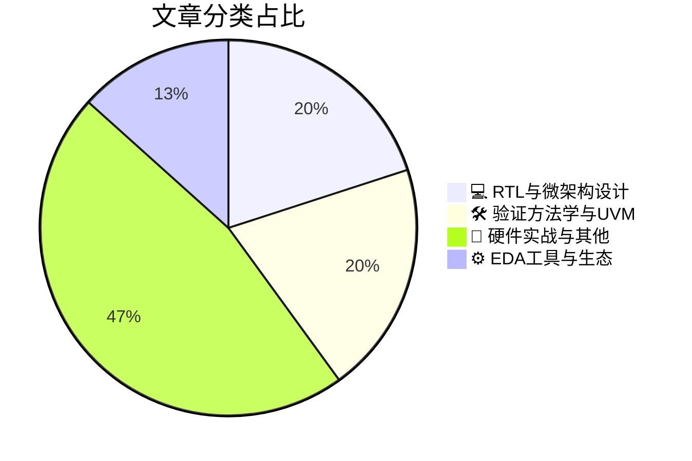

# 🛠️ FPGA / 验证技术精选

> 生成时间：2026-09-14 04:43:25 | 数据范围：过去 96 小时

## 📝 行业视点

当前硬件验证领域正涌现三大硬核趋势：异构内存Chiplet与HBM ECC优化正加速多请求LLM推理，驱动RTL微架构向低开销高带宽设计演进，以支撑AI工作负载的并发与能效极限。验证方法学加速向断言驱动硅成功与硬件信息流跟踪转型，强化预硅安全测试及现代系统可追溯性，确保复杂多die SoC的覆盖完整性与漏洞闭环。同时，静默数据错误重塑测试覆盖与舰队维护策略，千瓦级高功率验证及Chiplet革命（含亚2nm工艺）正倒逼EDA生态与实战可靠性协同升级，验证专家必须深度融合微架构洞察与先进方法学以应对异构系统挑战。

---

## 🏆 深度必读 (Top 3)

### 1. [异构内存芯粒加速多请求LLM推理（NUS）](https://semiengineering.com/heterogeneous-memory-chiplets-accelerate-multi-request-llm-inference-nus/)
**评分**: 7/10 | **分类**: 💻 RTL与微架构设计 | **标签**: `Chiplet` `Memory Hierarchy` `LLM Inference` `Heterogeneous Integration`

> **💡 推荐理由**：推荐给验证团队，因为文章深入探讨了异构内存芯粒架构中的关键验证痛点，如芯粒互连协议验证、异构内存一致性检查、多请求调度下的时序与性能断言，以及高并发LLM工作负载的覆盖率建模，可直接指导FPGA原型验证和SystemVerilog/UVM测试平台的构建，帮助团队提前识别AI芯片中的内存子系统风险。

**摘要**：
本文提出一种基于异构内存芯粒的架构，通过整合HBM、DRAM等不同类型的内存芯粒，有效解决多请求并发LLM推理中的内存带宽瓶颈和访问延迟问题。该设计针对传统同构内存系统在处理大规模语言模型KV缓存和权重加载时的效率低下痛点，引入智能调度与数据放置策略，显著提升吞吐量和能效。文章重点分析了芯粒间互连协议、异构内存一致性以及多请求优先级管理等架构挑战。从验证视角看，它揭示了异构芯粒系统中接口时序、跨内存域数据一致性以及高并发场景下性能验证的复杂性。整体方案通过仿真和原型验证展示了在多用户推理服务中的加速效果，为AI加速器设计提供了新思路。

### 2. [网络研讨会——Avestra讲解如何实现断言驱动的硅片成功](https://semiwiki.com/events/372811-webinar-avestra-explains-how-to-achieve-assertion-driven-silicon-success/)
**评分**: 7/10 | **分类**: 🛠️ 验证方法学与UVM | **标签**: `Assertion-based Verification` `SVA` `Silicon Success`

> **💡 推荐理由**：推荐给验证团队，因其直接针对断言驱动验证的实战落地，能显著提升团队在复杂SoC/FPGA项目中的首次硅片成功率、缩短调试周期并强化覆盖率闭环，是构建高效验证架构的必备参考。

**摘要**：
本文介绍了Avestra在网络研讨会中阐述的断言驱动验证方法论，旨在解决传统仿真验证中难以捕捉复杂时序与协议违规、调试周期长以及首次硅片成功率低的核心痛点。通过系统化部署SystemVerilog断言（SVA），结合仿真与形式验证，可在设计早期嵌入可执行规格，实现自动化检查与覆盖率闭环。该方法有效缩短了验证收敛时间，降低了后期硅片失败风险，并提升了架构级属性验证的完整性。针对FPGA与ASIC项目中常见的接口协议与状态机验证难题，提供了可落地的断言库构建与集成策略。整体帮助验证团队从被动调试转向主动预防，实现更高质量的硅片交付。

### 3. [降低AI推理中HBM ECC控制器开销（RPI、IBM）](https://semiengineering.com/reducing-hbm-ecc-controller-overhead-for-ai-inference-rpi-ibm/)
**评分**: 6/10 | **分类**: 💻 RTL与微架构设计 | **标签**: `HBM ECC` `AI Inference` `Controller Overhead` `Memory Subsystem`

> **💡 推荐理由**：强烈推荐给验证团队：文章直接针对HBM ECC控制器在AI推理中的开销痛点，提供了架构级优化思路，有助于验证工程师在内存子系统验证中更好地定义覆盖点、构建高效testbench，并提前识别面积/功耗/时序权衡问题，提升复杂SoC验证效率和质量。

**摘要**：
本文针对AI推理加速器中HBM内存子系统的ECC控制器设计，提出了一种显著降低面积、功耗和延迟开销的架构优化方案。传统HBM ECC控制器为保障数据可靠性引入的冗余校验逻辑和纠错路径，在高带宽AI推理场景下造成显著性能瓶颈和资源浪费，成为关键验证痛点。作者通过选择性ECC应用、轻量级校验算法以及与AI工作负载特性匹配的错误保护策略，有效削减了控制器开销，同时维持必要的可靠性。该设计解决了验证团队在复杂HBM接口、多通道并行访问和实时纠错场景下难以平衡功能正确性、时序收敛与功耗约束的架构难题。实验结果表明，优化后的控制器在典型推理负载下可大幅减少硬件开销，提升整体系统效率。文章为FPGA/ASIC验证工程师提供了可落地的设计与验证参考，尤其适用于高带宽内存密集型AI芯片。

---

## 📊 资讯分布与高频标签

## 📋 更多分类好文

### 🛠️ 验证方法学与UVM

- [**用于预硅安全测试的硬件信息流跟踪（普林斯顿、MIT、EPFL）**](https://semiengineering.com/hw-information-flow-tracking-for-pre-silicon-security-testing-princeton-mit-epfl/) - *semiengineering.com* (6分)
  > 本文提出硬件信息流跟踪（HW IFT）技术，专用于预硅阶段的安全验证与测试。传统功能验证和形式化方法难以有效捕获机密性/完整性违规、侧信道泄漏或硬件木马导致的非法信息传播等安全属性。IFT通过在RTL/门级对敏感数据进行标签标记与动态/静态传播跟踪，精确识别非预期信息流路径。该方法解决了复杂SoC/FPGA设计中安全属性难以量化和早期检测的核心痛点，显著提升预硅安全覆盖率并降低后硅修复成本。来自普林斯顿、MIT与EPFL的联合研究展示了其在实际处理器与加速器设计中的高效应用。

- [**为什么验证可追溯性必须为现代系统演进**](https://blogs.sw.siemens.com/verificationhorizons/2026/09/11/why-verification-traceability-must-evolve-for-modern-systems/) - *blogs.sw.siemens.com* (6分)
  > 文章指出传统验证可追溯性方法在面对现代复杂SoC、异构系统和安全关键设计时已显不足，无法有效应对需求频繁变更、多域协同验证以及硬件-软件协同设计带来的挑战。核心痛点包括需求到测试用例与覆盖率的链接断裂、变更影响分析困难、合规性证据收集低效，以及缺乏对动态架构和AI加速模块的实时追踪能力。文章强调需演进为自动化、智能化的端到端可追溯性框架，整合MBSE、覆盖率数据库与需求管理工具，实现从规格到硅前/硅后验证的闭环。通过引入动态链接、影响分析和自动化报告，解决架构设计中验证完整性与可维护性的关键问题。最终目标是提升验证效率、降低漏测风险并满足ISO 26262等标准要求。

### 💻 RTL与微架构设计

- [**论二进制翻译及其后果**](https://chipsandcheese.com/p/on-binary-translation-and-its-consequences) - *chipsandcheese.com* (6分)
  > 本文深入探讨了二进制翻译技术在处理器架构兼容性与仿真加速中的核心机制及其对验证流程的深远影响。文章重点解决了动态二进制翻译中语义等价性难以保证、异常处理与副作用难以覆盖的验证痛点，以及跨ISA翻译导致的时序与资源建模不准确问题。通过剖析翻译器设计中的架构权衡，作者指出传统基于指令级仿真的验证方法在面对翻译后二进制时覆盖率不足与调试效率低下的挑战。文章提出了针对翻译层的专用断言、参考模型同步与差分验证架构，有效缓解了FPGA原型验证与ASIC仿真中的一致性难题。最终讨论了这些后果对验证团队在测试激励生成、覆盖率闭环与性能建模方面的架构设计启示。

### 📝 硬件实战与其他

- [**静默数据错误重新定义测试覆盖率与机群维护策略**](https://semiengineering.com/silent-data-errors-redefine-test-coverage-and-fleet-maintenance-strategies/) - *semiengineering.com* (5分)
  > 文章聚焦静默数据错误（Silent Data Errors, SDEs）对数字IC/FPGA验证的颠覆性影响，指出传统功能覆盖率和断言检查无法有效捕获无症状数据损坏，导致验证盲区与系统级可靠性隐患。它直接解决了验证架构中隐蔽错误检测机制不足、测试向量生成缺乏SDE针对性的核心痛点，提出了增强覆盖率模型与专用检测策略。同时，文章重新定义了大规模机群维护范式，强调从被动修复转向预防性监控与动态隔离。通过案例分析，展示了如何在验证流程中集成SDE感知测试与硬件辅助机制，提升整体鲁棒性。这些内容为验证团队提供了应对新兴可靠性挑战的架构设计指导。

- [**验证在1kW功率下经受考验**](https://semiengineering.com/validation-gets-tested-at-1kw/) - *semiengineering.com* (5分)
  > 文章聚焦高功率电子系统（达1kW）的验证挑战，指出传统数字IC/FPGA仿真与仿真器在热应力、功率完整性和安全边界下失效的痛点。核心问题是多域协同验证不足，导致功率感知建模、硬件在环测试和实时热电耦合分析缺失，易引发过热、信号完整性崩溃或验证覆盖率盲区。作者提出基于先进FPGA仿真平台的架构改进，整合电源管理单元建模、动态功耗注入和多物理场协同仿真，以提升高功率场景下的验证效率与可靠性。这直接解决了从低功耗数字验证向高功率混合信号系统迁移时的架构设计瓶颈。整体强调验证流程必须从纯功能转向功率-热-安全一体化，避免后期硅后失败。

- [**从晶体管到AI：与Ramune Nagisetty共探Chiplet革命**](https://www.eejournal.com/fish_fry/from-transistors-to-ai-the-chiplet-revolution-with-ramune-nagisetty/) - *eejournal.com* (5分)
  > 本文通过与Intel专家Ramune Nagisetty的深度访谈，梳理了从传统晶体管缩放向Chiplet异构集成的演进路径，重点阐述其如何支撑AI芯片的算力扩展。文章直击多die系统架构设计中的核心痛点：die-to-die互连带宽/延迟权衡、电源完整性与热耦合管理，以及跨厂商接口标准化难题。它详细分析了验证层面的关键挑战，包括UCIe等协议的系统级验证复杂度、多芯片时钟域同步与安全隔离验证不足。通过模块化Chiplet方法，文章提出了可复用IP验证策略与分层验证架构，有效降低全系统仿真开销。整体为验证团队提供了从单芯片到Chiplet时代的方法论转型指引，强调早期架构协同验证的重要性。

- [**芯片产业一周回顾**](https://semiengineering.com/chip-industry-week-in-review-155/) - *semiengineering.com* (3分)
  > 本文汇总了芯片产业本周关键动态，聚焦EDA工具更新、AI辅助验证进展及先进封装验证挑战。文章明确指出当前数字IC/FPGA验证中的核心痛点：大规模SoC仿真性能瓶颈、功能覆盖率收敛缓慢以及多die异构系统验证复杂度激增。针对架构设计问题，强调了可验证性设计（DFV）与早期硬件/软件协同验证的必要性，以降低后期调试成本。同时讨论了FPGA原型与仿真加速器在缩短验证周期中的关键作用。这些洞察直接针对验证团队日常面临的效率与质量难题，提供了实用的行业趋势参考。

- [**在亚2纳米重新定义工艺**](https://semiengineering.com/redefining-processes-at-sub-2nm/) - *semiengineering.com* (3分)
  > 文章深入探讨了亚2纳米工艺节点下半导体制造流程的根本性变革，重点介绍GAA晶体管、背面供电网络（BSPDN）和CFET等新技术如何突破传统FinFET缩放瓶颈。这些创新虽提升了性能与密度，却显著加剧了工艺变异性、多物理场耦合及热效应等复杂性。针对验证痛点，文章指出传统仿真与建模方法已无法充分覆盖新器件行为与可靠性风险，亟需引入先进变异感知验证与多物理协同仿真架构。在设计层面，强调DTCO与STCO协同优化以平衡PPA目标。整体为验证团队提供了应对先进节点挑战的架构思路与方法论指引。

- [**SemiWiki对Qarakal Quantum公司Dr. Nissan Maskil的CEO访谈**](https://semiwiki.com/ceo-interviews/373457-semiwiki-ceo-interview-with-dr-nissan-maskil-of-qarakal-quantum/) - *semiwiki.com* (3分)
  > 本文是SemiWiki对Qarakal Quantum CEO Dr. Nissan Maskil的深度访谈，聚焦量子计算技术在半导体验证领域的创新应用。文章核心解决了传统数字IC/FPGA验证中状态空间爆炸、仿真速度瓶颈以及形式验证可扩展性差的关键痛点。Maskil博士阐述了量子启发算法与混合量子-经典架构如何加速覆盖率收敛和复杂约束求解。访谈详细讨论了量子验证引擎与现有EDA工具链的集成架构设计挑战及解决方案。通过实际案例展示了量子方法在提升验证完整性和缩短周期方面的潜力。整体为验证架构师提供了从经典向量子增强验证范式转型的清晰路径。

- [**Pickering将在Microelectronics UK展示用于半导体测试的可扩展信号切换**](https://www.eejournal.com/industry_news/pickering-to-showcase-scalable-signal-switching-for-semiconductor-test-at-microelectronics-uk/) - *eejournal.com* (3分)
  > Pickering Interfaces将在Microelectronics UK展会上重点展示其可扩展信号切换解决方案，专为半导体测试与验证场景设计。该方案直接解决了传统ATE和验证平台中信号路由灵活性差、通道扩展困难的核心痛点，尤其是在多DUT并行测试和复杂SoC接口验证时面临的硬件重构成本高问题。通过模块化PXI/LXI架构，工程师可动态配置高密度切换矩阵，支持从DC到RF的多类型信号，优化了测试架构的可扩展性与信号完整性。它有效缓解了验证环境中因DUT迭代频繁导致的切换系统瓶颈，提升了测试覆盖率和效率。整体上，该技术帮助验证团队构建更敏捷、低成本的半导体测试基础设施。

### ⚙️ EDA工具与生态

- [**台积电2026年OIP论坛将聚焦塑造芯片下一时代的技术**](https://semiwiki.com/semiconductor-manufacturers/tsmc/373252-tsmcs-2026-oip-forum-to-spotlight-the-technologies-shaping-the-next-era-of-chips/) - *semiwiki.com* (3分)
  > 台积电2026 OIP论坛将重点展示先进制程、3D堆叠、异构集成与AI芯片等塑造下一代芯片的核心技术。文章揭示这些技术如何突破当前摩尔定律放缓下的性能、功耗与密度瓶颈。针对验证痛点，新架构带来多die协同验证、跨芯片接口时序收敛及系统级功耗完整性检查的巨大复杂性。论坛探讨EDA工具链与验证方法学创新，以应对大规模异构设计的覆盖率与调试挑战。这为验证架构师提供了前瞻性指导，帮助提前规划针对先进节点的仿真、仿真加速与形式验证策略。

- [**Zuken 推出 E3.series 2027，扩展工程与制造能力**](https://www.eejournal.com/industry_news/zuken-launches-e3-series-2027-with-expanded-engineering-and-manufacturing-capabilities/) - *eejournal.com* (3分)
  > Zuken 正式发布 E3.series 2027，大幅扩展了电气工程设计与制造环节的功能集。新版本强化了自动化设计规则检查、跨学科数据同步和制造就绪性验证，直接解决了传统电气系统设计中工程到制造数据不一致、变更传播延迟以及后期制造缺陷难以提前发现的验证痛点。通过增强的数字孪生集成与实时协作平台，它帮助验证架构师更高效地验证复杂线束、面板和系统级互连的正确性与可制造性。此外，改进的变更管理和仿真闭环显著缩短了验证迭代周期，优化了从概念设计到生产的整体架构可靠性。这些能力针对数字IC/FPGA嵌入式系统中常见的机电集成验证挑战，提升了端到端验证覆盖率和效率。

