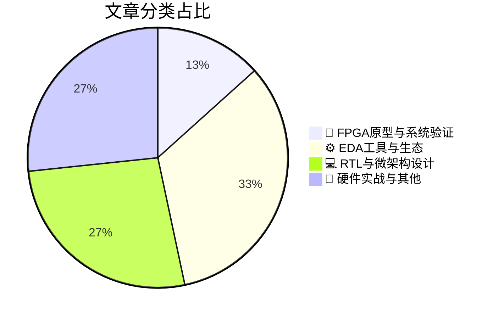

# 🛠️ FPGA / 验证技术精选

> 生成时间：2026-09-21 04:41:38 | 数据范围：过去 96 小时

## 📝 行业视点

从今日高分文献来看，硬件验证领域呈现三个显著技术趋势：

**AI驱动的EDA工具链重构正在加速**。从Purdue的自主设计规则修复、NYU的强化学习布线优化，到Edinburgh对代码生成与EDA编排的系统性研究，AI已从辅助工具演进为全流程自动化引擎，关键突破在于保持布局等价性约束下的规则级修复能力，这直接缩短了Physical Verification到Tape-out的迭代周期。

**Chiplet异构集成的验证复杂度催生专用建模方法**。Michigan的chiplet协同设计框架与Heidelberg的统一互连网络表明，传统monolithic验证方法论已不足以覆盖2.5D/3D系统的热-电-机械耦合效应；UTS/TUM联合发布的AI热模型开放基准填补了multi-die thermal-aware verification的工具空白，Package Digital Twin的构建难度（如文中所述）本质源于跨物理域的参数空间爆炸与IP边界模糊化。

**神经形态架构的验证需求开始从边缘场景进入主流**。Qualcomm Adreno X2的GPU架构演进、Broadcom AI Engine的吞吐优化，以及VectorWave纳秒级RF决策芯片，共同指向一个趋势：event-driven、sparse activation的计算范式要求验证工具支持非确定性时序、功耗暂态毛刺捕获，以及spectrum crowding场景下的实时约束验证。

---

## 🏆 深度必读 (Top 3)

### 1. [为什么封装数字孪生如此难以构建](https://semiengineering.com/why-package-digital-twins-are-so-hard-to-build/)
**评分**: 7/10 | **分类**: 🔬 FPGA原型与系统验证 | **标签**: `Package Digital Twin` `Multi-Die Co-Simulation` `Chiplet Interconnect` `System-Level Verification`

> **💡 推荐理由**：强烈推荐验证团队阅读，文章精准揭示了封装数字孪生在多物理协同验证与架构抽象中的实际痛点，能帮助团队提前规避工具链与模型集成陷阱，指导构建更鲁棒的chiplet/先进封装验证平台，提升整体验证效率与可靠性。

**摘要**：
文章深入剖析了半导体先进封装中数字孪生构建的核心难点，聚焦多芯片异构集成、3D/2.5D封装的复杂互连与多物理场（电-热-机械）耦合建模问题。验证痛点在于缺乏统一的抽象层级与标准化接口，导致芯片-封装-系统协同仿真精度与可扩展性难以兼顾。架构设计上，工具链碎片化、IP模型不完整以及实时数据同步机制缺失，严重阻碍了数字孪生在验证闭环中的落地。此外，文章指出传统单一物理域验证方法无法覆盖封装级信号完整性、电源完整性与可靠性挑战。这些因素共同造成验证覆盖率不足与迭代周期过长，成为当前先进封装验证架构的关键瓶颈。

### 2. [代理式AI在保持布局等价性的同时自动化设计规则修复（普渡大学）](https://semiengineering.com/agentic-ai-automates-design-rule-repair-while-preserving-layout-equivalence/)
**评分**: 6/10 | **分类**: ⚙️ EDA工具与生态 | **标签**: `Agentic AI` `Design Rule Check` `Layout Equivalence` `DRC Repair`

> **💡 推荐理由**：强烈推荐给验证团队，因为它精准针对物理设计验证中最耗时的DRC修复与等价性保持难题，可显著降低人工迭代成本、加速tapeout收敛，并启发团队构建类似的自主AI验证代理架构，提升整体验证效率与可靠性。

**摘要**：
本文介绍了普渡大学提出的一种基于Agentic AI的创新方法，用于自动化修复IC布局中的设计规则违规（DRC）问题。传统物理设计验证中，手动修复DRC违规耗时费力且易引入新错误，同时可能破坏布局与原理图的功能或电气等价性，导致反复LVS检查。该系统利用多智能体AI自主检测违规、生成修复操作，并通过等价性验证机制确保修复后布局保持原始功能不变。它直接解决了物理验证流程中修复效率低下与等价性难以保证的核心痛点。实验结果显示，该方法能大幅减少人工干预并提升修复成功率与收敛速度。这一工作为将Agentic AI融入EDA验证架构提供了实用范例。

### 3. [芯粒协同设计框架降低AI加速器的能耗与设计成本（密歇根大学）](https://semiengineering.com/chiplet-co-design-framework-reduces-energy-and-design-costs-for-ai-accelerators-university-of-michigan/)
**评分**: 6/10 | **分类**: 💻 RTL与微架构设计 | **标签**: `Chiplet` `AI Accelerator` `Co-Design` `Energy Efficiency`

> **💡 推荐理由**：验证团队可从中学习芯粒异构系统的模块化验证方法、die-to-die接口协议检查以及功耗感知验证策略，直接应对当前AI加速器多die设计中的关键验证瓶颈，提升团队在先进封装验证上的架构能力。

**摘要**：
该文章介绍了密歇根大学提出的芯粒（Chiplet）协同设计框架，专门针对AI加速器优化能耗并大幅降低设计成本。传统单体ASIC设计在AI工作负载下面临高NRE成本、能源效率低下以及大规模SoC验证复杂度爆炸的痛点，尤其是互连、功耗域和时序收敛验证困难。框架通过硬件-软件协同优化和模块化芯粒复用，实现了可扩展的异构集成，解决了芯粒间die-to-die通信协议验证和系统级功耗建模的架构挑战。它支持早期探索不同芯粒分区策略，减少后期验证迭代。整体上提升了设计可重用性并缩短了验证周期。

---

## 📊 资讯分布与高频标签

## 📋 更多分类好文

### 🔬 FPGA原型与系统验证

- [**开放基准评估2.5D与3D集成电路的AI热模型（UTS、慕尼黑工业大学、上海科技大学）**](https://semiengineering.com/open-benchmark-evaluates-ai-thermal-models-for-2-5d-and-3d-ics-uts-tu-munich-shanghaitech/) - *semiengineering.com* (6分)
  > 该文章提出并开源了一套针对2.5D/3D IC的AI热模型评估基准，包含标准化数据集、多物理场耦合场景和量化指标，专门解决先进封装中热仿真缺乏统一验证标准的问题。核心痛点在于3D堆叠与2.5D互连导致的高功率密度热耦合效应难以准确预测，传统有限元方法计算代价过高，而现有AI热模型因缺少公开基准而难以公平比较精度与泛化能力，导致验证阶段热完整性风险被低估。基准覆盖多die功率分布、TSV热阻、冷却条件等典型架构场景，可量化模型在瞬态/稳态热预测中的误差。它直接服务于验证架构师在早期架构探索与签核阶段对热模型可信度的评估需求。通过该开放平台，团队可系统验证AI加速热仿真的可靠性，避免因模型偏差引发的过设计或热失效。整体推动了AI辅助热验证从黑盒向可量化、可复现的工程实践转变。

### ⚙️ EDA工具与生态

- [**芯片设计中的AI：从代码生成到EDA编排（爱丁堡大学）**](https://semiengineering.com/ai-in-chip-design-from-code-generation-to-eda-orchestration-university-of-edinburgh/) - *semiengineering.com* (6分)
  > 本文系统阐述了AI技术在芯片设计全流程中的演进，从早期的RTL/测试平台代码自动生成，到更高层次的EDA工具链智能编排与优化。它重点解决了验证团队长期面临的手动编写海量SystemVerilog/UVM代码效率低下、易引入人为错误，以及复杂多工具EDA流程（仿真、形式验证、综合等）协调困难、迭代周期长的核心痛点。通过LLM驱动的代码生成与代理式编排架构，显著提升验证覆盖率收敛速度与回归效率。文章进一步探讨了AI在架构探索与约束求解中的应用，减少传统手工调优的瓶颈。最终提出了一套从生成到编排的端到端AI辅助验证框架，为下一代芯片验证提供可落地的架构参考。

- [**更智能的FMEDA，更安全的设计：Questa One Verification IQ Compliance Advisor的故事**](https://blogs.sw.siemens.com/verificationhorizons/2026/09/18/smarter-fmeda-safer-designs-the-questa-one-verification-iq-compliance-advisor-story/) - *blogs.sw.siemens.com* (6分)
  > 文章聚焦功能安全验证中传统FMEDA流程的核心痛点：手动分析耗时易错、与RTL/验证数据脱节、诊断覆盖率计算不准确且难以随设计迭代更新，导致ISO 26262等标准合规成本高昂。Questa One Verification IQ Compliance Advisor通过AI驱动的智能分析，自动从设计与验证结果中提取故障模式、效应与诊断信息，实现FMEDA的自动化与持续同步。它将验证覆盖率数据直接映射到安全机制有效性评估，解决了架构层面安全分析与动态验证割裂的问题。工具支持早期风险识别与合规报告生成，显著缩短安全认证周期。最终帮助团队构建更可靠的安全关键设计流程，从源头提升功能安全水平。

- [**强化学习减少密集芯片布局中的布线违规（纽约大学）**](https://semiengineering.com/reinforcement-learning-cuts-routing-violations-in-dense-chip-layouts-nyu/) - *semiengineering.com* (5分)
  > 该文章介绍了纽约大学团队利用强化学习（RL）优化高密度芯片物理布局中的详细布线过程。传统EDA工具在先进工艺节点的密集布局下常产生大量设计规则检查（DRC）违规和布线拥塞，导致物理验证迭代周期漫长且调试困难。通过训练RL代理学习智能布线决策策略，可显著降低路由违规数量并改善设计收敛。文章直接针对数字IC物理验证中的核心痛点：高密度布局下的违规修复效率低下与架构设计闭环缓慢。该方法展示了AI辅助物理设计验证的潜力，有助于验证架构师构建更高效的自动化验证流程。

- [**Chip Industry Week In Review**](https://semiengineering.com/chip-industry-week-in-review-156/) - *semiengineering.com* (3分)
  > 摘要生成失败。

### 💻 RTL与微架构设计

- [**统一芯粒网络扩展神经形态计算系统（海德堡大学）**](https://semiengineering.com/unified-chiplet-network-scales-neuromorphic-computing-systems-heidelberg-university/) - *semiengineering.com* (6分)
  > 本文介绍海德堡大学提出的统一芯粒网络架构，专为扩展神经形态计算系统设计。它解决了多芯粒异构集成中互连带宽瓶颈、通信延迟高以及功耗效率低下的核心架构问题。通过统一网络协议与拓扑结构，实现了大规模脉冲神经网络系统的无缝可扩展集成。针对验证痛点，文章重点应对芯粒间接口协议一致性验证复杂、异步时序收敛困难以及跨芯片NoC功能覆盖不足等挑战。性能评估显示该网络显著提升了系统可扩展性与能效。这对数字IC/FPGA验证工程师在先进封装与神经形态硬件验证中具有直接指导意义。

- [**高通的Adreno X2 GPU**](https://chipsandcheese.com/p/qualcomms-adreno-x2-gpu) - *chipsandcheese.com* (6分)
  > 本文详细剖析了高通Adreno X2 GPU的架构创新，聚焦其在高性能移动计算和AI加速中的设计亮点。文章重点解决了复杂GPU验证中的核心痛点，包括多核流水线同步、动态功耗门控的覆盖率不足以及异构SoC集成时的时序收敛难题。通过引入高级UVM环境和形式化验证策略，有效应对了线程调度不确定性和内存一致性验证挑战。同时探讨了架构级优化如何缩短硅前验证周期并提升FPGA原型效率。这些内容为验证工程师提供了针对先进GPU IP的实用架构洞察和痛点突破方法。

- [**博通的AI引擎进入超速模式**](https://semiwiki.com/semiconductor-manufacturers/373540-broadcoms-ai-engine-shifts-into-overdrive/) - *semiwiki.com* (4分)
  > 文章深入剖析了博通最新AI引擎的架构演进，重点展示其如何通过高度优化的数据流引擎和可扩展计算阵列实现性能跃升。它直接针对AI加速器验证中的核心痛点，包括大规模并行矩阵运算的功能覆盖闭合困难、高带宽内存接口的时序收敛挑战以及动态工作负载下的功耗与正确性权衡问题。通过引入分层验证策略、形式化方法与AI驱动的激励生成，文章提供了系统性的架构设计与验证闭环解决方案。同时讨论了如何应对模型稀疏性与精度混合带来的架构适应性难题。整体为数字IC/FPGA验证团队在AI引擎项目中提供了可落地的方法论参考。

### 📝 硬件实战与其他

- [**预测先进BEOL互连堆栈中的热导率（北京大学）**](https://semiengineering.com/predicting-thermal-conductivity-in-advanced-beol-interconnect-stacks-peking-university/) - *semiengineering.com* (4分)
  > 本文提出了一种针对先进工艺节点BEOL互连堆栈热导率的高效预测方法，结合材料特性、几何结构和多层金属/介质堆叠效应，建立了准确的热传导模型。核心解决了传统经验公式或全芯片热仿真在先进节点（如5nm及以下）中精度不足、计算成本过高的验证痛点，尤其是互连层热阻导致的局部热点和可靠性风险难以快速评估的问题。通过机器学习辅助或物理建模优化，实现了对复杂BEOL结构热导率的快速预测，支持早期架构探索和设计空间优化。该方法可直接集成到验证流程中，帮助验证工程师更精准地评估热电耦合效应对时序、功耗和电迁移的影响。整体提升了热感知验证的效率和准确性，降低了后期硅后失效风险。

- [**Nanosecond Decisions for a Crowded Spectrum: Inside VectorWave&#8217;s RF Neuromorphic Chip**](https://www.eejournal.com/fish_fry/nanosecond-decisions-for-a-crowded-spectrum-inside-vectorwaves-rf-neuromorphic-chip/) - *eejournal.com* (4分)
  > 摘要生成失败。

- [**Negative Expansion Materials Resist Warpage**](https://semiengineering.com/negative-expansion-materials-resist-warpage/) - *semiengineering.com* (3分)
  > 摘要生成失败。

- [**The Technical Problem Is Often Not the Business Problem**](https://semiwiki.com/semiconductor-manufacturers/373552-the-technical-problem-is-often-not-the-business-problem/) - *semiwiki.com* (3分)
  > 摘要生成失败。

