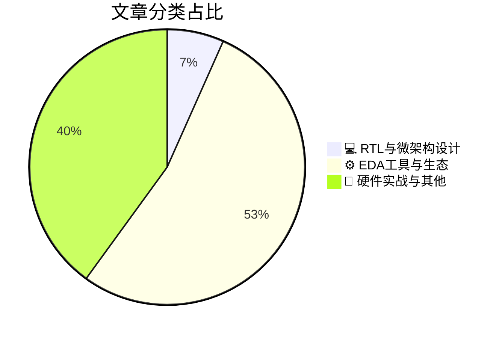

# 🛠️ FPGA / 验证技术精选

> 生成时间：2026-09-28 05:14:43 | 数据范围：过去 96 小时

## 📝 行业视点

当前硬件验证领域正加速向多裸片异构集成演进，NoC架构与UCIe协议成为多Die互连的核心，推动EDA工具突破传统2D边界以应对3D-IC的热力、信号完整性与IP管理挑战。AI代理正跨越设计孤岛，从L1辅助到L5全自主级别演进，实现证据驱动的自动化验证流程，Synopsys与TSMC的合作进一步加速agentic AI在先进节点的落地。晶体管层面，A7 CFET与A10 Nanosheet的寄生参数与可靠性对比，叠加TSMC AI时代路线图，正驱动设备建模向量子与高性能计算场景深度优化，验证工程师需重构覆盖率策略以应对这些范式转移。

---

## 🏆 深度必读 (Top 3)

### 1. [用于多裸片设备的片上网络（NoC）](https://semiengineering.com/a-network-on-chip-noc-for-multi-die-devices/)
**评分**: 6/10 | **分类**: 💻 RTL与微架构设计 | **标签**: `NoC` `Multi-Die` `Chiplet Interconnect` `System-Level Architecture`

> **💡 推荐理由**：推荐给验证团队，因为文章精准剖析了多裸片NoC的核心验证痛点（如跨die协议检查、多域同步和性能验证），提供了可落地的架构洞察与验证策略，能直接帮助团队应对先进封装技术中的复杂互连验证挑战，提升验证完备性和效率。

**摘要**：
本文提出了一种专为多裸片（multi-die）设备设计的片上网络（NoC）架构，重点解决跨die互连中的可扩展性、延迟和带宽瓶颈等架构设计问题。它针对异构集成场景下的路由拓扑、接口标准化和流量管理机制进行了优化，以应对多时钟域、电源域以及协议一致性验证的复杂性痛点。文章详细分析了NoC在2.5D/3D封装中的通信挑战，提供了降低验证覆盖盲区和性能瓶颈的设计方法。通过引入自适应路由和标准化链路层，有效简化了多裸片系统的功能正确性和系统级验证流程。该方案显著提升了多die SoC的整体可靠性和验证效率。

### 2. [3D芯片推动EDA进入新领域](https://semiengineering.com/3d-chips-push-eda-into-new-territory/)
**评分**: 6/10 | **分类**: ⚙️ EDA工具与生态 | **标签**: `3D IC` `chiplet` `multi-die EDA` `system-level verification`

> **💡 推荐理由**：强烈推荐给验证团队，因其精准定位了3D芯片验证中的多die协同、热效应与垂直互连等关键架构痛点，可帮助团队提前构建适应先进封装的验证流程与工具链，提升对下一代芯片设计的应对能力与效率。

**摘要**：
文章深入分析了3D芯片堆叠与异构集成如何迫使EDA工具突破传统二维设计边界，重点揭示了验证环节的核心痛点。验证团队面临多die协同仿真、TSV垂直互连信号完整性检查以及跨层热-电耦合效应建模等全新架构挑战。传统平面验证方法无法有效覆盖电源分配网络复杂性和系统级功能正确性验证。文章强调需要引入支持3D感知的形式化验证、硬件加速仿真和多物理场协同验证方法论。这些变革直接推动EDA厂商开发面向先进封装的验证解决方案，以保障3D IC的可靠性与可制造性。

### 3. [PCIe的下一章：与UCIe的Chiplet集成](https://blogs.sw.siemens.com/verificationhorizons/2026/09/25/the-next-chapter-for-pcie-chiplet-integration-with-ucie/)
**评分**: 6/10 | **分类**: ⚙️ EDA工具与生态 | **标签**: `UCIe` `PCIe` `Chiplet` `Die-to-Die`

> **💡 推荐理由**：推荐给验证团队，因为文章直接针对Chiplet时代PCIe验证的新兴痛点（如跨Die协议验证和UCIe集成），提供了实用的架构设计和验证方法论，有助于团队提前布局先进封装验证流程，提升多Die系统验证效率和覆盖率。

**摘要**：
本文探讨了PCIe协议在Chiplet架构中的演进，重点介绍如何通过UCIe标准实现多Die间的高速互连与PCIe功能的无缝集成。文章分析了传统单芯片PCIe验证方法在Chiplet场景下的局限性，包括跨Die协议一致性、时序同步和信号完整性等架构设计挑战。它提出了针对UCIe-PCIe桥接的验证策略，解决了多物理层接口的覆盖率不足和系统级互操作性验证痛点。通过案例展示了如何构建分层验证环境，以应对Chiplet集成带来的复杂性。核心贡献在于为验证工程师提供了可扩展的架构框架，确保PCIe在异构Chiplet系统中的可靠性和性能。

---

## 📊 资讯分布与高频标签

## 📋 更多分类好文

### ⚙️ EDA工具与生态

- [**管理3D-IC设计与IP**](https://semiengineering.com/managing-3d-ic-design-and-ip/) - *semiengineering.com* (5分)
  > 文章深入探讨了3D-IC（三维集成电路）设计中IP管理的核心挑战，特别是在多die堆叠和异构集成架构下。它明确指出验证痛点包括跨die接口的信号完整性与时序验证困难、TSV（硅通孔）建模不准确导致的功能与性能偏差，以及热效应对功耗、可靠性和系统级行为的复杂影响。架构设计问题聚焦于IP复用策略失效、die-to-die通信协议的一致性保障，以及如何在分层设计中实现有效的层次化验证。文章强调通过早期系统级建模、先进验证方法学（如多物理场协同仿真）和IP标准化管理来缓解这些风险。总体提供了实用的管理框架，帮助团队应对3D-IC带来的验证复杂性和设计收敛难题。

- [**当AI代理跨越芯片设计孤岛时**](https://semiengineering.com/when-ai-agents-cross-chip-design-silos/) - *semiengineering.com* (5分)
  > 文章探讨了AI代理如何打破芯片设计中传统的团队孤岛，特别聚焦于验证流程中的跨领域协作难题。它精准解决了RTL设计、功能验证、物理实现等环节因数据割裂和沟通壁垒导致的验证覆盖不全、缺陷发现滞后以及迭代效率低下等核心痛点。通过多智能体系统实现自动化知识共享与任务编排，显著提升验证架构的端到端集成能力。文章强调当前验证架构设计中碎片化工具链和人工交接的瓶颈，并提出基于AI代理的统一智能平台方案。该方案支持实时反馈闭环和自适应验证策略，有效缩短复杂SoC的验证周期。整体为数字IC/FPGA验证团队提供了从孤岛式工作流向协同智能架构转型的实践路径。

- [**EDA’s Future Is Evidence-Driven Automation**](https://semiengineering.com/edas-future-is-evidence-driven-automation/) - *semiengineering.com* (5分)
  > 摘要生成失败。

- [**Autonomy Levels For Design Agents: L1 To L5 Explained**](https://semiengineering.com/autonomy-levels-for-design-agents-l1-to-l5-explained/) - *semiengineering.com* (4分)
  > 摘要生成失败。

- [**HAL靠边站，新AI像芯片设计师一样思考**](https://www.eejournal.com/article/move-over-hal-new-ai-thinks-like-a-chip-designer/) - *eejournal.com* (4分)
  > 文章介绍了一种新型AI系统，能像资深芯片设计师一样进行架构决策、布局优化和设计迭代。它重点解决了传统数字IC/FPGA设计中人工探索设计空间耗时过长、PPA权衡效率低下以及验证覆盖率收敛缓慢的核心痛点。通过强化学习与生成式模型，AI可自动生成高质量的芯片布局、RTL架构建议和验证策略，大幅缩短设计周期。这减少了验证中因人为疏漏导致的bug逃逸，并提升了复杂SoC的验证完备性。最终为验证架构师提供了智能化工具，以应对日益增长的设计复杂度和验证瓶颈。

- [**Synopsys与台积电合作，利用Agentic AI和先进设计加速AI系统创新**](https://www.eejournal.com/industry_news/synopsys-and-tsmc-partner-to-accelerate-ai-systems-innovation-with-agentic-ai-and-advanced-design/) - *eejournal.com* (3分)
  > 本文介绍了Synopsys与TSMC的战略合作，通过集成Agentic AI代理和先进工艺设计工具，加速AI芯片系统的创新与落地。核心解决了先进节点（如3nm/2nm）下AI加速器验证中覆盖率爆炸、仿真周期过长以及多die异构集成架构探索效率低下的痛点。Agentic AI可自主规划验证策略、生成测试激励并优化回归流程，显著降低人工干预。合作还强化了设计-验证闭环，支持早期架构权衡与功耗/性能/面积协同优化。验证团队可借此应对复杂AI系统中的时序、协议与功能安全验证挑战。整体推动了EDA工具向智能化、自动化方向演进。

### 📝 硬件实战与其他

- [**为AI时代设计芯片：台积电路线图意味着什么**](https://semiwiki.com/semiconductor-manufacturers/tsmc/373986-designing-chips-for-the-ai-era-what-tsmcs-roadmap-means/) - *semiwiki.com* (4分)
  > 文章分析了台积电针对AI芯片的先进工艺与封装路线图，包括N3/N2节点、CoWoS、SoIC等技术如何支撑高算力、高带宽AI加速器设计。它重点解决了多芯片异构集成带来的架构挑战，如die-to-die互连复杂性、功耗密度与热管理问题。验证痛点集中在系统级多die协同验证、高速接口时序收敛以及先进节点下的可靠性与可测性保障。文章强调验证架构需从传统单芯片转向3D/2.5D封装感知的分层验证策略。通过解读路线图，帮助团队提前规划验证工具链与方法论，以应对AI时代芯片规模爆炸式增长。

- [**比较A7 CFET与A10纳米片FET：从寄生效应到芯片可靠性（TUM、UNIMORE、应用材料公司）**](https://semiengineering.com/comparing-a7-cfet-and-a10-nanosheet-fets-from-parasitics-to-chip-reliability-tum-unimore-applied-materials/) - *semiengineering.com* (3分)
  > 本文系统比较了A7节点CFET与A10节点纳米片FET从器件寄生参数到芯片级可靠性的全面差异。文章重点分析了两种先进晶体管结构的寄生电容、电阻及其对电路延迟、功耗和信号完整性的影响。它直接解决了先进工艺中3D晶体管寄生提取不准确、导致时序收敛和功耗验证困难的核心验证痛点。研究进一步量化了寄生效应对芯片可靠性指标（如电迁移、热可靠性和TDDB）的影响，揭示了架构选择中的可靠性权衡问题。通过TCAD仿真与实验数据，为验证团队提供了针对CFET与纳米片技术的建模与验证方法论指导。总体为下一代数字IC架构设计和可靠性验证流程优化提供了关键技术洞察。

- [**面向下一代量子应用的AI驱动器件建模**](https://semiengineering.com/ai-driven-device-modeling-for-next-generation-quantum-applications/) - *semiengineering.com* (3分)
  > 本文提出了一种基于AI的器件建模方法，专门针对下一代量子计算与量子传感应用中的复杂器件行为进行高效准确建模。传统物理仿真和手工建模在处理量子器件的非线性、噪声敏感性和多物理场耦合时面临精度不足、计算开销巨大以及难以覆盖工艺变异的验证痛点。文章通过机器学习驱动的代理模型和数据增强技术，构建了可快速迭代的器件模型，显著加速了从器件级到系统级的验证闭环。该方法解决了量子相关IC/FPGA架构设计中模型保真度与仿真速度难以兼顾的核心架构问题，并支持不确定性量化以提升验证覆盖率。整体框架可无缝集成到现有数字验证流程中，为量子-经典混合系统的早期验证提供可靠基础。

- [**Mixx Technologies的Vivek Raghuraman CEO访谈**](https://semiwiki.com/ceo-interviews/373738-ceo-interview-with-vivek-raghuraman-of-mixx-technologies/) - *semiwiki.com* (3分)
  > 本文通过采访Mixx Technologies CEO Vivek Raghuraman，深入探讨了数字IC与FPGA验证中面临的核心挑战。文章重点指出了复杂SoC和多芯片系统中传统验证方法在覆盖率闭合、调试效率和可扩展性方面的痛点。Raghuraman分享了公司在验证架构设计上的创新思路，包括先进仿真、仿真加速和工具链集成策略，以应对异构设计和chiplet带来的复杂性。内容还涉及如何通过优化验证流程缩短上市时间并提升可靠性。整体为验证架构师提供了解决大规模设计验证瓶颈的实践见解。

- [**Thintronics公司Stefan Pastine博士的CEO访谈**](https://semiwiki.com/ceo-interviews/373713-ceo-interview-with-dr-stefan-pastine-of-thintronics/) - *semiwiki.com* (3分)
  > 本文通过与Thintronics CEO Dr. Stefan Pastine的访谈，深入探讨了其超薄高性能介电材料技术如何革新高速PCB和封装设计。核心内容聚焦于传统厚介电层导致的信号损耗、串扰和延迟问题，这些直接加剧了数字IC/FPGA中高速接口（如SerDes、PCIe、DDR）的信号完整性（SI）和电源完整性（PI）验证复杂度。文章指出该技术通过实现更薄、更低损耗的介质，从根本上降低了高频信号衰减和阻抗不匹配风险，从而简化了验证架构中的时序收敛、眼图分析和多板级协同仿真挑战。它解决了验证团队在先进工艺节点下面临的材料限制导致的过度悲观建模和反复迭代验证痛点，推动从“事后验证”向“设计即验证”的架构转变。整体强调材料创新对提升验证效率和系统可靠性的关键作用。

- [**ScienceSoft CEO Nick Kurayev 访谈**](https://semiwiki.com/ceo-interviews/374075-ceo-interview-with-nick-kurayev-of-sciencesoft/) - *semiwiki.com* (3分)
  > 本文是对ScienceSoft CEO Nick Kurayev的深度访谈，聚焦软件系统开发与验证实践。文章指出复杂企业级系统中验证覆盖率不足、自动化测试集成困难以及遗留代码验证效率低下等核心痛点。它解决了验证架构设计中如何将测试左移、构建可扩展验证框架以及平衡敏捷迭代与全面回归测试的问题。Kurayev分享了ScienceSoft通过定制化验证策略和工具链帮助客户降低缺陷逃逸率的经验。这些见解对数字IC/FPGA验证团队在UVM环境构建、覆盖率驱动验证和CI/CD流水线优化方面具有直接借鉴价值。整体强调了跨领域验证方法论的迁移应用。

