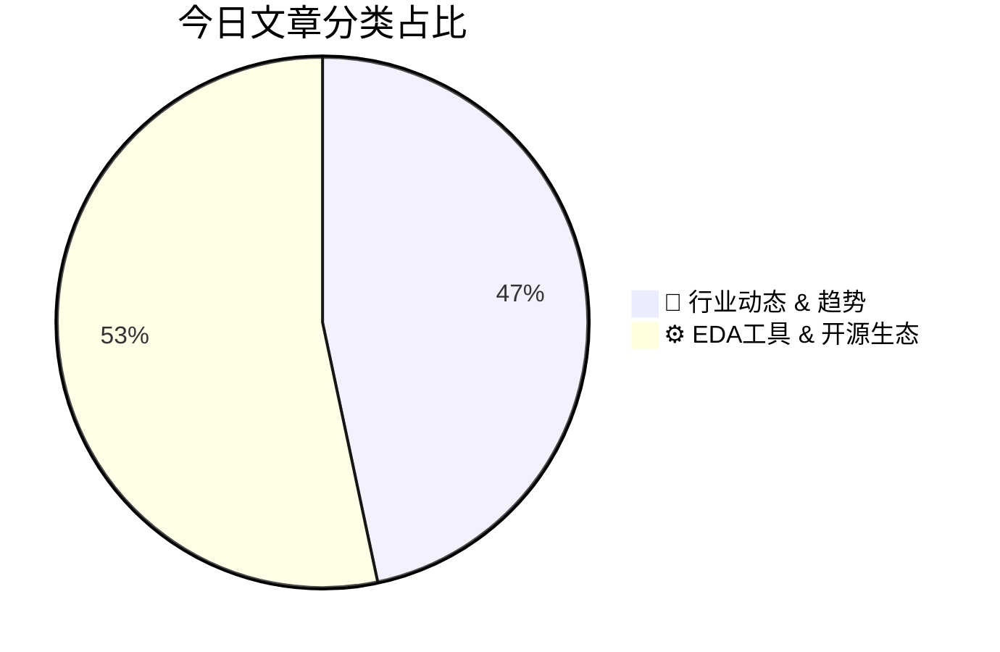

# 🛠️ FPGA / 验证技术每日精选

> 生成时间：2/20/2026, 6:11:42 PM | 数据范围：过去 48 小时

## 📝 今日看点

端侧LLM革命正驱动硬件验证范式向AI原生协同验证转型，要求验证流程覆盖低精度量化单元与稀疏计算阵列的形式化等价性检查，同时LUBIS EDA与加法学习（Additive Learning）方法论试图通过机器学习加速收敛以解决指数级状态空间爆炸的验证瓶颈。基于虚拟制造（Virtual Fabrication）的晶圆内变异（Within-Wafer Variation）连续分布建模正取代传统工艺角离散化方法，结合智能寄生参数分析实现了更高精度的物理签核（Physical Sign-off）与工艺-电压-温度（PVT）感知时序闭合。光电互连异构集成（Photonic Interconnect Heterogeneous Integration）引入光-电-热多物理场耦合验证需求，动态路由电光路由器（Electro-Optical Router）与2.5D/3D封装协同设计对112G/224G高速接口的信号完整性（SI）和跨域协同仿真提出新的方法论挑战。

---

## 🏆 今日必读 (Top 3)

### 1. [芯片行业一周回顾](https://semiengineering.com/chip-industry-week-in-review-126/)
**评分**: 8/10 | **分类**: 🚀 行业动态 & 趋势 | **标签**: `半导体行业` `周度回顾` `市场动态` `技术趋势`

> **💡 推荐理由**：本文系统梳理了验证方法学从模块级向系统级验证（SoC Level）迁移的技术路径，深入剖析了Chiplet互联一致性验证、AI辅助回归测试优化等前沿方案的工程实施细节，为验证工程师提供了优化验证收敛策略（Verification Closure）和规划技术栈升级的具体参考，有助于应对当前芯片复杂度激增带来的验证危机。

**摘要**：
本周芯片行业聚焦先进制程良率提升与AI芯片设计验证挑战。核心痛点在于随着Chiplet架构和异构集成普及，系统级验证空间呈指数级爆炸，传统RTL仿真在面对百亿门级设计时难以在Tape-out前完成全场景覆盖率收敛，且回归测试周期严重影响迭代效率。行业解决方案正加速向硬件仿真加速（Emulation）与FPGA原型验证（Prototyping）的混合验证范式迁移，并引入基于机器学习的验证空间优化（VSO）技术智能压缩测试用例集。同时，云原生EDA平台和开源验证工具链的成熟正在重构验证基础设施，但高端形式验证（Formal Verification）工具仍面临算力成本高昂与专业人才短缺的双重制约。

### 2. [端侧大模型革命](https://semiengineering.com/the-on-device-llm-revolution/)
**评分**: 8/10 | **分类**: 🚀 行业动态 & 趋势 | **标签**: `Edge AI` `LLM inference` `On-device AI` `AI accelerator` `Low-power design`

> **💡 推荐理由**：作为数字IC/FPGA验证架构师，端侧LLM芯片的复杂性要求验证工程师深入理解AI加速器架构特性（如稀疏计算、低比特量化、存算一体等创新设计）。本文揭示了端侧AI芯片验证中的关键挑战，包括大规模参数加载的内存带宽验证、定点/浮点混合精度运算的正确性验证，以及软硬件协同优化带来的验证空间爆炸问题。掌握这些内容有助于验证工程师建立面向AI芯片的先进验证策略，如基于实际LLM推理trace的性能验证、功耗-性能联合优化验证，以及形式化验证在数学运算单元中的应用，为未来参与端侧AI芯片项目提供关键方法论指导。

**摘要**：
端侧大模型革命旨在将大语言模型从云端迁移至本地设备，以解决隐私泄露、网络延迟和云端部署成本高昂等核心痛点。然而，在资源受限的移动和IoT设备上部署LLM面临内存容量瓶颈、算力不足和严苛功耗限制等严峻硬件挑战。业界通过模型量化/剪枝/蒸馏等压缩技术、高效注意力机制优化以及专用AI加速器（NPU）架构创新，实现了大模型在端侧的高效推理。这一趋势对芯片验证提出全新要求，包括低精度数值运算验证、复杂数据流调试和巨大状态空间覆盖等难题。验证工程师需采用软硬件协同验证方法学，构建真实AI工作负载场景，确保AI加速器在满足功耗约束下实现性能目标。

### 3. [汽车行业一周综述](https://semiengineering.com/automotive-week-in-review-2/)
**评分**: 8/10 | **分类**: 🚀 行业动态 & 趋势 | **标签**: `Automotive Electronics` `Functional Safety` `ISO 26262` `ADAS` `Verification Trends`

> **💡 推荐理由**：对于数字IC/FPGA验证工程师而言，汽车电子领域的功能安全（Functional Safety）与车规级可靠性验证是当前高端验证岗位的核心技能缺口。本文深入剖析了从传统消费级芯片验证向汽车级验证转型的关键方法论差异，特别是形式验证在故障注入（Fault Injection）中的应用以及虚拟HIL平台搭建实践，为验证工程师拓展汽车电子这一高增长领域提供了直接的技术路径参考。

**摘要**：
本周汽车行业焦点集中于车规级芯片功能安全验证的复杂性挑战，特别是ISO 26262 ASIL-D级别合规性验证带来的巨大资源消耗与自动驾驶Corner Case覆盖不足的核心痛点。针对这些问题，业界开始广泛采用UVM与形式验证相结合的混合验证策略，并引入基于AI的测试用例生成技术以提升场景覆盖率。同时，数字孪生驱动的虚拟硬件在环（HIL）平台成为新趋势，通过构建高保真虚拟ECU环境显著加速验证收敛并降低物理原型依赖。这些方法不仅解决了传统仿真效率瓶颈，还为自动驾驶算法的安全性验证提供了可扩展的解决方案。

---

## 📊 资讯分布与高频标签

## 📋 更多分类好文

### ⚙️ EDA工具 & 开源生态

- [**理解晶圆内变化：一种虚拟制造方法**](https://semiengineering.com/understanding-within-wafer-variations-a-virtual-fabrication-approach/) - *semiengineering.com* (8分)
  > 先进工艺节点下，晶圆内（Within-Wafer）工艺变化已成为影响芯片良率和性能的关键因素，但传统宏观点测方法难以捕捉微观尺度的变异特征。本文提出了一种基于虚拟制造（Virtual Fabrication）的建模方法，通过计算机仿真重建工艺步骤中的物理化学反应，实现对晶圆级非均匀性的高精度量化分析。该方法能够建立工艺参数与器件电学特性之间的映射关系，为设计阶段考虑制造变异（DFM）提供了数据基础。研究表明，虚拟制造可有效识别关键工艺窗口，帮助工程师理解边缘效应、负载效应等物理机制对片内差异的贡献。这种数字化方法不仅降低了硅片实验成本，更为建立准确的工艺变异库（Process Variation Library）提供了新途径，有助于提升先进节点下的设计鲁棒性。

- [**基于增量学习的定制集成电路设计**](https://semiwiki.com/eda/366611-custom-ic-design-using-additive-learning/) - *semiwiki.com* (8分)
  > 传统定制IC设计流程面临周期长、成本高且知识难以跨项目复用的痛点，尤其在验证环节表现为重复构建测试环境导致效率低下。本文提出基于增量学习（Additive Learning）的设计方法论，通过使EDA工具和设计模型从历史项目中持续积累知识，实现设计经验的跨代际迁移与优化。该方法允许系统在保留已有设计模式的基础上，快速适应新的工艺节点和规格变更，避免传统从头开始的设计流程。实验表明，这种累积式学习能显著加速设计空间探索、验证收敛及缺陷预测，大幅降低定制IC的开发周期与迭代成本。

- [**LUBIS EDA：破解现代芯片设计的验证瓶颈**](https://semiwiki.com/eda/lubis-eda/366373-lubis-eda-addressing-the-verification-bottleneck-in-modern-chip-design/) - *semiwiki.com* (8分)
  > 随着工艺节点进步和系统复杂度激增，验证环节已成为现代芯片设计流程中的关键瓶颈，传统基于仿真的验证方法面临覆盖率收敛困难、回归测试周期冗长及调试成本高昂等严峻挑战。LUBIS EDA针对这些行业痛点提出了创新性的验证解决方案，通过形式化验证、智能仿真加速或自动化验证环境生成等技术手段，显著提升验证效率并缩短上市时间。该平台能够有效应对大型SoC和复杂FPGA设计中的功能验证挑战，在保证验证完备性的同时降低验证成本。其架构设计与现有UVM等主流验证方法学兼容，并可引入机器学习等技术优化测试向量生成和覆盖率收敛。实践表明，采用该方案可帮助验证团队突破传统流程的效率天花板，是解决当前验证危机的重要技术路径。

- [**更智能的IC版图寄生参数分析**](https://semiwiki.com/eda/366576-smarter-ic-layout-parasitic-analysis/) - *semiwiki.com* (8分)
  > 先进工艺节点下，IC版图寄生参数网络规模呈指数级增长，传统全芯片提取-仿真流程面临计算成本高昂、迭代周期冗长的严峻挑战。本文提出一种基于机器学习与分布式计算的智能化寄生分析方法，通过关键路径识别与分层精度控制，实现选择性提取与降阶建模。该方法在保持签核级精度的同时，将分析速度提升数倍，有效解决了大规模设计中物理验证与性能验证的效率瓶颈。特别适用于复杂SoC的后仿验证阶段，能显著缩短从版图完成到时序收敛的迭代周期，加速设计签核流程。通过智能优化数据规模与计算资源分配，为验证团队提供了在有限时间内完成全面物理验证的可行路径。

- [**论坛帖子：关于抑制 load() 消息的方法**](https://community.cadence.com/cadence_technology_forums/f/custom-ic-skill/65756/suppress-load-messages/1407804) - *community.cadence.com* (8分)
  > 该论坛帖子探讨了在数字验证流程中抑制load()函数冗余日志输出的实用技巧。核心痛点在于，当使用load()加载内存初始化文件或配置数据时，仿真工具会产生大量非关键信息，严重污染日志文件，降低调试效率并增加关键信号追踪难度。解决方案涵盖了通过特定编译选项、运行时参数或环境变量（如$load期望的静默模式）来过滤这些消息的具体实现。文章对比了主流仿真器（VCS、Xcelium、Questa等）的不同配置方法，并强调了在保持错误警告可见的前提下清理日志的最佳实践。最后讨论了如何在批量回归测试与交互式调试场景间平衡日志详细程度。

- [**论坛帖子：回复：当"创建网表"失败时，能否通过TCL捕获相关信息？**](https://community.cadence.com/cadence_technology_forums/pcb-design/f/allegro-x-scripting-tcl/65623/can-i-catch-any-information-while-create-netlist-fail-with-tcl/1407800) - *community.cadence.com* (8分)
  > 该帖子探讨了在FPGA自动化流程中，当"Create Netlist"（创建网表）步骤失败时，如何通过TCL脚本精准捕获和解析错误信息的难题。核心痛点在于标准错误输出往往缺乏足够的调试细节，导致自动化验证流程难以进行智能故障分类和流程控制。解决方案主要涉及使用TCL的`catch`命令捕获异常，结合检查`errorInfo`全局变量获取详细错误堆栈，以及通过工具特定的消息配置机制（如Vivado的`get_msg_config`）拦截关键错误日志。此外，建议实施分层错误处理策略，结合日志文件解析来区分综合错误、约束冲突或资源溢出问题，从而实现更健壮的自动化调试与报告生成。

- [**论坛帖子：回复：在pcDefinePCell中引用CDF默认值时SKILL Lint报告"未识别全局变量"错误**](https://community.cadence.com/cadence_technology_forums/f/custom-ic-skill/65754/skill-lint-unrecognized-global-variable-error-when-referencing-cdf-default-values-in-pcdefinepcell/1407793) - *community.cadence.com* (8分)
  > 在Cadence Virtuoso平台使用SKILL语言开发参数化单元（PCell）时，开发者常遇到Lint工具报告"Unrecognized global variable"错误，特别是在pcDefinePCell函数中直接引用CDF（Component Description Format）定义的默认参数值。该误报源于Lint的静态分析机制无法识别运行时动态加载的CDF符号，尽管这些变量在实际执行时有效。解决方案包括使用CDF API（如cdfGetBaseCellCDF）显式获取参数值、通过prog/de结构局部声明变量，或配置Lint忽略特定CDF相关警告。正确处理此问题对维护PCell代码的可读性和可靠性至关重要，能避免开发者因大量误报而忽略真正的代码缺陷。对于需要自定义器件模型或自动化版图生成的团队，掌握CDF与SKILL Lint的交互机制是确保验证环境代码质量的基础。

- [**Forum Post: RE: Suppress load() messages**](https://community.cadence.com/cadence_technology_forums/f/custom-ic-skill/65756/suppress-load-messages/1407792) - *community.cadence.com* (8分)
  > 摘要生成失败。

### 🚀 行业动态 & 趋势

- [**SEMI 2026年美国半导体政策战略**](https://semiengineering.com/semi-2026-u-s-policy-strategy/) - *semiengineering.com* (8分)
  > SEMI 2026年美国政策战略针对美国半导体产业面临的供应链地缘脆弱性与先进制程产能不足等核心痛点，提出系统性解决方案。该战略强调通过加速CHIPS法案资金落地扩大本土先进逻辑、存储与封装产能，并构建'友岸外包'供应链网络降低对单一地区的依赖。针对出口管制政策对创新生态的制约及验证、设计等领域严重的工程师短缺问题，建议优化管制框架以平衡国家安全与商业利益，同时通过STEM教育投资与移民政策改革扩大人才供给。最终目标是建立具备韧性的半导体生态系统，确保美国在AI芯片与异构集成等下一代技术领域的持续领先，并强化从设计到验证的全链条本土能力。

- [**SiFive&#8217;s AI’s Next Chapter: RISC-V and Custom Silicon**](https://semiwiki.com/ip/sifive/366818-sifives-ais-next-chapter-risc-v-and-custom-silicon/) - *semiwiki.com* (8分)
  > 摘要生成失败。

- [**是德科技推出Infiniium XR8示波器，加速高速数字验证与合规性测试**](https://www.eejournal.com/industry_news/keysight-introduces-infiniium-xr8-oscilloscopes-to-accelerate-high-speed-digital-validation-and-compliance/) - *eejournal.com* (8分)
  > 随着高速数字接口（如PCIe、DDR、USB4）速率突破百Gbps，传统验证手段面临带宽不足、测试周期长及信号完整性分析复杂等痛点。是德科技推出的Infiniium XR8示波器通过提供超高带宽（可达数十GHz）、多通道同步采集以及低噪声前端，解决了高速链路信号捕获与精确测量的技术瓶颈。该设备深度集成了自动化合规性测试软件和实时协议解码功能，将原本需要数周的验证周期缩短至数天。其高动态范围特性尤其适用于电源完整性（PI）与信号完整性（SI）的协同分析，确保从芯片级到系统级的可靠验证。

- [**CEA展示首个用于光子中介层的动态路由电光路由器**](https://www.eejournal.com/industry_news/cea-demonstrates-first-dynamically-routed-electro-optical-router-for-photonic-interposers/) - *eejournal.com* (8分)
  > 随着多芯粒集成和2.5D/3D封装技术的发展，传统电互连面临带宽瓶颈和功耗墙的挑战，而静态光路由缺乏流量自适应能力。CEA展示的首个动态路由电光路由器通过光电混合架构，在光子中介层上实现了可重构的光路交换，解决了光互连灵活性不足的核心痛点。该方案结合电子控制层的高可编程性与光子传输的高带宽、低延迟特性，支持根据实时数据流量动态配置路由路径，显著提升了网络吞吐率和能效比。这一技术突破为下一代高性能计算和AI加速器的高密度互连提供了新范式，同时也引入了光电接口协同验证、混合信号完整性测试等新的验证挑战，预示着芯粒间互连验证将从纯电气域向光电融合域演进。

